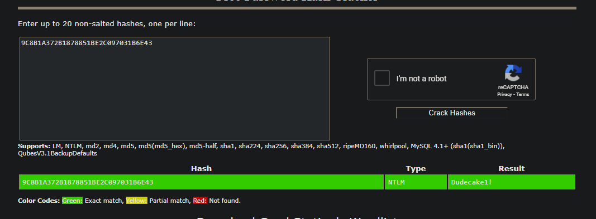

https://book.hacktricks.xyz/pentesting/pentesting-snmp

kali@kali:~$ snmpwalk -c public -v1 -t 10 10.10.10.116 1.3.6.1.2.1.25.6.3.1.2
iso.3.6.1.2.1.25.6.3.1.2.1 = STRING: "Microsoft Visual C++ 2008 Redistributable - x64 9.0.30729.6161"
iso.3.6.1.2.1.25.6.3.1.2.2 = STRING: "VMware Tools"
iso.3.6.1.2.1.25.6.3.1.2.3 = STRING: "Microsoft Visual C++ 2008 Redistributable - x86 9.0.30729.6161"

sudo nmap -Pn --script "snmp* and not snmp-brute" -sU -oN snmp-info -p 161 10.10.10.116

braa ignite123@10.10.10.116:.1.3.6.*

# Nmap 7.91 scan initiated Mon Feb 15 16:30:48 2021 as: nmap -Pn --script "snmp* and not snmp-brute" -sU -oN snmp-info -p 161 10.10.10.116
Nmap scan report for 10.10.10.116
Host is up.

PORT    STATE SERVICE
161/udp open  snmp
| snmp-interfaces: 
|   Software Loopback Interface 1\x00
|     IP address: 127.0.0.1  Netmask: 255.0.0.0
|     Type: softwareLoopback  Speed: 1 Gbps
|     Status: up
|     Traffic stats: 0.00 Kb sent, 0.00 Kb received
|   WAN Miniport (IKEv2)\x00
|     Type: tunnel  Speed: 0 Kbps
|     Traffic stats: 0.00 Kb sent, 0.00 Kb received
|   WAN Miniport (PPTP)\x00
|     Type: tunnel  Speed: 0 Kbps
|     Traffic stats: 0.00 Kb sent, 0.00 Kb received
|   Microsoft Kernel Debug Network Adapter\x00
|     Type: ethernetCsmacd  Speed: 0 Kbps
|     Traffic stats: 0.00 Kb sent, 0.00 Kb received
|   WAN Miniport (L2TP)\x00
|     Type: tunnel  Speed: 0 Kbps
|     Traffic stats: 0.00 Kb sent, 0.00 Kb received
|   Teredo Tunneling Pseudo-Interface\x00
|     MAC address: Unknown
|     Type: tunnel  Speed: 0 Kbps
|     Traffic stats: 0.00 Kb sent, 0.00 Kb received
|   WAN Miniport (IP)\x00
|     Type: ethernetCsmacd  Speed: 0 Kbps
|     Traffic stats: 0.00 Kb sent, 0.00 Kb received
|   WAN Miniport (SSTP)\x00
|     Type: tunnel  Speed: 0 Kbps
|     Traffic stats: 0.00 Kb sent, 0.00 Kb received
|   WAN Miniport (IPv6)\x00
|     Type: ethernetCsmacd  Speed: 0 Kbps
|     Traffic stats: 0.00 Kb sent, 0.00 Kb received
|   Intel(R) 82574L Gigabit Network Connection\x00
|     IP address: 10.10.10.116  Netmask: 255.255.255.0
|     MAC address: 00:50:56:b9:1f:65 (VMware)
|     Type: ethernetCsmacd  Speed: 1 Gbps
|     Status: up
|     Traffic stats: 171.50 Kb sent, 1.65 Mb received
|   WAN Miniport (PPPOE)\x00
|     Type: ppp  Speed: 0 Kbps
|     Traffic stats: 0.00 Kb sent, 0.00 Kb received
|   WAN Miniport (Network Monitor)\x00
|     Type: ethernetCsmacd  Speed: 0 Kbps
|     Traffic stats: 0.00 Kb sent, 0.00 Kb received
|   Intel(R) 82574L Gigabit Network Connection-WFP Native MAC Layer LightWeight Filter-0000\x00
|     MAC address: 00:50:56:b9:1f:65 (VMware)
|     Type: ethernetCsmacd  Speed: 1 Gbps
|     Status: up
|     Traffic stats: 171.50 Kb sent, 1.65 Mb received
|   Intel(R) 82574L Gigabit Network Connection-QoS Packet Scheduler-0000\x00
|     MAC address: 00:50:56:b9:1f:65 (VMware)
|     Type: ethernetCsmacd  Speed: 1 Gbps
|     Status: up
|     Traffic stats: 171.50 Kb sent, 1.65 Mb received
|   Intel(R) 82574L Gigabit Network Connection-WFP 802.3 MAC Layer LightWeight Filter-0000\x00
|     MAC address: 00:50:56:b9:1f:65 (VMware)
|     Type: ethernetCsmacd  Speed: 1 Gbps
|     Status: up
|_    Traffic stats: 171.50 Kb sent, 1.65 Mb received
| snmp-netstat: 
|   TCP  0.0.0.0:21           0.0.0.0:0
|   TCP  0.0.0.0:80           0.0.0.0:0
|   TCP  0.0.0.0:135          0.0.0.0:0
|   TCP  0.0.0.0:445          0.0.0.0:0
|   TCP  0.0.0.0:49664        0.0.0.0:0
|   TCP  0.0.0.0:49665        0.0.0.0:0
|   TCP  0.0.0.0:49666        0.0.0.0:0
|   TCP  0.0.0.0:49667        0.0.0.0:0
|   TCP  0.0.0.0:49668        0.0.0.0:0
|   TCP  0.0.0.0:49669        0.0.0.0:0
|   TCP  0.0.0.0:49670        0.0.0.0:0
|   TCP  10.10.10.116:139     0.0.0.0:0
|   UDP  0.0.0.0:123          *:*
|   UDP  0.0.0.0:161          *:*
|   UDP  0.0.0.0:500          *:*
|   UDP  0.0.0.0:4500         *:*
|   UDP  0.0.0.0:5050         *:*
|   UDP  0.0.0.0:5353         *:*
|   UDP  0.0.0.0:5355         *:*
|   UDP  10.10.10.116:137     *:*
|   UDP  10.10.10.116:138     *:*
|   UDP  10.10.10.116:1900    *:*
|   UDP  10.10.10.116:64586   *:*
|   UDP  127.0.0.1:1900       *:*
|_  UDP  127.0.0.1:64587      *:*
| snmp-processes: 
|   1: 
|     Name: System Idle Process
|   4: 
|     Name: System
|   316: 
|     Name: smss.exe
|   336: 
|     Name: svchost.exe
|     Path: C:\Windows\System32\
|     Params: -k LocalSystemNetworkRestricted
|   348: 
|     Name: svchost.exe
|     Path: C:\Windows\system32\
|     Params: -k LocalService
|   400: 
|     Name: csrss.exe
|   484: 
|     Name: wininit.exe
|   500: 
|     Name: csrss.exe
|   576: 
|     Name: winlogon.exe
|   596: 
|     Name: services.exe
|   628: 
|     Name: lsass.exe
|     Path: C:\Windows\system32\
|   712: 
|     Name: fontdrvhost.exe
|   720: 
|     Name: fontdrvhost.exe
|   732: 
|     Name: svchost.exe
|     Path: C:\Windows\system32\
|     Params: -k DcomLaunch
|   828: 
|     Name: svchost.exe
|     Path: C:\Windows\system32\
|     Params: -k RPCSS
|   908: 
|     Name: vmacthlp.exe
|     Path: C:\Program Files\VMware\VMware Tools\
|   924: 
|     Name: dwm.exe
|   984: 
|     Name: svchost.exe
|     Path: C:\Windows\system32\
|     Params: -k LocalServiceNoNetwork
|   992: 
|     Name: svchost.exe
|     Path: C:\Windows\System32\
|     Params: -k LocalServiceNetworkRestricted
|   1056: 
|     Name: svchost.exe
|     Path: C:\Windows\system32\
|     Params: -k netsvcs
|   1080: 
|     Name: svchost.exe
|     Path: C:\Windows\System32\
|     Params: -k NetworkService
|   1104: 
|     Name: Memory Compression
|   1212: 
|     Name: svchost.exe
|     Path: C:\Windows\System32\
|     Params: -k LocalServiceNetworkRestricted
|   1296: 
|     Name: svchost.exe
|     Path: C:\Windows\system32\
|     Params: -k LocalServiceNetworkRestricted
|   1304: 
|     Name: svchost.exe
|     Path: C:\Windows\System32\
|     Params: -k LocalServiceNetworkRestricted
|   1396: 
|     Name: LogonUI.exe
|     Params:  /flags:0x0 /state0:0xa3a5d855 /state1:0x41c64e6d
|   1436: 
|     Name: spoolsv.exe
|     Path: C:\Windows\System32\
|   1568: 
|     Name: svchost.exe
|     Path: C:\Windows\system32\
|     Params: -k appmodel
|   1700: 
|     Name: svchost.exe
|     Path: C:\Windows\system32\
|     Params: -k apphost
|   1708: 
|     Name: svchost.exe
|     Path: C:\Windows\System32\
|     Params: -k utcsvc
|   1728: 
|     Name: svchost.exe
|     Path: C:\Windows\system32\
|     Params: -k ftpsvc
|   1796: 
|     Name: SecurityHealthService.exe
|   1812: 
|     Name: snmp.exe
|     Path: C:\Windows\System32\
|   1848: 
|     Name: VGAuthService.exe
|     Path: C:\Program Files\VMware\VMware Tools\VMware VGAuth\
|   1856: 
|     Name: vmtoolsd.exe
|     Path: C:\Program Files\VMware\VMware Tools\
|   1868: 
|     Name: ManagementAgentHost.exe
|     Path: C:\Program Files\VMware\VMware Tools\VMware CAF\pme\bin\
|   1896: 
|     Name: svchost.exe
|     Path: C:\Windows\system32\
|     Params: -k iissvcs
|   1924: 
|     Name: MsMpEng.exe
|   2512: 
|     Name: dllhost.exe
|     Path: C:\Windows\system32\
|     Params: /Processid:{02D4B3F1-FD88-11D1-960D-00805FC79235}
|   2756: 
|     Name: svchost.exe
|     Path: C:\Windows\system32\
|     Params: -k NetworkServiceNetworkRestricted
|   2828: 
|     Name: SearchIndexer.exe
|     Path: C:\Windows\system32\
|     Params: /Embedding
|   2960: 
|     Name: WmiPrvSE.exe
|     Path: C:\Windows\system32\wbem\
|   2980: 
|     Name: svchost.exe
|   3236: 
|     Name: NisSrv.exe
|   3520: 
|     Name: msdtc.exe
|     Path: C:\Windows\System32\
|   3552: 
|     Name: svchost.exe
|     Path: C:\Windows\system32\
|     Params: -k LocalServiceAndNoImpersonation
|   3832: 
|     Name: svchost.exe
|     Path: C:\Windows\System32\
|     Params: -k smphost
|   3904: 
|     Name: MpCmdRun.exe
|     Path: C:\Program Files\Windows Defender\
|     Params:  -IdleTask -TaskName WdCacheMaintenance
|   3932: 
|     Name: svchost.exe
|     Path: C:\Windows\system32\
|     Params: -k LocalSystemNetworkRestricted
|   4052: 
|     Name: conhost.exe
|     Path: \??\C:\Windows\system32\
|     Params: 0x4
|   4064: 
|     Name: WmiPrvSE.exe
|_    Path: C:\Windows\system32\wbem\
| snmp-sysdescr: Hardware: AMD64 Family 23 Model 1 Stepping 2 AT/AT COMPATIBLE - Software: Windows Version 6.3 (Build 15063 Multiprocessor Free)
|_  System uptime: 19m53.43s (119343 timeticks)
| snmp-win32-services: 
|   AppX Deployment Service (AppXSVC)
|   Application Host Helper Service
|   Background Intelligent Transfer Service
|   Background Tasks Infrastructure Service
|   Base Filtering Engine
|   CNG Key Isolation
|   COM+ Event System
|   COM+ System Application
|   Client License Service (ClipSVC)
|   Connected Devices Platform Service
|   Connected User Experiences and Telemetry
|   CoreMessaging
|   Cryptographic Services
|   DCOM Server Process Launcher
|   DHCP Client
|   DNS Client
|   Data Sharing Service
|   Data Usage
|   Device Setup Manager
|   Diagnostic Policy Service
|   Diagnostic Service Host
|   Diagnostic System Host
|   Distributed Link Tracking Client
|   Distributed Transaction Coordinator
|   Geolocation Service
|   Group Policy Client
|   IKE and AuthIP IPsec Keying Modules
|   IP Helper
|   IPsec Policy Agent
|   Local Session Manager
|   Microsoft Account Sign-in Assistant
|   Microsoft FTP Service
|   Microsoft Storage Spaces SMP
|   Network Connection Broker
|   Network List Service
|   Network Location Awareness
|   Network Store Interface Service
|   Plug and Play
|   Power
|   Print Spooler
|   Program Compatibility Assistant Service
|   RPC Endpoint Mapper
|   Remote Procedure Call (RPC)
|   SNMP Service
|   SSDP Discovery
|   Security Accounts Manager
|   Security Center
|   Server
|   Shell Hardware Detection
|   State Repository Service
|   Storage Service
|   Superfetch
|   System Event Notification Service
|   System Events Broker
|   TCP/IP NetBIOS Helper
|   Task Scheduler
|   Themes
|   Time Broker
|   TokenBroker
|   User Manager
|   User Profile Service
|   VMware Alias Manager and Ticket Service
|   VMware CAF Management Agent Service
|   VMware Physical Disk Helper Service
|   VMware Tools
|   WinHTTP Web Proxy Auto-Discovery Service
|   Windows Audio
|   Windows Audio Endpoint Builder
|   Windows Connection Manager
|   Windows Defender Antivirus Network Inspection Service
|   Windows Defender Antivirus Service
|   Windows Defender Security Centre Service
|   Windows Driver Foundation - User-mode Driver Framework
|   Windows Event Log
|   Windows Firewall
|   Windows Font Cache Service
|   Windows Management Instrumentation
|   Windows Process Activation Service
|   Windows Push Notifications System Service
|   Windows Search
|   Windows Time
|   Windows Update
|   Workstation
|_  World Wide Web Publishing Service
| snmp-win32-software: 
|   Microsoft Visual C++ 2008 Redistributable - x64 9.0.30729.6161; 2018-10-12T20:10:30
|   Microsoft Visual C++ 2008 Redistributable - x86 9.0.30729.6161; 2018-10-12T20:10:22
|_  VMware Tools; 2018-10-12T20:11:02
| snmp-win32-users: 
|   Administrator
|   DefaultAccount
|   Destitute
|_  Guest

# Nmap done at Mon Feb 15 16:31:31 2021 -- 1 IP address (1 host up) scanned in 42.51 seconds

apt-get install snmp-mibs-downloader

https://book.hacktricks.xyz/pentesting/pentesting-snmp

kali@kali:~/htb/boxes/conceal/10.10.10.116$ braa public@10.10.10.116:.1.3.6.*   
10.10.10.116:107ms:.0:Hardware: AMD64 Family 23 Model 1 Stepping 2 AT/AT COMPATIBLE - Software: Windows Version 6.3 (Build 15063 Multiprocessor Free)
10.10.10.116:108ms:.0:.1                                                       
10.10.10.116:108ms:.0:159537                                                   
10.10.10.116:107ms:.0:IKE VPN password PSK - 9C8B1A372B1878851BE2C097031B6E43
10.10.10.116:109ms:.0:Conceal                                                  
10.10.10.116: Message cannot be decoded!
10.10.10.116: Message cannot be decoded!
10.10.10.116: Message cannot be decoded!

ike-scan -P -M -A -n fakeID 10.10.10.116

Dudecake1!
