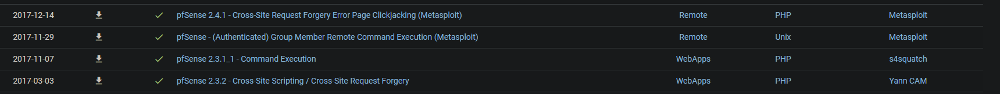

# Sense writeup

```
PORT    STATE SERVICE  VERSION
80/tcp  open  http     lighttpd 1.4.35
| http-methods: 
|_  Supported Methods: GET HEAD POST OPTIONS
|_http-server-header: lighttpd/1.4.35
|_http-title: Did not follow redirect to https://10.10.10.60/
443/tcp open  ssl/http lighttpd 1.4.35
|_http-favicon: Unknown favicon MD5: 082559A7867CF27ACAB7E9867A8B320F
| http-methods: 
|_  Supported Methods: GET HEAD POST OPTIONS
|_http-server-header: lighttpd/1.4.35
|_http-title: Login
| ssl-cert: Subject: commonName=Common Name (eg, YOUR name)/organizationName=CompanyName/stateOrProvinceName=Somewhere/countryName=US
| Issuer: commonName=Common Name (eg, YOUR name)/organizationName=CompanyName/stateOrProvinceName=Somewhere/countryName=US
| Public Key type: rsa
| Public Key bits: 1024
| Signature Algorithm: sha256WithRSAEncryption
| Not valid before: 2017-10-14T19:21:35
| Not valid after:  2023-04-06T19:21:35
| MD5:   65f8 b00f 57d2 3468 2c52 0f44 8110 c622
|_SHA-1: 4f7c 9a75 cb7f 70d3 8087 08cb 8c27 20dc 05f1 bb02
|_ssl-date: TLS randomness does not represent time
```


/opt/dirsearch/dirsearch.py -u https://10.10.10.60/ -e php --plain-text-report=scan


oct 2017 




username "rohit" pw pfsense


parser.add_argument("--rhost", help = "Remote Host")
parser.add_argument('--lhost', help = 'Local Host listener')
parser.add_argument('--lport', help = 'Local Port listener')
parser.add_argument("--username", help = "pfsense Username")
parser.add_argument("--password", help = "pfsense Password")

